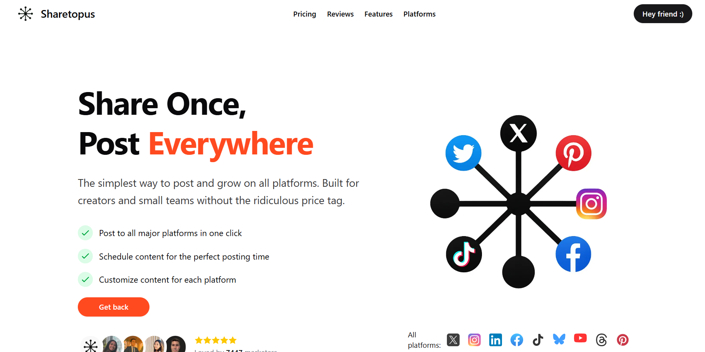
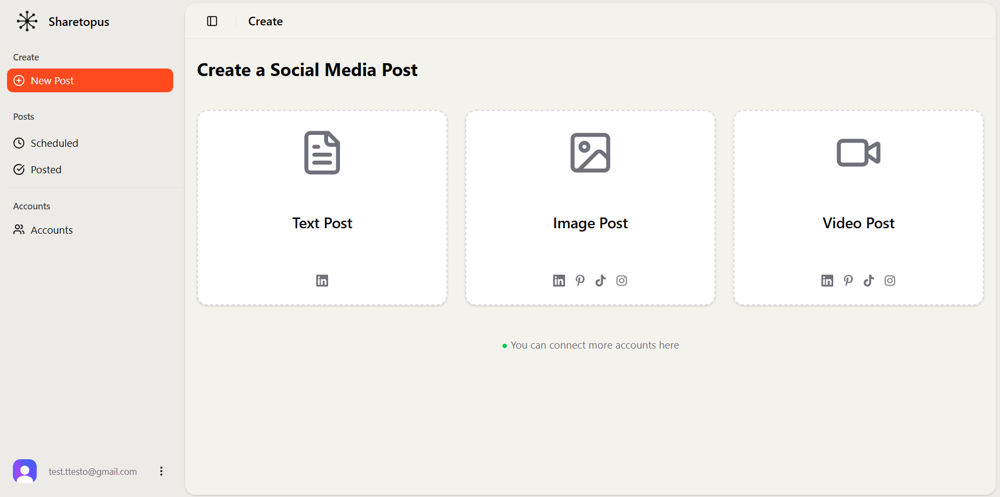
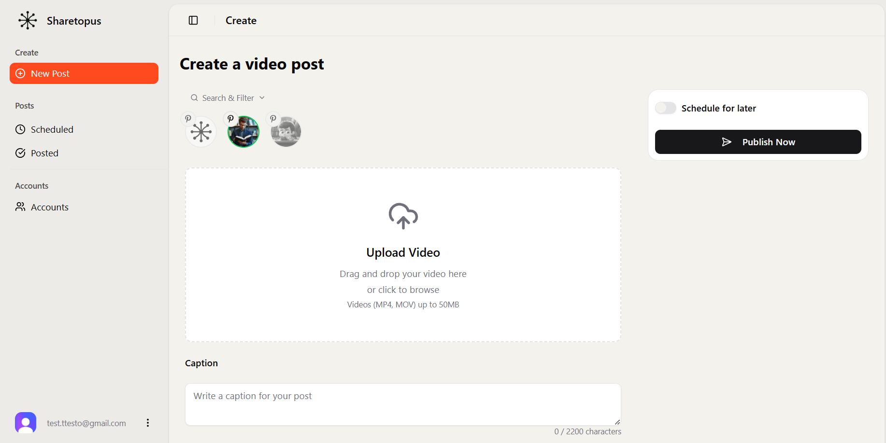

# Sharetopus

Social media scheduling and publishing for LinkedIn, TikTok, Pinterest, and Instagram. One dashboard, one MCP server, four platforms. AI agents (Claude Desktop, Cursor) manage posts on behalf of subscribers through 18 MCP tools.

**Production:** [sharetopus.com](https://sharetopus.com)





[](https://nextjs.org)
[](https://www.typescriptlang.org)
[](https://react.dev)
[](https://supabase.com)
[](https://stripe.com)
[](https://clerk.com)
[](https://www.inngest.com)
[](https://tailwindcss.com)
[](https://vercel.com)

[]()
[]()
[-9ca3af)]()
[-3b82f6)]()

## What is Sharetopus

Sharetopus is a SaaS tool for scheduling and publishing social media posts across LinkedIn, TikTok, Pinterest, and Instagram. You create a post once, customize it per platform, and publish immediately or schedule it for later. Subscribers on Creator plans and above get access to 18 MCP tools that let AI agents manage posts, query analytics, and handle media uploads on their behalf. Background jobs (Inngest) handle dispatch, polling, webhook processing, and storage cleanup.

## Surfaces

| Surface | Status | Auth | Description |
|---------|--------|------|-------------|
| Web UI | Shipped | Clerk session | Browser dashboard at sharetopus.com |
| MCP | Shipped | Clerk OAuth / API key | 18 tools for AI agents (Claude Desktop, Cursor) |
| REST API | Planned | `stp_rest_*` API key | Mirrors MCP tools. Schema ready, code not built. |
| x402 Wallet | Planned | SIWE signature | Per-action USDC payments. Schema ready, code not built. |

**Web App.** Clerk authentication, Stripe billing, post creation with per-platform customization, scheduling calendar, content history. See [docs/ARCHITECTURE.md](./docs/ARCHITECTURE.md).

**MCP Server.** Streamable HTTP at `/api/mcp/mcp` and SSE at `/api/mcp/sse`. Requires Creator plan or above ($18/mo). 18 tools across read (list connections, posts, analytics) and write (schedule, post now, bulk operations, media upload). See [docs/MCP.md](./docs/MCP.md).

**REST API** (planned). Public API mirroring MCP tools with `stp_rest_*` API keys. Schema ready (`api_keys.kind=rest`, `created_via=api`), code path not built. See [docs/ROADMAP.md](./docs/ROADMAP.md).

**x402 Wallet** (planned). Pay-per-action with USDC credits via SIWE wallet authentication. Schema tables exist, code path not built. See [docs/ROADMAP.md](./docs/ROADMAP.md).

## Tech Stack

| Category | Technology | Version |
|----------|-----------|---------|
| Framework | Next.js (App Router, Turbopack) | 16.1.6 |
| Language | TypeScript | 5.9.3 |
| UI | React + Tailwind CSS + shadcn/ui | 19.2.0 / 4.2.4 |
| Auth | Clerk (`@clerk/nextjs`) | 7.3.2 |
| Database + Storage | Supabase (`@supabase/supabase-js`) | 2.105.3 |
| Payments | Stripe | 18.5.0 |
| Background Jobs | Inngest | 4.3.0 |
| Rate Limiting | Upstash Redis + `@upstash/ratelimit` | 1.38.0 / 2.0.8 |
| MCP | `@modelcontextprotocol/sdk` + `mcp-handler` | 1.29.0 / 1.1.0 |
| Deployment | Vercel | |

Full dependency list: [package.json](./package.json).

## Quick Start

```bash
git clone <repo-url>
cd sharetopus
npm install
cp .env.example .env.local
# Fill in all required values (see docs/DEVELOPMENT.md)
npm run dev              # http://localhost:3000
```

Prerequisites: Node.js 20+, Supabase project, Clerk application, Stripe account, Inngest account, Upstash Redis instance, and OAuth apps for each platform you want to test.

Full setup guide: [docs/DEVELOPMENT.md](./docs/DEVELOPMENT.md).

## Platforms

| Platform | Media Types | Post Model |
|----------|-------------|------------|
| LinkedIn | text, image, video | Direct upload to LinkedIn CDN |
| TikTok | image, video | Async pull (TikTok fetches media from URL, poll + webhook for completion) |
| Pinterest | image, video | Image: direct URL. Video: streaming multipart S3 upload, then poll |
| Instagram | image, reel | Container model (create container, poll status, publish) |

Details per platform: [docs/PLATFORMS.md](./docs/PLATFORMS.md).

## MCP Server

Two transports: Streamable HTTP at `/api/mcp/mcp` and SSE at `/api/mcp/sse`. Both stateless (mcp-handler 1.1.0). Authenticated via Clerk OAuth tokens or `stp_mcp_*` API keys. Both resolve to a `principal_id` with a cached subscription tier.

18 tools, all requiring Creator plan ($18/mo) or above:

| Category | Tools |
|----------|-------|
| Read | list_connections, list_pinterest_boards, list_scheduled_posts, list_content_history, list_billing_summary, request_account_reauth_link, get_account_analytics, generate_post_draft |
| Write (quota-gated) | schedule_post, post_now, cancel_scheduled_posts, resume_scheduled_posts, reschedule_posts, delete_scheduled_posts, attach_media_from_url, request_upload_url, bulk_schedule, bulk_post_now |

Write tools support idempotent retries via `idempotency_key`. See [docs/MCP.md](./docs/MCP.md) for the full tool inventory, parameter schemas, and usage examples.

## Background Jobs

11 Inngest functions handle scheduling, posting, polling, and cleanup:

| Function | Trigger | Purpose |
|----------|---------|---------|
| scheduled-posts-tick | Cron `*/5 * * * *` | Dispatch due scheduled posts (batch 200) |
| process-single-post | Event `post.due` | Process one scheduled post (retries 3) |
| process-direct-post | Event `post.now` | Process one direct post (no retry) |
| tiktok-publish-status-poll | Event `tiktok.publish.poll` | Poll TikTok for publish completion (60 attempts, 60s interval) |
| process-tiktok-publish-webhook | Event `tiktok.publish.webhook.received` | Process TikTok webhook events (retries 3) |
| sweep-stuck-direct-posts | Cron `*/5 * * * *` | Recover stuck pending posts (>10 min) |
| sweep-orphan-storage-files | Cron daily 03:00 UTC | Delete unreferenced storage files (>24h) |
| sweep-stale-oauth-clients | Cron daily 04:00 UTC | Purge unverified OAuth clients (>90 days) |
| cleanup-cancelled-posts-after-grace | Cron daily 05:00 UTC | Delete system-cancelled posts (>7 days) |
| cleanup-stripe-webhook-events | Cron daily 03:00 UTC | Prune webhook idempotency log (>90 days) |
| cleanup-mcp-audit-log | Cron daily 04:00 UTC | Prune audit log (>90 days) |

See [docs/INNGEST.md](./docs/INNGEST.md).

## Billing

Three Stripe subscription tiers. MCP access starts at Creator.

| Tier | Monthly | Yearly | Accounts | Storage | MCP Access |
|------|---------|--------|----------|---------|------------|
| Starter | $9 | $64 | 5 | 5 GB | Web only |
| Creator | $18 | $129 | 15 | 15 GB | All 18 tools (quotas apply) |
| Pro | $27 | $194 | Unlimited | 45 GB | All 18 tools (unlimited) |

See [docs/BILLING.md](./docs/BILLING.md).

## Documentation

| Document | Description |
|----------|-------------|
| [docs/ARCHITECTURE.md](./docs/ARCHITECTURE.md) | System map, component interactions, data flows, state diagrams |
| [docs/AUTH.md](./docs/AUTH.md) | Clerk, MCP auth (API key + OAuth), principal model, entitlement |
| [docs/BILLING.md](./docs/BILLING.md) | Stripe subscriptions, plan gates, usage quotas |
| [docs/DATABASE.md](./docs/DATABASE.md) | All 31 tables, relationships, RLS posture |
| [docs/DEVELOPMENT.md](./docs/DEVELOPMENT.md) | Local setup, testing, deployment |
| [docs/INNGEST.md](./docs/INNGEST.md) | 11 background functions, cron schedules, sweep jobs |
| [docs/MCP.md](./docs/MCP.md) | MCP server: 18 tools, auth, withMcpTool HOF, usage examples |
| [docs/PLATFORMS.md](./docs/PLATFORMS.md) | Per-platform OAuth, posting flows, quirks |
| [docs/ROADMAP.md](./docs/ROADMAP.md) | Shipped features, deferred work, open issues |
| [docs/SCHEDULING.md](./docs/SCHEDULING.md) | Schedule lifecycle, locks, retries, created_via |
| [docs/SECURITY.md](./docs/SECURITY.md) | Threat model, SSRF, HMAC proxy, rate limits, audit |
| [docs/STORAGE.md](./docs/STORAGE.md) | Supabase Storage, signed URLs, orphan sweep |

## Configuration

Key environment variables (see [docs/DEVELOPMENT.md](./docs/DEVELOPMENT.md) for the full list):

| Category | Variables |
|----------|-----------|
| Auth | `CLERK_SECRET_KEY`, `NEXT_PUBLIC_CLERK_PUBLISHABLE_KEY` |
| Database | `NEXT_PUBLIC_SUPABASE_URL`, `SUPABASE_SERVICE_ROLE` |
| Payments | `STRIPE_SECRET_KEY`, `STRIPE_WEBHOOK_SECRET` |
| Jobs | `INNGEST_EVENT_KEY`, `INNGEST_SIGNING_KEY` |
| Rate Limiting | `UPSTASH_REDIS_REST_URL`, `UPSTASH_REDIS_REST_TOKEN` |
| Security | `MEDIA_PROXY_HMAC_SECRET` (64 hex), `MCP_IP_HASH_SALT` (32 bytes base64) |
| Platforms | `LINKEDIN_CLIENT_ID/SECRET`, `TIKTOK_CLIENT_KEY/SECRET`, `PINTEREST_CLIENT_ID/SECRET`, `INSTAGRAM_CLIENT_ID/SECRET` |

## Security

Authentication is split by surface: Clerk sessions for web, Clerk OAuth or API keys for MCP. All surfaces resolve to a `principal_id` in the `principals` table. Rate limiting uses Upstash Redis sliding windows. Audit logs are append-only with 90-day retention. SSRF protection blocks 14 private/reserved IP ranges on media downloads. HMAC-signed proxy URLs serve media to TikTok without exposing credentials. Stripe and TikTok webhooks are verified via signatures with idempotency tables preventing replay.

Full security architecture: [docs/SECURITY.md](./docs/SECURITY.md).

## Roadmap

**Recently shipped:** TikTok webhook integration, hybrid pricing (MCP Creator+ minimum), withMcpTool HOF refactor, API key expiry (7/30/90/365 days), web requestId tracing, generic adapter pattern, OAuth client trust enforcement, data retention crons.

**Near-term:** REST API v1. **Mid-term:** x402 wallet access, additional platforms. **Long-term:** Analytics pipeline, federated agent features.

Full roadmap: [docs/ROADMAP.md](./docs/ROADMAP.md).

## Known Limitations

- Threads, YouTube, X/Twitter, and Facebook are in type definitions but have no backend code.
- Instagram connect button is commented out in the UI (backend OAuth and posting work).
- i18n is declared (fr, en, es) but no translation files exist. UI is English only.
- Studio/Analytics page shows "Coming Soon". The analytics_metrics table exists but has no data pipeline.
- TikTok default privacy is SELF_ONLY (private). Users must select a public level.
- `@upstash/qstash` is in dependencies but unused (legacy from pre-Inngest era).

## Contributing

This is a private project. See [docs/DEVELOPMENT.md](./docs/DEVELOPMENT.md) for the development setup, code conventions, and deployment process.

## License

No LICENSE file in the repository.

## Live

**Production:** [https://sharetopus.com](https://sharetopus.com)

**Demo:** [https://x.com/Andy00L/status/2033366044941643828](https://x.com/Andy00L/status/2033366044941643828)
