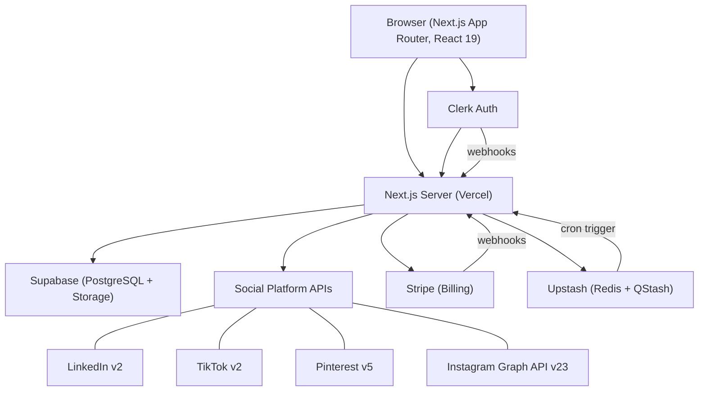

# Sharetopus

A SaaS social media publishing tool. Create a post once, customize it per platform, and publish or schedule it to LinkedIn, TikTok, Pinterest, and Instagram from a single dashboard. Runs in production at [sharetopus.com](https://sharetopus.com).


## Quick Start

```bash
git clone <repo-url>
cd sharetopus
bun install
cp .env.example .env.local   # fill in all required values
bun dev                       # http://localhost:3000
```

Full setup instructions (Supabase tables, Stripe products, Clerk config, OAuth apps): [docs/getting-started/installation.md](./docs/getting-started/installation.md).

## What It Does

- **Multi-platform posting.** Publish text, image, or video content to LinkedIn, TikTok, Pinterest, and Instagram in one action. Per-account content customization supported.
- **Scheduling.** Pick a future date and time. QStash fires a cron job at the scheduled moment to publish the batch.
- **Social account management.** Connect accounts via OAuth. Plan-based limits (5 / 15 / unlimited).
- **Subscription billing.** Three Stripe-powered tiers (Starter $9/mo, Creator $18/mo, Pro $27/mo) with yearly discounts around 40%.
- **Content history.** View every published post grouped by batch, with per-platform status and external links.
- **MCP server.** 14 tools, 3 resources, and 3 prompts exposed via the Model Context Protocol. AI clients (Claude Desktop, Cursor) can manage posts on behalf of subscribers.
- **Media handling.** Upload images (JPEG/PNG, 8 MB max) and videos (MP4/MOV, 250 MB max) to Supabase Storage with signed URLs.



## Documentation

| Section | Description |
|---------|-------------|
| [Getting Started](./docs/getting-started/README.md) | Install, configure, run |
| [Architecture](./docs/architecture/README.md) | System design, components, data flow |
| [Features](./docs/features/README.md) | Per-feature deep dives |
| [Integrations](./docs/integrations/README.md) | External services and social platform APIs |
| [Reference](./docs/reference/README.md) | API routes, env vars, database schema |
| [Operations](./docs/operations/README.md) | Deployment, troubleshooting |
| [Development](./docs/development/README.md) | Local setup, testing |

Additional docs:

- [ARCHITECTURE.md](./ARCHITECTURE.md) (redirects to docs/architecture/)
- [MCP Server](./src/lib/mcp/README.md) (subsystem README)
- [Internal Actions](./src/actions/server/_internal/README.md) (subsystem README)

## Tech Stack

| Category | Technology | Version |
|----------|-----------|---------|
| Framework | Next.js (App Router, Turbopack) | 16.1.6 |
| Language | TypeScript | 5.9 |
| UI | React | 19.2.0 |
| Styling | Tailwind CSS + shadcn/ui | 4.2 |
| Auth | Clerk (`@clerk/nextjs`) | 7.3 |
| Database | Supabase (`@supabase/supabase-js`) | 2.105 |
| Payments | Stripe | 18.5 |
| Rate Limiting | Upstash Redis + Ratelimit | 1.38 / 2.0 |
| Scheduling | Upstash QStash | 2.10 |
| MCP | `@modelcontextprotocol/sdk` + `mcp-handler` | 1.29 / 1.1 |
| Deployment | Vercel | |
| Package Manager | Bun | |

Full dependency list with versions: [package.json](./package.json).

## Scripts

| Script | Command | What it does |
|--------|---------|-------------|
| `dev` | `next dev --turbopack` | Development server with Turbopack |
| `build` | `next build` | Production build |
| `start` | `next start` | Production server |
| `lint` | `next lint` | ESLint |

## Known Limitations

- **Facebook and Twitter/X** have stub files only (`src/lib/api/facebook/facebook.ts`, `src/lib/api/twitter/twitter.ts`). No implementation.
- **Threads, YouTube, Bluesky** appear in type definitions and the landing page platform list, but have no backend support.
- **Instagram connect button** is commented out in the connections page UI. The backend OAuth and posting routes work.
- **i18n** is declared (`i18n-config.ts` with `fr`, `en`, `es`) and dependencies are installed, but no translation files exist. The entire UI is English.
- **Studio/Analytics** page shows a "Coming Soon" placeholder. The `analytics_metrics` table exists but is not populated.
- **TikTok default privacy** is `SELF_ONLY` (private). Users must change this in the create form for public posts.

## Live

**Production:** [https://sharetopus.com](https://sharetopus.com)

**Demo video:** [https://x.com/Andy00L/status/2033366044941643828](https://x.com/Andy00L/status/2033366044941643828)

## License

No LICENSE file found in the repository.

---

[Back to top](#sharetopus) | [Full documentation](./docs/README.md)
