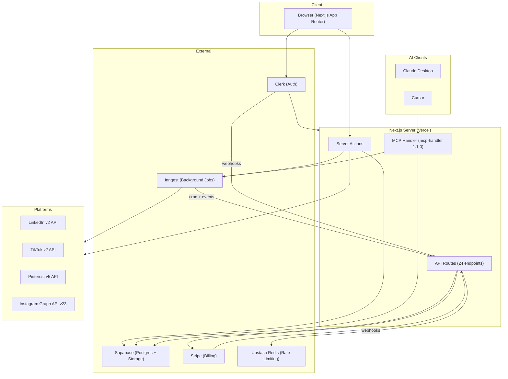
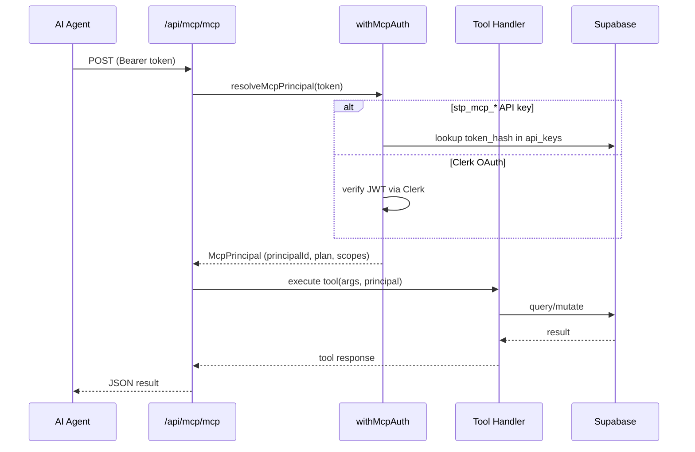

# Sharetopus

Social media scheduling tool with an MCP server. Create a post once, customize it per platform, and publish or schedule it to LinkedIn, TikTok, Pinterest, and Instagram from a single dashboard. AI agents (Claude Desktop, Cursor) can manage posts through the MCP server on behalf of subscribers.

Production: [sharetopus.com](https://sharetopus.com)


## What it does

- Publishes text, image, and video posts to 4 platforms (LinkedIn, TikTok, Pinterest, Instagram)
- Schedules posts for future dates. Inngest cron dispatches due posts every 5 minutes.
- Exposes 18 MCP tools, 3 resources, and 3 prompts to AI agents via Streamable HTTP
- Three Stripe subscription tiers: Starter ($9/mo), Creator ($18/mo), Pro ($27/mo) with ~40% yearly discounts
- 6 Inngest background functions: post dispatcher, post worker, TikTok poll, direct post worker, stuck-post sweep, orphan storage sweep
- Per-account content customization, batch grouping, and content history tracking
- Media uploads to Supabase Storage: images (JPEG/PNG, 8 MB) and videos (MP4/MOV, 250 MB)

## Architecture



## MCP server

Two transports: Streamable HTTP at `/api/mcp/mcp` and SSE at `/api/mcp/sse`. Both stateless (mcp-handler 1.1.0). Authenticated via Clerk OAuth tokens or `stp_mcp_*` API keys. Both resolve to a `principal_id` with a cached subscription tier.



18 tools across 4 tiers. Write tools support idempotent retries via `idempotency_key`. See [docs/MCP.md](./docs/MCP.md) for the full tool inventory, parameter schemas, and usage examples.

| Tier | Tools |
|------|-------|
| Free | list_connections, list_pinterest_boards, list_scheduled_posts, list_content_history, list_billing_summary, request_account_reauth_link |
| Starter+ | schedule_post, post_now, cancel_scheduled_posts, resume_scheduled_posts, reschedule_posts, delete_scheduled_posts, attach_media_from_url, request_upload_url |
| Creator+ | bulk_schedule, bulk_post_now, get_account_analytics |
| Pro | generate_post_draft |

## Platforms

| Platform | OAuth Scopes | Media Types | Post Model |
|----------|-------------|-------------|------------|
| LinkedIn | openid, profile, email, w_member_social | text, image, video | Direct upload to LinkedIn CDN |
| TikTok | user.info.basic, user.info.profile, video.publish, video.upload, user.info.stats | image, video | Async pull (TikTok fetches media from URL, poll for completion) |
| Pinterest | boards:read/write, pins:read/write, user_accounts:read, catalogs:read/write | image, video | Image: direct URL. Video: streaming multipart S3 upload, then poll |
| Instagram | instagram_business_basic, instagram_business_content_publish | image, reel | Container model (create container, poll status, publish) |

Details per platform: [docs/PLATFORMS.md](./docs/PLATFORMS.md).

## Channels

| Channel | Status | Auth | Description |
|---------|--------|------|-------------|
| Web UI | Shipped | Clerk session | Browser-based dashboard at sharetopus.com |
| MCP | Shipped | Clerk OAuth / API key | 18 tools for AI agents (Claude Desktop, Cursor) |
| REST API | Deferred | `stp_rest_*` API key | Mirrors MCP tools. Schema ready (`api_keys.kind=rest`, `created_via=api`). |
| x402 Wallet | Deferred | SIWE signature | Per-action payments with USDC credits. Schema ready, code path not built. |

Security architecture for all channels: [docs/SECURITY.md](./docs/SECURITY.md).

## Quick start

```bash
git clone <repo-url>
cd sharetopus
npm install              # or bun install
cp .env.example .env.local
# Fill in all required values (see Configuration below)
npm run dev              # http://localhost:3000
```

Prerequisites: Node.js 20+, a Supabase project, a Clerk application, a Stripe account, Inngest account, Upstash Redis instance, and OAuth apps for each platform you want to test.

Full setup: [docs/DEVELOPMENT.md](./docs/DEVELOPMENT.md).

## Project structure

```
src/
  actions/
    api/                        # adminSupabase client (RLS bypass)
    client/                     # Client-side helpers (signed URL upload)
    server/
      _internal/                # Auth-free actions for MCP layer
      accounts/                 # Social account disconnect
      connections/              # Account limit checks
      contentHistoryActions/    # Content history CRUD
      data/                     # Storage, pending posts, orphan sweep helpers
      mcp/                      # API key CRUD
      rateLimit/                # Upstash rate limiter
      scheduleActions/          # Schedule CRUD (thin wrappers over _internal)
      stripe/                   # Checkout, subscription check, portal
  app/
    (marketing)/                # Landing, privacy, ToS pages
    (protected)/                # Authenticated UI (create, scheduled, posted, etc.)
    api/
      auth/                     # Clerk auth routes
      inngest/                  # Inngest serve endpoint
      mcp/[transport]/          # MCP Streamable HTTP + SSE
      media/                    # HMAC-signed media proxy
      posts/status/             # Inngest job status polling
      social/{platform}/        # OAuth + posting routes per platform
      storage/                  # Signed upload/view URL generation
      webhooks/clerk/           # User lifecycle webhooks
      webhooks/stripe/          # Subscription + invoice webhooks
  components/
    core/                       # Feature components (create, scheduled, posted, etc.)
    marketing-page/             # Landing page sections
    sidebar/                    # Navigation
    ui/                         # shadcn/ui primitives
  inngest/
    functions/                  # 6 background functions (crons + event handlers)
  lib/
    api/
      _shared/                  # Streaming multipart builder
      instagram/                # Instagram Graph API integration
      linkedin/                 # LinkedIn v2 integration
      pinterest/                # Pinterest v5 integration
      tiktok/                   # TikTok v2 integration
    mcp/
      auth.ts                   # resolveMcpPrincipal, API key + OAuth
      audit.ts                  # logToolCall, IP hashing, arg redaction
      context.ts                # extractPrincipal, extractSessionId
      entitlement.ts            # Plan gating + monthly quotas
      tools/                    # 18 MCP tool definitions
      resources/                # 3 MCP resources
      prompts/                  # 3 MCP prompts
    types/                      # Database types, plan config
```

## Configuration

Every environment variable referenced in the source code. See [.env.example](./.env.example) for placeholder values.

| Variable | Required | Default | Description |
|----------|----------|---------|-------------|
| `NEXT_PUBLIC_CLERK_PUBLISHABLE_KEY` | Yes | | Clerk publishable key |
| `CLERK_SECRET_KEY` | Yes | | Clerk secret key |
| `CLERK_WEBHOOK_SECRET` | Yes | | Clerk webhook signing secret (prod) |
| `CLERK_WEBHOOK_SECRET_DEV` | Dev only | | Clerk webhook signing secret (local) |
| `NEXT_PUBLIC_SUPABASE_URL` | Yes | | Supabase project URL |
| `NEXT_PUBLIC_SUPABASE_ANON_KEY` | Yes | | Supabase anonymous key |
| `SUPABASE_SERVICE_ROLE` | Yes | | Supabase service role key (bypasses RLS) |
| `SUPABASE_BUCKET_NAME` | No | `scheduled-videos` | Storage bucket name |
| `SUPABASE_CUSTOM_STORAGE_DOMAIN` | No | | Custom domain for TikTok direct media mode |
| `STRIPE_SECRET_KEY` | Yes | | Stripe secret key |
| `STRIPE_PUBLISHABLE_KEY` | Yes | | Stripe publishable key |
| `STRIPE_WEBHOOK_SECRET` | Yes | | Stripe webhook signing secret (prod) |
| `STRIPE_WEBHOOK_SECRET_DEV` | Dev only | | Stripe webhook signing secret (local) |
| `UPSTASH_REDIS_REST_URL` | Yes | | Upstash Redis REST endpoint |
| `UPSTASH_REDIS_REST_TOKEN` | Yes | | Upstash Redis auth token |
| `INNGEST_EVENT_KEY` | Yes | | Inngest event key |
| `INNGEST_SIGNING_KEY` | Yes | | Inngest signing key |
| `LINKEDIN_CLIENT_ID` | Yes | | LinkedIn OAuth app client ID |
| `LINKEDIN_CLIENT_SECRET` | Yes | | LinkedIn OAuth app client secret |
| `LINKEDIN_REDIRECT_URL` | Yes | `http://localhost:3000/api/social/linkedin/connect` | LinkedIn OAuth callback |
| `TIKTOK_CLIENT_KEY` | Yes | | TikTok OAuth client key (prod) |
| `TIKTOK_CLIENT_SECRET` | Yes | | TikTok OAuth client secret (prod) |
| `TIKTOK_CLIENT_KEY_DEV` | Dev only | | TikTok OAuth client key (dev sandbox) |
| `TIKTOK_CLIENT_SECRET_DEV` | Dev only | | TikTok OAuth client secret (dev sandbox) |
| `TIKTOK_REDIRECT_URL` | Yes | `http://localhost:3000/api/social/tiktok/connect` | TikTok OAuth callback |
| `TIKTOK_MEDIA_SOURCE` | No | `proxy` | TikTok media delivery mode: `proxy` or `supabase_direct` |
| `PINTEREST_CLIENT_ID` | Yes | | Pinterest OAuth app ID |
| `PINTEREST_CLIENT_SECRET` | Yes | | Pinterest OAuth app secret |
| `PINTEREST_REDIRECT_URL` | Yes | `http://localhost:3000/api/social/pinterest/connect` | Pinterest OAuth callback |
| `INSTAGRAM_CLIENT_ID` | Yes | | Instagram (Meta) OAuth app ID |
| `INSTAGRAM_CLIENT_SECRET` | Yes | | Instagram (Meta) OAuth app secret |
| `INSTAGRAM_REDIRECT_URL` | Yes | `http://localhost:3000/api/social/instagram/connect` | Instagram OAuth callback |
| `FRONTEND_URL` | Yes | `http://localhost:3000` | Base URL for webhooks and redirects |
| `NEXT_PUBLIC_BASE_URL` | No | `https://sharetopus.com` | Public base URL shown in MCP docs |
| `CRON_SECRET_KEY` | Yes | | Secret for cron job auth bypass |
| `MEDIA_PROXY_HMAC_SECRET` | Yes | | HMAC key for signing /api/media URLs (64 hex chars) |
| `MCP_IP_HASH_SALT` | Prod | | Salt for hashing client IPs in MCP audit log (32 bytes, base64) |

## Documentation

| Document | Description |
|----------|-------------|
| [docs/ARCHITECTURE.md](./docs/ARCHITECTURE.md) | System map, component interactions, data flows, state diagrams |
| [docs/SECURITY.md](./docs/SECURITY.md) | Security architecture: SSRF guard, idempotency, storage quotas, HMAC media proxy |
| [docs/MCP.md](./docs/MCP.md) | MCP server: all 18 tools, auth, annotations, usage examples |
| [docs/PLATFORMS.md](./docs/PLATFORMS.md) | Per-platform OAuth, posting flows, quirks |
| [docs/SCHEDULING.md](./docs/SCHEDULING.md) | Schedule lifecycle, locks, retries, created_via |
| [docs/DATABASE.md](./docs/DATABASE.md) | All 29 tables, relationships, RLS posture |
| [docs/AUTH.md](./docs/AUTH.md) | Clerk, MCP API keys, principal model |
| [docs/INNGEST.md](./docs/INNGEST.md) | 6 background functions, cron schedules, sweep jobs |
| [docs/STORAGE.md](./docs/STORAGE.md) | Supabase Storage, signed URLs, orphan sweep |
| [docs/BILLING.md](./docs/BILLING.md) | Stripe subscriptions, plan gates, usage quotas |
| [docs/DEVELOPMENT.md](./docs/DEVELOPMENT.md) | Local setup, testing, deployment |
| [docs/ROADMAP.md](./docs/ROADMAP.md) | Deferred features, open issues |

## Tech stack

| Category | Technology | Version |
|----------|-----------|---------|
| Framework | Next.js (App Router, Turbopack) | 16.1.6 |
| Language | TypeScript | 5.9.3 |
| UI | React | 19.2.0 |
| Styling | Tailwind CSS + shadcn/ui | 4.2.4 |
| Auth | Clerk (`@clerk/nextjs`) | 7.3.2 |
| Database + Storage | Supabase (`@supabase/supabase-js`) | 2.105.3 |
| Payments | Stripe | 18.5.0 |
| Background Jobs | Inngest | 4.3.0 |
| Rate Limiting | Upstash Redis + `@upstash/ratelimit` | 1.38.0 / 2.0.8 |
| MCP | `@modelcontextprotocol/sdk` + `mcp-handler` | 1.29.0 / 1.1.0 |
| Deployment | Vercel | |

Full dependency list: [package.json](./package.json).

## Known limitations

- Threads, YouTube, X/Twitter, and Facebook appear in platform type definitions but have no backend integration code.
- Instagram connect button is commented out in the connections UI. The backend OAuth and posting routes work.
- i18n is declared (`i18n-config.ts` with fr, en, es) and dependencies are installed, but no translation files exist. UI is English only.
- Studio/Analytics page shows a "Coming Soon" placeholder. The `analytics_metrics` table exists but is not populated by any cron.
- TikTok default privacy level is `SELF_ONLY` (private). Users must change this in the create form.
- Pinterest board selection via MCP requires calling `list_pinterest_boards` first to get a board ID.
- `@upstash/qstash` is listed in dependencies but is not imported anywhere in the source. Scheduling uses Inngest.

## Live

**Production:** [https://sharetopus.com](https://sharetopus.com)

**Demo:** [https://x.com/Andy00L/status/2033366044941643828](https://x.com/Andy00L/status/2033366044941643828)

## License

No LICENSE file in the repository.

---

[Back to top](#sharetopus) | [Full documentation](./docs/ARCHITECTURE.md)
