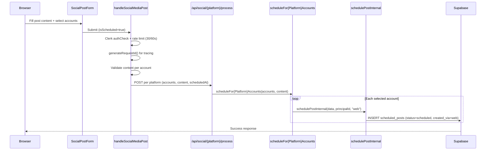
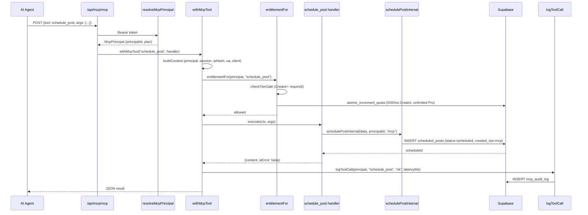
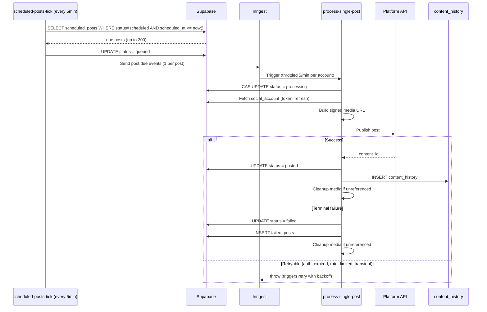
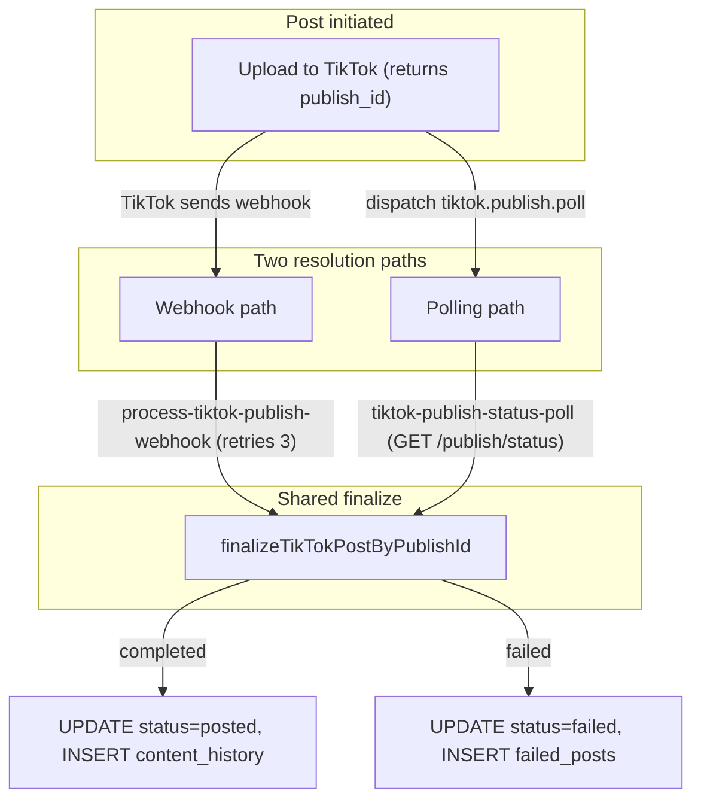
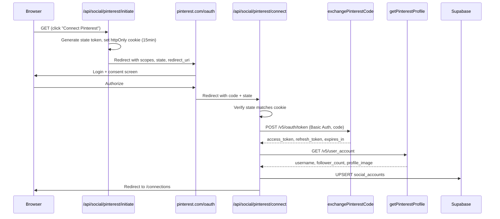
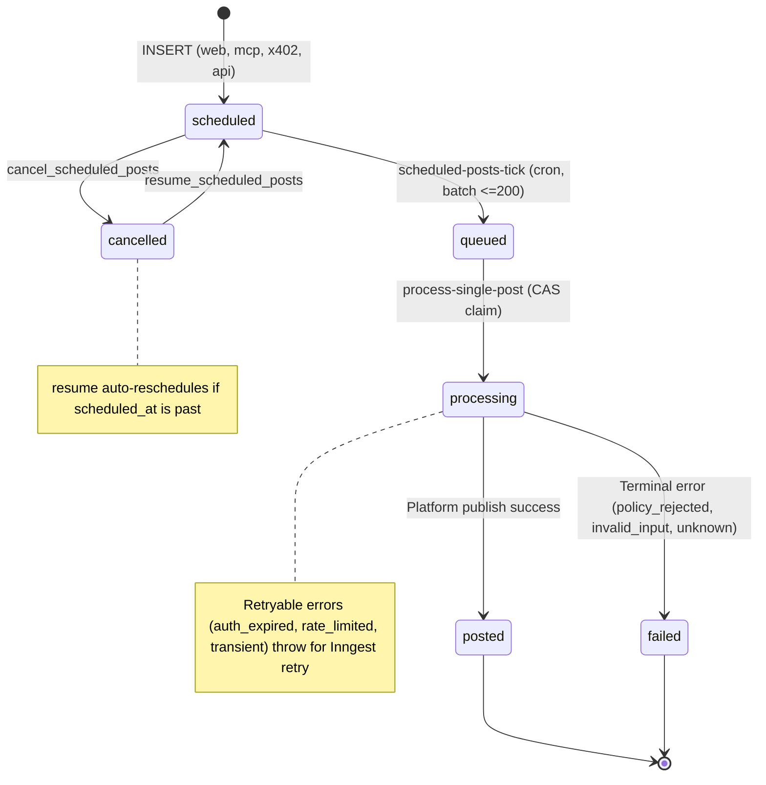
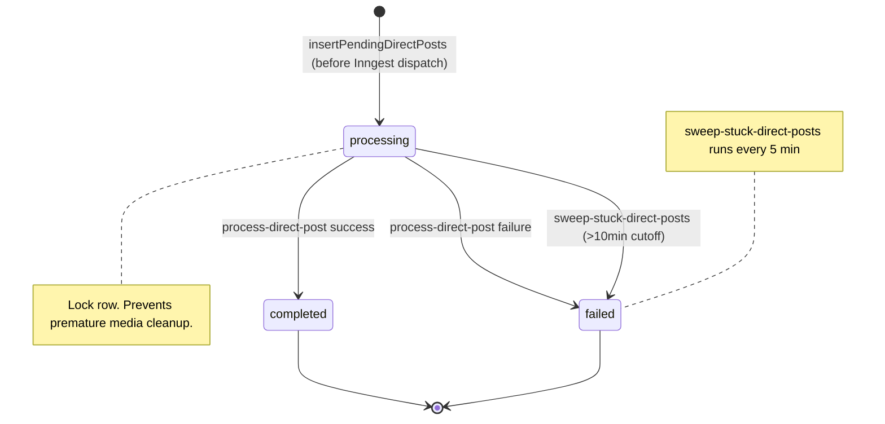

# Architecture

System architecture for Sharetopus: a Next.js 16 SaaS app with an MCP server, Inngest background jobs, and integrations with 4 social platforms.

346 TypeScript source files. 21 API routes. 31 database tables. 18 MCP tools. 11 Inngest functions.

[Back to README](../README.md)

## Table of contents

- [System overview](#system-overview)
- [Directory structure](#directory-structure)
- [Data flows](#data-flows)
  - [Web user schedules a post](#web-user-schedules-a-post)
  - [MCP agent schedules a post](#mcp-agent-schedules-a-post)
  - [Inngest processes a scheduled post](#inngest-processes-a-scheduled-post)
  - [TikTok async publish (webhook + polling)](#tiktok-async-publish-webhook--polling)
  - [Pinterest OAuth flow](#pinterest-oauth-flow)
- [State diagrams](#state-diagrams)
  - [scheduled_posts.status](#scheduled_postsstatus)
  - [pending_direct_posts.status](#pending_direct_postsstatus)
- [Error handling](#error-handling)
- [Design tradeoffs](#design-tradeoffs)
- [Tech stack](#tech-stack)
- [Source files referenced](#source-files-referenced)

## System overview

```mermaid
graph TD
    subgraph Client["Client Layer"]
        Browser["React 19 SPA (App Router)"]
        AI["AI Agents (Claude Desktop, Cursor)"]
    end

    subgraph Edge["Edge / Middleware"]
        ClerkMW["Clerk Middleware (src/middleware.ts)"]
    end

    subgraph Server["Next.js Server (Vercel, 300s max)"]
        subgraph Actions["Server Actions"]
            PubActions["Public Actions (auth + rate limit)"]
            IntActions["Internal Actions (no auth, MCP use)"]
        end
        subgraph API["API Routes (21 endpoints)"]
            SocialRoutes["Social OAuth + Post Routes"]
            StorageRoutes["Storage URL Routes"]
            WebhookRoutes["Webhook Handlers (Clerk, Stripe, TikTok)"]
            PostStatus["Post Status Polling"]
            X402Routes["x402 Routes (deferred)"]
        end
        subgraph MCP["MCP Server"]
            MCPRoute["POST /api/mcp/mcp"]
            MCPAuth["withMcpAuth (Bearer token)"]
            MCPTools["18 Tools, 3 Resources, 3 Prompts"]
        end
    end

    subgraph Background["Background (Inngest, 11 functions)"]
        subgraph EventHandlers["Event-driven (4)"]
            Worker["process-single-post (post.due, retries 3)"]
            DirectWorker["process-direct-post (post.now, retries 0)"]
            TikTokPoll["tiktok-publish-status-poll (tiktok.publish.poll)"]
            TikTokWebhook["process-tiktok-publish-webhook (tiktok.publish.webhook.received, retries 3)"]
        end
        subgraph Crons["Cron jobs (7)"]
            Dispatcher["scheduled-posts-tick (*/5 min)"]
            StuckSweep["sweep-stuck-direct-posts (*/5 min)"]
            OrphanSweep["sweep-orphan-storage-files (daily 03:00)"]
            StripeSweep["cleanup-stripe-webhook-events (daily 03:00)"]
            OauthSweep["sweep-stale-oauth-clients (daily 04:00)"]
            AuditSweep["cleanup-mcp-audit-log (daily 04:00)"]
            GraceSweep["cleanup-cancelled-posts-after-grace (daily 05:00)"]
        end
    end

    subgraph Data["Data Layer"]
        Supabase["Supabase Postgres (31 tables)"]
        Storage["Supabase Storage (scheduled-videos)"]
        Redis["Upstash Redis (rate limits)"]
    end

    subgraph External["External Services"]
        Clerk["Clerk (Auth + Webhooks)"]
        Stripe["Stripe (Billing + Webhooks)"]
        LI["LinkedIn v2"]
        TK["TikTok v2"]
        PI["Pinterest v5"]
        IG["Instagram Graph v23"]
    end

    Browser --> ClerkMW --> Actions
    AI --> MCPRoute
    MCPRoute --> MCPAuth --> MCPTools
    MCPTools --> IntActions
    PubActions --> Supabase
    PubActions --> Redis
    IntActions --> Supabase
    Actions --> StorageRoutes
    StorageRoutes --> Storage
    Dispatcher --> Worker
    Worker --> LI & TK & PI & IG
    DirectWorker --> LI & TK & PI & IG
    TikTokPoll --> TK
    TikTokWebhook --> Supabase
    StuckSweep --> Supabase
    OrphanSweep --> Storage
    StripeSweep --> Supabase
    OauthSweep --> Supabase
    AuditSweep --> Supabase
    GraceSweep --> Supabase
    Clerk -->|webhooks| WebhookRoutes
    Stripe -->|webhooks| WebhookRoutes
    TK -->|webhooks| WebhookRoutes
    WebhookRoutes --> Supabase
```



## Directory structure

```
src/
  actions/
    api/
      adminSupabase.ts          # Supabase client with service role (bypasses RLS)
    client/
      signedUrlUpload.ts        # Client-side XHR upload with progress
    server/
      _internal/                # No-auth actions consumed by MCP tools
        contentHistoryActions/  # getContentHistoryInternal
        data/                   # deleteSupabaseFileAction, fetchSocialAccounts
        scheduleActions/        # schedulePost, cancel, resume, update, delete, get
      accounts/                 # disconnectSocialAccount
      connections/              # checkAccountLimits (plan-gated)
      contentHistoryActions/    # storeContentHistory, storeFailedPost, getContentHistory
      data/                     # generateServerSignedUploadUrl, pendingDirectPosts,
                                # pendingTikTokPulls, mcpSessions, orphanStorageSweep,
                                # sweepStaleOauthClients, cleanupCancelledPostsAfterGrace,
                                # finalizeTikTokPostByPublishId,
                                # getServerSignedViewUrl, getSupabaseVideoFile
      directPostActions/        # directPostBatchAction (with requestId tracing)
      handleSocialMediaPost/    # Main posting handler (direct + scheduled)
      mcp/                      # createApiKey, listApiKeys, revokeApiKey
      rateLimit/                # checkRateLimit (Upstash sliding window)
      scheduleActions/          # Public wrappers: auth + rate limit + delegate to _internal
      stripe/                   # checkOutSession, checkUserSubscription, customerPortal
  app/
    (marketing)/                # Landing page, Privacy Policy, ToS
    (protected)/                # Authenticated routes
      connections/              # Social account management
      create/                   # Post creation (text/image/video)
      integrations/             # Integration status page
      payment/                  # Checkout + success page
      posted/                   # Content history view
      scheduled/                # Scheduled posts view
      studio/                   # Analytics (Coming Soon)
      userProfile/              # Clerk user profile
    .well-known/
      oauth-protected-resource/ # RFC 9728 OAuth discovery for MCP clients
    api/
      auth/[clerk]/             # Clerk auth UI
      inngest/                  # Inngest serve() endpoint (11 functions)
      mcp/[transport]/          # MCP server (Streamable HTTP + SSE)
      media/                    # HMAC-signed media proxy
      posts/status/             # Inngest job status polling (max 50 event IDs)
      social/
        {platform}/connect/     # OAuth callback handler
        {platform}/initiate/    # OAuth initiation redirect
      storage/
        generate-upload-url/    # Signed upload URL (Clerk-authed)
        generate-view-url/      # Signed view URL (Clerk-authed, 5min TTL)
      webhooks/
        clerk/                  # user.created, user.updated, user.deleted
        stripe/                 # subscription.*, invoice.*
        tiktok/publish/         # TikTok Content Posting webhooks
      x402/                     # Wallet-based access (deferred)
        connect/                # x402 connection initiation
        oauth/callback/         # Platform OAuth callback for wallet users
        oauth/status/           # Connection status query
        register/               # Wallet registration challenge + verify
  components/
    core/
      create/                   # Post creation form, media upload, validation
        action/
          handleSocialMediaPost/  # Main posting handler (direct + scheduled)
          media/                  # Upload helpers
        SocialPostForm/           # Form UI, hooks, validation, state
      scheduled/                # Scheduled posts table, reschedule dialog
      posted/                   # Content history table
      accounts/                 # Connect accounts button, account list
    marketing-page/             # Hero, comparison, details, nav
    sidebar/                    # App navigation
    ui/                         # shadcn/ui components
  inngest/
    client.ts                   # Inngest client (id: "sharetopus")
    dispatch/
      dispatchPostNowEvents.ts  # Dispatch helper for direct posts
    functions/
      scheduledPostsTick.ts     # Cron */5: dispatch due scheduled posts
      processSinglePost.ts      # Event post.due: process one scheduled post (retries 3)
      processDirectPost.ts      # Event post.now: process one direct post (retries 0)
      tikTokPublishStatusPoll.ts  # Event tiktok.publish.poll: poll TikTok publish status
      processTikTokPublishWebhook.ts  # Event tiktok.publish.webhook.received: handle TikTok webhook (retries 3)
      sweepStuckDirectPosts.ts  # Cron */5: recover stuck pending_direct_posts
      sweepOrphanStorageFiles.ts  # Cron daily 03:00: delete unreferenced storage files
      cleanupStripeWebhookEvents.ts  # Cron daily 03:00: purge stripe_webhook_events > 90d
      sweepStaleOauthClientsCron.ts   # Cron daily 04:00: purge unverified OAuth clients > 90d
      cleanupMcpAuditLogCron.ts       # Cron daily 04:00: purge mcp_audit_log > 90d
      cleanupCancelledPostsAfterGraceCron.ts  # Cron daily 05:00: delete cancelled posts past 7d grace
      platformErrors.ts         # Error classification (retryable vs terminal)
  lib/
    api/
      _shared/
        buildStreamingMultipartFormDataBody.ts  # Streaming S3 upload for Pinterest
        directPostForAccountsGeneric.ts        # Generic direct-post adapter (all 4 platforms)
        processAccountsGeneric.ts              # Generic multi-account processor
        scheduleForAccountGeneric.ts           # Generic scheduler
      instagram/                # OAuth, posting, scheduling, data helpers
      linkedin/                 # OAuth, posting, scheduling, data helpers
      pinterest/                # OAuth, posting (streaming video), scheduling
      tiktok/                   # OAuth, posting (async pull), scheduling, finalize
      inngest/                  # Inngest API helpers
    jobs/
      runtimeConfig.ts          # Runtime tuning (concurrency, timeouts, batch sizes)
    mcp/
      auth.ts                   # resolveMcpPrincipal (API key + OAuth paths)
      audit.ts                  # logToolCall, arg redaction, session upsert
      context.ts                # extractPrincipal, extractSessionId, extractIpHash
      entitlement.ts            # Plan gating (Creator+ minimum) + monthly quota enforcement
      ipHash.ts                 # SHA-256 IP hashing with configurable salt
      withMcpTool.ts            # HOF wrapper: auth, entitlement, audit, error handling
      _shared/                  # safeUserFetch, enforceStorageQuota, currentQuotaPeriod
      tools/                    # 18 tool definitions (one file per tool)
      prompts/                  # 3 prompt definitions (auditCalendar, planWeekForPlatform, repurposePost)
    types/
      database.types.ts         # Generated Supabase types (31 tables)
      plans.ts                  # Plan tiers (Starter, Creator, Pro), price IDs, account/storage limits
    utils/
      generateRequestId.ts      # Web requestId tracing for server actions
    x402/                       # Wallet-based anonymous access (deferred)
      auth/                     # resolveWalletPrincipal, types
      audit/                    # logX402Call
      connect/                  # buildOAuthUrl
      oauth/                    # connectionToken, callback handlers per platform
      register/                 # handleRegisterChallenge, handleRegisterVerify
      sanctions/                # applyWalletGate (OFAC)
      siwe/                     # SIWE nonce create/consume/verify
      solana/                   # refundSolana
```

## Data flows

### Web user schedules a post



### MCP agent schedules a post

MCP access requires the Creator plan or higher. Starter users have zero MCP access. All 18 tools enforce this via the `withMcpTool` HOF, which runs entitlement checks before any business logic.



### Inngest processes a scheduled post



### TikTok async publish (webhook + polling)

TikTok's Content Posting API is asynchronous. After the initial upload, TikTok returns a `publish_id` but the post is not live yet. Sharetopus resolves final status through two parallel paths that both converge on the same function.



Whichever path fires first writes the final state. The finalize function is idempotent, so if both paths resolve (e.g., webhook arrives after polling already completed), the second call is a no-op.

### Pinterest OAuth flow



## State diagrams

### scheduled_posts.status



### pending_direct_posts.status



## Error handling

The codebase uses an errors-as-values pattern at service boundaries. Functions return `{ success: boolean; message: string; data?: T }` instead of throwing exceptions. This keeps error handling explicit at every call site.

```typescript
// Pattern used throughout server actions:
{ success: true, message: "Post scheduled", data: { scheduleId: "..." } }
{ success: false, message: "Rate limited", resetIn: 45 }
{ success: false, message: "Account not found" }
```

Exceptions are thrown only for retryable failures inside Inngest workers, where Inngest catches the throw and applies exponential backoff. Terminal failures (policy rejection, invalid input) are recorded and the function returns normally.

Platform errors are classified in `src/inngest/functions/platformErrors.ts`:
- **Retryable**: `auth_expired`, `rate_limited`, `transient` (network timeouts, connection resets)
- **Terminal**: `policy_rejected` (platform policy violation), `invalid_input` (wrong post type, missing board), `unknown`

The `withMcpTool` HOF handles MCP-layer errors. If entitlement denies the request, it writes an audit row with status `denied` or `quota_exceeded` and returns a structured error to the agent. If the handler throws, the HOF writes an `error` audit row and re-throws for the SDK to surface as a JSON-RPC error.

## Design tradeoffs

**Principals table (unified identity).** `principals.kind` is `clerk` or `wallet`. Every other table FKs to `principal_id`, not `user_id`. This adds a join when you only care about Clerk users (which is currently all users), but it means the x402 wallet-based anonymous access path can be added without schema migration. The wallet tables exist in the schema but the code path is deferred.

**created_via enum.** Every post-related table stores `created_via: web | mcp | x402 | api`. This was threaded through all scheduling and posting paths so analytics can distinguish origin. The cost is an extra parameter passed through several layers.

**withMcpTool HOF.** Every MCP tool handler is wrapped by `withMcpTool`, which handles: (1) extract per-request context (principal, session, ipHash, user agent, client info), (2) run entitlement gate (tier check + monthly quota via atomic RPC), (3) call business logic, (4) emit audit row with latency. Tool handlers only contain business logic. The HOF also supports per-tool `auditArgsBuilder` for scrubbing large or sensitive args before they reach `mcp_audit_log`.

**Generic adapter pattern.** `directPostForAccountsGeneric.ts` provides a single code path for direct posting across all 4 platforms. Platform-specific logic is injected via callbacks. Same pattern in `processAccountsGeneric.ts` and `scheduleForAccountGeneric.ts`. This avoids 4x duplication at the cost of an abstraction layer.

**TikTok dual-path resolution.** TikTok publishes are async (you get a `publish_id`, not a final status). Both webhook and polling paths exist because webhooks are faster but not 100% reliable. Both converge on `finalizeTikTokPostByPublishId`, which is idempotent. The second path to arrive is a no-op.

**Stateless MCP (mcp-handler 1.1.0).** The MCP server runs in stateless Streamable HTTP mode. mcp-handler 1.1.0 does not support persistent sessions across requests. Each request resolves the principal independently. The `mcp_sessions` table tracks session activity but cannot enforce session continuity. This is fine for tool calls but limits features like long-running subscriptions or server-initiated notifications.

**Internal vs public actions.** MCP tools call `_internal` actions that skip Clerk auth (the MCP auth layer already verified the principal). Public server actions add Clerk auth + rate limiting and delegate to the same `_internal` functions. This avoids double-auth but means `_internal` functions must never be imported from client components. The `server-only` package enforces this at build time.

**Admin Supabase client.** All server actions use a service-role Supabase client that bypasses RLS. This is simpler than managing RLS policies for server-side operations but means the application layer is responsible for all access control. Every action manually checks `principal_id` ownership.

**Web requestId tracing.** Public server actions call `generateRequestId()` and pass the ID through the call chain. This ties together the server action, any Inngest events dispatched, and the resulting background work, making it possible to trace a user action end-to-end in logs.

**Inngest over pg_cron.** Background jobs use Inngest (hosted) instead of Postgres cron extensions. Inngest provides retry with backoff, per-account throttling, event-driven dispatch, and observability without self-hosting infrastructure. The tradeoff is a dependency on Inngest's hosted service and the 300-second Vercel function timeout ceiling.

**Streaming multipart for Pinterest video.** Pinterest requires uploading video files to S3 via multipart form-data. The `buildStreamingMultipartFormDataBody` helper streams the file chunk-by-chunk (~64KB) to avoid loading the entire video into memory. This adds complexity (Content-Length precomputation, `duplex: "half"` on fetch) but keeps memory usage bounded even for 250 MB videos.

**4 surfaces, 2 shipped.** The system is designed for 4 access surfaces: Web (shipped), MCP (shipped), REST API (deferred), x402 wallet-based access (deferred). The `created_via` enum and `principals` table accommodate all four, but only Web and MCP have working code paths today.

## Tech stack

| Category | Package | Version |
|----------|---------|---------|
| Framework | next | 16.2.6 |
| React | react / react-dom | 19.2.0 |
| TypeScript | typescript | 5.9.3 |
| CSS | tailwindcss | 4.2.4 |
| Auth | @clerk/nextjs | 7.3.2 |
| MCP Auth | @clerk/mcp-tools | 0.5.0 |
| Database | @supabase/supabase-js | 2.105.3 |
| Payments | stripe | 18.5.0 |
| Background Jobs | inngest | 4.3.0 |
| Rate Limiting | @upstash/ratelimit | 2.0.8 |
| Redis | @upstash/redis | 1.38.0 |
| MCP SDK | @modelcontextprotocol/sdk | 1.29.0 |
| MCP Handler | mcp-handler | 1.1.0 |
| HTTP Client | axios | 1.16.0 |
| Validation | zod | 3.25.76 |
| UI Components | shadcn (Radix UI) | 2.10.0 |
| Date Handling | date-fns | 4.1.0 |
| ID Generation | nanoid / uuid | 5.1.11 / 11.1.1 |
| Webhooks | svix | 1.92.2 |
| Charts | recharts | 2.15.4 |
| File Upload | react-dropzone | 14.4.1 |
| Drag & Drop | @dnd-kit | core 6.3.1 |
| Deployment | Vercel | |

## Source files referenced

| File | What it does |
|------|-------------|
| `src/app/api/inngest/route.ts` | Inngest serve() endpoint, registers all 11 functions |
| `src/inngest/client.ts` | Inngest client instance (id: "sharetopus") |
| `src/inngest/functions/scheduledPostsTick.ts` | Cron: dispatch due scheduled posts every 5 min |
| `src/inngest/functions/processSinglePost.ts` | Event worker: process one scheduled post |
| `src/inngest/functions/processDirectPost.ts` | Event worker: process one direct post |
| `src/inngest/functions/tikTokPublishStatusPoll.ts` | Event worker: poll TikTok publish status |
| `src/inngest/functions/processTikTokPublishWebhook.ts` | Event worker: handle TikTok publish webhook |
| `src/inngest/functions/sweepStuckDirectPosts.ts` | Cron: recover stuck direct posts |
| `src/inngest/functions/sweepOrphanStorageFiles.ts` | Cron: delete unreferenced storage files |
| `src/inngest/functions/cleanupStripeWebhookEvents.ts` | Cron: purge Stripe webhook events older than 90 days |
| `src/inngest/functions/sweepStaleOauthClientsCron.ts` | Cron: purge unverified OAuth clients older than 90 days |
| `src/inngest/functions/cleanupMcpAuditLogCron.ts` | Cron: purge mcp_audit_log rows older than 90 days |
| `src/inngest/functions/cleanupCancelledPostsAfterGraceCron.ts` | Cron: delete cancelled posts past 7-day grace |
| `src/inngest/functions/platformErrors.ts` | Error classification (retryable vs terminal) |
| `src/lib/mcp/withMcpTool.ts` | HOF: auth, entitlement, audit, error handling for MCP tools |
| `src/lib/mcp/entitlement.ts` | Plan gating (Creator+ minimum) + monthly quota enforcement |
| `src/lib/mcp/auth/resolve.ts` | resolveMcpPrincipal (API key + OAuth paths) |
| `src/lib/mcp/audit.ts` | logToolCall, arg redaction, session upsert |
| `src/lib/mcp/context.ts` | Extract principal, sessionId, ipHash from MCP request |
| `src/lib/api/_shared/directPostForAccountsGeneric.ts` | Generic direct-post adapter for all 4 platforms |
| `src/lib/api/_shared/processAccountsGeneric.ts` | Generic multi-account processor |
| `src/lib/api/_shared/scheduleForAccountGeneric.ts` | Generic scheduler |
| `src/lib/api/_shared/buildStreamingMultipartFormDataBody.ts` | Streaming multipart for Pinterest video |
| `src/actions/server/data/finalizeTikTokPostByPublishId.ts` | Shared TikTok finalize (webhook + polling converge here) |
| `src/actions/api/adminSupabase.ts` | Service-role Supabase client (bypasses RLS) |
| `src/lib/utils/generateRequestId.ts` | Web requestId tracing for server actions |
| `src/lib/types/database.types.ts` | Generated Supabase types (31 tables) |
| `src/lib/types/plans.ts` | Plan tiers, tier comparison, price ID mapping |
| `src/proxy.ts` | Clerk middleware (edge) |

---

**See also:** [docs/SECURITY.md](./SECURITY.md) (security architecture, threat model), [docs/MCP.md](./MCP.md) (tool inventory, auth flow), [docs/DATABASE.md](./DATABASE.md) (schema details), [docs/INNGEST.md](./INNGEST.md) (background jobs detail)

[Back to README](../README.md)
