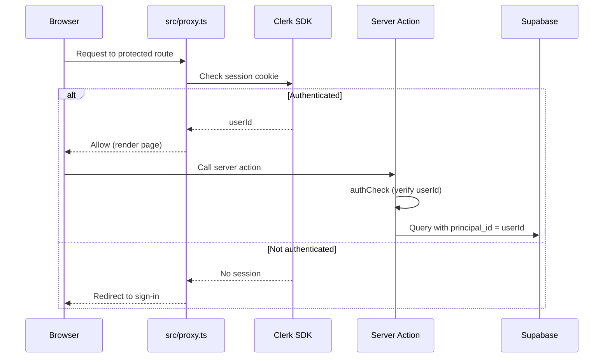
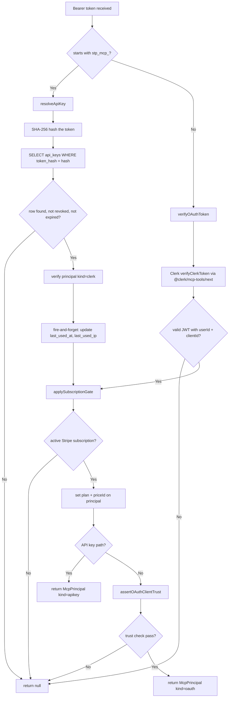
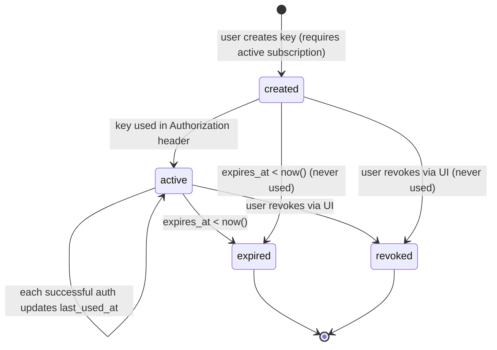

# Authentication

Two auth systems: Clerk for web users, MCP API keys + Clerk OAuth for AI agents. Both resolve to a `principal_id` in the `principals` table.

[Back to README](../README.md)

## Table of contents

1. [Principal model](#principal-model)
2. [Web authentication (Clerk)](#web-authentication-clerk)
3. [MCP authentication](#mcp-authentication)
4. [API key lifecycle](#api-key-lifecycle)
5. [OAuth discovery](#oauth-discovery)
6. [OAuth client trust enforcement](#oauth-client-trust-enforcement)
7. [Entitlement and plan gating](#entitlement-and-plan-gating)
8. [IP hashing](#ip-hashing)
9. [Future: wallet authentication (deferred)](#future-wallet-authentication-deferred)
10. [Source files referenced](#source-files-referenced)

---

## Principal model

The `principals` table is the root identity table. Every user-scoped table FKs to `principals.id`, not to `users.id`. This indirection exists so that wallet-based principals (Phase 4) can own the same resources without schema changes.

```mermaid
erDiagram
    principals {
        uuid id PK
        text kind "clerk | wallet"
        timestamptz created_at
        timestamptz deleted_at
        jsonb metadata
    }
    users {
        uuid id PK_FK "FK to principals"
        text email
        text first_name
        text last_name
        text stripe_customer_id
    }
    wallets {
        uuid id PK_FK "FK to principals (future)"
        text address
    }
    api_keys {
        uuid id PK
        uuid principal_id FK
        text prefix "first 8 chars"
        text token_hash "SHA-256"
        text kind "rest | mcp | wallet"
        text[] scopes
        timestamptz expires_at
        timestamptz revoked_at
    }
    mcp_oauth_clients {
        text client_id PK
        text trust_level "unverified | verified | blocked"
        text registered_by_user_id FK
        timestamptz revoked_at
    }

    principals ||--o| users : "kind=clerk"
    principals ||--o| wallets : "kind=wallet"
    principals ||--o{ api_keys : "owns"
    principals ||--o{ mcp_oauth_clients : "registers"
```

Currently all principals have `kind=clerk`. The wallet path is schema-ready but not built.

---

## Web authentication (Clerk)

Clerk handles session management, sign-in/sign-up UI, and webhook-driven user sync.



### Middleware configuration

`src/proxy.ts` uses `clerkMiddleware` from `@clerk/nextjs/server` with two route matchers:

**Public routes** (no auth required, MCP does its own Bearer token auth):
- `/api/mcp/(.*)`
- `/api/x402/(.*)`
- `/.well-known/oauth-protected-resource(.*)`
- `/.well-known/oauth-authorization-server(.*)`

**Protected routes** (auth required, redirect to sign-in if no session):
- `/accounts`, `/config`, `/connections`, `/create`, `/dashboard`
- `/posts`, `/posted`, `/scheduled`, `/schedule`
- `/studio`, `/userProfile`, `/integrations`

### Clerk webhooks

`src/app/api/webhooks/clerk/route.ts` handles three Clerk events. All payloads are verified via Svix signature before processing.

| Event | Action |
|-------|--------|
| `user.created` | Upsert into `principals` (kind=clerk), insert into `users`, create Stripe customer |
| `user.updated` | Update `users` (email, name), update Stripe customer metadata |
| `user.deleted` | Delete from `users`, delete Stripe customer, delete storage folder |

**Rollback behavior:** If the Stripe customer creation fails during `user.created`, the handler returns early (no DB records created). If the Supabase insert fails after Stripe creation, the Stripe customer is deleted. This keeps the two systems consistent.

---

## MCP authentication

All MCP requests carry a Bearer token. The dispatcher in `resolveMcpPrincipal` routes the token to one of two auth paths based on its prefix, then applies a shared subscription gate.



The subscription gate runs before the OAuth trust check. This prevents non-paying users from ever inserting rows into `mcp_oauth_clients`.

### McpPrincipal type

`McpPrincipal` is a discriminated union on the `kind` field:

```typescript
// kind: "apikey"
{
  kind: "apikey";
  principalId: string;
  apiKeyId: string;       // UUID of the api_keys row
  scopes: string[];
  plan: PlanTier | null;  // "starter" | "creator" | "pro" | null
  priceId: string | null;
}

// kind: "oauth"
{
  kind: "oauth";
  principalId: string;
  oauthClientId: string;  // OAuth client ID from Clerk token
  scopes: string[];
  plan: PlanTier | null;
  priceId: string | null;
}
```

The `plan` field starts as `null` and is populated by `applySubscriptionGate` from the active `stripe_subscriptions` row. Downstream code reads `principal.plan` without re-querying.

### Fail-closed design

`resolveMcpPrincipal` returns `null` on any failure. Callers treat `null` as a 401. There is no fallback or degraded-access mode.

---

## API key lifecycle

### Key format

`stp_mcp_` followed by 32 hex characters (e.g., `stp_mcp_a1b2c3d4e5f6...`).

The raw key is returned exactly once at creation time. Only the SHA-256 hash is stored. Authentication works by hashing the provided token and matching against `token_hash`.

### Schema (api_keys table)

| Column | Description |
|--------|-------------|
| `id` | UUID primary key |
| `principal_id` | FK to `principals` |
| `name` | User-chosen label (1-100 chars) |
| `prefix` | First 8 chars of the raw key (for UI display) |
| `token_hash` | SHA-256 hash of the full key |
| `kind` | `rest`, `mcp`, or `wallet` |
| `scopes` | Array of permission strings |
| `expires_at` | Expiry timestamp (required) |
| `last_used_at` | Updated on every successful auth |
| `last_used_ip` | Hashed IP of last use |
| `created_at` | Creation timestamp |
| `revoked_at` | Soft-delete timestamp (non-null means revoked) |

### Expiry options

Users select from four fixed durations: **7, 30, 90, or 365 days**. The default is 90 days. There is no "never expires" option. These values are defined in `API_KEY_EXPIRY_DAYS_OPTIONS` and validated by `isValidApiKeyExpiryDays()`.

### State machine



### Constraints

- Maximum **10 active MCP keys** per user
- Creating a key requires an **active Stripe subscription**
- Revocation is a soft delete (`revoked_at` set, row kept for audit)
- `last_used_at` and `last_used_ip` are updated via `waitUntil` (fire-and-forget, does not block the auth response)

---

## OAuth discovery

`src/app/.well-known/oauth-protected-resource/route.ts` implements [RFC 9728](https://datatracker.ietf.org/doc/rfc9728/) (OAuth Protected Resource Metadata).

MCP clients that support OAuth discovery (Claude Desktop, Cursor) hit this endpoint to find the Clerk authorization server automatically. The route is handled by `@clerk/mcp-tools/next` and reads `NEXT_PUBLIC_CLERK_PUBLISHABLE_KEY` from the environment to construct the metadata response.

---

## OAuth client trust enforcement

The `mcp_oauth_clients` table tracks every OAuth client that has authenticated against the MCP endpoint. Each client has a trust level that controls whether future auth attempts are allowed.

### Trust levels

| Level | Behavior |
|-------|----------|
| `unverified` | Auth allowed. Client has not been promoted (or was demoted). |
| `verified` | Auth allowed. Auto-assigned on first sight if user has fewer than 5 verified clients. |
| `blocked` | Auth refused. Set via SQL or future admin UI. |

### Trust state transitions

**First sight (new client_id):** The system upserts a row into `mcp_oauth_clients`. If the registering user has fewer than 5 verified clients, the new client is auto-verified. Otherwise it is inserted as unverified.

**Subscription cancel:** All `verified` clients belonging to the user are demoted to `unverified` (see `demoteOauthClientsOnCancel`).

**Resubscribe:** Up to 5 clients are promoted back to `verified`.

**Stale cleanup:** Unverified clients older than 90 days with no recent sessions are purged by the `sweep-stale-oauth-clients` Inngest cron at 04:00 UTC daily.

### DCR rate limits

First-sight registration is rate-limited per IP to prevent abuse:
- **1 new client per minute per IP**
- **10 new clients per day per IP**

Rate-limit hits are logged to the `rate_limit_events` table with scopes `dcr_register` and `dcr_register_daily`.

---

## Entitlement and plan gating

`entitlementFor()` runs on every MCP tool call (via the `withMcpTool` HOF wrapper) before any business logic executes.

### Check order

1. **Tier gate** (no DB call). Compares `principal.plan` against the minimum tier for the tool. All MCP tools currently require the Creator tier or higher. Starter users have zero MCP access.

2. **Monthly quota** (atomic DB call). If the tool has a cap defined in `MONTHLY_CAPS`, the `atomic_increment_quota` Postgres RPC increments and checks the counter in a single SQL statement. Two concurrent requests at cap-1 produce one allow and one deny, never two allows.

### Deny reasons

| Reason | Meaning |
|--------|---------|
| `no_subscription` | User has no active subscription |
| `plan_too_low` | User's tier does not meet the tool's minimum |
| `monthly_quota` | Monthly cap reached for this tool |
| `platform_quota` | Tool has a zero cap on this tier (not available) |
| `infra_error` | DB/RPC error (fails open to avoid blocking paying users) |

### Sample monthly caps (Creator tier)

| Tool | Creator cap | Pro cap |
|------|-------------|---------|
| `schedule_post` | 500 | unlimited |
| `post_now` | 500 | unlimited |
| `bulk_schedule` | 200 | unlimited |
| `generate_post_draft` | 100 | unlimited |

Read-only tools (`list_connections`, `list_scheduled_posts`, etc.) have no monthly cap.

---

## IP hashing

Client IPs are hashed before storage to avoid writing raw PII to the database. Used by `last_used_ip` on API keys and by rate-limit event logging.

**Algorithm:** `SHA-256(ip + ":" + salt)`, truncated to 32 hex chars (16 bytes of entropy).

**Salt configuration:**
- **Production:** `MCP_IP_HASH_SALT` env var is required. Missing salt throws at request time (fail fast, never write reversible hashes).
- **Dev/test:** Falls back to a hardcoded dev salt with a one-time console warning.

Generate a production salt:
```bash
openssl rand -base64 32
```

---

## Future: wallet authentication (deferred)

The `principals` / `wallets` schema is in place for x402 wallet-based anonymous access. The planned flow:

1. User presents a SIWE (Sign-In With Ethereum) signature
2. System creates or finds a `principal` with `kind=wallet`
3. Wallet credits are checked against `wallet_credits`
4. Tool calls are charged to the wallet balance

This code path is not built. The `wallets` table FK to `principals` exists but is unused. See [docs/ROADMAP.md](./ROADMAP.md).

---

## Source files referenced

| File | Role |
|------|------|
| `src/proxy.ts` | Clerk middleware, public/protected route matchers |
| `src/app/api/webhooks/clerk/route.ts` | Clerk webhook handler (user.created, user.updated, user.deleted) |
| `src/lib/mcp/auth/resolve.ts` | `resolveMcpPrincipal` dispatcher |
| `src/lib/mcp/auth/types.ts` | `McpPrincipal` discriminated union type |
| `src/lib/mcp/auth/resolvers/apiKey.ts` | API key resolver (hash, lookup, verify, track) |
| `src/lib/mcp/auth/resolvers/oauth.ts` | `verifyOAuthToken`, `assertOAuthClientTrust` |
| `src/lib/mcp/auth/resolvers/applySubscriptionGate.ts` | Subscription check, plan enrichment |
| `src/lib/mcp/auth/oauthClientTrust.ts` | Trust check, first-sight insert, DCR rate limiting |
| `src/lib/mcp/entitlement.ts` | `entitlementFor()`, tier gate, monthly quota |
| `src/lib/mcp/apiKeyExpiry.ts` | `API_KEY_EXPIRY_DAYS_OPTIONS`, expiry validation |
| `src/lib/mcp/ipHash.ts` | `hashClientIp()`, salt handling |
| `src/lib/mcp/tokens.ts` | `isMcpApiKeyToken()`, `hashToken()`, `generateMcpApiKey()` |
| `src/actions/server/mcp/createApiKey.ts` | API key creation server action |
| `src/actions/server/data/demoteOauthClientsOnCancel.ts` | Demote verified clients on subscription cancel |
| `src/inngest/functions/sweepStaleOauthClientsCron.ts` | Daily stale OAuth client cleanup |
| `src/app/.well-known/oauth-protected-resource/route.ts` | RFC 9728 OAuth discovery |

---

**See also:** [docs/MCP.md](./MCP.md) (tool inventory, entitlement), [docs/SECURITY.md](./SECURITY.md) (identity flow diagram, audit log), [docs/BILLING.md](./BILLING.md) (plan tier definitions)

[Back to README](../README.md)
