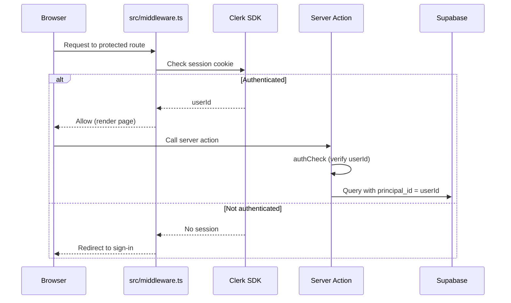
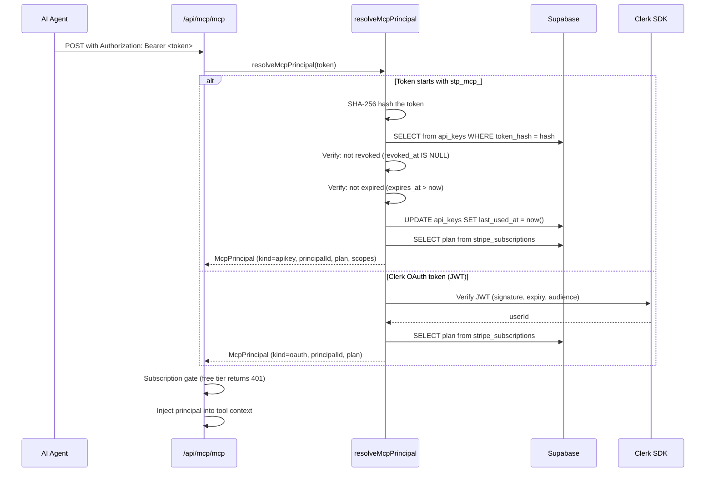

# Authentication

Two auth systems: Clerk for web users, MCP API keys + Clerk OAuth for AI agents. Both resolve to a `principal_id` in the `principals` table.

[Back to README](../README.md)

## Principal model

The `principals` table is the root identity table. Every user-scoped table FKs to `principals.id`.

```mermaid
erDiagram
    principals {
        uuid id PK
        text kind "clerk | wallet"
        timestamptz created_at
        timestamptz deleted_at
        jsonb metadata
    }
    users {
        uuid id PK_FK "FK to principals"
        text email
        text first_name
        text last_name
        text stripe_customer_id
    }
    wallets {
        uuid id PK_FK "FK to principals (future)"
        text address
    }

    principals ||--o| users : "kind=clerk"
    principals ||--o| wallets : "kind=wallet"
```

**Why unified:** The x402 wallet-based anonymous access path (Phase 4) will create `principals` with `kind=wallet`. Since all tables FK to `principal_id`, wallet users can schedule posts, have usage quotas, and be audited without schema changes. Currently all principals are `kind=clerk`.

## Web authentication (Clerk)



### Middleware configuration

`src/middleware.ts` uses `@clerk/nextjs` middleware with:
- **Public routes** (no auth required): `/api/mcp/(.*)`, `/.well-known/oauth-protected-resource(.*)`, `/.well-known/oauth-authorization-server(.*)`
- **Protected routes** (auth required): `/accounts`, `/connections`, `/create`, `/scheduled`, `/posted`, `/studio`, `/userProfile`, `/integrations`, `/payment`, and others

MCP endpoints are public because the MCP handler performs its own Bearer token authentication.

### Clerk webhooks

`src/app/api/webhooks/clerk/route.ts` handles three events via Svix signature verification:

| Event | Action |
|-------|--------|
| `user.created` | Insert into principals (kind=clerk), insert into users, create Stripe customer |
| `user.updated` | Update users (email, name), update Stripe customer metadata |
| `user.deleted` | Delete user from users table, delete Stripe customer, delete storage folder |

Rollback: if Stripe customer creation fails during `user.created`, the Supabase records are cleaned up. If Supabase insert fails, the Stripe customer is deleted.

## MCP authentication



### McpPrincipal type

```typescript
{
  kind: "apikey" | "oauth"
  principalId: string
  apiKeyId?: string        // if kind=apikey
  oauthClientId?: string   // if kind=oauth
  scopes: string[]
  plan: PlanTier           // "free" | "starter" | "creator" | "pro"
  priceId: string | null
}
```

The plan tier is resolved once during auth and cached on the principal object. Tools and entitlement checks read `principal.plan` without querying `stripe_subscriptions` again.

## API key model

Stored in the `api_keys` table.

| Column | Description |
|--------|-------------|
| id | UUID primary key |
| principal_id | FK to principals |
| name | User-chosen label (1-100 chars) |
| prefix | First 8 chars of the raw key (for UI display) |
| token_hash | SHA-256 hash of the full key |
| kind | `rest`, `mcp`, or `wallet` |
| scopes | Array of permission strings |
| expires_at | Optional expiry timestamp |
| last_used_at | Updated on every successful auth |
| last_used_ip | IP of last use |
| created_at | Creation timestamp |
| revoked_at | Soft-delete timestamp (non-null = revoked) |

**Key format:** `stp_mcp_` followed by 32 hex characters.

**Limits:** Maximum 10 active MCP keys per user. Creating a key requires an active subscription.

**Security:** The raw key is returned exactly once at creation time. Only the hash is stored. Lookup happens by hashing the provided token and matching against `token_hash`.

## OAuth discovery

`src/app/.well-known/oauth-protected-resource/route.ts` implements RFC 9728 (OAuth Protected Resource Metadata). MCP clients that support OAuth discovery (Claude Desktop, Cursor) use this endpoint to find the Clerk authorization server automatically.

Handled by `@clerk/mcp-tools/next`. Reads `NEXT_PUBLIC_CLERK_PUBLISHABLE_KEY` from env to construct the metadata response.

## Entitlement and plan gating

`src/lib/mcp/entitlement.ts` enforces tier requirements and monthly quotas.

Check order:
1. **Tier gate:** Each action has a minimum tier requirement (e.g., bulk_schedule requires creator+)
2. **Monthly quota:** Atomic increment via `atomic_increment_quota` Postgres RPC

Deny reasons returned to the tool:
- `no_subscription`: User is on free tier
- `plan_too_low`: User's tier doesn't meet the action requirement
- `monthly_quota`: Monthly cap reached
- `platform_quota`: Action has a zero quota for this tier
- `infra_error`: DB/RPC error (fails open to avoid blocking users)

## Future: wallet authentication (deferred)

The principals/wallets schema is in place for x402 wallet-based anonymous access. The flow would:
1. User presents a SIWE (Sign-In With Ethereum) signature
2. System creates/finds a principal with `kind=wallet`
3. Wallet credits are checked against `wallet_credits`
4. Tool calls are charged to the wallet balance

This code path is not built. See [docs/ROADMAP.md](./ROADMAP.md).

---

**See also:** [docs/MCP.md](./MCP.md) (tool inventory, entitlement), [docs/SECURITY.md](./SECURITY.md) (identity flow diagram, audit log), [docs/BILLING.md](./BILLING.md) (plan tier definitions)

[Back to README](../README.md)
