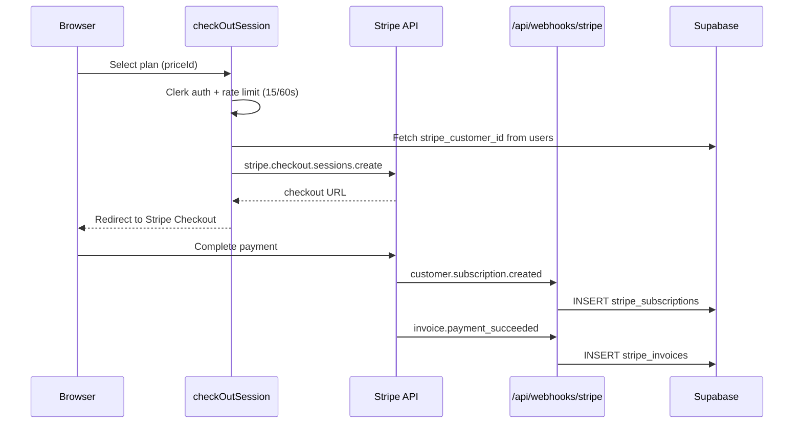

# Billing

Stripe handles subscriptions and payments. Three tiers with monthly and yearly pricing. Plan gates control MCP tool access, account limits, and storage quotas.

[Back to README](../README.md)

## Plan tiers

| Tier | Monthly | Yearly (~40% off) | Connected Accounts | Storage | MCP Tools |
|------|---------|--------------------|--------------------|---------|-----------|
| Starter | $9 | $64 | 5 | 5 GB | Write tools (schedule, post, cancel, etc.) |
| Creator | $18 | $129 | 15 | 15 GB | + bulk_schedule, get_account_analytics |
| Pro | $27 | $194 | 999 (unlimited) | 45 GB | + generate_post_draft |

Plan configuration: `src/lib/types/plans.ts`.

Stripe price IDs are environment-specific (dev vs prod). The code uses `NODE_ENV` to select the correct set. Price IDs map to tiers via `priceIdToTier()`.

## Subscription flow

## Webhook events

`src/app/api/webhooks/stripe/route.ts` processes:

| Event | Action |
|-------|--------|
| `customer.subscription.created` | Insert into stripe_subscriptions, resume system-cancelled posts, promote OAuth clients |
| `customer.subscription.updated` | Update stripe_subscriptions (status, period, plan) |
| `customer.subscription.deleted` | Set status to `cancelled`, demote OAuth clients, cancel future scheduled posts |
| `invoice.payment_succeeded` | Insert into stripe_invoices with amount_paid_cents |
| `invoice.payment_failed` | Insert into stripe_invoices with status `failed` |

## Subscription status

`checkUserSubscription` in `src/actions/server/stripe/checkUserSubscription.ts` returns true if the most recent subscription has status:

- `active`
- `trialing`
- `past_due`

Returns false for `cancelled` or no subscription. Defaults to false on error (fail-closed).

## Plan gating

### Account limits

Checked by `checkAccountLimits` in `src/actions/server/connections/checkAccountLimits.ts`:

| Tier | Max Connected Accounts |
|------|----------------------|
| Starter | 5 |
| Creator | 15 |
| Pro | 999 |
| Free (no sub) | 0 |

### MCP monthly quotas

Enforced atomically via `atomic_increment_quota` Postgres RPC:

| Action | Starter | Creator | Pro |
|--------|---------|---------|-----|
| schedule_post | 100/mo | 500/mo | unlimited |
| post_now | 100/mo | 500/mo | unlimited |
| request_upload_url | 100/mo | 500/mo | unlimited |
| attach_media_from_url | 100/mo | 500/mo | unlimited |
| bulk_schedule | blocked | 200/mo | unlimited |
| bulk_post_now | blocked | 500/mo | unlimited |
| generate_post_draft | blocked | blocked | 100/mo |

### Upload limits

All plans share the same per-file size caps:

| Type | Max Per File |
|------|-------------|
| Image | 8 MB |
| Video | 250 MB |

Storage quota is cumulative and checked during upload URL generation.

## Customer portal

`createCustomerPortal` in `src/actions/server/stripe/customerPortal.ts` creates a Stripe Billing Portal session. Rate limited at 20 requests per 60 seconds. Requires an active subscription. Return URL: `/create`.

## Usage tracking

The `usage_quotas` table stores per-principal monthly counts:

| Column | Description |
|--------|-------------|
| principal_id | FK to principals |
| period | Date, first of month (e.g., "2026-05-01"). All readers use `currentQuotaPeriod()` from `src/lib/mcp/_shared/currentQuotaPeriod.ts`. |
| action | Action name (e.g., "schedule_post") |
| count | Current count for this period |

Incremented atomically by `atomic_increment_quota` on every quota-gated MCP tool call.

## Subscription lifecycle

### Cancel (period_end, customer.subscription.deleted)

When a user's Stripe subscription reaches period_end, the webhook handler:

1. Sets `stripe_subscriptions.status = 'cancelled'`
2. Demotes the user's verified OAuth clients to unverified
   (`demoteOauthClientsOnCancel`)
3. Cancels all future scheduled posts, tagging each with
   `cancelled_by_sub_at = now()` (`cancelFutureScheduledPostsOnSubCancel`)

The user retains access to the dashboard and can resubscribe.
Manual cancellations of posts made before the sub cancel are left
untouched (they have `cancelled_by_sub_at IS NULL`).

### Resubscribe (customer.subscription.created)

When the user resubscribes, the webhook handler:

1. INSERTs the new `stripe_subscriptions` row
2. Resumes system-cancelled posts (`resumeCancelledPostsOnResubscribe`).
   Posts whose original `scheduled_at` has elapsed are bumped to
   `now() + 1 hour` via `bumpPastScheduleToFuture`.
3. Re-promotes previously-demoted OAuth clients
   (`promoteOauthClientsOnResubscribe`) up to the per-user cap of 5.

### Grace period (7 days)

If the user does not resubscribe within 7 days, the daily cron
`cleanup-cancelled-posts-after-grace` (05:00 UTC) deletes their
system-cancelled posts. Orphan media in storage is picked up by
`sweep-orphan-storage-files` (03:00 UTC) the following day.

The cron re-checks subscription status before deletion as a guard
against webhook delivery failures.

## Future: x402 (deferred)

Schema tables exist for wallet-based anonymous payments:
- `wallet_credits`: Balance tracking
- `wallet_credits_ledger`: Credit transaction history
- `x402_charges`: Per-action payment records
- `x402_refunds`: Refund records
- `x402_access_log`: Access audit trail
- `pricing_actions`: Action pricing definitions

No code path is built for these. See [docs/ROADMAP.md](./ROADMAP.md).

---

**See also:** [docs/AUTH.md](./AUTH.md) (subscription gate in auth flow), [docs/MCP.md](./MCP.md) (per-tool quotas and tier gates), [docs/STORAGE.md](./STORAGE.md) (storage caps per plan)

[Back to README](../README.md)
