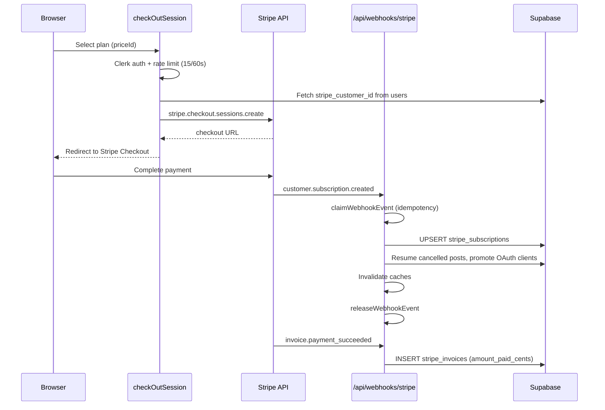
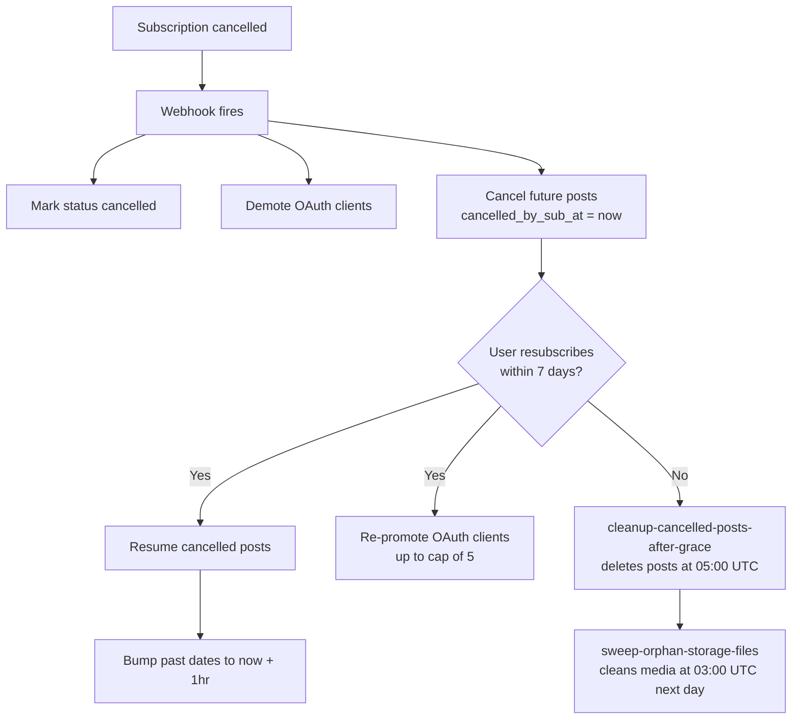

# Billing

Stripe handles subscriptions and payments. Three tiers with monthly and yearly pricing. Plan gates control web UI access, MCP tool access, account limits, and storage quotas. MCP access requires Creator tier or above (Starter is web-only).

[Back to README](../README.md)

## Table of contents

- [Plan tiers](#plan-tiers)
- [Stripe subscription flow](#stripe-subscription-flow)
- [Webhook events](#webhook-events)
- [Subscription status](#subscription-status)
- [Plan gating](#plan-gating)
  - [Account limits](#account-limits)
  - [MCP tool access by tier](#mcp-tool-access-by-tier)
  - [Storage quotas](#storage-quotas)
- [MCP monthly quotas](#mcp-monthly-quotas)
- [Upload limits](#upload-limits)
- [Customer portal](#customer-portal)
- [Usage tracking](#usage-tracking)
- [Subscription lifecycle](#subscription-lifecycle)
  - [Cancel](#cancel-period_end-customersubscriptiondeleted)
  - [Resubscribe](#resubscribe-customersubscriptioncreated)
  - [Grace period](#grace-period-7-days)
- [Future: x402 (deferred)](#future-x402-deferred)
- [Source files referenced](#source-files-referenced)

## Plan tiers

| Tier | Monthly | Yearly (~40% off) | Connected accounts | Storage | Web UI | MCP access |
|------|---------|--------------------|--------------------|---------|--------|------------|
| Starter | $9 | $64 | 5 | 5 GB | Yes | No |
| Creator (popular) | $18 | $129 | 15 | 15 GB | Yes | Yes (quota-limited) |
| Pro | $27 | $194 | 999 (unlimited) | 45 GB | Yes | Yes (unlimited) |

Starter users get full web UI access but zero MCP tool access. This is the hybrid pricing model: web for everyone, MCP for Creator and above. All 18 MCP tools require Creator minimum via `ACCESS_PLAN_GATE`.

Stripe price IDs are environment-specific (dev vs prod). The code uses `NODE_ENV` to select the correct set. `priceIdToTier()` in `plans.ts` builds the `PRICE_ID_TO_TIER` map at module load from both dev and prod price ID arrays.

## Stripe subscription flow

Webhook processing uses a `claimWebhookEvent`/`releaseWebhookEvent` pattern to guarantee idempotent handling of each Stripe event.

## Webhook events

`src/app/api/webhooks/stripe/route.ts` (268 lines) processes five event types:

| Event | Action |
|-------|--------|
| `customer.subscription.created` | Upsert `stripe_subscriptions`, resume system-cancelled posts, promote OAuth clients, invalidate caches |
| `customer.subscription.updated` | Upsert `stripe_subscriptions` (plan changes, status changes), invalidate cache |
| `customer.subscription.deleted` | Set status to `cancelled`, demote OAuth clients, cancel future scheduled posts, invalidate caches |
| `invoice.payment_succeeded` | Upsert `stripe_invoices` with `amount_paid_cents` |
| `invoice.payment_failed` | Upsert `stripe_invoices` with status `failed` |

## Subscription status

`checkActiveSubscription` returns `isActive=true` if the most recent subscription has any of these statuses:

- `active`
- `trialing`

Returns `false` for `past_due`, `cancelled`, or no subscription. Defaults to `false` on error (fail-closed).

## Plan gating

### Account limits

Checked by `checkAccountLimits`:

| Tier | Max connected accounts |
|------|------------------------|
| Starter | 5 |
| Creator | 15 |
| Pro | 999 |
| Free (no sub) | 0 |

### MCP tool access by tier

All 18 MCP tools are gated by `ACCESS_PLAN_GATE`, which requires Creator minimum:

| Tier | MCP access | Notes |
|------|------------|-------|
| Starter | Blocked | Web UI only. All MCP tool calls return an upgrade prompt. |
| Creator | All 18 tools | Subject to monthly quotas (see below). |
| Pro | All 18 tools | Unlimited usage (no quotas). |

### Storage quotas

| Tier | Storage cap |
|------|-------------|
| Starter | 5 GB |
| Creator | 15 GB |
| Pro | 45 GB |

Storage quota is cumulative and checked during upload URL generation.

## MCP monthly quotas

Defined in `MONTHLY_CAPS` from `entitlement.ts`. Enforced atomically via `atomic_increment_quota` Postgres RPC. Starter is blocked from all MCP tools at the gate level (not via quotas).

| Action | Starter | Creator | Pro |
|--------|---------|---------|-----|
| `schedule_post` | blocked | 500/mo | unlimited |
| `post_now` | blocked | 500/mo | unlimited |
| `request_upload_url` | blocked | 500/mo | unlimited |
| `attach_media_from_url` | blocked | 500/mo | unlimited |
| `bulk_schedule` | blocked | 200/mo | unlimited |
| `bulk_post_now` | blocked | 500/mo | unlimited |
| `generate_post_draft` | blocked | 100/mo | unlimited |

Starter shows "blocked" because `ACCESS_PLAN_GATE` rejects all MCP calls before quota checks run. The `MONTHLY_CAPS` for Starter are 0 across the board, but the gate check fires first.

`generate_post_draft` is available to Creator at 100/mo. Previous versions restricted this to Pro only.

## Upload limits

All plans share the same per-file size caps:

| Type | Max per file |
|------|--------------|
| Image | 8 MB |
| Video | 250 MB |

## Customer portal

`createCustomerPortal` creates a Stripe Billing Portal session. Rate limited at 20 requests per 60 seconds. Requires an active subscription. Return URL: `/create`.

## Usage tracking

The `usage_quotas` table stores per-principal monthly counts:

| Column | Description |
|--------|-------------|
| `principal_id` | FK to `principals` |
| `period` | Date, first of month (e.g., `2026-05-01`). All readers use `currentQuotaPeriod()`. |
| `action` | Action name (e.g., `schedule_post`) |
| `count` | Current count for this period |

Incremented atomically by `atomic_increment_quota` on every quota-gated MCP tool call. Period resets on the first of each month.

## Subscription lifecycle

### Cancel (period_end, customer.subscription.deleted)

When a user's Stripe subscription reaches period_end, the webhook handler:

1. Sets `stripe_subscriptions.status = 'cancelled'`
2. Demotes the user's verified OAuth clients to unverified (`demoteOauthClientsOnCancel`)
3. Cancels all future scheduled posts, tagging each with `cancelled_by_sub_at = now()` (`cancelFutureScheduledPostsOnSubCancel`)
4. Invalidates subscription and entitlement caches

The user retains access to the dashboard and can resubscribe. Manual cancellations of posts made before the sub cancel are left untouched (they have `cancelled_by_sub_at IS NULL`).

### Resubscribe (customer.subscription.created)

When the user resubscribes, the webhook handler:

1. INSERTs the new `stripe_subscriptions` row
2. Resumes system-cancelled posts (`resumeCancelledPostsOnResubscribe`). Posts whose original `scheduled_at` has elapsed are bumped to `now() + 1 hour` via `bumpPastScheduleToFuture`.
3. Re-promotes previously-demoted OAuth clients (`promoteOauthClientsOnResubscribe`) up to the per-user cap of 5.

### Grace period (7 days)

If the user does not resubscribe within 7 days, the daily cron `cleanup-cancelled-posts-after-grace` (05:00 UTC) deletes their system-cancelled posts. Orphan media in storage is picked up by `sweep-orphan-storage-files` (03:00 UTC) the following day.

The cron re-checks subscription status before deletion as a guard against webhook delivery failures.

## Future: x402 (deferred)

Schema tables exist for wallet-based anonymous payments:

- `wallet_credits`: Balance tracking
- `wallet_credits_ledger`: Credit transaction history
- `x402_charges`: Per-action payment records
- `x402_refunds`: Refund records
- `x402_access_log`: Access audit trail
- `pricing_actions`: Action pricing definitions

No code path is built for these. See [docs/ROADMAP.md](./ROADMAP.md).

## Source files referenced

| File | Purpose |
|------|---------|
| `src/lib/types/plans.ts` | Plan tier definitions, price ID mappings, `priceIdToTier()` |
| `src/app/api/webhooks/stripe/route.ts` | Stripe webhook handler (268 lines) |
| `src/actions/server/stripe/checkUserSubscription.ts` | `checkActiveSubscription`, subscription status checks |
| `src/actions/server/stripe/customerPortal.ts` | `createCustomerPortal`, Stripe Billing Portal session |
| `src/actions/server/connections/checkAccountLimits.ts` | Account limit enforcement per tier |
| `src/lib/mcp/_shared/entitlement.ts` | `MONTHLY_CAPS`, `ACCESS_PLAN_GATE`, MCP tier gating |
| `src/lib/mcp/_shared/currentQuotaPeriod.ts` | `currentQuotaPeriod()`, period format for usage tracking |

---

**See also:** [docs/AUTH.md](./AUTH.md) (subscription gate in auth flow), [docs/MCP.md](./MCP.md) (per-tool quotas and tier gates), [docs/STORAGE.md](./STORAGE.md) (storage caps per plan)

[Back to README](../README.md)
