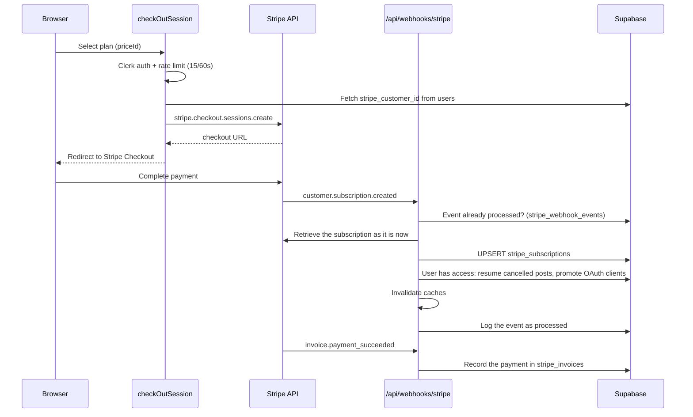
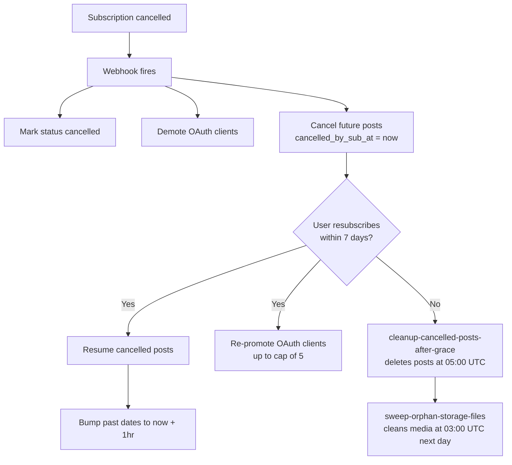

# Billing

Stripe handles subscriptions and payments. Three tiers with monthly and yearly pricing. Plan gates control web UI access, MCP tool access, account limits, and storage quotas. MCP access requires Creator tier or above (Starter is web-only).

[Back to README](../README.md)

## Table of contents

- [Plan tiers](#plan-tiers)
- [Stripe subscription flow](#stripe-subscription-flow)
- [Webhook events](#webhook-events)
- [Subscription status](#subscription-status)
- [Plan gating](#plan-gating)
  - [Account limits](#account-limits)
  - [MCP tool access by tier](#mcp-tool-access-by-tier)
  - [Storage quotas](#storage-quotas)
- [MCP monthly quotas](#mcp-monthly-quotas)
- [Upload limits](#upload-limits)
- [Customer portal](#customer-portal)
- [Usage tracking](#usage-tracking)
- [Subscription lifecycle](#subscription-lifecycle)
  - [Cancel](#cancel-period_end-customersubscriptiondeleted)
  - [Resubscribe](#resubscribe-customersubscriptioncreated)
  - [Grace period](#grace-period-7-days)
- [Future: x402 (deferred)](#future-x402-deferred)
- [Source files referenced](#source-files-referenced)

## Plan tiers

| Tier | Monthly | Yearly (~40% off) | Connected accounts | Storage | Web UI | MCP access |
|------|---------|--------------------|--------------------|---------|--------|------------|
| Starter | $9 | $64 | 5 | 5 GB | Yes | No |
| Creator (popular) | $18 | $129 | 15 | 15 GB | Yes | Yes (quota-limited) |
| Pro | $27 | $194 | 999 (unlimited) | 45 GB | Yes | Yes (unlimited) |

Starter users get full web UI access but zero MCP tool access. This is the hybrid pricing model: web for everyone, MCP for Creator and above. All 18 MCP tools require Creator minimum via `ACCESS_PLAN_GATE`.

Stripe price IDs are environment-specific (dev vs prod). The code uses `NODE_ENV` to select the correct set. `priceIdToTier()` in `plans.ts` builds the `PRICE_ID_TO_TIER` map at module load from both dev and prod price ID arrays.

## Stripe subscription flow

```mermaid
sequenceDiagram
    participant User as Browser
    participant Action as checkOutSession
    participant Stripe as Stripe API
    participant Webhook as /api/webhooks/stripe
    participant DB as Supabase

    User->>Action: Select plan (priceId)
    Action->>Action: Clerk auth + rate limit (15/60s)
    Action->>DB: Fetch stripe_customer_id from users
    Action->>Stripe: stripe.checkout.sessions.create
    Stripe-->>Action: checkout URL
    Action-->>User: Redirect to Stripe Checkout
    User->>Stripe: Complete payment
    Stripe->>Webhook: customer.subscription.created
    Webhook->>DB: Event already processed? (stripe_webhook_events)
    Webhook->>Stripe: Retrieve the subscription as it is now
    Webhook->>DB: UPSERT stripe_subscriptions
    Webhook->>DB: User has access: resume cancelled posts, promote OAuth clients
    Webhook->>Webhook: Invalidate caches
    Webhook->>DB: Log the event as processed
    Stripe->>Webhook: invoice.payment_succeeded
    Webhook->>DB: Record the payment in stripe_invoices
```

The webhook logs an event in `stripe_webhook_events` only after processing it succeeded (`src/actions/server/stripe/stripeEventLog.ts`). Every failed step, the user lookup and each side effect included, answers 500, and Stripe delivers the event again for up to three days. Nothing is logged before that point, so a failure can never mark an unprocessed event as done. Every step is idempotent, so a redelivery, or a duplicate that arrives while the first delivery runs, repeats nothing. An event whose customer matches no user answers 200 with `no_user_match`, because no retry can change that.

Stripe does not deliver events in order. A subscription event therefore stores the subscription as Stripe has it now, retrieved from the API, not the payload, which may be older than a row a later event already wrote. A subscription Stripe no longer has keeps its payload's state.

## Webhook events

`src/app/api/webhooks/stripe/route.ts` processes five event types:

| Event | Action |
|-------|--------|
| `customer.subscription.created`, `customer.subscription.updated` | Upsert `stripe_subscriptions` from the retrieved subscription, invalidate caches. If the user has access afterwards, resume system-cancelled posts and promote OAuth clients. |
| `customer.subscription.deleted` | Same upsert (the retrieved status is `canceled`). If the user has no access left, demote OAuth clients and cancel future scheduled posts. |
| `invoice.payment_succeeded` | Record the payment in `stripe_invoices` with `amount_paid_cents`. It replaces an earlier `failed` row for the same invoice. |
| `invoice.payment_failed` | Record `failed` in `stripe_invoices`, unless the invoice already has a row: a failure never replaces a success. |

What happens to posts and OAuth clients follows the user's access after the write (`checkActiveSubscription`), not the event type. A late `deleted` for a subscription the user already replaced leaves the new plan's posts alone, and a `created` for a subscription still waiting on its first payment (`incomplete`) grants nothing until the `updated` event that makes it active. A failed access check answers 500.

`recordInvoicePayment` (`src/actions/server/stripe/recordInvoicePayment.ts`) writes invoices for both the webhook and the `ensureUserExists` sync. The sync records paid invoices and invoices whose payment was tried and failed (`uncollectible`, or `open` after an attempt); drafts, voided invoices and open ones not charged yet are skipped.

## Subscription status

`checkActiveSubscription` (`src/actions/checkActiveSubscription.ts`) returns `isActive=true` if the most recent subscription has any of these statuses:

- `active`
- `trialing`

Without one, banked referral weeks (`users.creator_access_until` in the future) count as Creator access with status `referral_grant`. Otherwise it returns `isActive=false` with status `none`.

A failed database read returns `isActive=false` with status `unavailable`. Gates stay closed (fail-closed), while billing code tells "could not check" apart from "not subscribed": the customer portal and MCP key creation ask for a retry, `list_billing_summary` returns a tool error, `GET /v1/usage` answers 500, and the MCP subscription gate does not cache the failure.

It is server-only. It trusts the user id it is given, so as a server action any browser could read any user's plan and billing dates by id. Browser code asks through `createCustomerPortal`, which reads the id from the Clerk session.

## Plan gating

### Account limits

Checked by `checkAccountLimits`:

| Tier | Max connected accounts |
|------|------------------------|
| Starter | 5 |
| Creator | 15 |
| Pro | 999 |
| Free (no sub) | 0 |

### MCP tool access by tier

All 18 MCP tools are gated by `ACCESS_PLAN_GATE`, which requires Creator minimum:

| Tier | MCP access | Notes |
|------|------------|-------|
| Starter | Blocked | Web UI only. All MCP tool calls return an upgrade prompt. |
| Creator | All 18 tools | Subject to monthly quotas (see below). |
| Pro | All 18 tools | Unlimited usage (no quotas). |

REST API endpoints share the same quota system and plan gates. The `withRestEndpoint` middleware resolves the principal's plan and enforces the same tier and quota checks that MCP uses.

### Storage quotas

| Tier | Storage cap |
|------|-------------|
| Starter | 5 GB |
| Creator | 15 GB |
| Pro | 45 GB |

Storage quota is cumulative and checked during upload URL generation.

## MCP monthly quotas

Defined in `MONTHLY_CAPS` from `entitlement.ts`. Enforced atomically via `atomic_increment_quota` Postgres RPC. Starter is blocked from all MCP tools at the gate level (not via quotas).

| Action | Starter | Creator | Pro |
|--------|---------|---------|-----|
| `schedule_post` | blocked | 500/mo | unlimited |
| `post_now` | blocked | 500/mo | unlimited |
| `request_upload_url` | blocked | 500/mo | unlimited |
| `attach_media_from_url` | blocked | 500/mo | unlimited |
| `bulk_schedule` | blocked | 200/mo | unlimited |
| `bulk_post_now` | blocked | 500/mo | unlimited |
| `generate_post_draft` | blocked | 100/mo | unlimited |

Starter shows "blocked" because `ACCESS_PLAN_GATE` rejects all MCP calls before quota checks run. The `MONTHLY_CAPS` for Starter are 0 across the board, but the gate check fires first.

`generate_post_draft` is available to Creator at 100/mo. Previous versions restricted this to Pro only.

## Upload limits

All plans share the same per-file size caps:

| Type | Max per file |
|------|--------------|
| Image | 8 MB |
| Video | 250 MB |

## Customer portal

`createCustomerPortal` creates a Stripe Billing Portal session. Rate limited at 20 requests per 60 seconds. Requires an active subscription. Return URL: `/create`.

A failure carries a `reason`: `no_subscription` when the user has nothing to manage, `failed` otherwise (a subscription it could not check included). The pricing buttons open checkout, and the sidebar billing entry opens the pricing section, only on `no_subscription`, so a paying user is never sent to a second checkout.

## Usage tracking

The `usage_quotas` table stores per-principal monthly counts:

| Column | Description |
|--------|-------------|
| `principal_id` | FK to `principals` |
| `period` | Date, first of month (e.g., `2026-05-01`). All readers use `currentQuotaPeriod()`. |
| `action` | Action name (e.g., `schedule_post`) |
| `count` | Current count for this period |

Incremented atomically by `atomic_increment_quota` on every quota-gated MCP tool call. Period resets on the first of each month.

## Subscription lifecycle

### Cancel (period_end, customer.subscription.deleted)

When a user's Stripe subscription reaches period_end, the webhook handler:

1. Stores the subscription with Stripe's status, `canceled`
2. Checks the user's access. With another active subscription or banked referral weeks, it stops here.
3. Demotes the user's verified OAuth clients to unverified (`demoteOauthClientsOnCancel`)
4. Cancels all future scheduled posts, tagging each with `cancelled_by_sub_at = now()` (`cancelFutureScheduledPostsOnSubCancel`)
5. Invalidates subscription and entitlement caches

The user retains access to the dashboard and can resubscribe. Manual cancellations of posts made before the sub cancel are left untouched (they have `cancelled_by_sub_at IS NULL`). A manual cancel, resume or reschedule clears the tag, so a post the user handled after the lapse is never removed by the grace cleanup.

### Resubscribe (customer.subscription.created or .updated)

When a subscription event leaves the user with access (a new subscription, or one whose first payment went through), the webhook handler:

1. Upserts the `stripe_subscriptions` row
2. Resumes system-cancelled posts (`resumeCancelledPostsOnResubscribe`). Posts whose original `scheduled_at` has elapsed are bumped to `now() + 1 hour` via `bumpPastScheduleToFuture`. A post that fails to resume fails the event, and the redelivery resumes whatever is still tagged.
3. Re-promotes previously-demoted OAuth clients (`promoteOauthClientsOnResubscribe`) up to the per-user cap of 5.

### Grace period (7 days)

If the user does not resubscribe within 7 days, the daily cron `cleanup-cancelled-posts-after-grace` (05:00 UTC) deletes their system-cancelled posts. Orphan media in storage is picked up by `sweep-orphan-storage-files` (03:00 UTC) the following day.

The cron re-checks subscription status before deletion as a guard against webhook delivery failures. When that check fails, it keeps the posts and the next daily run checks again. The delete itself repeats the selection criteria, so a post resumed during the run is not removed.

```mermaid
flowchart TD
    A[Subscription cancelled] --> B[Webhook fires]
    B --> C[Mark status cancelled]
    B --> D[Demote OAuth clients]
    B --> E[Cancel future posts<br>cancelled_by_sub_at = now]
    E --> F{User resubscribes<br>within 7 days?}
    F -- Yes --> G[Resume cancelled posts]
    G --> H[Bump past dates to now + 1hr]
    F -- Yes --> I[Re-promote OAuth clients<br>up to cap of 5]
    F -- No --> J[cleanup-cancelled-posts-after-grace<br>deletes posts at 05:00 UTC]
    J --> K[sweep-orphan-storage-files<br>cleans media at 03:00 UTC next day]
```

## x402 Pay-Per-Call

AI agents access dedicated `/api/x402/*` routes and pay USDC per action on Base or Solana. No Stripe subscription required. Auth is via X-PAYMENT header (signed wallet payment).

### Pricing

| Action | USDC | Description |
|--------|------|-------------|
| `register` | $1.00 | One-time wallet registration |
| `connect_account` | $0.50 | OAuth connection or re-auth |
| `post.text` | $0.50 | Single text post |
| `post.image` | $0.75 | Single image post |
| `post.video` | $1.00 | Single video post |
| `upload_url` | $0.10 | Mint signed upload URL |
| `reschedule` | $0.10 | Reschedule one post |
| `cancel` | $0.001 | Cancel scheduled posts |
| `delete` | $0.001 | Hard delete posts |
| `list_connections` | $0.001 | Read social connections |
| `list_posts` | $0.001 | Read scheduled posts |
| `list_history` | $0.001 | Read content history |

Prices are stored in the `pricing_actions` table. Seed SQL: `/x402_pricing_actions_seed.sql`.

### Refund Policy

- **Checked before settlement, nothing charged:** account ownership, post eligibility, caption length, the platform's daily cap, a reused `idempotency_key`, and the upload's content type, size and storage quota. A request that fails these never settles.
- **Refundable:** a failure after on-chain settlement (dispatch, scheduling, connection insert, upload URL mint) sends an on-chain USDC refund.
- **Non-refundable:** Publish failures at Inngest execute time (post.text, post.image, post.video). Pay-per-attempt model.
- Refund records are stored in `x402_refunds` once the chain confirms the refund. The refund tx hash is included in the error response.

### Charge Lifecycle

Status flow: `pending` (inserted before settlement; the UNIQUE nonce blocks a replay) -> `settled` (facilitator confirmed) -> `refunded` (refund confirmed on-chain) or `failed` (definitive settle rejection, non-refundable handler error, or a refund that could not be sent). An indeterminate settle stays `pending` and an unconfirmed refund stays `settled`; both get an `x402_reconciliation` row that the hourly `sweep-x402-reconciliation` Inngest function resolves or reports as a failed run.

### Storage

Wallet users get 5 GB aggregate storage (same as Starter tier, independent constant `WALLET_STORAGE_LIMIT`). Per-file caps: 8 MB image, 250 MB video.

## Source files referenced

| File | Purpose |
|------|---------|
| `src/lib/types/plans.ts` | Plan tier definitions, price ID mappings, `priceIdToTier()` |
| `src/app/api/webhooks/stripe/route.ts` | Stripe webhook handler |
| `src/actions/server/stripe/stripeEventLog.ts` | `isStripeEventProcessed`, `markStripeEventProcessed`: the processed-event log |
| `src/actions/server/stripe/recordInvoicePayment.ts` | Writes an invoice's payment outcome, for the webhook and the `ensureUserExists` sync |
| `src/actions/server/stripe/toSubscriptionRow.ts` | The `stripe_subscriptions` row for a Stripe subscription, written by both the webhook and the `ensureUserExists` sync |
| `src/actions/checkActiveSubscription.ts` | `checkActiveSubscription`, the server-only subscription reader |
| `src/actions/server/stripe/customerPortal.ts` | `createCustomerPortal`, Stripe Billing Portal session |
| `src/actions/server/connections/checkAccountLimits.ts` | Account limit enforcement per tier |
| `src/lib/mcp/_shared/entitlement.ts` | `MONTHLY_CAPS`, `ACCESS_PLAN_GATE`, MCP tier gating |
| `src/lib/mcp/_shared/currentQuotaPeriod.ts` | `currentQuotaPeriod()`, period format for usage tracking |
| `src/lib/api/rest/middleware/withRestEndpoint.ts` | REST API auth middleware (enforces same plan gates) |

---

**See also:** [docs/AUTH.md](./AUTH.md) (subscription gate in auth flow), [docs/MCP.md](./MCP.md) (per-tool quotas and tier gates), [docs/STORAGE.md](./STORAGE.md) (storage caps per plan)

[Back to README](../README.md)
