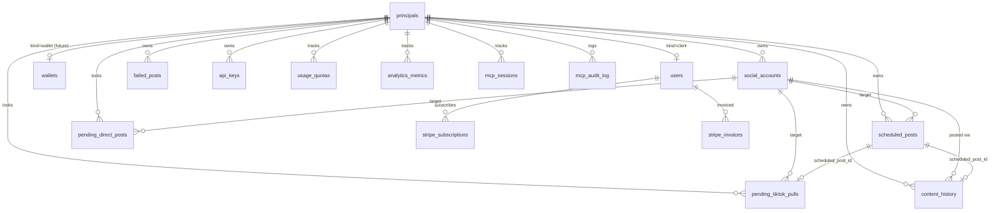

# Database

29 Postgres tables in Supabase, organized around a principal-centric model. Every user-scoped table FKs to `principals.id`, not `users.id`, to support future wallet-based access.

Generated types: `src/lib/types/database.types.ts`. Full schema dump: `Supabase_db_schema` (if present in repo root).

[Back to README](../README.md)

## Entity relationships

## Table inventory

### Core identity

| Table | Purpose | Key Columns |
|-------|---------|-------------|
| `principals` | Unified identity. kind = clerk or wallet. | id, kind, created_at, deleted_at |
| `users` | Clerk user details. FK to principals. | id (FK), email, first_name, last_name, stripe_customer_id |
| `wallets` | Future x402 wallet identities. FK to principals. | id (FK), address |

### Social accounts

| Table | Purpose | Key Columns |
|-------|---------|-------------|
| `social_accounts` | Connected OAuth accounts. | id, principal_id, platform, account_identifier, display_name, access_token, refresh_token, token_expires_at, is_available |
| `social_connections` | Connection metadata. | id, principal_id, platform |

### Posts

| Table | Purpose | Key Columns |
|-------|---------|-------------|
| `scheduled_posts` | Posts awaiting or in-process publication. | id, principal_id, social_account_id, platform, status, scheduled_at, post_title, post_description, media_type, media_storage_path, batch_id, created_via, idempotency_key |
| `failed_posts` | Archive of terminal post failures. | Same structure as scheduled_posts plus error_message |
| `content_history` | Record of published content. | id, principal_id, platform, content_id, title, description, media_url, media_type, status, batch_id, created_via, extra |
| `pending_direct_posts` | Lock table for direct "post now" operations. | event_id (PK), batch_id, principal_id, social_account_id, platform, media_storage_path, status |
| `pending_tiktok_pulls` | Lock table for TikTok async publish polling. | publish_id (PK), principal_id, social_account_id, scheduled_post_id, media_storage_path, status, attempt_count |

### Billing

| Table | Purpose | Key Columns |
|-------|---------|-------------|
| `stripe_subscriptions` | Active/cancelled subscriptions. | id, user_id, stripe_subscription_id, plan (price ID), status, current_period_end |
| `stripe_invoices` | Payment history (append-only). | id, user_id, stripe_invoice_id, amount_paid_cents, currency, status |
| `usage_quotas` | Monthly action counts for quota enforcement. | principal_id, period, action, count |
| `platform_quotas` | Per-platform daily caps. | platform, daily_cap, burst_cap_60s |

### MCP

| Table | Purpose | Key Columns |
|-------|---------|-------------|
| `api_keys` | MCP and REST API keys. | id, principal_id, name, prefix, token_hash, kind (rest/mcp/wallet), scopes, expires_at, revoked_at, last_used_at |
| `mcp_sessions` | Session activity tracking. | id, principal_id, session_id, client_name, client_version, ip_hash, last_activity_at |
| `mcp_audit_log` | Append-only tool call log. | id, principal_id, tool_name, args_redacted, result_status, latency_ms, ip_hash, user_agent |
| `mcp_oauth_clients` | Registered OAuth clients. | client_id, client_name, redirect_uris, trust_level (unverified/verified/blocked) |

### Analytics

| Table | Purpose | Key Columns |
|-------|---------|-------------|
| `analytics_metrics` | Performance metrics per content item. | id, principal_id, platform, content_id, metric_date, views, likes, comments, shares |

### x402 / Wallet (schema exists, code path deferred)

| Table | Purpose |
|-------|---------|
| `wallet_credits` | Wallet credit balances |
| `wallet_credits_ledger` | Credit transaction history |
| `x402_charges` | x402 payment charges |
| `x402_refunds` | x402 refund records |
| `x402_access_log` | x402 access audit trail |
| `pricing_actions` | Action pricing definitions |
| `siwe_nonces` | Sign-In With Ethereum nonces |
| `usdc_fmv_daily` | USDC fair market value snapshots |
| `sanctions_screenings` | Wallet sanctions check results |

### Infrastructure

| Table | Purpose | Key Columns |
|-------|---------|-------------|
| `rate_limit_events` | Rate limit event log | id, principal_id, action, timestamp |

### RPC Functions

| Function | Purpose |
|----------|---------|
| `atomic_increment_quota` | Atomically increment usage_quotas.count, preventing race conditions in concurrent MCP requests |

## Status CHECK constraints

Key enum constraints in the schema:

- `scheduled_posts.status`: scheduled, queued, processing, posted, failed, cancelled
- `scheduled_posts.created_via`: web, mcp, x402, api
- `scheduled_posts.media_type`: text, image, video
- `pending_direct_posts.status`: processing, completed, failed
- `pending_tiktok_pulls.status`: pending, completed, failed
- `api_keys.kind`: rest, mcp, wallet
- `principals.kind`: clerk, wallet
- `social_accounts.platform`: linkedin, tiktok, pinterest, instagram, facebook, threads, youtube, x
- `mcp_oauth_clients.trust_level`: unverified, verified, blocked
- `mcp_audit_log.result_status`: ok, error, denied, rate_limited, quota_exceeded
- `stripe_invoices.status`: succeeded, failed

## RLS posture

All tables have Row Level Security enabled at the Supabase level. However, the application uses a service-role Supabase client (`adminSupabase` in `src/actions/api/adminSupabase.ts`) that bypasses RLS entirely. Access control is enforced in application code by filtering on `principal_id` in every query.

This means:
- The anon key (used client-side) cannot access any table directly
- All data access goes through server actions or API routes
- Every server action manually verifies `principal_id` ownership
- The admin client has full read/write access (used only server-side, guarded by `server-only` import)

Tradeoff: simpler than managing per-table RLS policies, but the application layer is the only access control boundary. A bug in a server action could expose data across principals.

---

[Back to README](../README.md)
