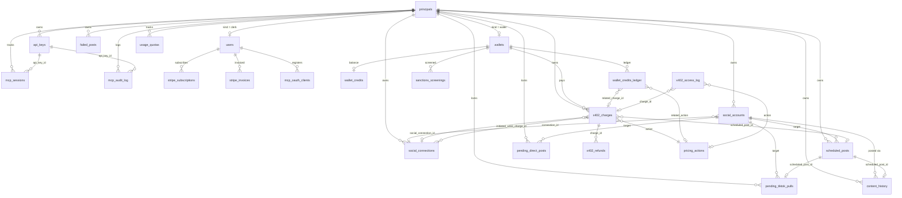
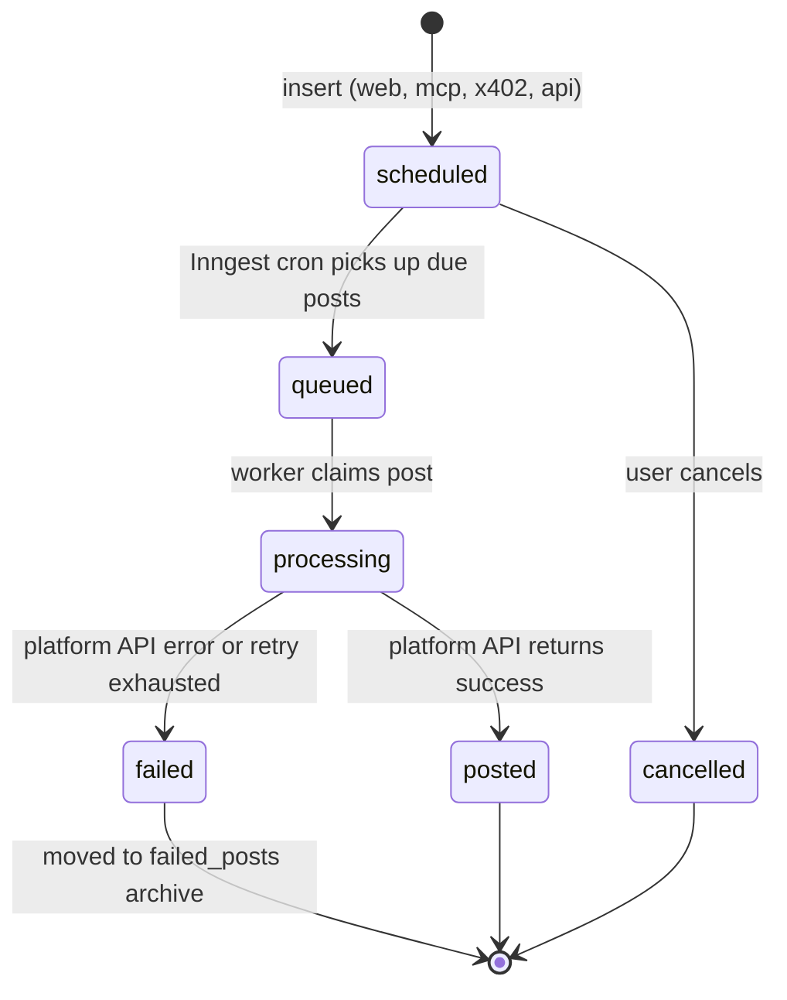
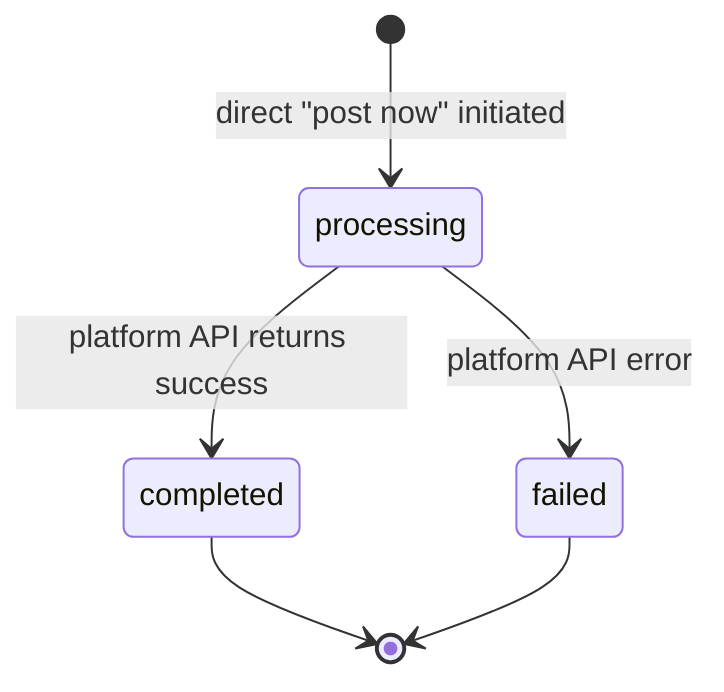
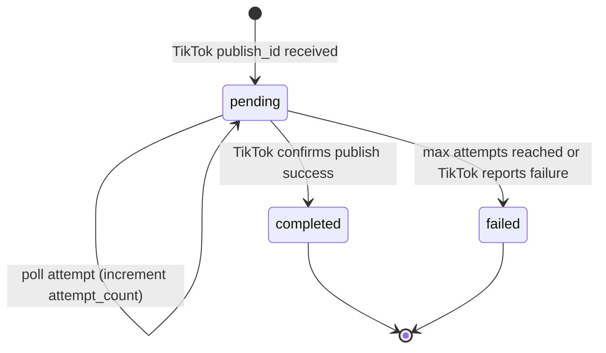

# Database

31 Postgres tables in Supabase, organized around a principal-centric model. Every user-scoped table foreign-keys to `principals.id` (not `users.id`) so that both Clerk-based users and wallet-based identities share one identity root.

Generated types live in `src/lib/types/database.types.ts` (1 991 lines). Regenerate after schema changes with `supabase gen types typescript --linked > src/lib/types/database.types.ts`.

[Back to README](../README.md)

---

## Table of contents

1. [Entity relationships](#entity-relationships)
2. [Table inventory](#table-inventory)
   - [Core identity (3)](#core-identity)
   - [Social (2)](#social)
   - [Posts (5)](#posts)
   - [Billing (4)](#billing)
   - [MCP (4)](#mcp)
   - [Analytics (1)](#analytics)
   - [x402 / Wallet (9)](#x402--wallet)
   - [Infrastructure (3)](#infrastructure)
3. [Status CHECK constraints](#status-check-constraints)
4. [Append-only tables](#append-only-tables)
5. [RPC functions](#rpc-functions)
6. [Data lifecycle and retention](#data-lifecycle-and-retention)
7. [RLS posture](#rls-posture)
8. [State diagrams](#state-diagrams)
9. [Source files referenced](#source-files-referenced)

---

## Entity relationships

The diagram below shows the core foreign-key graph. Tables that only FK to `principals` (e.g. `rate_limit_events`, `analytics_metrics`) are omitted to keep the diagram readable.

---

## Table inventory

### Core identity

| Table | Purpose | Columns |
|-------|---------|---------|
| `principals` | Unified identity root. Every user-scoped table FKs here. | id, kind (`clerk` &#124; `wallet`), created_at, updated_at, deleted_at, metadata |
| `users` | Clerk user profile. FK `id` to `principals`. | id, email, first_name, last_name, stripe_customer_id, locale, timezone, created_at, updated_at |
| `wallets` | Blockchain wallet identity. FK `id` to `principals`. | id, address, chain (`base` &#124; `base-sepolia` &#124; `polygon` &#124; `arbitrum` &#124; `solana` &#124; `solana-devnet`), display_name, ens_name, sanctions_status (`unchecked` &#124; `clean` &#124; `sanctioned`), sanctions_checked_at, registered_at, last_seen_at, metadata |

### Social

| Table | Purpose | Columns |
|-------|---------|---------|
| `social_accounts` | Connected OAuth accounts for each principal. | id, principal_id, platform, account_identifier, display_name, username, email_address, avatar_url, is_verified, follower_count, following_count, bio_description, is_available, access_token, refresh_token, token_expires_at, connection_id, extra, created_at, updated_at |
| `social_connections` | OAuth connection lifecycle records. | id, principal_id, initiated_via (`web` &#124; `mcp` &#124; `api` &#124; `x402`), initiated_x402_charge_id, platform, oauth_state, oauth_code_verifier, redirect_uri, status (`pending` &#124; `connected` &#124; `expired` &#124; `failed` &#124; `revoked`), expires_at, connected_at, failed_at, error_code, error_message, social_account_id, poll_count, last_polled_at, last_polled_ip_hash, metadata, created_at, updated_at |

### Posts

| Table | Purpose | Columns |
|-------|---------|---------|
| `scheduled_posts` | Posts awaiting or in-process publication. | id, principal_id, social_account_id, platform, status (`scheduled` &#124; `queued` &#124; `processing` &#124; `posted` &#124; `failed` &#124; `cancelled`), scheduled_at, posted_at, scheduled_at_date (GENERATED), post_title, post_description, post_options, media_type (`text` &#124; `image` &#124; `video`), media_storage_path, cover_image_timestamp, batch_id, error_message, retry_count, created_via (`web` &#124; `mcp` &#124; `x402` &#124; `api`), idempotency_key, x402_charge_id, metadata, cancelled_by_sub_at, created_at, updated_at |
| `failed_posts` | Archive of terminal post failures. Same structure as `scheduled_posts`. | (mirrors `scheduled_posts`) |
| `content_history` | Record of published content, written after successful posting. | id, principal_id, social_account_id, scheduled_post_id, platform, content_id, title, description, media_url, media_type, status, batch_id, created_via (`web` &#124; `mcp` &#124; `x402` &#124; `api`), extra, created_at, updated_at |
| `pending_direct_posts` | Lock table for "post now" operations. Prevents duplicate direct posts. | event_id (PK), batch_id, principal_id, social_account_id, platform, media_storage_path, status (`processing` &#124; `completed` &#124; `failed`), failure_reason, idempotency_key, finished_at, created_at |
| `pending_tiktok_pulls` | Lock table for TikTok async publish polling. | publish_id (PK), principal_id, social_account_id, scheduled_post_id, content_history_id, media_storage_path, status (`pending` &#124; `completed` &#124; `failed`), attempt_count, last_polled_at, finalized_at, failure_reason, tiktok_post_id, creator_username, created_at |

### Billing

| Table | Purpose | Columns |
|-------|---------|---------|
| `stripe_subscriptions` | Active and cancelled subscriptions. | id, user_id, stripe_subscription_id, stripe_customer_id, stripe_price_id, plan, status, start_date, end_date, current_period_end, cancel_reason, metadata, created_at, updated_at |
| `stripe_invoices` | Payment records (append-only). | id, user_id, stripe_invoice_id, amount_paid_cents, currency, status, metadata, created_at |
| `usage_quotas` | Monthly action counts for quota enforcement. | principal_id, period, action, count |
| `platform_quotas` | Per-platform daily and burst rate caps. | platform, daily_cap, burst_cap_60s, notes |

### MCP

| Table | Purpose | Columns |
|-------|---------|---------|
| `api_keys` | API keys for MCP, REST, and wallet access. | id, principal_id, name, prefix, token_hash, kind (`rest` &#124; `mcp` &#124; `wallet`), scopes, expires_at, last_used_at, last_used_ip, created_at, revoked_at, metadata |
| `mcp_sessions` | Session tracking for MCP connections. | id, principal_id, oauth_client_id, api_key_id, protocol_version, started_at, last_activity_at, ended_at, client_name, client_version, ip_hash |
| `mcp_audit_log` | Append-only log of every MCP tool call. | id, principal_id, oauth_client_id, api_key_id, session_id, tool_name, args_redacted, result_status (`ok` &#124; `error` &#124; `denied` &#124; `rate_limited` &#124; `quota_exceeded`), latency_ms, ip_hash, user_agent, month (GENERATED), created_at |
| `mcp_oauth_clients` | Registered OAuth clients for MCP. | client_id (PK), client_name, redirect_uris, software_id, software_version, registered_by_user_id, trust_level (`unverified` &#124; `verified` &#124; `blocked`), revoked_at, metadata, created_at, updated_at |

### Analytics

| Table | Purpose | Columns |
|-------|---------|---------|
| `analytics_metrics` | Performance metrics per content item per day. | id, principal_id, platform, content_id, metric_date, views, comments, likes, shares, subscribers, extra, created_at, updated_at |

### x402 / Wallet

| Table | Purpose | Columns |
|-------|---------|---------|
| `wallet_credits` | USDC credit balance per wallet. | wallet_id, balance_usdc, updated_at |
| `wallet_credits_ledger` | Credit transaction history (append-only). | id, wallet_id, delta_usdc, reason (`topup` &#124; `spend` &#124; `refund` &#124; `adjustment`), related_charge_id, related_action, idempotency_key, created_at |
| `x402_charges` | x402 payment charge records. | id, principal_id, wallet_id, action, amount_usdc, amount_usd_at_receipt, network, asset, nonce, request_id, payer_address, recipient_address, status (`pending` &#124; `settled` &#124; `failed` &#124; `refunded`), facilitator, facilitator_fee_usdc, tx_hash, block_number, scheduled_post_id, social_connection_id, error_message, metadata, created_at, settled_at |
| `x402_refunds` | Refund records (append-only). | id, charge_id, reason, refunded_usdc, refund_tx_hash, initiated_by, metadata, created_at |
| `x402_access_log` | Access audit trail (append-only). | id, principal_id, wallet_id, endpoint, action, charge_id, result_status (`ok` &#124; `402_required` &#124; `sanctioned` &#124; `rate_limited` &#124; `error`), latency_ms, ip_hash, user_agent, month (GENERATED), created_at |
| `pricing_actions` | Action pricing definitions. | action (PK), display_name, usdc_price, description, recurrence (`one_time` &#124; `monthly`), effective_from, effective_until, metadata |
| `siwe_nonces` | Sign-In With Ethereum nonce tracking. | nonce, wallet, expires_at, used_at |
| `usdc_fmv_daily` | Daily USDC fair market value snapshots. | fmv_date, usd_per_usdc, source, fetched_at |
| `sanctions_screenings` | Wallet sanctions check results (append-only). | id, wallet_id, result (`clean` &#124; `sanctioned` &#124; `error`), source, raw_response, checked_at |

### Infrastructure

| Table | Purpose | Columns |
|-------|---------|---------|
| `rate_limit_events` | Rate limit event log. | id, principal_id, ip_hash, scope, created_at |
| `stripe_webhook_events` | Stripe webhook idempotency log (append-only). | event_id (PK), type, processed_at, livemode |
| `tiktok_webhook_events` | TikTok webhook idempotency log (append-only). | event_id (PK), event_type, processed_at |

---

## Status CHECK constraints

All enum-like values are enforced by CHECK constraints in Postgres (not Postgres ENUM types). Corresponding TypeScript unions are exported from `database.types.ts`.

| Column | Values |
|--------|--------|
| `principals.kind` | `clerk`, `wallet` |
| `wallets.chain` | `base`, `base-sepolia`, `polygon`, `arbitrum`, `solana`, `solana-devnet` |
| `wallets.sanctions_status` | `unchecked`, `clean`, `sanctioned` |
| `social_accounts.platform` | `linkedin`, `tiktok`, `pinterest`, `instagram`, `facebook`, `threads`, `youtube`, `x` |
| `social_connections.initiated_via` | `web`, `mcp`, `api`, `x402` |
| `social_connections.status` | `pending`, `connected`, `expired`, `failed`, `revoked` |
| `scheduled_posts.status` | `scheduled`, `queued`, `processing`, `posted`, `failed`, `cancelled` |
| `scheduled_posts.media_type` | `text`, `image`, `video` |
| `scheduled_posts.created_via` | `web`, `mcp`, `x402`, `api` |
| `pending_direct_posts.status` | `processing`, `completed`, `failed` |
| `pending_tiktok_pulls.status` | `pending`, `completed`, `failed` |
| `api_keys.kind` | `rest`, `mcp`, `wallet` |
| `mcp_oauth_clients.trust_level` | `unverified`, `verified`, `blocked` |
| `mcp_audit_log.result_status` | `ok`, `error`, `denied`, `rate_limited`, `quota_exceeded` |
| `wallet_credits_ledger.reason` | `topup`, `spend`, `refund`, `adjustment` |
| `x402_charges.status` | `pending`, `settled`, `failed`, `refunded` |
| `x402_access_log.result_status` | `ok`, `402_required`, `sanctioned`, `rate_limited`, `error` |
| `pricing_actions.recurrence` | `one_time`, `monthly` |
| `sanctions_screenings.result` | `clean`, `sanctioned`, `error` |

---

## Append-only tables

Eight tables set `Update: never` in the generated types. Rows can be inserted but never modified via application code, ensuring audit and financial records stay tamper-proof.

| Table | What it logs |
|-------|-------------|
| `mcp_audit_log` | Every MCP tool call (args redacted, result status, latency). Insert happens fire-and-forget in `logToolCall` (`src/lib/mcp/audit.ts`). |
| `stripe_invoices` | Stripe payment records. |
| `wallet_credits_ledger` | Credit transaction history for x402 wallets. |
| `x402_access_log` | x402 endpoint access audit trail. |
| `x402_refunds` | x402 refund records. |
| `sanctions_screenings` | Wallet sanctions check results. |
| `stripe_webhook_events` | Stripe webhook idempotency log. Prevents duplicate event processing. |
| `tiktok_webhook_events` | TikTok webhook idempotency log. Prevents duplicate event processing. |

See [SECURITY.md](./SECURITY.md) for details on argument redaction and PII handling in audit logs.

---

## RPC functions

Two server-side Postgres functions, called via `adminSupabase.rpc()`:

| Function | Signature | Returns | Purpose |
|----------|-----------|---------|---------|
| `atomic_increment_quota` | `(_principal_id, _period, _action, _cap)` | `number` or `null` | Atomically increments `usage_quotas.count`. Returns the new count if under the cap, `null` if the cap would be exceeded. Prevents race conditions in concurrent MCP requests. |
| `get_user_storage_bytes` | `(_bucket, _prefix)` | `number` | Returns total storage bytes for a principal in a given Supabase Storage bucket. Reads `storage.objects` directly (no pagination). Used by `enforceStorageQuota`. |

---

## Data lifecycle and retention

| Data | Retention | Mechanism |
|------|-----------|-----------|
| `mcp_audit_log` | 90 days | Rows older than 90 days are eligible for deletion by a scheduled cleanup job. |
| `stripe_webhook_events` | 90 days | Same 90-day cleanup window. |
| `tiktok_webhook_events` | 90 days | Same 90-day cleanup window. |
| Cancelled posts (`scheduled_posts` with status `cancelled`) | 7-day grace period | Cancelled posts remain queryable for 7 days via `cancelled_by_sub_at`, then eligible for hard deletion. |
| `content_history` | Indefinite | Published content records are kept for analytics and history display. |
| `x402_charges`, `x402_refunds`, `wallet_credits_ledger` | Indefinite | Financial records are never deleted. |
| `sanctions_screenings` | Indefinite | Compliance records are never deleted. |

---

## RLS posture

All 31 tables have Row Level Security (RLS) enabled at the Supabase level. The application uses a service-role Supabase client (`adminSupabase` in `src/actions/api/adminSupabase.ts`) that bypasses RLS entirely. Access control is enforced in application code by filtering on `principal_id` in every query.

What this means in practice:

- The anon key (used client-side) cannot access any table directly.
- All data access goes through server actions or API routes.
- Every server action manually verifies `principal_id` ownership before returning data.
- The admin client has full read/write access, used only server-side, guarded by the `server-only` import.

Tradeoff: simpler than managing per-table RLS policies, but the application layer is the only access control boundary. A bug in a server action could expose data across principals.

---

## State diagrams

### scheduled_posts.status

### pending_direct_posts.status

### pending_tiktok_pulls.status

---

## Source files referenced

| File | Description |
|------|-------------|
| `src/lib/types/database.types.ts` | Generated Supabase types (31 tables, 2 RPC functions, type aliases) |
| `src/actions/api/adminSupabase.ts` | Service-role Supabase client that bypasses RLS |
| `src/lib/mcp/audit.ts` | Fire-and-forget `logToolCall` insert into `mcp_audit_log` |

---

**See also:** [SECURITY.md](./SECURITY.md) (append-only tables, idempotency constraints), [BILLING.md](./BILLING.md) (quota enforcement via `atomic_increment_quota`), [SCHEDULING.md](./SCHEDULING.md) (post status transitions)

[Back to README](../README.md)
