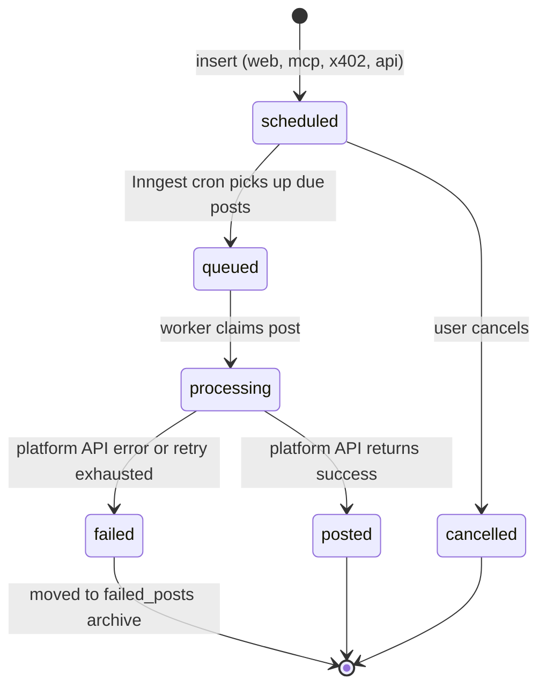
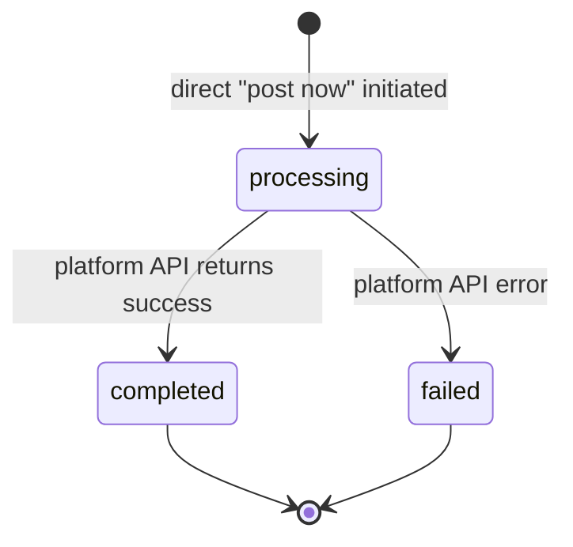
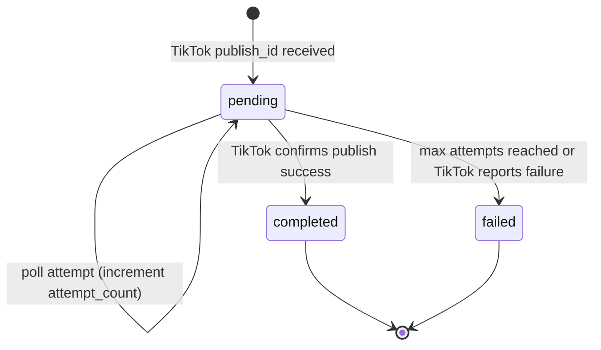

# Database

37 Postgres tables in Supabase, organized around a principal-centric model. Every user-scoped table foreign-keys to `principals.id` (not `users.id`) so that both Clerk-based users and wallet-based identities share one identity root.

`src/db/schema.ts` declares the schema with [Drizzle](https://orm.drizzle.team) and is the source of truth for every table, column, index, foreign key, CHECK constraint and RLS policy. Server code queries through the Drizzle client in `src/db/client.ts`. Code that has not moved to Drizzle yet still uses supabase-js (`adminSupabase`) with the hand-maintained types in `src/lib/types/database.types.ts`, which is never regenerated.

[Back to README](../README.md)

---

## Table of contents

1. [Schema changes](#schema-changes)
2. [Entity relationships](#entity-relationships)
3. [Table inventory](#table-inventory)
   - [Core identity (3)](#core-identity)
   - [Social (3)](#social)
   - [Posts (5)](#posts)
   - [Billing (7)](#billing)
   - [MCP (3)](#mcp)
   - [REST API (1)](#rest-api)
   - [Webhooks (2)](#webhooks)
   - [Analytics (1)](#analytics)
   - [x402 / Wallet (9)](#x402--wallet)
   - [Infrastructure (3)](#infrastructure)
4. [Status CHECK constraints](#status-check-constraints)
5. [Append-only tables](#append-only-tables)
6. [Functions and triggers](#functions-and-triggers)
7. [Data lifecycle and retention](#data-lifecycle-and-retention)
8. [RLS posture](#rls-posture)
9. [State diagrams](#state-diagrams)
10. [Source files referenced](#source-files-referenced)

---

## Schema changes

| Command | What it does |
|---------|--------------|
| `bun run db:generate` | Compares `src/db/schema.ts` with the last migration snapshot and writes the SQL for the difference into `drizzle/`. |
| `bun run db:migrate` | Applies the pending migrations in `drizzle/` and records each one in `drizzle.__drizzle_migrations`. |
| `bun run db:pull` | Reads the live database into `drizzle/`. Only for checking drift: `src/db/schema.ts` is edited by hand. |

To change the schema, edit `src/db/schema.ts`, run `bun run db:generate`, review the SQL it wrote, then apply it with `bun run db:migrate`. A migration runs against production only after that review. `drizzle/0000_baseline.sql` marks the starting point (2026-09-23) and runs nothing, since the database already had every object.

| Variable | Pooler | Used by |
|----------|--------|---------|
| `DATABASE_URL` | Transaction pooler, port 6543 | The app, through `src/db/client.ts`. Prepared statements are off because this pooler does not keep them between transactions. |
| `SUPABASE_DB_URL` | Session pooler, port 5432 | drizzle-kit, through `drizzle.config.ts`. |

Both connect as the database owner, which bypasses RLS the way the service-role key does.

Rows read through Drizzle have the shape supabase-js rows had: snake_case keys, timestamps as ISO strings (`2026-09-23T20:26:45.1234+00:00`), and numeric and bigint columns as numbers. The `timestamptz` column type in `src/db/schema.ts` converts Postgres' own text form to the ISO one.

---

## Entity relationships

The diagram below shows the core foreign-key graph. Tables that only FK to `principals` (e.g. `rate_limit_events`, `analytics_metrics`) are omitted to keep the diagram readable.

```mermaid
erDiagram
    principals ||--o| users : "kind = clerk"
    principals ||--o| wallets : "kind = wallet"
    principals ||--o{ social_accounts : "owns"
    principals ||--o{ social_connections : "owns"
    principals ||--o{ scheduled_posts : "owns"
    principals ||--o{ failed_posts : "owns"
    principals ||--o{ content_history : "owns"
    principals ||--o{ api_keys : "owns"
    principals ||--o{ usage_quotas : "tracks"
    principals ||--o{ mcp_audit_log : "logs"
    principals ||--o{ pending_direct_posts : "locks"
    principals ||--o{ pending_tiktok_pulls : "locks"
    principals ||--o{ x402_charges : "owns"

    users ||--o{ stripe_subscriptions : "subscribes"
    users ||--o{ stripe_invoices : "invoiced"
    users ||--o{ mcp_oauth_clients : "registers"
    users ||--o| referral_codes : "code"
    users ||--o{ referrals : "referrer or referred"
    users ||--o{ referral_reward_grants : "rewarded"
    users ||--o{ share_links : "owns"
    share_links ||--o{ social_connections : "share_link_id"

    wallets ||--o| wallet_credits : "balance"
    wallets ||--o{ wallet_credits_ledger : "ledger"
    wallets ||--o{ x402_charges : "pays"
    wallets ||--o{ sanctions_screenings : "screened"

    social_accounts ||--o{ scheduled_posts : "target"
    social_accounts ||--o{ content_history : "posted via"
    social_accounts ||--o{ pending_direct_posts : "target"
    social_accounts ||--o{ pending_tiktok_pulls : "target"
    social_accounts }o--|| social_connections : "connection_id"

    social_connections }o--o| x402_charges : "initiated_x402_charge_id"

    scheduled_posts ||--o| pending_tiktok_pulls : "scheduled_post_id"
    scheduled_posts ||--o| content_history : "scheduled_post_id"

    x402_charges ||--o{ x402_refunds : "charge_id"
    x402_charges }o--o| scheduled_posts : "scheduled_post_id"
    x402_charges }o--o| social_connections : "social_connection_id"
    x402_charges }o--|| pricing_actions : "action"

    wallet_credits_ledger }o--o| x402_charges : "related_charge_id"
    wallet_credits_ledger }o--o| pricing_actions : "related_action"

    x402_access_log }o--o| x402_charges : "charge_id"
    x402_access_log }o--o| pricing_actions : "action"

    api_keys ||--o{ mcp_audit_log : "api_key_id"
    api_keys ||--o{ rest_audit_log : "api_key_id"

    principals ||--o{ webhook_subscriptions : "owns"
    webhook_subscriptions ||--o{ webhook_deliveries : "subscription_id"
```

---

## Table inventory

### Core identity

| Table | Purpose | Columns |
|-------|---------|---------|
| `principals` | Unified identity root. Every user-scoped table FKs here. | id, kind (`clerk` &#124; `wallet`), created_at, updated_at, deleted_at, metadata |
| `users` | Clerk user profile. FK `id` to `principals`. | id, email (citext), first_name, last_name, stripe_customer_id, locale, timezone, creator_access_until, created_at, updated_at |
| `wallets` | Blockchain wallet identity. FK `id` to `principals`. | id, address, chain (`base` &#124; `base-sepolia` &#124; `polygon` &#124; `arbitrum` &#124; `solana` &#124; `solana-devnet` &#124; `celo` &#124; `arc`), display_name, ens_name, sanctions_status (`unchecked` &#124; `clean` &#124; `sanctioned`), sanctions_checked_at, registered_at, last_seen_at, metadata |

### Social

| Table | Purpose | Columns |
|-------|---------|---------|
| `social_accounts` | Connected OAuth accounts for each principal. | id, principal_id, platform, account_identifier, display_name, username, email_address (citext), avatar_url, is_verified, follower_count, following_count, bio_description, is_available, access_token, refresh_token, token_expires_at, connection_id, extra, created_at, updated_at, deleted_at |
| `social_connections` | OAuth connection lifecycle records. | id, principal_id, initiated_via (`web` &#124; `mcp` &#124; `api` &#124; `x402` &#124; `share_link`), initiated_x402_charge_id, platform, oauth_state, oauth_code_verifier, redirect_uri, status (`pending` &#124; `connected` &#124; `expired` &#124; `failed` &#124; `revoked`), expires_at, connected_at, failed_at, error_code, error_message, social_account_id, share_link_id, poll_count, last_polled_at, last_polled_ip_hash, metadata, created_at, updated_at |
| `share_links` | Links a user sends to someone else so that person can connect an account for them. | id, owner_principal_id, platform, token, expires_at, max_uses, used_count, revoked_at, last_used_at, created_at |

### Posts

| Table | Purpose | Columns |
|-------|---------|---------|
| `scheduled_posts` | Posts awaiting or in-process publication. | id, principal_id, social_account_id, platform, status (`scheduled` &#124; `queued` &#124; `processing` &#124; `posted` &#124; `failed` &#124; `cancelled`), scheduled_at, posted_at, scheduled_at_date (GENERATED), post_title, post_description, post_options, media_type (`text` &#124; `image` &#124; `video`), media_storage_path, cover_image_timestamp, batch_id, error_message, retry_count, created_via (`web` &#124; `mcp` &#124; `x402` &#124; `api`), idempotency_key, x402_charge_id, metadata, cancelled_by_sub_at, created_at, updated_at |
| `failed_posts` | Archive of terminal post failures. Same structure as `scheduled_posts`. | (mirrors `scheduled_posts`) |
| `content_history` | Record of published content, written after successful posting. | id, principal_id, social_account_id, scheduled_post_id, platform, content_id, title, description, media_url, media_type, status, batch_id, created_via (`web` &#124; `mcp` &#124; `x402` &#124; `api`), extra, created_at |
| `pending_direct_posts` | Lock table for "post now" operations. Prevents duplicate direct posts. | event_id (PK), batch_id, principal_id, social_account_id, platform, media_storage_path, status (`processing` &#124; `completed` &#124; `failed`), failure_reason, idempotency_key, finished_at, created_at |
| `pending_tiktok_pulls` | Lock table for TikTok async publish polling. | publish_id (PK), principal_id, social_account_id, scheduled_post_id, content_history_id, media_storage_path, status (`pending` &#124; `completed` &#124; `failed`), attempt_count, last_polled_at, finalized_at, failure_reason, tiktok_post_id, creator_username, created_at |

### Billing

| Table | Purpose | Columns |
|-------|---------|---------|
| `stripe_subscriptions` | Active and cancelled subscriptions. | id, user_id, stripe_subscription_id, stripe_customer_id, stripe_price_id, plan, status, start_date, end_date, current_period_end, cancel_reason, metadata, created_at, updated_at |
| `stripe_invoices` | Payment records (append-only). | id, user_id, stripe_invoice_id, amount_paid_cents, currency, status, metadata, created_at |
| `usage_quotas` | Monthly action counts for quota enforcement. | principal_id, period, action, count |
| `platform_quotas` | Per-platform daily and burst rate caps. | platform, daily_cap, burst_cap_60s, notes, updated_at |
| `referral_codes` | One referral code per user. | user_id (PK), code, created_at |
| `referrals` | Who referred whom. | id, referrer_id, referred_id, status (Postgres enum `referral_status`: `pending` &#124; `verified` &#124; `redeemed` &#124; `void`), created_at, verified_at, redeemed_at, reward_batch_id |
| `referral_reward_grants` | Free weeks granted to a referrer, with the access window before and after. | id, user_id, weeks_granted, granted_at, creator_access_until_before, creator_access_until_after, referral_ids |

### MCP

| Table | Purpose | Columns |
|-------|---------|---------|
| `api_keys` | API keys for MCP, REST, and wallet access. | id, principal_id, name, prefix, token_hash, kind (`rest` &#124; `mcp` &#124; `wallet`), scopes, expires_at, last_used_at, last_used_ip, created_at, revoked_at, metadata |
| `mcp_audit_log` | Append-only log of every MCP tool call. | id, principal_id, oauth_client_id, api_key_id, session_id, tool_name, args_redacted, result_status (`ok` &#124; `error` &#124; `denied` &#124; `rate_limited` &#124; `quota_exceeded`), latency_ms, ip_hash, user_agent, month (GENERATED), created_at |
| `mcp_oauth_clients` | Registered OAuth clients for MCP. | client_id (PK), client_name, redirect_uris, software_id, software_version, registered_by_user_id, trust_level (`unverified` &#124; `verified` &#124; `blocked`), revoked_at, metadata, created_at |

### REST API

| Table | Purpose | Columns |
|-------|---------|---------|
| `rest_audit_log` | Append-only log of every REST API request. | id, principal_id, api_key_id, endpoint, http_method, request_id, ip_hash, user_agent, status_code, outcome (`success` &#124; `validation_error` &#124; `auth_error` &#124; `rate_limited` &#124; `internal_error`), error_code, latency_ms, args_redacted, response_summary, created_at |

### Webhooks

| Table | Purpose | Columns |
|-------|---------|---------|
| `webhook_subscriptions` | User-created webhook endpoint registrations. | id, principal_id, url, events, secret, active, failure_count, last_delivery_at, last_disabled_at, created_at, updated_at |
| `webhook_deliveries` | Record of each webhook delivery attempt. | id, subscription_id, event_type, event_id, payload, status_code, response_body, attempt, latency_ms, delivered_at, failed_at, error_message, created_at |

### Analytics

| Table | Purpose | Columns |
|-------|---------|---------|
| `analytics_metrics` | Performance metrics per content item per day. | id, principal_id, platform, content_id, metric_date, views, comments, likes, shares, subscribers, extra, created_at, updated_at |

### x402 / Wallet

| Table | Purpose | Columns |
|-------|---------|---------|
| `wallet_credits` | USDC credit balance per wallet. | wallet_id, balance_usdc, updated_at |
| `wallet_credits_ledger` | Credit transaction history (append-only). | id, wallet_id, delta_usdc, reason (`topup` &#124; `spend` &#124; `refund` &#124; `adjustment`), related_charge_id, related_action, idempotency_key, created_at |
| `x402_charges` | x402 payment charge records. | id, principal_id, wallet_id, action, amount_usdc, amount_usd_at_receipt, network, asset, nonce, request_id, payer_address, recipient_address, status (`pending` &#124; `settled` &#124; `failed` &#124; `refunded`), facilitator, facilitator_fee_usdc, tx_hash, block_number, scheduled_post_id, social_connection_id, error_message, metadata, created_at, settled_at |
| `x402_refunds` | Refund records (append-only). | id, charge_id, reason, refunded_usdc, refund_tx_hash, initiated_by, metadata, created_at |
| `x402_access_log` | Access audit trail (append-only). | id, principal_id, wallet_id, endpoint, action, charge_id, result_status (`ok` &#124; `402_required` &#124; `sanctioned` &#124; `rate_limited` &#124; `error`), latency_ms, ip_hash, user_agent, month (GENERATED), created_at |
| `pricing_actions` | Action pricing definitions. | action (PK), display_name, usdc_price, description, recurrence (`one_time` &#124; `monthly`), effective_from, effective_until, metadata, created_at, updated_at |
| `x402_reconciliation` | Payments that need a manual look: settled on chain but not recorded, or a refund that failed. | id, charge_id, tx_hash, kind (`settle_unrecorded` &#124; `settle_indeterminate` &#124; `refund_failed`), payer_address, amount_atomic, network, created_at |
| `usdc_fmv_daily` | Daily USDC fair market value snapshots. | fmv_date, usd_per_usdc, source, fetched_at |
| `sanctions_screenings` | Wallet sanctions check results (append-only). | id, wallet_id, result (`clean` &#124; `sanctioned` &#124; `error`), source, raw_response, checked_at |

### Infrastructure

| Table | Purpose | Columns |
|-------|---------|---------|
| `rate_limit_events` | Rate limit event log. | id, principal_id, ip_hash, scope, created_at |
| `stripe_webhook_events` | Stripe webhook idempotency log (append-only). | event_id (PK), type, processed_at, livemode |
| `tiktok_webhook_events` | TikTok webhook idempotency log (append-only). | event_id (PK), event_type, processed_at |

---

## Status CHECK constraints

Enum-like values are enforced by CHECK constraints in Postgres, not Postgres ENUM types (the one exception is `referrals.status`). In `src/db/schema.ts` each list is one constant, such as `POST_STATUSES`, that builds both the CHECK constraint and the column's TypeScript union, so the two cannot drift.

| Column | Values |
|--------|--------|
| `principals.kind` | `clerk`, `wallet` |
| `wallets.chain` | `base`, `base-sepolia`, `polygon`, `arbitrum`, `solana`, `solana-devnet`, `celo`, `arc` |
| `wallets.sanctions_status` | `unchecked`, `clean`, `sanctioned` |
| `social_accounts.platform`, `social_connections.platform`, `pending_direct_posts.platform` | `SOCIAL_PLATFORMS`: the 28 ids the code writes, `POSTING_PLATFORMS` (`src/lib/platforms/capabilities.ts`) plus `REGISTRY_PLATFORM_IDS` (`src/lib/platforms/providers/catalog.ts`). A new platform is added to that list. |
| `social_connections.initiated_via` | `web`, `mcp`, `api`, `x402`, `share_link` |
| `social_connections.status` | `pending`, `connected`, `expired`, `failed`, `revoked` |
| `scheduled_posts.status`, `failed_posts.status` | `scheduled`, `queued`, `processing`, `posted`, `failed`, `cancelled` |
| `scheduled_posts.media_type`, `failed_posts.media_type` | `text`, `image`, `video` |
| `scheduled_posts.created_via`, `failed_posts.created_via`, `content_history.created_via` | `web`, `mcp`, `x402`, `api` |
| `pending_direct_posts.status` | `processing`, `completed`, `failed` |
| `pending_tiktok_pulls.status` | `pending`, `completed`, `failed` |
| `api_keys.kind` | `rest`, `mcp`, `wallet` |
| `mcp_oauth_clients.trust_level` | `unverified`, `verified`, `blocked` |
| `mcp_audit_log.result_status` | `ok`, `error`, `denied`, `rate_limited`, `quota_exceeded` |
| `wallet_credits_ledger.reason` | `topup`, `spend`, `refund`, `adjustment` |
| `x402_charges.status` | `pending`, `settled`, `failed`, `refunded` |
| `x402_access_log.result_status` | `ok`, `402_required`, `sanctioned`, `rate_limited`, `error` |
| `pricing_actions.recurrence` | `one_time`, `monthly` |
| `sanctions_screenings.result` | `clean`, `sanctioned`, `error` |
| `rest_audit_log.outcome` | `success`, `validation_error`, `auth_error`, `rate_limited`, `internal_error` |
| `x402_reconciliation.kind` | `settle_unrecorded`, `settle_indeterminate`, `refund_failed` |

---

## Append-only tables

Nine tables are append-only. Six of them (`mcp_audit_log`, `stripe_invoices`, `wallet_credits_ledger`, `x402_access_log`, `x402_refunds`, `sanctions_screenings`) have a `reject_mutation` trigger, so Postgres itself refuses an UPDATE or DELETE. The other three are append-only by convention: no code updates them.

| Table | What it logs |
|-------|-------------|
| `mcp_audit_log` | Every MCP tool call (args redacted, result status, latency). The insert in `logToolCall` (`src/lib/mcp/audit.ts`) is awaited. |
| `rest_audit_log` | Every REST API request (endpoint, method, status code, latency). Insert via `writeRestAuditLog` (`src/lib/api/rest/audit/writeRestAuditLog.ts`). |
| `stripe_invoices` | Stripe payment records. |
| `wallet_credits_ledger` | Credit transaction history for x402 wallets. |
| `x402_access_log` | x402 endpoint access audit trail. |
| `x402_refunds` | x402 refund records. |
| `sanctions_screenings` | Wallet sanctions check results. |
| `stripe_webhook_events` | Stripe webhook idempotency log. Prevents duplicate event processing. |
| `tiktok_webhook_events` | TikTok webhook idempotency log. Prevents duplicate event processing. |

See [SECURITY.md](./SECURITY.md) for details on argument redaction and PII handling in audit logs.

---

## Functions and triggers

Drizzle does not manage Postgres functions or triggers, so they live only in the database. To change one, write the SQL in a hand-written migration: `bun run db:generate --custom --name <change>` creates an empty file in `drizzle/` for it.

Functions the app calls:

| Function | Arguments | Returns | Purpose |
|----------|-----------|---------|---------|
| `atomic_increment_quota` | `(_principal_id, _period, _action, _cap)` | `number` or `null` | Atomically increments `usage_quotas.count`. Returns the new count if under the cap, `null` if the cap would be exceeded. Prevents race conditions in concurrent MCP requests. |
| `get_user_storage_bytes` | `(_bucket, _prefix)` | `number` | Returns total storage bytes for a principal in a given Supabase Storage bucket. Reads `storage.objects` directly (no pagination). Used by `enforceStorageQuota`. |
| `consume_share_link` | `(p_share_link_id)` | `(success, reason)` | Locks the share link, checks revoked, expiry and `max_uses`, then counts one use. Called when a share-link OAuth flow succeeds. |
| `grant_referral_rewards` | `(p_referrer_id)` | weeks granted | Turns each 3 verified referrals into 1 free week (at most 15 redeemed referrals per referrer) and extends `users.creator_access_until`. |
| `onboard_wallet_atomic` | `(p_principal_id, p_address, p_chain, p_sanctions_source)` | `{ principal_id, wallet_id, is_new }` | Creates a wallet principal with its `wallets`, `sanctions_screenings` and `wallet_credits` rows in one transaction, or returns the existing wallet for that address. |

Triggers:

| Trigger function | Fires on | Effect |
|------------------|----------|--------|
| `handle_updated_at` | UPDATE on `analytics_metrics`, `pricing_actions`, `principals`, `scheduled_posts`, `social_accounts`, `social_connections`, `stripe_subscriptions`, `users`, `wallet_credits` | Sets `updated_at`, so code never writes it. |
| `reject_mutation` | UPDATE or DELETE on the six trigger-protected append-only tables | Raises an error. |
| `enforce_principal_kind` | INSERT, or UPDATE of `principal_id`, on `mcp_audit_log` and `x402_charges` | Refuses a principal that is not `clerk` (audit log) or not `wallet` (charges). |
| `enforce_api_key_kind_matrix` | INSERT, or UPDATE of `principal_id` or `kind`, on `api_keys` | `rest` and `mcp` keys need a `clerk` principal, `wallet` keys a `wallet` principal. |
| `social_connections_status_guard` | UPDATE on `social_connections` | `connected`, `expired`, `failed` and `revoked` are terminal statuses. |
| `x402_status_guard` | UPDATE on `x402_charges` | A settled charge can only become refunded; `failed` and `refunded` are terminal. |
| `delete_principal_on_user_delete` | After DELETE on `users` | Deletes the matching `principals` row. |
| `rls_auto_enable` | Event trigger `ensure_rls`, after any CREATE TABLE | Turns RLS on for every new table in `public`. |

---

## Data lifecycle and retention

| Data | Retention | Mechanism |
|------|-----------|-----------|
| `mcp_audit_log`, `x402_access_log` | 90 days, not enforced yet | Daily cleanup jobs delete older rows, but the append-only trigger refuses a DELETE unless the transaction sets `app.allow_append_only_delete = 'on'`, which nothing does yet. Both jobs fail and no row has been deleted. |
| `stripe_webhook_events` | 90 days | Same 90-day cleanup window. |
| `tiktok_webhook_events` | 90 days | Same 90-day cleanup window. |
| Cancelled posts (`scheduled_posts` with status `cancelled`) | 7-day grace period | Cancelled posts remain queryable for 7 days via `cancelled_by_sub_at`, then eligible for hard deletion. |
| `content_history` | Indefinite | Published content records are kept for analytics and history display. |
| `x402_charges`, `x402_refunds`, `wallet_credits_ledger` | Indefinite | Financial records are never deleted. |
| `sanctions_screenings` | Indefinite | Compliance records are never deleted. |

---

## RLS posture

All 37 tables have Row Level Security (RLS) enabled, and the `rls_auto_enable` event trigger enables it on any new table. The application reads and writes only on the server, through the Drizzle client (`src/db/client.ts`) or the service-role Supabase client (`adminSupabase` in `src/actions/api/adminSupabase.ts`), and both bypass RLS. Access control is enforced in application code by filtering on `principal_id` in every query.

What this means in practice:

- No browser code queries the database; the anon key is not shipped to the browser.
- All data access goes through server actions or API routes.
- Every server action manually verifies `principal_id` ownership before returning data.
- Both clients have full read/write access and are guarded by the `server-only` import.
- The `*_self_*` and `*_public_read` policies for the `authenticated` and `anon` roles are not used by the app.

Tradeoff: simpler than managing per-table RLS policies, but the application layer is the only access control boundary. A bug in a server action could expose data across principals.

---

## State diagrams

### scheduled_posts.status

```mermaid
stateDiagram-v2
    [*] --> scheduled : insert (web, mcp, x402, api)
    scheduled --> queued : Inngest cron picks up due posts
    scheduled --> cancelled : user cancels
    queued --> processing : worker claims post
    processing --> posted : platform API returns success
    processing --> failed : platform API error or retry exhausted
    failed --> [*] : moved to failed_posts archive
    posted --> [*]
    cancelled --> [*]
```

### pending_direct_posts.status

```mermaid
stateDiagram-v2
    [*] --> processing : direct "post now" initiated
    processing --> completed : platform API returns success
    processing --> failed : platform API error
    completed --> [*]
    failed --> [*]
```

### pending_tiktok_pulls.status

```mermaid
stateDiagram-v2
    [*] --> pending : TikTok publish_id received
    pending --> pending : poll attempt (increment attempt_count)
    pending --> completed : TikTok confirms publish success
    pending --> failed : max attempts reached or TikTok reports failure
    completed --> [*]
    failed --> [*]
```

---

## Source files referenced

| File | Description |
|------|-------------|
| `src/db/schema.ts` | The schema: tables, indexes, foreign keys, CHECK value lists, RLS policies |
| `src/db/client.ts` | Drizzle client (`db`) and `runQuery`, which returns `{ data, error }` instead of throwing |
| `drizzle.config.ts` | drizzle-kit settings for `db:pull`, `db:generate`, `db:migrate` |
| `drizzle/` | Migrations and their snapshots, starting with `0000_baseline.sql` |
| `src/lib/types/database.types.ts` | Hand-maintained supabase-js types for code not yet on Drizzle |
| `src/actions/api/adminSupabase.ts` | Service-role Supabase client that bypasses RLS |
| `src/lib/mcp/audit.ts` | `logToolCall`, the awaited insert into `mcp_audit_log` |
| `src/lib/api/rest/audit/writeRestAuditLog.ts` | Audit log writer for REST API requests |
| `src/lib/api/rest/webhooks/dispatch.ts` | Dispatches webhook events to Inngest for delivery |

---

**See also:** [SECURITY.md](./SECURITY.md) (append-only tables, idempotency constraints), [BILLING.md](./BILLING.md) (quota enforcement via `atomic_increment_quota`), [SCHEDULING.md](./SCHEDULING.md) (post status transitions)

[Back to README](../README.md)
