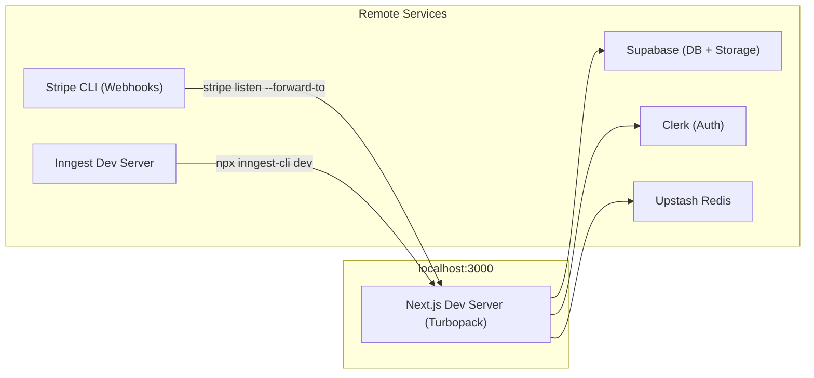

# Development

Local setup, testing, and deployment for Sharetopus.

[Back to README](../README.md)

## Local dev stack



## Prerequisites

- Node.js 20+ (or Bun)
- A [Supabase](https://supabase.com) project with the schema applied
- A [Clerk](https://clerk.com) application
- A [Stripe](https://stripe.com) account with 3 products + price IDs
- An [Inngest](https://www.inngest.com) account
- An [Upstash](https://upstash.com) Redis instance
- OAuth apps for each platform you want to test:
  - [LinkedIn Developer](https://developer.linkedin.com)
  - [TikTok Developers](https://developers.tiktok.com)
  - [Pinterest Developers](https://developers.pinterest.com)
  - [Meta for Developers](https://developers.facebook.com) (Instagram Login)

## Setup

```bash
# Clone and install
git clone <repo-url>
cd sharetopus
npm install              # or: bun install

# Environment
cp .env.example .env.local
# Fill in ALL required values (see .env.example comments)

# Development server
npm run dev              # http://localhost:3000 (Next.js with Turbopack)
```

### Supabase

1. Create a Supabase project
2. Apply the schema (tables, RLS policies, functions). If `Supabase_db_schema` exists in the repo root, use it as reference.
3. Create a storage bucket named `scheduled-videos`
4. Copy the project URL, anon key, and service role key to `.env.local`

### Clerk

1. Create a Clerk application
2. Enable the desired sign-in methods
3. Set up a webhook endpoint pointing to `{FRONTEND_URL}/api/webhooks/clerk` for events: `user.created`, `user.updated`, `user.deleted`
4. Copy publishable key, secret key, and webhook secret to `.env.local`
5. For local development, use `CLERK_WEBHOOK_SECRET_DEV`

### Stripe

1. Create 3 products with monthly and yearly prices matching the plan config in `src/lib/types/plans.ts`
2. Set up a webhook endpoint pointing to `{FRONTEND_URL}/api/webhooks/stripe` for events: `customer.subscription.*`, `invoice.payment_succeeded`, `invoice.payment_failed`
3. Copy secret key, publishable key, and webhook secret to `.env.local`
4. For local webhook testing, use the [Stripe CLI](https://stripe.com/docs/stripe-cli): `stripe listen --forward-to localhost:3000/api/webhooks/stripe`

### Inngest

1. Create an Inngest account and get your event key + signing key
2. For local development, run the [Inngest Dev Server](https://www.inngest.com/docs/local-development): `npx inngest-cli@latest dev`
3. The Inngest serve endpoint is at `/api/inngest`

### Platform OAuth apps

Each platform needs an OAuth app with the redirect URL set to `{FRONTEND_URL}/api/social/{platform}/connect`:

- **LinkedIn:** Redirect URL `http://localhost:3000/api/social/linkedin/connect`
- **TikTok:** Redirect URL `http://localhost:3000/api/social/tiktok/connect`. TikTok requires separate dev/prod credentials (`TIKTOK_CLIENT_KEY_DEV`, `TIKTOK_CLIENT_SECRET_DEV`).
- **Pinterest:** Redirect URL `http://localhost:3000/api/social/pinterest/connect`
- **Instagram:** Redirect URL `http://localhost:3000/api/social/instagram/connect`. Use "Instagram Login" product on Meta, not "Facebook Login".

## Scripts

| Command | What it does |
|---------|-------------|
| `npm run dev` | Dev server with Turbopack |
| `npm run build` | Production build |
| `npm run start` | Production server |
| `npm run lint` | ESLint |

## Type checking

```bash
npx tsc --noEmit
```

No test framework is configured. Type checking is the primary automated verification.

## Code conventions

### Errors as values

Server actions return `{ success: boolean; message: string; data?: T; resetIn?: number }` instead of throwing. Inngest workers throw only for retryable errors.

### Log prefixes

Server actions prefix log messages with the function name in brackets: `[schedulePostInternal]`, `[deleteSupabaseFileAction]`.

### Path aliases

`@/*` maps to `src/*` (configured in `tsconfig.json`). All imports use this alias.

### Server-only imports

`adminSupabase` and other server-only modules use the `server-only` package. Importing them from a client component causes a build error. This prevents accidental exposure of the service role key.

### created_via

All post-creating functions accept a `createdVia` parameter: `web`, `mcp`, `x402`, or `api`. Pass the correct value so analytics can distinguish origin.

## Deployment

Deployed to **Vercel**. Function duration limits are set via Next.js route segment config (`export const maxDuration = 300`) in each route file, not in vercel.json.

Routes with extended duration:
- `src/app/api/mcp/[transport]/route.ts`: 300 seconds
- `src/app/api/inngest/route.ts`: 300 seconds

The `vercel.json` at the repo root only configures `src/app/api/direct/**/*.ts` with `maxDuration: 60`. All other routes use Vercel's default.

### Environment strategy

- **Development:** `.env.local` with `CLERK_WEBHOOK_SECRET_DEV`, `STRIPE_WEBHOOK_SECRET_DEV`, `TIKTOK_CLIENT_KEY_DEV`/`TIKTOK_CLIENT_SECRET_DEV`
- **Production:** Vercel environment variables with production keys. `NODE_ENV=production` selects production Stripe price IDs.

### Branch model

`main` branch deploys to production at [sharetopus.com](https://sharetopus.com).

---

**See also:** [docs/ARCHITECTURE.md](./ARCHITECTURE.md) (system overview, directory structure), [docs/MCP.md](./MCP.md) (MCP server setup), [docs/ROADMAP.md](./ROADMAP.md) (deferred features, open issues)

[Back to README](../README.md)
