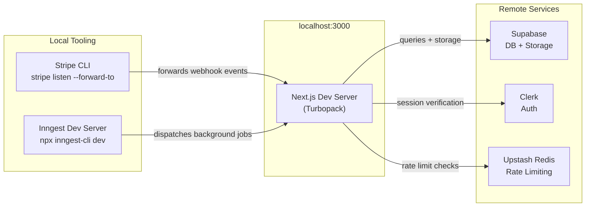

# Development

Local setup, environment configuration, and deployment for Sharetopus.

[Back to README](../README.md)

## Table of contents

- [Local dev stack](#local-dev-stack)
- [Prerequisites](#prerequisites)
- [Setup](#setup)
  - [Clone and install](#clone-and-install)
  - [Supabase](#supabase)
  - [Clerk](#clerk)
  - [Stripe](#stripe)
  - [Inngest](#inngest)
  - [Platform OAuth apps](#platform-oauth-apps)
- [Environment variables](#environment-variables)
  - [Auth (Clerk)](#auth-clerk)
  - [Database (Supabase)](#database-supabase)
  - [Payments (Stripe)](#payments-stripe)
  - [Rate limiting (Upstash)](#rate-limiting-upstash)
  - [Background jobs (Inngest)](#background-jobs-inngest)
  - [Platform OAuth](#platform-oauth)
  - [x402 / Coinbase CDP](#x402--coinbase-cdp)
  - [App config](#app-config)
- [Scripts](#scripts)
- [Type checking](#type-checking)
- [Code conventions](#code-conventions)
- [Deployment](#deployment)
- [Source files referenced](#source-files-referenced)

## Local dev stack



The Next.js dev server talks to remote Supabase, Clerk, and Upstash instances. Stripe webhooks and Inngest job dispatch run locally through their respective CLI tools.

## Prerequisites

| Dependency | Purpose |
|---|---|
| Node.js 20+ | Runtime |
| [Supabase](https://supabase.com) project | Postgres database and file storage |
| [Clerk](https://clerk.com) application | Authentication and user management |
| [Stripe](https://stripe.com) account | Subscription billing (3 products with price IDs) |
| [Inngest](https://www.inngest.com) account | Background job processing |
| [Upstash](https://upstash.com) Redis instance | API rate limiting |
| Platform OAuth apps (one per platform) | LinkedIn, TikTok, Pinterest, Instagram |

## Setup

### Clone and install

```bash
git clone <repo-url>
cd sharetopus
npm install

cp .env.example .env.local
# Fill in all required values (see tables below and .env.example comments)

npm run dev    # http://localhost:3000
```

### Supabase

1. Create a Supabase project.
2. Apply the database schema (tables, RLS policies, functions). If a `Supabase_db_schema` file exists in the repo root, use it as reference.
3. Create a storage bucket named `scheduled-videos` (or set `SUPABASE_BUCKET_NAME` to your chosen name).
4. Copy the project URL, anon key, and service role key into `.env.local`.

### Clerk

1. Create a Clerk application and enable your preferred sign-in methods.
2. Add a webhook endpoint: `{FRONTEND_URL}/api/webhooks/clerk`.
3. Subscribe to events: `user.created`, `user.updated`, `user.deleted`.
4. Copy the publishable key, secret key, and webhook signing secret into `.env.local`.
5. For local development, populate `CLERK_WEBHOOK_SECRET_DEV` instead of `CLERK_WEBHOOK_SECRET`.

### Stripe

1. Create 3 products with monthly and yearly prices matching the plan config in `src/lib/types/plans.ts`.
2. Add a webhook endpoint: `{FRONTEND_URL}/api/webhooks/stripe`.
3. Subscribe to events: `customer.subscription.*`, `invoice.payment_succeeded`, `invoice.payment_failed`.
4. Copy the secret key, publishable key, and webhook signing secret into `.env.local`.
5. For local webhook testing, install the [Stripe CLI](https://stripe.com/docs/stripe-cli) and run:

```bash
stripe listen --forward-to localhost:3000/api/webhooks/stripe
```

### Inngest

1. Get your event key and signing key from the Inngest dashboard.
2. For local development, start the dev server:

```bash
npx inngest-cli@latest dev
```

3. The Inngest serve endpoint is at `/api/inngest`.

### Platform OAuth apps

Each platform requires an OAuth app with its redirect URL set to `{FRONTEND_URL}/api/social/{platform}/connect`.

| Platform | Redirect URL (local) | Notes |
|---|---|---|
| LinkedIn | `http://localhost:3000/api/social/linkedin/connect` | Standard OAuth |
| TikTok | `http://localhost:3000/api/social/tiktok/connect` | Requires separate dev/prod credentials (`TIKTOK_CLIENT_KEY_DEV`, `TIKTOK_CLIENT_SECRET_DEV`) |
| Pinterest | `http://localhost:3000/api/social/pinterest/connect` | Standard OAuth |
| Instagram | `http://localhost:3000/api/social/instagram/connect` | Use the "Instagram Login" product on Meta, not "Facebook Login" |

## Environment variables

All variables are documented in `.env.example`. The tables below group them by service.

### Auth (Clerk)

| Variable | Required | Notes |
|---|---|---|
| `NEXT_PUBLIC_CLERK_PUBLISHABLE_KEY` | Yes | Clerk dashboard, API Keys |
| `CLERK_SECRET_KEY` | Yes | Clerk dashboard, API Keys |
| `CLERK_WEBHOOK_SECRET` | Prod | Webhook signing secret |
| `CLERK_WEBHOOK_SECRET_DEV` | Dev | Local dev override |

### Database (Supabase)

| Variable | Required | Notes |
|---|---|---|
| `NEXT_PUBLIC_SUPABASE_URL` | Yes | Project URL |
| `NEXT_PUBLIC_SUPABASE_ANON_KEY` | Yes | Anon/public key |
| `SUPABASE_SERVICE_ROLE` | Yes | Service role key (server-only) |
| `SUPABASE_BUCKET_NAME` | No | Default: `scheduled-videos` |
| `SUPABASE_CUSTOM_STORAGE_DOMAIN` | No | For TikTok `supabase_direct` media mode |

### Payments (Stripe)

| Variable | Required | Notes |
|---|---|---|
| `STRIPE_SECRET_KEY` | Yes | Stripe dashboard |
| `STRIPE_PUBLISHABLE_KEY` | Yes | Stripe dashboard |
| `STRIPE_WEBHOOK_SECRET` | Prod | Webhook signing secret |
| `STRIPE_WEBHOOK_SECRET_DEV` | Dev | Local dev override |

### Rate limiting (Upstash)

| Variable | Required | Notes |
|---|---|---|
| `UPSTASH_REDIS_REST_URL` | Yes | Upstash Redis REST endpoint |
| `UPSTASH_REDIS_REST_TOKEN` | Yes | Upstash Redis REST token |

### Background jobs (Inngest)

| Variable | Required | Notes |
|---|---|---|
| `INNGEST_EVENT_KEY` | Yes | Event dispatch key |
| `INNGEST_SIGNING_KEY` | Yes | Serve endpoint auth |

### Platform OAuth

| Variable | Required | Notes |
|---|---|---|
| `LINKEDIN_CLIENT_ID` | Per platform | LinkedIn OAuth app |
| `LINKEDIN_CLIENT_SECRET` | Per platform | LinkedIn OAuth app |
| `LINKEDIN_REDIRECT_URL` | Per platform | Default: `http://localhost:3000/api/social/linkedin/connect` |
| `TIKTOK_CLIENT_KEY` | Prod | Production TikTok app |
| `TIKTOK_CLIENT_SECRET` | Prod | Production TikTok app |
| `TIKTOK_CLIENT_KEY_DEV` | Dev | Sandbox TikTok app |
| `TIKTOK_CLIENT_SECRET_DEV` | Dev | Sandbox TikTok app |
| `TIKTOK_REDIRECT_URL` | Per platform | Default: `http://localhost:3000/api/social/tiktok/connect` |
| `TIKTOK_MEDIA_SOURCE` | No | `proxy` (default) or `supabase_direct` |
| `PINTEREST_CLIENT_ID` | Per platform | Pinterest OAuth app |
| `PINTEREST_CLIENT_SECRET` | Per platform | Pinterest OAuth app |
| `PINTEREST_REDIRECT_URL` | Per platform | Default: `http://localhost:3000/api/social/pinterest/connect` |
| `INSTAGRAM_CLIENT_ID` | Per platform | Meta app with Instagram Login |
| `INSTAGRAM_CLIENT_SECRET` | Per platform | Meta app with Instagram Login |
| `INSTAGRAM_REDIRECT_URL` | Per platform | Default: `http://localhost:3000/api/social/instagram/connect` |

### x402 / Coinbase CDP

| Variable | Required | Notes |
|---|---|---|
| `CDP_API_KEY_ID` | For x402 | Coinbase CDP API key ID |
| `CDP_API_KEY_SECRET` | For x402 | Coinbase CDP API key secret |
| `CDP_WALLET_SECRET` | For x402 | CDP wallet secret |
| `X402_RECIPIENT_EVM` | For x402 | EVM wallet address for USDC payments |
| `X402_RECIPIENT_SOLANA` | For x402 | Solana wallet address for USDC payments |
| `X402_DEFAULT_NETWORK` | No | Default: `base` |
| `X402_TESTNET_NETWORK` | No | Default: `base-sepolia` |
| `X402_FACILITATOR_URL` | No | Default: Coinbase hosted facilitator |
| `CDP_WEBHOOK_SIGNING_SECRET` | For x402 | HMAC verification of CDP webhook events |

### App config

| Variable | Required | Notes |
|---|---|---|
| `FRONTEND_URL` | Yes | Default: `http://localhost:3000` |
| `NEXT_PUBLIC_BASE_URL` | No | Default: `https://sharetopus.com` |
| `CRON_SECRET_KEY` | Yes | Shared secret for cron auth bypass |
| `MEDIA_PROXY_HMAC_SECRET` | Yes | 64 hex chars. Generate: `node -e "console.log(require('crypto').randomBytes(32).toString('hex'))"` |
| `MCP_IP_HASH_SALT` | Prod | 32 bytes base64. Generate: `node -e "console.log(require('crypto').randomBytes(32).toString('base64'))"` |

## Scripts

| Command | Description |
|---|---|
| `npm run dev` | Start dev server with Turbopack (`next dev --turbopack`) |
| `npm run build` | Production build (`next build`) |
| `npm run start` | Start production server (`next start`) |
| `npm run lint` | Run ESLint (`next lint`) |

## Type checking

```bash
npx tsc --noEmit
```

No test framework is configured. Type checking is the primary automated verification step.

## Code conventions

### Errors as values

Server actions return a result object instead of throwing:

```typescript
{ success: boolean; message: string; data?: T; resetIn?: number }
```

Inngest workers throw only for retryable errors. Non-retryable failures are returned as values.

### Log prefixes

All server actions and core functions prefix log messages with the function name in brackets:

```
[schedulePostInternal] Creating post for user u_abc...
[deleteSupabaseFileAction] Removed file xyz from bucket
```

### Path aliases

`@/*` maps to `src/*` (configured in `tsconfig.json`). All imports use this alias.

### Server-only imports

`adminSupabase` and other privileged modules use the `server-only` package. Importing them from a client component triggers a build error, preventing accidental exposure of the service role key.

### created_via tracking

All post-creating functions accept a `createdVia` parameter with one of four values: `web`, `mcp`, `x402`, or `api`. This value is stored with every post so analytics can distinguish origin.

### requestId tracing

Web server actions generate a `requestId` at entry and thread it through batch functions. This provides a correlation ID in logs for tracing a single user action across multiple internal calls.

## Deployment

Deployed to Vercel. The `main` branch deploys to production at [sharetopus.com](https://sharetopus.com).

### Function duration

Vercel function timeout is configured per route using Next.js route segment config (`export const maxDuration`), not in `vercel.json`.

| Route | maxDuration |
|---|---|
| `src/app/api/mcp/[transport]/route.ts` | 300s |
| `src/app/api/inngest/route.ts` | 300s |
| `src/app/api/x402/register/route.ts` | 60s |
| `src/app/api/x402/connect/route.ts` | 60s |
| All other routes | Vercel default |

### Dev/prod environment strategy

Development uses `.env.local` with `*_DEV` variants for webhook secrets and platform credentials:

- `CLERK_WEBHOOK_SECRET_DEV` instead of `CLERK_WEBHOOK_SECRET`
- `STRIPE_WEBHOOK_SECRET_DEV` instead of `STRIPE_WEBHOOK_SECRET`
- `TIKTOK_CLIENT_KEY_DEV` / `TIKTOK_CLIENT_SECRET_DEV` instead of `TIKTOK_CLIENT_KEY` / `TIKTOK_CLIENT_SECRET`

Production uses Vercel environment variables with production keys. `NODE_ENV=production` selects production Stripe price IDs.

## Source files referenced

| File | What it contains |
|---|---|
| `package.json` | Scripts, dependencies |
| `tsconfig.json` | Path aliases, compiler options |
| `vercel.json` | Vercel deployment configuration |
| `.env.example` | Full list of environment variables with documentation |
| `src/lib/types/plans.ts` | Stripe product and price ID configuration |
| `src/app/api/mcp/[transport]/route.ts` | MCP server route (maxDuration 300) |
| `src/app/api/inngest/route.ts` | Inngest serve endpoint (maxDuration 300) |
| `src/app/api/webhooks/clerk/route.ts` | Clerk webhook handler |
| `src/app/api/webhooks/stripe/route.ts` | Stripe webhook handler |
| `src/app/api/webhooks/tiktok/publish/route.ts` | TikTok publish status webhook handler |
| `src/lib/jobs/runtimeConfig.ts` | Runtime constants including max duration |

---

See also: [ARCHITECTURE.md](./ARCHITECTURE.md), [MCP.md](./MCP.md), [ROADMAP.md](./ROADMAP.md)

[Back to README](../README.md)
