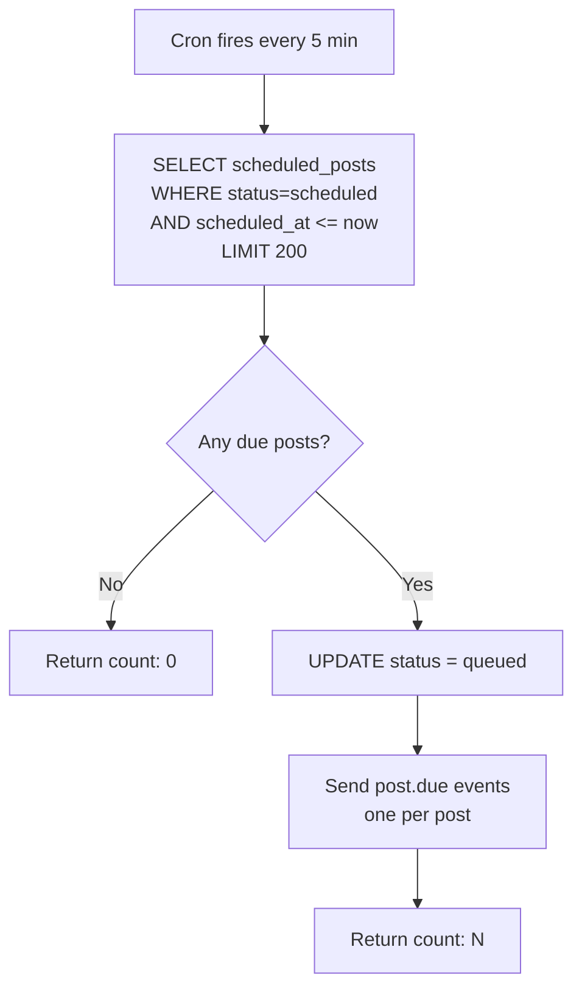
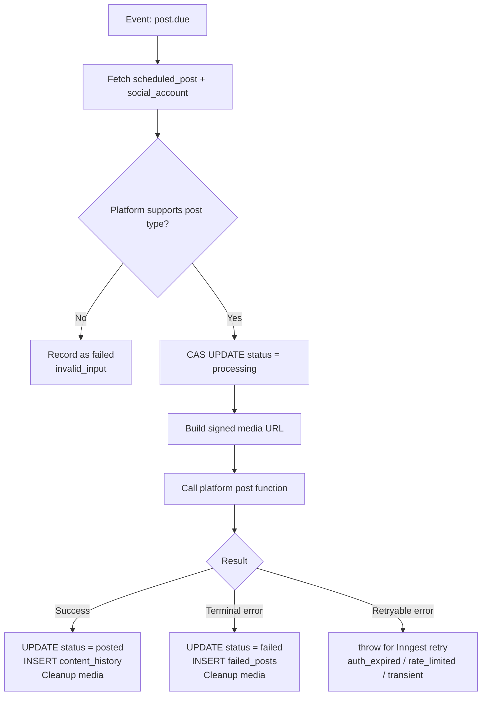
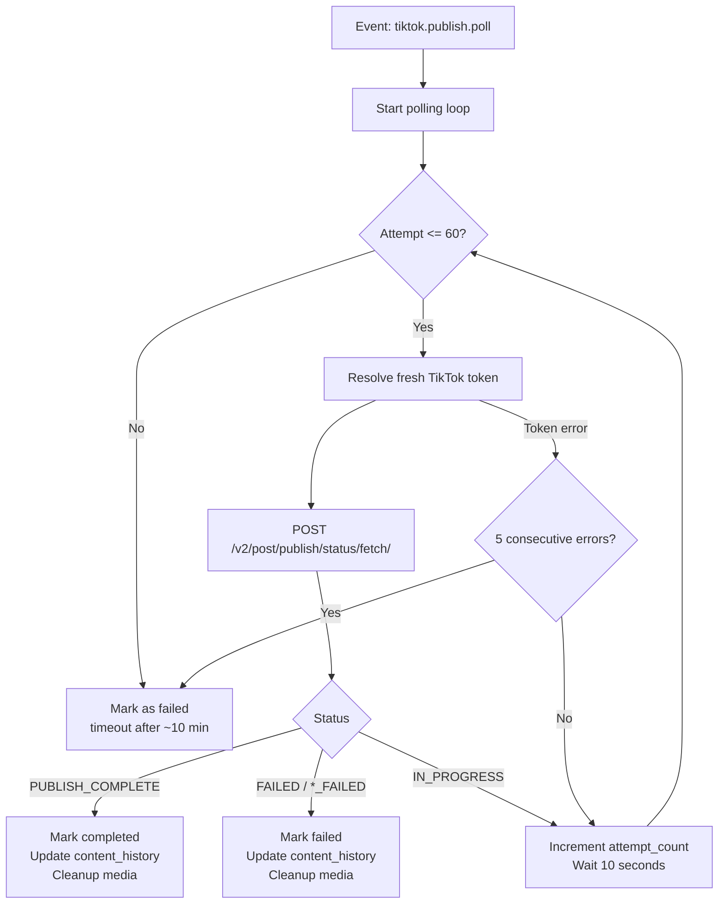
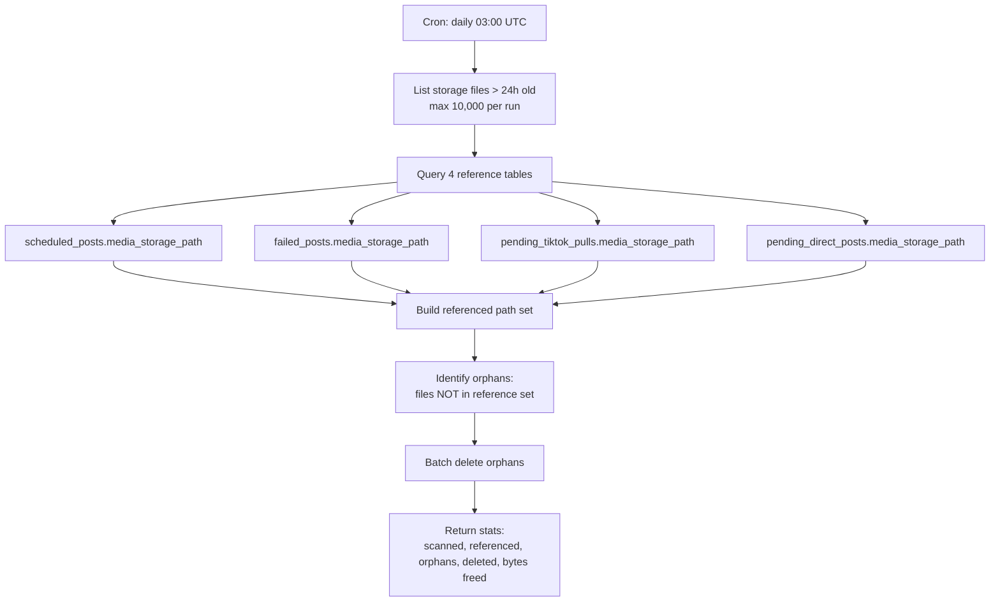

# Inngest Functions

6 background functions registered in `src/app/api/inngest/route.ts`. The Inngest client ID is `sharetopus` (`src/inngest/client.ts`).

Runtime configuration is centralized in `src/lib/jobs/runtimeConfig.ts` with env-overridable defaults tuned for Vercel Hobby (300s max function duration, ~2048 MB memory).

[Back to README](../README.md)

## Function inventory

| Function ID | Trigger | Concurrency | Retries | Purpose |
|-------------|---------|-------------|---------|---------|
| scheduled-posts-tick | Cron `*/5 * * * *` | 1 | 0 | Dispatch due scheduled posts |
| process-single-post | Event `post.due` | 5 (dynamic) | 3 | Process one scheduled post |
| process-direct-post | Event `post.now` | 5 (dynamic) | 0 | Process one direct "post now" item |
| tiktok-publish-status-poll | Event `tiktok.publish.poll` | 5 per account | 0 | Poll TikTok for publish completion |
| sweep-stuck-direct-posts | Cron `*/5 * * * *` | default | 0 | Recover stuck pending_direct_posts (>10 min) |
| sweep-orphan-storage-files | Cron `0 3 * * *` | default | 0 | Delete unreferenced storage files (>24h) |

## scheduled-posts-tick

**File:** `src/inngest/functions/scheduledPostsTick.ts`
**Schedule:** Every 5 minutes
**Concurrency:** 1 (sequential, prevents overlap)

Each event includes `scheduled_post_id`, `principal_id`, `social_account_id`, `platform`, `scheduled_at`. Event IDs use `${postId}:${scheduledAt}` for 24-hour deduplication.

## process-single-post

**File:** `src/inngest/functions/processSinglePost.ts`
**Trigger:** Event `post.due`
**Concurrency:** Dynamic (default 5, based on available memory)
**Retries:** `RUNTIME.maxRetries` (default 3, capped at 20)
**Throttle:** 5 per minute per social_account_id

Platform compatibility: Pinterest, Instagram, and TikTok reject text-only posts. LinkedIn accepts all types.

Media URL generation: Supabase signed URLs for Pinterest/LinkedIn/Instagram. TikTok uses either HMAC-signed proxy URLs or direct Supabase URLs depending on `TIKTOK_MEDIA_SOURCE` env var.

## process-direct-post

**File:** `src/inngest/functions/processDirectPost.ts`
**Trigger:** Event `post.now`
**Concurrency:** Dynamic (default 5)
**Retries:** 0 (fire-and-forget)

Fetches the social account, calls the platform's `directPostFromEvent` handler, and finalizes the `pending_direct_posts` row. Media cleanup happens on all terminal paths except TikTok success (where the TikTok poll worker handles cleanup after publish completion).

## tiktok-publish-status-poll

**File:** `src/inngest/functions/tikTokPublishStatusPoll.ts`
**Trigger:** Event `tiktok.publish.poll`
**Concurrency:** 5 per social_account_id

**Polling config:**
- Max attempts: 60
- Interval: 10 seconds
- Total ceiling: ~10 minutes
- Consecutive error threshold: 5 (token resolution or polling errors)

## sweep-stuck-direct-posts

**File:** `src/inngest/functions/sweepStuckDirectPosts.ts`
**Schedule:** Every 5 minutes
**Retries:** 0

Marks `pending_direct_posts` rows with `status=processing` and `created_at < now - 10 minutes` as `failed`. This recovers rows where the worker crashed (OOM, Vercel timeout, Inngest abort) and the lock was never released.

The 10-minute cutoff is conservative. Legitimate direct post operations complete in under 30 seconds. TikTok worst case (with the separate poll worker) is ~3 minutes.

## sweep-orphan-storage-files

**File:** `src/inngest/functions/sweepOrphanStorageFiles.ts`
**Schedule:** Daily at 03:00 UTC
**Retries:** 0 (next daily run catches failures)

**Why `content_history.media_url` is excluded:** Content history stores platform-hosted URLs (e.g., `https://media.licdn.com/...`), not Supabase storage paths. Including it would never match.

**Partial success:** Failed batch deletes are logged but don't abort the run. The 24-hour cutoff ensures orphans remain eligible for the next run.

**Bucket:** `SUPABASE_BUCKET_NAME` env var (default: `scheduled-videos`).

## Runtime configuration

`src/lib/jobs/runtimeConfig.ts` exports a `RUNTIME` object with defaults tuned for Vercel Hobby:

| Setting | Default | Env Override |
|---------|---------|-------------|
| maxDurationS | 300 | `MAX_DURATION_S` |
| workerConcurrency | 5 (auto-computed from memory) | |
| perAccountThrottlePerMinute | 5 | `PER_ACCOUNT_THROTTLE_PER_MIN` |
| maxFileMb | 100 | `MAX_FILE_MB` |
| maxRetries | 3 | `WORKER_MAX_RETRIES` |
| dispatcherBatchSize | 200 | `DISPATCHER_BATCH_SIZE` |
| signedUrlTtlS | 300 | `SIGNED_URL_TTL_S` |
| tikTokPublishPollMaxAttempts | 60 | |
| tikTokPublishPollIntervalMs | 10,000 | |
| directPostStatusPollIntervalMs | 1,500 | `DIRECT_POST_POLL_INTERVAL_MS` |
| directPostStatusPollMaxAttempts | 120 | `DIRECT_POST_POLL_MAX_ATTEMPTS` |
| pollWindowS | 120 | `POLL_WINDOW_S` |

## Error classification

`src/inngest/functions/platformErrors.ts` maps platform errors to retry decisions:

- **Retryable:** `auth_expired`, `rate_limited`, `transient` (worker throws, Inngest retries with backoff)
- **Terminal:** `policy_rejected`, `invalid_input`, `unknown` (recorded as failure, no retry)

---

**See also:** [docs/SCHEDULING.md](./SCHEDULING.md) (post lifecycle, lock tables), [docs/STORAGE.md](./STORAGE.md) (orphan sweep details), [docs/PLATFORMS.md](./PLATFORMS.md) (per-platform posting flows)

[Back to README](../README.md)
