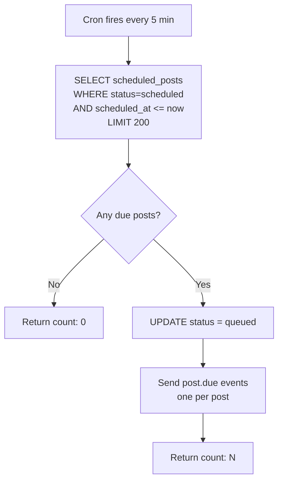
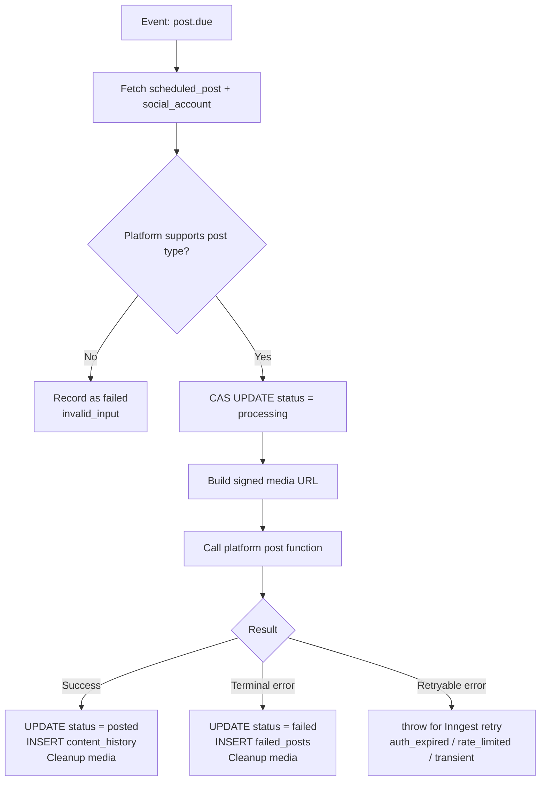
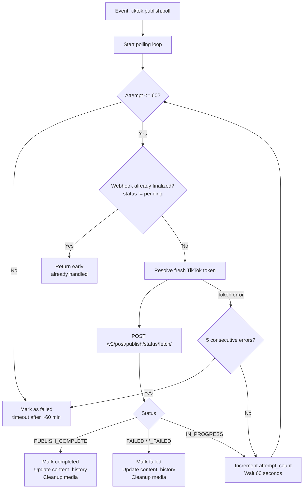
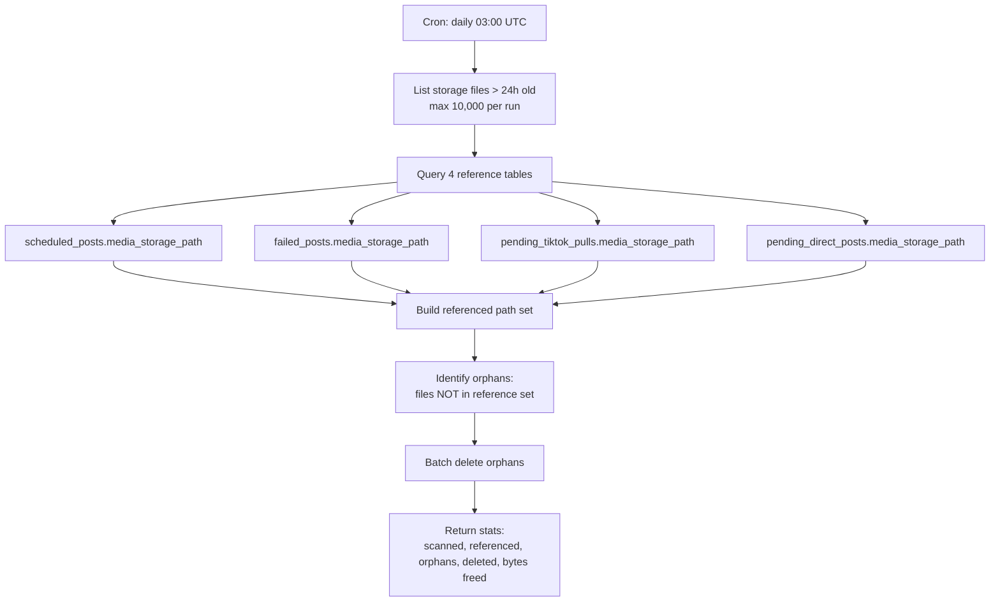

# Inngest Functions

11 background functions registered in `src/app/api/inngest/route.ts`. The Inngest client ID is `sharetopus` (`src/inngest/client.ts`).

Runtime configuration is centralized in `src/lib/jobs/runtimeConfig.ts` with env-overridable defaults tuned for Vercel Hobby (300s max function duration, ~2048 MB memory).

[Back to README](../README.md)

## Table of contents

- [Function inventory](#function-inventory)
- [scheduled-posts-tick](#scheduled-posts-tick)
- [process-single-post](#process-single-post)
- [process-direct-post](#process-direct-post)
- [tiktok-publish-status-poll](#tiktok-publish-status-poll)
- [process-tiktok-publish-webhook](#process-tiktok-publish-webhook)
- [sweep-stuck-direct-posts](#sweep-stuck-direct-posts)
- [sweep-orphan-storage-files](#sweep-orphan-storage-files)
- [sweep-stale-oauth-clients](#sweep-stale-oauth-clients)
- [cleanup-cancelled-posts-after-grace](#cleanup-cancelled-posts-after-grace)
- [cleanup-stripe-webhook-events](#cleanup-stripe-webhook-events)
- [cleanup-mcp-audit-log](#cleanup-mcp-audit-log)
- [Event vocabulary](#event-vocabulary)
- [Runtime configuration](#runtime-configuration)
- [Cron schedule coordination](#cron-schedule-coordination)
- [Error classification](#error-classification)
- [Source files referenced](#source-files-referenced)

## Function inventory

| Function ID | Trigger | Concurrency | Retries | Purpose |
|---|---|---|---|---|
| scheduled-posts-tick | Cron `*/5 * * * *` | 1 | 0 | Dispatch due scheduled posts |
| process-single-post | Event `post.due` | 5 (dynamic) | 3 (capped at 20) | Process one scheduled post |
| process-direct-post | Event `post.now` | 5 (dynamic) | 0 | Process one direct "post now" item |
| tiktok-publish-status-poll | Event `tiktok.publish.poll` | 5 per account | 0 (internal loop) | Poll TikTok for publish completion |
| process-tiktok-publish-webhook | Event `tiktok.publish.webhook.received` | default | 3 | Handle TikTok publish webhook callbacks |
| sweep-stuck-direct-posts | Cron `*/5 * * * *` | default | 0 | Recover stuck pending_direct_posts (>10 min) |
| sweep-orphan-storage-files | Cron `0 3 * * *` | default | 0 | Delete unreferenced storage files (>24h) |
| sweep-stale-oauth-clients | Cron `0 4 * * *` | default | 0 | Remove unverified OAuth clients (>90 days) |
| cleanup-cancelled-posts-after-grace | Cron `0 5 * * *` | default | 0 | Delete posts after subscription cancel grace period |
| cleanup-stripe-webhook-events | Cron `0 3 * * *` | default | 0 | Purge processed Stripe webhook events (>90 days) |
| cleanup-mcp-audit-log | Cron `0 4 * * *` | default | 0 | Truncate MCP audit log entries (>90 days) |

## scheduled-posts-tick

**File:** `src/inngest/functions/scheduledPostsTick.ts` (65 lines)
**Schedule:** Every 5 minutes
**Concurrency:** 1 (sequential, prevents overlap)
**Retries:** 0
**Batch size:** `RUNTIME.dispatcherBatchSize` (200)

Each event includes `scheduled_post_id`, `principal_id`, `social_account_id`, `platform`, `scheduled_at`. Event IDs use the format `post.due-${post.id}-${post.scheduled_at}` for 24-hour deduplication.

## process-single-post

**File:** `src/inngest/functions/processSinglePost.ts` (149 lines)
**Trigger:** Event `post.due`
**Concurrency:** `RUNTIME.workerConcurrency` (5, computed from memory)
**Retries:** `Math.min(RUNTIME.maxRetries, 20)` (default 3)
**Throttle:** `RUNTIME.perAccountThrottlePerMinute` (5) per `social_account_id`

Platform compatibility: Pinterest, Instagram, and TikTok reject text-only posts. LinkedIn accepts all types.

Media URL generation: Supabase signed URLs for Pinterest/LinkedIn/Instagram. TikTok uses either HMAC-signed proxy URLs or direct Supabase URLs depending on the `TIKTOK_MEDIA_SOURCE` env var.

## process-direct-post

**File:** `src/inngest/functions/processDirectPost.ts` (89 lines)
**Trigger:** Event `post.now`
**Concurrency:** `RUNTIME.workerConcurrency` (5)
**Retries:** 0 (fire-and-forget)
**Throttle:** `RUNTIME.perAccountThrottlePerMinute` (5) per `social_account_id`

Fetches the social account, calls the platform's `directPostFromEvent` handler, and finalizes the `pending_direct_posts` row. Media cleanup happens on all terminal paths except TikTok success (where the TikTok poll worker handles cleanup after publish completion).

## tiktok-publish-status-poll

**File:** `src/inngest/functions/tikTokPublishStatusPoll.ts` (171 lines)
**Trigger:** Event `tiktok.publish.poll`
**Concurrency:** 5 per `social_account_id`
**Retries:** 0 (uses an internal retry loop instead)

**Polling config:**
- Max attempts: `RUNTIME.tikTokPublishPollMaxAttempts` (60)
- Interval: `RUNTIME.tikTokPublishPollIntervalMs` (60,000ms = 60 seconds)
- Total ceiling: ~60 minutes (matches TikTok's 1-hour `PROCESSING_DOWNLOAD` timeout)
- Consecutive error threshold: 5 (token resolution or polling errors)
- Early exit: checks if a webhook already finalized the post (status != "pending") before each poll attempt

## process-tiktok-publish-webhook

**File:** `src/inngest/functions/processTikTokPublishWebhook.ts` (128 lines)
**Trigger:** Event `tiktok.publish.webhook.received`
**Retries:** 3

Handles TikTok publish lifecycle webhooks sent to `/api/webhooks/tiktok/publish`. Only processes `DIRECT_POST` events (`INBOX_SHARE` is filtered out). Finalization is idempotent via `finalizeTikTokPostByPublishId`, so both the webhook and the poll worker can attempt to finalize without conflict.

**Events handled:**

| TikTok Event | Action |
|---|---|
| `post.publish.complete` | Finalize as completed (no `post_id` available yet) |
| `post.publish.publicly_available` | Finalize as completed with `post_id` |
| `post.publish.failed` | Finalize as failed |
| `inbox_delivered` | Ignored |
| `no_longer_publicly_available` | Ignored |
| `authorization.removed` | Ignored |

When the webhook finalizes a post before the poll worker reaches it, the poll worker detects the non-pending status and exits early.

## sweep-stuck-direct-posts

**File:** `src/inngest/functions/sweepStuckDirectPosts.ts` (47 lines)
**Schedule:** Every 5 minutes
**Retries:** 0
**Cutoff:** 10 minutes (`STUCK_AGE_MS` = 600,000ms)

Marks `pending_direct_posts` rows with `status=processing` and `created_at < now - 10 minutes` as `failed`. This recovers rows where the worker crashed (OOM, Vercel timeout, Inngest abort) and the lock was never released.

The 10-minute cutoff is conservative. Legitimate direct post operations complete in under 30 seconds. TikTok worst case (with the separate poll worker) is ~3 minutes.

## sweep-orphan-storage-files

**File:** `src/inngest/functions/sweepOrphanStorageFiles.ts` (130 lines)
**Schedule:** Daily at 03:00 UTC
**Retries:** 0 (next daily run catches failures)
**Cutoff:** 24 hours
**Max files per run:** 10,000

**Why `content_history.media_url` is excluded:** Content history stores platform-hosted URLs (e.g., `https://media.licdn.com/...`), not Supabase storage paths. Including it would never match.

**Partial success:** Failed batch deletes are logged but do not abort the run. The 24-hour cutoff ensures orphans remain eligible for the next run.

**Bucket:** `SUPABASE_BUCKET_NAME` env var (default: `scheduled-videos`).

## sweep-stale-oauth-clients

**File:** `src/inngest/functions/sweepStaleOauthClientsCron.ts` (37 lines)
**Schedule:** Daily at 04:00 UTC
**Retries:** 0
**Retention:** 90 days

Removes unverified OAuth clients that have no recent sessions and are older than 90 days. This prevents accumulation of abandoned MCP client registrations.

## cleanup-cancelled-posts-after-grace

**File:** `src/inngest/functions/cleanupCancelledPostsAfterGraceCron.ts` (40 lines)
**Schedule:** Daily at 05:00 UTC
**Retries:** 0
**Grace period:** 7 days after subscription cancellation

Deletes scheduled posts belonging to users whose subscriptions were cancelled more than 7 days ago. The grace period gives users time to resubscribe before their queued content is removed.

## cleanup-stripe-webhook-events

**File:** `src/inngest/functions/cleanupStripeWebhookEvents.ts` (37 lines)
**Schedule:** Daily at 03:00 UTC
**Retries:** 0
**Retention:** 90 days

Purges processed Stripe webhook event records older than 90 days. These records exist for idempotency checking, and 90 days is well past the window where replays could occur.

## cleanup-mcp-audit-log

**File:** `src/inngest/functions/cleanupMcpAuditLogCron.ts` (58 lines)
**Schedule:** Daily at 04:00 UTC
**Retries:** 0
**Retention:** `RETENTION_DAYS` = 90

Truncates MCP audit log entries older than 90 days. Uses the service-role client to bypass the append-only RLS trigger on the audit table, since normal clients can only insert.

## Event vocabulary

| Event Name | Emitted By | Consumed By | Payload Key Fields |
|---|---|---|---|
| `post.due` | scheduled-posts-tick | process-single-post | `scheduled_post_id`, `principal_id`, `social_account_id`, `platform`, `scheduled_at` |
| `post.now` | directPostBatch (server action) | process-direct-post | post and account details |
| `tiktok.publish.poll` | process-direct-post, process-single-post | tiktok-publish-status-poll | publish ID, account, media path |
| `tiktok.publish.webhook.received` | `/api/webhooks/tiktok/publish` (route handler) | process-tiktok-publish-webhook | TikTok event type, publish ID, post ID |

## Runtime configuration

`src/lib/jobs/runtimeConfig.ts` exports a `RUNTIME` object with defaults tuned for Vercel Hobby:

| Setting | Default | Env Override |
|---|---|---|
| maxDurationS | 300 | `MAX_DURATION_S` |
| workerConcurrency | 5 (auto-computed: `floor(2048/350)`) | |
| perAccountThrottlePerMinute | 5 | `PER_ACCOUNT_THROTTLE_PER_MIN` |
| maxFileMb | 100 | `MAX_FILE_MB` |
| maxRetries | 3 | `WORKER_MAX_RETRIES` |
| dispatcherBatchSize | 200 | `DISPATCHER_BATCH_SIZE` |
| signedUrlTtlS | 300 | `SIGNED_URL_TTL_S` |
| tikTokPublishPollMaxAttempts | 60 | |
| tikTokPublishPollIntervalMs | 60,000 (60 seconds) | |
| pollWindowS | 120 | `POLL_WINDOW_S` |

## Cron schedule coordination

All cron times are UTC. Functions at the same time slot run in parallel (no ordering dependency between them).

| UTC Time | Functions |
|---|---|
| `*/5 * * * *` (every 5 min) | scheduled-posts-tick, sweep-stuck-direct-posts |
| `0 3 * * *` (03:00) | sweep-orphan-storage-files, cleanup-stripe-webhook-events |
| `0 4 * * *` (04:00) | sweep-stale-oauth-clients, cleanup-mcp-audit-log |
| `0 5 * * *` (05:00) | cleanup-cancelled-posts-after-grace |

## Error classification

`src/inngest/functions/platformErrors.ts` maps platform errors to retry decisions:

- **Retryable:** `auth_expired`, `rate_limited`, `transient` (worker throws, Inngest retries with backoff)
- **Terminal:** `policy_rejected`, `invalid_input`, `unknown` (recorded as failure, no retry)

---

**See also:** [docs/SCHEDULING.md](./SCHEDULING.md) (post lifecycle, lock tables), [docs/STORAGE.md](./STORAGE.md) (orphan sweep details), [docs/PLATFORMS.md](./PLATFORMS.md) (per-platform posting flows)

[Back to README](../README.md)

## Source files referenced

- `src/inngest/client.ts` (Inngest client, ID: "sharetopus")
- `src/app/api/inngest/route.ts` (function registration, 11 functions)
- `src/lib/jobs/runtimeConfig.ts` (RUNTIME config object)
- `src/inngest/functions/scheduledPostsTick.ts`
- `src/inngest/functions/processSinglePost.ts`
- `src/inngest/functions/processDirectPost.ts`
- `src/inngest/functions/tikTokPublishStatusPoll.ts`
- `src/inngest/functions/processTikTokPublishWebhook.ts`
- `src/inngest/functions/sweepStuckDirectPosts.ts`
- `src/inngest/functions/sweepOrphanStorageFiles.ts`
- `src/inngest/functions/sweepStaleOauthClientsCron.ts`
- `src/inngest/functions/cleanupCancelledPostsAfterGraceCron.ts`
- `src/inngest/functions/cleanupStripeWebhookEvents.ts`
- `src/inngest/functions/cleanupMcpAuditLogCron.ts`
- `src/inngest/functions/platformErrors.ts`
