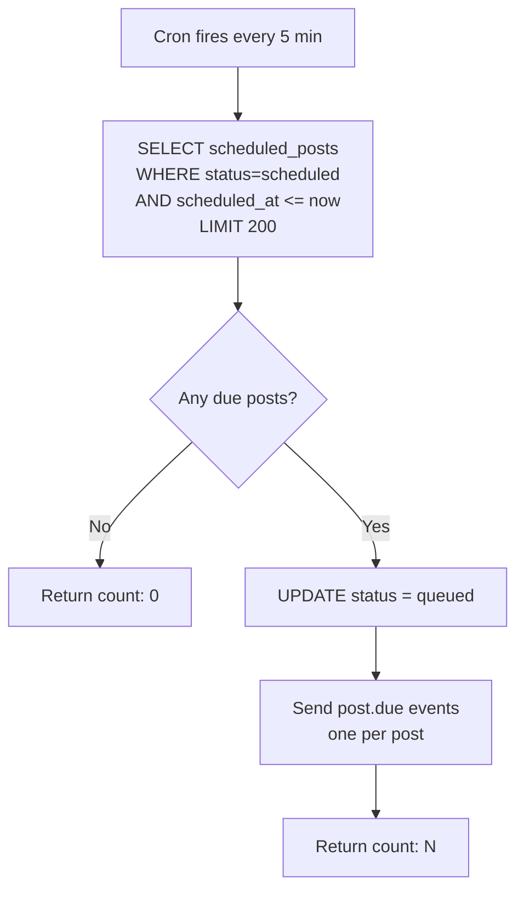
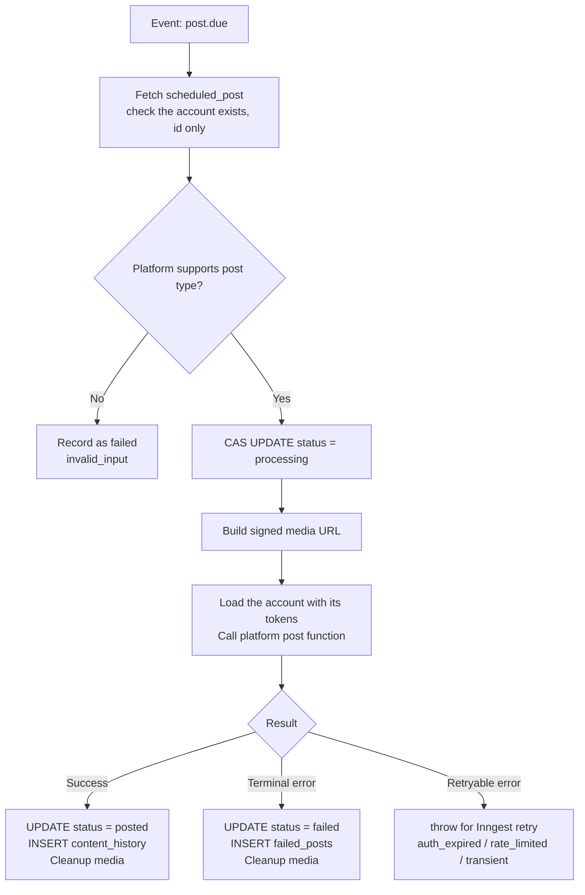
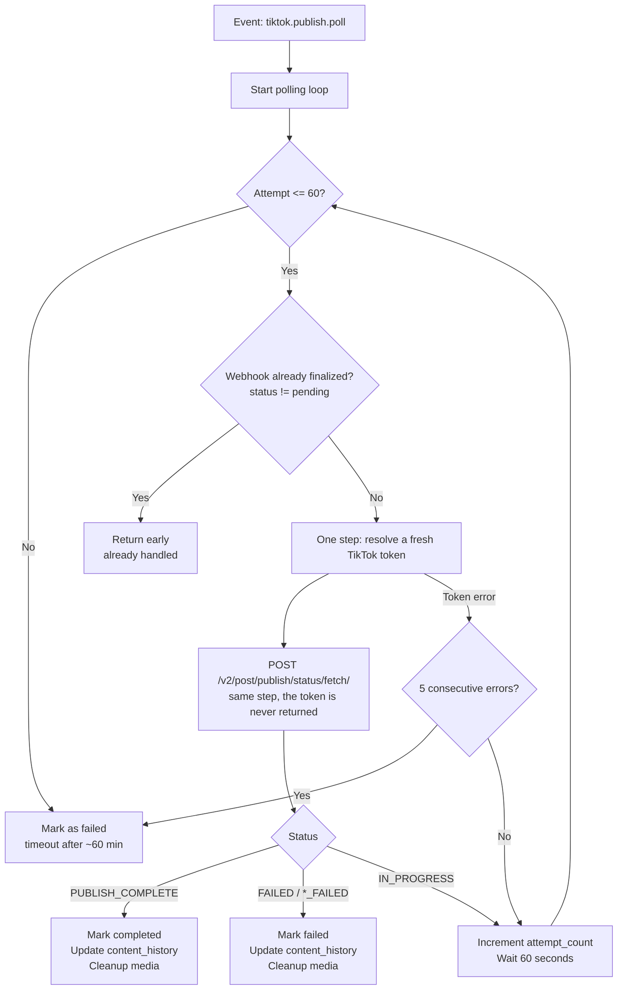
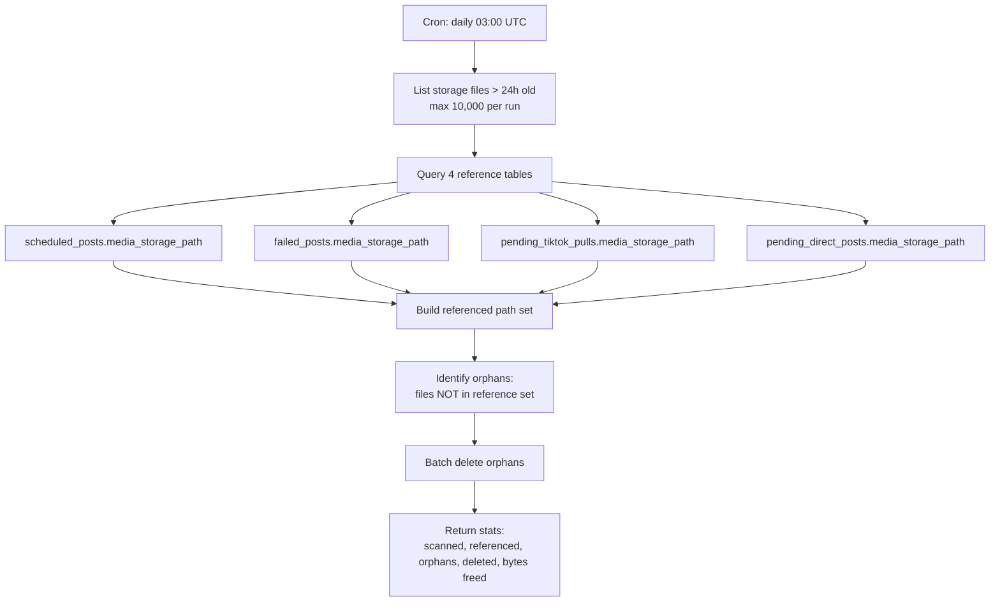
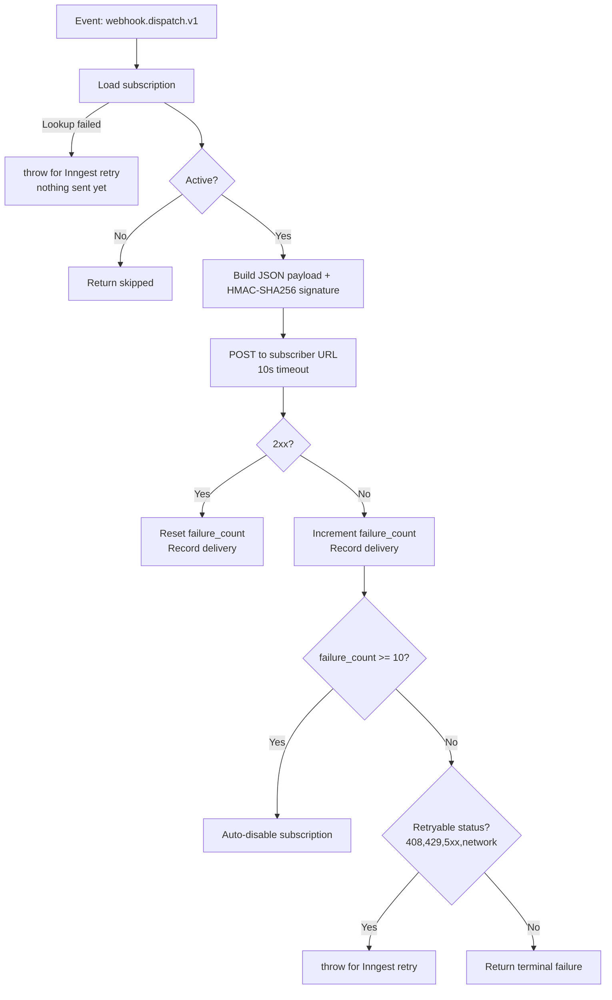

# Inngest Functions

16 background functions registered in `src/app/api/inngest/route.ts`. The Inngest client ID is `sharetopus` (`src/inngest/client.ts`).

Runtime configuration is centralized in `src/lib/jobs/runtimeConfig.ts` with env-overridable defaults tuned for Vercel Hobby (300s max function duration, ~2048 MB memory).

[Back to README](../README.md)

## Table of contents

- [Function inventory](#function-inventory)
- [scheduled-posts-tick](#scheduled-posts-tick)
- [process-single-post](#process-single-post)
- [process-direct-post](#process-direct-post)
- [tiktok-publish-status-poll](#tiktok-publish-status-poll)
- [process-tiktok-publish-webhook](#process-tiktok-publish-webhook)
- [sweep-stuck-direct-posts](#sweep-stuck-direct-posts)
- [sweep-orphan-storage-files](#sweep-orphan-storage-files)
- [sweep-stale-oauth-clients](#sweep-stale-oauth-clients)
- [cleanup-cancelled-posts-after-grace](#cleanup-cancelled-posts-after-grace)
- [cleanup-stripe-webhook-events](#cleanup-stripe-webhook-events)
- [cleanup-mcp-audit-log](#cleanup-mcp-audit-log)
- [cleanup-x402-access-log](#cleanup-x402-access-log)
- [cleanup-rest-audit-log](#cleanup-rest-audit-log)
- [cleanup-tiktok-webhook-events](#cleanup-tiktok-webhook-events)
- [encrypt-social-tokens](#encrypt-social-tokens)
- [deliver-webhook](#deliver-webhook)
- [Event vocabulary](#event-vocabulary)
- [Runtime configuration](#runtime-configuration)
- [Cron schedule coordination](#cron-schedule-coordination)
- [Error classification](#error-classification)
- [Source files referenced](#source-files-referenced)

## Function inventory

| Function ID | Trigger | Concurrency | Retries | Purpose |
|---|---|---|---|---|
| scheduled-posts-tick | Cron `*/5 * * * *` | 1 | 0 | Dispatch due scheduled posts |
| process-single-post | Event `post.due` | 5 (dynamic) | 3 (capped at 20) | Process one scheduled post |
| process-direct-post | Event `post.now` | 5 (dynamic) | 0 | Process one direct "post now" item |
| tiktok-publish-status-poll | Event `tiktok.publish.poll` | 5 per account | 0 (internal loop) | Poll TikTok for publish completion |
| process-tiktok-publish-webhook | Event `tiktok.publish.webhook.received` | default | 3 | Handle TikTok publish webhook callbacks |
| sweep-stuck-direct-posts | Cron `*/5 * * * *` | default | 0 | Recover stuck pending_direct_posts (>10 min) |
| sweep-orphan-storage-files | Cron `0 3 * * *` | default | 0 | Delete unreferenced storage files (>24h) |
| sweep-stale-oauth-clients | Cron `0 4 * * *` | default | 0 | Remove unverified OAuth clients (>90 days) |
| cleanup-cancelled-posts-after-grace | Cron `0 5 * * *` | default | 0 | Delete posts after subscription cancel grace period |
| cleanup-stripe-webhook-events | Cron `0 3 * * *` | default | 0 | Purge processed Stripe webhook events (>90 days) |
| cleanup-mcp-audit-log | Cron `0 4 * * *` | default | 0 | Delete MCP audit log rows (>90 days) |
| cleanup-x402-access-log | Cron `0 6 * * *` | default | 0 | Delete x402 access log rows (>90 days) |
| cleanup-rest-audit-log | Cron `0 7 * * *` | default | 0 | Delete REST audit log rows (>90 days) |
| cleanup-tiktok-webhook-events | Cron `0 8 * * *` | default | 0 | Purge logged TikTok webhook events (>90 days) |
| cleanup-social-connections | Cron `0 2 * * *` | default | 0 | Delete pending, failed and expired OAuth connection rows (>30 days) |
| sweep-x402-reconciliation | Cron `20 * * * *` | default | 0 | Resolve or report x402 payments that need a manual look |
| encrypt-social-tokens | Cron `0 9 * * *`, Event `social-tokens.encrypt` | default | 1 | Encrypt social account tokens still stored in plaintext |
| deliver-webhook | Event `webhook.dispatch.v1` | default | 3 | Deliver one webhook event to a subscriber (HMAC signed) |

## scheduled-posts-tick

**File:** `src/inngest/functions/scheduledPostsTick.ts` (65 lines)
**Schedule:** Every 5 minutes
**Concurrency:** 1 (sequential, prevents overlap)
**Retries:** 0
**Batch size:** `RUNTIME.dispatcherBatchSize` (200)

```mermaid
flowchart TD
    A[Cron fires every 5 min] --> B[SELECT scheduled_posts\nWHERE status=scheduled\nAND scheduled_at <= now\nLIMIT 200]
    B --> C{Any due posts?}
    C -->|No| D[Return count: 0]
    C -->|Yes| E[UPDATE status = queued]
    E --> F[Send post.due events\none per post]
    F --> G[Return count: N]
```

Each event includes `scheduled_post_id`, `principal_id`, `social_account_id`, `platform`, `scheduled_at`. Event IDs use the format `post.due-${post.id}-${post.scheduled_at}` for 24-hour deduplication.

## process-single-post

**File:** `src/inngest/functions/processSinglePost.ts` (149 lines)
**Trigger:** Event `post.due`
**Concurrency:** `RUNTIME.workerConcurrency` (5, computed from memory)
**Retries:** `Math.min(RUNTIME.maxRetries, 20)` (default 3)
**Throttle:** `RUNTIME.perAccountThrottlePerMinute` (5) per `social_account_id`

```mermaid
flowchart TD
    A[Event: post.due] --> B[Fetch scheduled_post
check the account exists, id only]
    B --> C{Platform supports post type?}
    C -->|No| D[Record as failed\ninvalid_input]
    C -->|Yes| E[CAS UPDATE status = processing]
    E --> F[Build signed media URL]
    F --> G[Load the account with its tokens
Call platform post function]
    G --> H{Result}
    H -->|Success| I[UPDATE status = posted\nINSERT content_history\nCleanup media]
    H -->|Terminal error| J[UPDATE status = failed\nINSERT failed_posts\nCleanup media]
    H -->|Retryable error| K[throw for Inngest retry\nauth_expired / rate_limited / transient]
```

No step returns an OAuth token. Inngest stores every step result, so the fetch step keeps only the account id, and the step that publishes loads the full row itself (`fetchAccountForPublish`), which also picks up a token another run refreshed in between. An account deleted between the two steps fails the post as `invalid_input`; a failed read throws inside the step and is retried, since nothing was published.

Platform compatibility: Pinterest, Instagram, and TikTok reject text-only posts. LinkedIn accepts all types.

Media URL generation: Supabase signed URLs for Pinterest/LinkedIn/Instagram. TikTok uses either HMAC-signed proxy URLs or direct Supabase URLs depending on the `TIKTOK_MEDIA_SOURCE` env var.

## process-direct-post

**File:** `src/inngest/functions/processDirectPost.ts` (89 lines)
**Trigger:** Event `post.now`
**Concurrency:** `RUNTIME.workerConcurrency` (5)
**Retries:** 0 (fire-and-forget)
**Throttle:** `RUNTIME.perAccountThrottlePerMinute` (5) per `social_account_id`

Loads the social account and calls the platform's `directPostFromEvent` handler in one step, so the OAuth tokens never land in a stored step result, then finalizes the `pending_direct_posts` row. An account that cannot be loaded fails the post and still finalizes the row. Media cleanup happens on all terminal paths except TikTok success (where the TikTok poll worker handles cleanup after publish completion).

## tiktok-publish-status-poll

**File:** `src/inngest/functions/tikTokPublishStatusPoll.ts` (171 lines)
**Trigger:** Event `tiktok.publish.poll`
**Concurrency:** 5 per `social_account_id`
**Retries:** 0 (uses an internal retry loop instead)

```mermaid
flowchart TD
    A[Event: tiktok.publish.poll] --> B[Start polling loop]
    B --> C{Attempt <= 60?}
    C -->|No| D[Mark as failed\ntimeout after ~60 min]
    C -->|Yes| W{Webhook already finalized?\nstatus != pending}
    W -->|Yes| X[Return early\nalready handled]
    W -->|No| E[One step: resolve a fresh TikTok token]
    E --> F[POST /v2/post/publish/status/fetch/
same step, the token is never returned]
    F --> G{Status}
    G -->|PUBLISH_COMPLETE| H[Mark completed\nUpdate content_history\nCleanup media]
    G -->|FAILED / *_FAILED| I[Mark failed\nUpdate content_history\nCleanup media]
    G -->|IN_PROGRESS| J[Increment attempt_count\nWait 60 seconds]
    J --> C
    E -->|Token error| K{5 consecutive errors?}
    K -->|Yes| D
    K -->|No| J
```

**Polling config:**
- Max attempts: `RUNTIME.tikTokPublishPollMaxAttempts` (60)
- Interval: `RUNTIME.tikTokPublishPollIntervalMs` (60,000ms = 60 seconds)
- Total ceiling: ~60 minutes (matches TikTok's 1-hour `PROCESSING_DOWNLOAD` timeout)
- Consecutive error threshold: 5 (token resolution or polling errors)
- Early exit: checks if a webhook already finalized the post (status != "pending") before each poll attempt

## process-tiktok-publish-webhook

**File:** `src/inngest/functions/processTikTokPublishWebhook.ts` (128 lines)
**Trigger:** Event `tiktok.publish.webhook.received`
**Retries:** 3

Handles TikTok publish lifecycle webhooks sent to `/api/webhooks/tiktok/publish`. The route sends each event with its derived event id as the Inngest event `id`, then logs it in `tiktok_webhook_events`; a failed send answers 500 so TikTok redelivers, and a redelivery before the log is written starts no second run. Only processes `DIRECT_POST` events (`INBOX_SHARE` is filtered out). Finalization is idempotent via `finalizeTikTokPostByPublishId`, so both the webhook and the poll worker can attempt to finalize without conflict.

**Events handled:**

| TikTok Event | Action |
|---|---|
| `post.publish.complete` | Finalize as completed (no `post_id` available yet) |
| `post.publish.publicly_available` | Finalize as completed with `post_id` |
| `post.publish.failed` | Finalize as failed |
| `inbox_delivered` | Ignored |
| `no_longer_publicly_available` | Ignored |
| `authorization.removed` | Ignored |

When the webhook finalizes a post before the poll worker reaches it, the poll worker detects the non-pending status and exits early.

## sweep-stuck-direct-posts

**File:** `src/inngest/functions/sweepStuckDirectPosts.ts` (47 lines)
**Schedule:** Every 5 minutes
**Retries:** 0
**Cutoff:** 10 minutes (`STUCK_AGE_MS` = 600,000ms)

Marks `pending_direct_posts` rows with `status=processing` and `created_at < now - 10 minutes` as `failed`. This recovers rows where the worker crashed (OOM, Vercel timeout, Inngest abort) and the lock was never released.

The 10-minute cutoff is conservative. Legitimate direct post operations complete in under 30 seconds. TikTok worst case (with the separate poll worker) is ~3 minutes.

## sweep-orphan-storage-files

**File:** `src/inngest/functions/sweepOrphanStorageFiles.ts` (130 lines)
**Schedule:** Daily at 03:00 UTC
**Retries:** 0 (next daily run catches failures)
**Cutoff:** 24 hours
**Max files per run:** 10,000

```mermaid
flowchart TD
    A[Cron: daily 03:00 UTC] --> B[List storage files > 24h old\nmax 10,000 per run]
    B --> C[Query 4 reference tables]
    C --> D[scheduled_posts.media_storage_path]
    C --> E[failed_posts.media_storage_path]
    C --> F[pending_tiktok_pulls.media_storage_path]
    C --> G[pending_direct_posts.media_storage_path]
    D & E & F & G --> H[Build referenced path set]
    H --> I[Identify orphans:\nfiles NOT in reference set]
    I --> J[Batch delete orphans]
    J --> K[Return stats:\nscanned, referenced, orphans, deleted, bytes freed]
```

**Why `content_history.media_url` is excluded:** Content history stores platform-hosted URLs (e.g., `https://media.licdn.com/...`), not Supabase storage paths. Including it would never match.

**Partial success:** Failed batch deletes are logged but do not abort the run. The 24-hour cutoff ensures orphans remain eligible for the next run.

**Bucket:** `MEDIA_BUCKET` (`src/lib/storage/mediaBucket.ts`): `SUPABASE_BUCKET_NAME` when set, `scheduled-videos` otherwise.

## sweep-stale-oauth-clients

**File:** `src/inngest/functions/sweepStaleOauthClientsCron.ts` (37 lines)
**Schedule:** Daily at 04:00 UTC
**Retries:** 0
**Retention:** 90 days

Removes unverified OAuth clients that have no recent sessions and are older than 90 days. This prevents accumulation of abandoned MCP client registrations.

## cleanup-cancelled-posts-after-grace

**File:** `src/inngest/functions/cleanupCancelledPostsAfterGraceCron.ts` (41 lines)
**Schedule:** Daily at 05:00 UTC
**Retries:** 0
**Grace period:** 7 days after subscription cancellation

Deletes scheduled posts belonging to users whose subscriptions were cancelled more than 7 days ago. The grace period gives users time to resubscribe before their queued content is removed. Users with an active or trialing subscription keep their posts. So do users whose subscription check fails. Those are counted in `skippedDueToCheckError`, and the next run checks them again.

## cleanup-stripe-webhook-events

**File:** `src/inngest/functions/cleanupStripeWebhookEvents.ts` (37 lines)
**Schedule:** Daily at 03:00 UTC
**Retries:** 0
**Retention:** 90 days

Purges processed Stripe webhook event records older than 90 days. These records exist for idempotency checking, and 90 days is well past the window where replays could occur.

## cleanup-mcp-audit-log

**File:** `src/inngest/functions/cleanupMcpAuditLogCron.ts` (58 lines)
**Schedule:** Daily at 04:00 UTC
**Retries:** 0
**Retention:** `RETENTION_DAYS` = 90

Deletes MCP audit log rows older than 90 days. The table's `reject_mutation` trigger refuses every UPDATE and DELETE, and no database role bypasses a trigger, so the DELETE runs in its own transaction that first calls `set_config('app.allow_append_only_delete', 'on', true)`: the one exception the trigger allows, local to that transaction. Until 2026-09-24 nothing set it, and every run failed at the DELETE.

## cleanup-x402-access-log

**File:** `src/inngest/functions/cleanupX402AccessLogCron.ts`
**Schedule:** Daily at 06:00 UTC
**Retries:** 0
**Retention:** `RETENTION_DAYS` = 90

Deletes x402 access log rows older than 90 days, through the same trigger exception as cleanup-mcp-audit-log.

## cleanup-rest-audit-log

**File:** `src/inngest/functions/cleanupRestAuditLogCron.ts`
**Schedule:** Daily at 07:00 UTC
**Retries:** 0
**Retention:** `RETENTION_DAYS` = 90

Deletes REST audit log rows older than 90 days, added on 2026-09-24 (the table had no cleanup). `rest_audit_log` is append-only by convention and has no `reject_mutation` trigger, so a plain DELETE goes through.

## cleanup-tiktok-webhook-events

**File:** `src/inngest/functions/cleanupTikTokWebhookEventsCron.ts`
**Schedule:** Daily at 08:00 UTC
**Retries:** 0
**Retention:** `RETENTION_DAYS` = 90

Deletes `tiktok_webhook_events` rows older than 90 days, added on 2026-09-24 (the table had no cleanup). TikTok redelivers an event for 72 hours at most, so the log only has to outlive that window. A plain DELETE: the table has no `reject_mutation` trigger.

## encrypt-social-tokens

**File:** `src/inngest/functions/encryptSocialTokensCron.ts`
**Schedule:** Daily at 09:00 UTC, and on the `social-tokens.encrypt` event
**Retries:** 1
**Batch:** `BATCH_SIZE` = 500 rows per run

Rewrites every `social_accounts` token still stored in plaintext through the encrypting column (see [SECURITY.md](./SECURITY.md#social-account-tokens-at-rest)). After the deploy that ships encryption, send `social-tokens.encrypt` from the Inngest dashboard to encrypt the existing rows at once instead of waiting for 09:00. It runs inside the deployment on purpose: a backfill run from a laptop with a different key would leave every token unreadable.

Each row update is guarded on the stored values it read, so a token refreshed meanwhile (already encrypted by its own write) is left alone. The step returns counts only, since Inngest stores step results. Once every row is encrypted, a run is one query that finds nothing; the job also catches a row written in plaintext by an instance still running the old code during the rollout.

## deliver-webhook

**File:** `src/inngest/functions/deliverWebhook.ts` (232 lines)
**Trigger:** Event `webhook.dispatch.v1`
**Retries:** 3
**Throttle:** 100 per 60s per `subscription_id`

Delivers a single webhook event to one subscriber endpoint.

```mermaid
flowchart TD
    A[Event: webhook.dispatch.v1] --> B[Load subscription]
    B -->|Lookup failed| R[throw for Inngest retry\nnothing sent yet]
    B --> C{Active?}
    C -->|No| D[Return skipped]
    C -->|Yes| E[Build JSON payload + HMAC-SHA256 signature]
    E --> F[POST to subscriber URL\n10s timeout]
    F --> G{2xx?}
    G -->|Yes| H[Reset failure_count\nRecord delivery]
    G -->|No| I[Increment failure_count\nRecord delivery]
    I --> J{failure_count >= 10?}
    J -->|Yes| K[Auto-disable subscription]
    J -->|No| L{Retryable status?\n408,429,5xx,network}
    L -->|Yes| M[throw for Inngest retry]
    L -->|No| N[Return terminal failure]
```

Headers sent: `X-Sharetopus-Event`, `X-Sharetopus-Delivery`, `X-Sharetopus-Signature` (`sha256=<hex>`), `User-Agent: Sharetopus-Webhook/1.0`.

Auto-disable threshold: 10 consecutive failures (`AUTO_DISABLE_THRESHOLD`). The increment is one UPDATE computed from the stored count, and it never re-enables a subscription the user disabled. Re-enabling via PATCH `/api/v1/webhooks/:id` resets `failure_count` to 0.

Write failures after the POST (delivery log, failure count) are logged with the `[deliverWebhook]` prefix and not retried, because a retry would deliver the event twice.

Retryable status codes: 408, 429, 500, 502, 503, 504. Terminal failures (other 4xx) are recorded but do not trigger Inngest retry.

## Event vocabulary

| Event Name | Emitted By | Consumed By | Payload Key Fields |
|---|---|---|---|
| `post.due` | scheduled-posts-tick | process-single-post | `scheduled_post_id`, `principal_id`, `social_account_id`, `platform`, `scheduled_at` |
| `post.now` | directPostBatch (server action) | process-direct-post | post and account details |
| `tiktok.publish.poll` | process-direct-post, process-single-post | tiktok-publish-status-poll | publish ID, account, media path |
| `tiktok.publish.webhook.received` | `/api/webhooks/tiktok/publish` (route handler) | process-tiktok-publish-webhook | TikTok event type, publish ID, post ID |
| `webhook.dispatch.v1` | `dispatchWebhook` (`src/lib/api/rest/webhooks/dispatch.ts`) | deliver-webhook | subscription_id, event_type, event_id, payload |
| `social-tokens.encrypt` | Sent by hand from the Inngest dashboard | encrypt-social-tokens | none |

## Runtime configuration

`src/lib/jobs/runtimeConfig.ts` exports a `RUNTIME` object with defaults tuned for Vercel Hobby:

| Setting | Default | Env Override |
|---|---|---|
| maxDurationS | 300 | `MAX_DURATION_S` |
| workerConcurrency | 5 (auto-computed: `floor(2048/350)`) | |
| perAccountThrottlePerMinute | 5 | `PER_ACCOUNT_THROTTLE_PER_MIN` |
| maxFileMb | 100 | `MAX_FILE_MB` |
| maxRetries | 3 | `WORKER_MAX_RETRIES` |
| dispatcherBatchSize | 200 | `DISPATCHER_BATCH_SIZE` |
| signedUrlTtlS | 300 | `SIGNED_URL_TTL_S` |
| tikTokPublishPollMaxAttempts | 60 | |
| tikTokPublishPollIntervalMs | 60,000 (60 seconds) | |
| pollWindowS | 120 | `POLL_WINDOW_S` |

## Cron schedule coordination

All cron times are UTC. Functions at the same time slot run in parallel (no ordering dependency between them).

| UTC Time | Functions |
|---|---|
| `*/5 * * * *` (every 5 min) | scheduled-posts-tick, sweep-stuck-direct-posts |
| `20 * * * *` (hourly at :20) | sweep-x402-reconciliation |
| `0 2 * * *` (02:00) | cleanup-social-connections |
| `0 3 * * *` (03:00) | sweep-orphan-storage-files, cleanup-stripe-webhook-events |
| `0 4 * * *` (04:00) | sweep-stale-oauth-clients, cleanup-mcp-audit-log |
| `0 5 * * *` (05:00) | cleanup-cancelled-posts-after-grace |
| `0 6 * * *` (06:00) | cleanup-x402-access-log |
| `0 7 * * *` (07:00) | cleanup-rest-audit-log |
| `0 8 * * *` (08:00) | cleanup-tiktok-webhook-events |
| `0 9 * * *` (09:00) | encrypt-social-tokens |

## Error classification

`src/inngest/functions/platformErrors.ts` maps platform errors to retry decisions:

- **Retryable:** `auth_expired`, `rate_limited`, `transient` (worker throws, Inngest retries with backoff)
- **Terminal:** `policy_rejected`, `invalid_input`, `unknown` (recorded as failure, no retry)

---

**See also:** [docs/SCHEDULING.md](./SCHEDULING.md) (post lifecycle, lock tables), [docs/STORAGE.md](./STORAGE.md) (orphan sweep details), [docs/PLATFORMS.md](./PLATFORMS.md) (per-platform posting flows)

[Back to README](../README.md)

## Source files referenced

- `src/inngest/client.ts` (Inngest client, ID: "sharetopus")
- `src/app/api/inngest/route.ts` (function registration, 18 functions)
- `src/lib/jobs/runtimeConfig.ts` (RUNTIME config object)
- `src/inngest/functions/scheduledPostsTick.ts`
- `src/inngest/functions/processSinglePost.ts`
- `src/inngest/functions/processDirectPost.ts`
- `src/inngest/functions/tikTokPublishStatusPoll.ts`
- `src/inngest/functions/processTikTokPublishWebhook.ts`
- `src/inngest/functions/sweepStuckDirectPosts.ts`
- `src/inngest/functions/sweepOrphanStorageFiles.ts`
- `src/inngest/functions/sweepStaleOauthClientsCron.ts`
- `src/inngest/functions/cleanupCancelledPostsAfterGraceCron.ts`
- `src/inngest/functions/cleanupStripeWebhookEvents.ts`
- `src/inngest/functions/cleanupMcpAuditLogCron.ts`
- `src/inngest/functions/cleanupX402AccessLogCron.ts`
- `src/inngest/functions/cleanupRestAuditLogCron.ts`
- `src/inngest/functions/cleanupSocialConnectionsCron.ts`
- `src/inngest/functions/sweepX402ReconciliationCron.ts`
- `src/inngest/functions/cleanupTikTokWebhookEventsCron.ts`
- `src/inngest/functions/encryptSocialTokensCron.ts`
- `src/inngest/functions/deliverWebhook.ts`
- `src/inngest/functions/platformErrors.ts`
- `src/lib/api/rest/webhooks/dispatch.ts`
