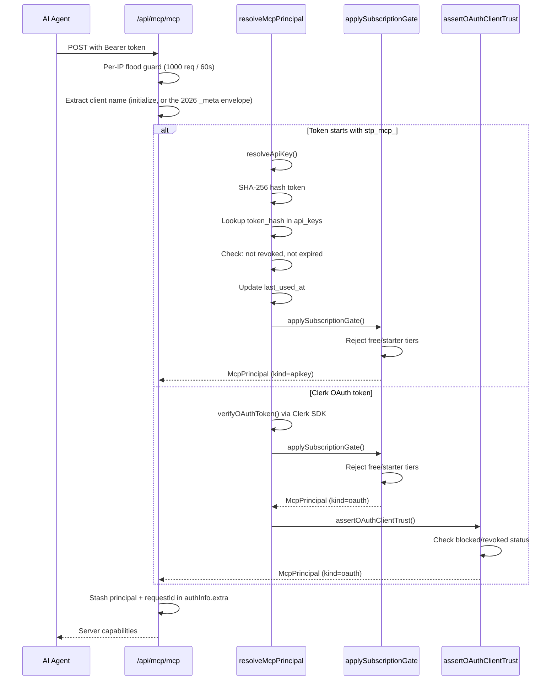

# MCP Server

Sharetopus exposes an MCP server that lets AI agents (Claude Desktop, Cursor, ChatGPT) schedule posts, manage content, and query analytics on behalf of authenticated subscribers.

One URL, stateless:

- **Streamable HTTP:** `https://sharetopus.com/api/mcp/mcp`

Built with mcp-handler 2.2.0 and @modelcontextprotocol/server 2.1.0. The same handler serves the 2026-07-28 protocol revision natively and 2025-era clients through the SDK's stateless fallback, so clients on either era use the same URL. The legacy HTTP+SSE transport no longer exists: `/api/mcp/sse` answers 404.

> **Plan requirement:** MCP access requires the Creator plan or higher. All 10 tools require Creator tier minimum. Starter and free users have no MCP access.

[Back to README](../README.md)

---

## Table of contents

- [Authentication](#authentication)
- [Connecting from AI clients](#connecting-from-ai-clients)
- [withMcpTool higher-order function](#withmcptool-higher-order-function)
- [Server instructions](#server-instructions)
- [Tool inventory](#tool-inventory)
- [Tool details](#tool-details)
- [Tool annotations](#tool-annotations)
- [Prompts](#prompts)
- [Usage examples](#usage-examples)
- [MCP request lifecycle](#mcp-request-lifecycle)
- [Idempotency](#idempotency)
- [Audit logging](#audit-logging)
- [OAuth client management](#oauth-client-management)
- [Known limitations](#known-limitations)
- [Source files referenced](#source-files-referenced)

---

## Authentication

Two auth paths, both resolving to a `McpPrincipal` (kind: `apikey` or `oauth`) with a cached subscription tier.


```mermaid
sequenceDiagram
    participant Agent as AI Agent
    participant Route as /api/mcp/mcp
    participant Auth as resolveMcpPrincipal
    participant Gate as applySubscriptionGate
    participant Trust as assertOAuthClientTrust

    Agent->>Route: POST with Bearer token
    Route->>Route: Per-IP flood guard (1000 req / 60s)
    Route->>Route: Extract client name (initialize, or the 2026 _meta envelope)

    alt Token starts with stp_mcp_
        Auth->>Auth: resolveApiKey()
        Auth->>Auth: SHA-256 hash token
        Auth->>Auth: Lookup token_hash in api_keys
        Auth->>Auth: Check: not revoked, not expired
        Auth->>Auth: Update last_used_at
        Auth->>Gate: applySubscriptionGate()
        Gate->>Gate: Reject free/starter tiers
        Gate-->>Route: McpPrincipal (kind=apikey)
    else Clerk OAuth token
        Auth->>Auth: verifyOAuthToken() via Clerk SDK
        Auth->>Gate: applySubscriptionGate()
        Gate->>Gate: Reject free/starter tiers
        Gate-->>Auth: McpPrincipal (kind=oauth)
        Auth->>Trust: assertOAuthClientTrust()
        Trust->>Trust: Check blocked/revoked status
        Trust-->>Route: McpPrincipal (kind=oauth)
    end

    Route->>Route: Stash principal + requestId in authInfo.extra
    Route-->>Agent: Server capabilities
```

The subscription gate runs before the OAuth trust check. This means non-paying users never leave a row in `mcp_oauth_clients`.

### Rate limits

Two limits, both in `src/lib/mcp/rateLimits.ts` (the public docs read the same constants):

- **1000 requests per 60 seconds per IP** (SHA-256 hashed, raw IP never stored), checked before any token handling, so token-probing attackers cannot bypass it. Hosted clients (Claude, ChatGPT) send every user's calls from a shared pool of egress IPs, so this is a flood guard, not a per-user budget. Over it the route answers 429 with `Retry-After` (503 when the limiter is down), never 401: a 401 tells an OAuth client its token is dead and starts a re-login.
- **100 tool calls per 60 seconds per principal**, across all tools, enforced in `withMcpTool` (see below).
- When a database read fails while checking the token (key lookup, subscription read, OAuth client lookup), the route answers 503 with `Retry-After: 30`, not 401, for the same reason. See [AUTH.md](./AUTH.md#fail-closed-design).
- `MAX_CLIENT_INFO_BODY_BYTES`: 16 KB (bodies larger than this skip client name extraction)

### Generating an API key

1. Open the Sharetopus web app. Navigate to Settings or Integrations.
2. Click "Create MCP API Key" and give it a name.
3. Copy the key (shown once, format: `stp_mcp_xxxxxxxxxxxxxxxxxxxxxxxxxxxxxxxxxxxx`).
4. Store it in your MCP client config as a Bearer token.

Limits: 10 active MCP keys per user. Keys can be revoked from the UI. Requires Creator plan or higher.

---

## Connecting from AI clients

`/docs/mcp`, `/docs/mcp.md`, and the integrations card render these steps from `src/lib/docs/mcpCatalog.ts`. Change them there and here together.

### Claude (web and desktop)

Open **Customize > Connectors > Add custom connector**, paste `https://sharetopus.com/api/mcp/mcp`, and click **Add**. Then click **Connect** and sign in to Sharetopus. Claude's default OAuth client option, **Use Claude's published identity**, works because Clerk publishes client ID metadata documents. Dynamic client registration is turned off, so the **Register automatically** option does not work.

On Team and Enterprise plans an owner adds the connector under **Organization settings > Connectors**, and members click **Connect** under **Customize > Connectors**.

Claude picks the transport from the URL, and a URL ending in `/sse` selects the old SSE transport, which this server does not serve. Source: [Claude custom connectors](https://claude.com/docs/connectors/custom/remote-mcp).

### Claude Code

```bash
claude mcp add --transport http sharetopus https://sharetopus.com/api/mcp/mcp
```

Then run `/mcp` and choose **Authenticate**. With an API key instead:

```bash
claude mcp add --transport http sharetopus https://sharetopus.com/api/mcp/mcp \
  --header "Authorization: Bearer stp_mcp_YOUR_KEY"
```

### Cursor

Add to `~/.cursor/mcp.json`:

```json
{
  "mcpServers": {
    "sharetopus": {
      "url": "https://sharetopus.com/api/mcp/mcp",
      "headers": {
        "Authorization": "Bearer stp_mcp_YOUR_KEY"
      }
    }
  }
}
```

### Other clients (RFC 9728 auto-discovery)

For clients that support OAuth discovery and sign in with a client ID metadata document, only the URL is needed. A client that only supports dynamic client registration cannot sign in with OAuth; give it an API key instead.

```json
{
  "mcpServers": {
    "sharetopus": {
      "url": "https://sharetopus.com/api/mcp/mcp"
    }
  }
}
```

The server publishes an RFC 9728 OAuth Protected Resource metadata endpoint at `/.well-known/oauth-protected-resource` for automatic discovery.

---

## withMcpTool higher-order function

Every tool handler is wrapped by `withMcpTool`, a higher-order function that centralizes context extraction, entitlement gating, and audit logging. Tool authors write only business logic. The wrapper handles everything else.

**Execution steps:**

1. **Extract per-request context** (principal, requestId, ipHash, userAgent, startedAt)
2. **Compute audit args** via `auditArgsBuilder` if provided, otherwise fall back to `rawArgsAsAuditPayload` (coerces empty objects to null)
3. **Apply the per-user budget** (`MCP_TOOL_CALL_RATE_LIMIT`: 100 tool calls per 60 seconds per principal). Over budget: emit a `rate_limited` audit row and return a tool error with the retry delay, which the model can wait on. A limiter outage fails open, since the monthly quota still bounds usage.
4. **Run entitlement gate** (tier check via `ACTION_PLAN_GATE`, then monthly quota via `MONTHLY_CAPS`)
5. **On deny:** emit audit row with status `denied` or `quota_exceeded`, return error to agent
6. **On allow:** call the inner handler
7. **On success or handler-returned isError:** emit audit row. Handler may override the result status via `auditStatus` (e.g., `rate_limited`) and the args via `auditArgs`
8. **On thrown error:** emit an `error` audit row with the default audit args, then re-throw so the SDK surfaces a JSON-RPC error

### McpToolContext

The context object passed to every handler:

| Field | Type | Description |
|-------|------|-------------|
| `principal` | `McpPrincipal` | Authenticated user with kind, principalId, scopes, plan |
| `requestId` | `string \| null` | Per-request correlation ID for cross-layer log tracing, also stored as `mcp_audit_log.session_id` |
| `ipHash` | `string \| null` | SHA-256 of client IP + salt |
| `userAgent` | `string \| null` | Truncated to 512 chars |
| `startedAt` | `number` | `Date.now()` at context build time, used for latency computation |

### McpHandlerResult

The return type from every handler. Build it with `jsonResult(value)` or `errorResult(message)` from `withMcpTool.ts`.

| Field | Type | Description |
|-------|------|-------------|
| `content` | `Array<{ type: "text"; text: string }>` | MCP SDK content envelope; `jsonResult` puts the compact JSON here |
| `structuredContent` | `Record?` | The same object, checked by the SDK against the tool's `outputSchema`; dropped on errors |
| `isError` | `boolean?` | Signals an error response to the agent |
| `auditStatus` | `string?` | Override the audit log status (default: `ok` if no error, `error` if isError) |
| `auditArgs` | `Record \| null?` | Override the args stored in the audit log |

### Usage pattern

```typescript
server.registerTool(
  "publish_posts",
  { title, description, inputSchema, outputSchema, annotations },
  withMcpTool(
    "publish_posts",
    async (ctx, args) => {
      // Business logic only. Entitlement, audit, context are handled.
      return jsonResult(output);
    },
    // Keeps large payloads out of the audit log.
    { auditArgsBuilder: (args) => ({ count: args.posts.length }) },
  ),
);
```

---

## Server instructions

The server sends `MCP_SERVER_INSTRUCTIONS` (`src/lib/mcp/serverInstructions.ts`) in its initialize result, so every client learns the posting flow before its first call. `/docs/mcp.md` prints the same text. A text post takes two calls:

1. `list_connections`: take the account id.
2. `publish_posts`: one entry per account; `scheduled_at` schedules it, no `scheduled_at` publishes it now.

`list_posts` with the returned `batch_id` then shows what happened to each post.

---

## Tool inventory

10 tools, all requiring Creator+ minimum. Quota enforcement is atomic (Postgres RPC `atomic_increment_quota`) and counts calls, not posts. Every tool declares an `outputSchema` and returns `structuredContent` next to the JSON text. All tools carry [Connectors Directory annotations](#tool-annotations).

Monthly quota format below: Creator cap / Pro cap.

| Tool | Group | Monthly Quota | Rate Limit | Description |
|------|-------|---------------|------------|-------------|
| `list_connections` | Read | - | - | Connected accounts with id, platform and status (`ok` or `needs_reconnect`), plus `reconnect_url` |
| `list_pinterest_boards` | Read | - | - | Boards of a Pinterest account (bookmark pagination) |
| `list_posts` | Read | - | - | Posts by status, or every post of one `publish_posts` batch |
| `list_billing_summary` | Read | - | - | Plan, status, and this month's calls of each capped tool against its limit |
| `get_account_analytics` | Read | - | - | Daily views, likes, comments, shares, subscribers |
| `attach_media_from_url` | Media | 500 / unlimited | 10/60s | Copy a public image or video into storage. SSRF-guarded. |
| `request_upload_url` | Media | 500 / unlimited | 20/60s | Signed URL to upload a local file |
| `publish_posts` | Posting | 500 / unlimited | - | Publish now or schedule 1 to 30 posts |
| `update_scheduled_posts` | Posting | - | - | Cancel, resume or reschedule 1 to 50 posts |
| `delete_scheduled_posts` | Posting | - | - | Permanently delete 1 to 50 posts and media nothing else uses |

Every tool call also counts against the per-user budget of 100 calls per 60 seconds.

---

## Tool details

### Platforms and options

`publish_posts`, the `list_posts` and `get_account_analytics` filters, and the prompts work with every platform `POST /v1/posts` accepts: `SCHEDULABLE_PLATFORMS` in `src/lib/platforms/capabilities.ts`. That is the 7 dedicated platforms (linkedin, tiktok, pinterest, instagram, youtube, x, facebook) plus the 21 registry providers (bluesky, mastodon, telegram, discord, slack, devto, wordpress, reddit, threads, tumblr, twitch, kick, hashnode, medium, lemmy, farcaster, listmonk, nostr, linkedin_page, dribbble, gmb). Analytics rows exist only for the 7 dedicated platforms.

A post never names its platform: `publish_posts` reads it from the account, so a post cannot target the wrong platform.

Registry options, shared with the REST post body (`src/lib/platforms/postTargetOptions.ts`):

| Field | Platform | Required |
|---|---|---|
| `subreddit` | reddit | yes |
| `flair_id` | reddit | no |
| `community_id` | lemmy | yes |
| `publication_id` | hashnode | no, defaults to the first publication |
| `blog` | tumblr | no, defaults to the blog stored at connect |
| `location_name` | gmb, shaped `locations/<id>` | yes |
| `organization_id` | linkedin_page | no, defaults to the connected organization |
| `canonical_url` | devto | no |
| `tags` | devto, at most 4 | no |

Before anything is scheduled or dispatched, `publish_posts` rejects a post whose account is unknown, a post type the platform does not take (catalog `supportedMediaTypes`), a missing `title` on reddit, lemmy, devto, hashnode, medium, wordpress and dribbble (catalog `titleRequired`), a missing required option above, and a Pinterest post without `pinterest_board_id`. A rejected post lands in `rejected` with its reason; the other posts of the call still go out.

TikTok posts made through MCP are always public (`PUBLIC_TO_EVERYONE`, `src/lib/platforms/tikTokPrivacy.ts`); there is no privacy argument.

---

### list_connections

List every connected account. Tokens are never returned.

**Parameters:**
```
response_format  "concise" | "detailed"  optional  default: "concise"
  detailed adds follower_count and avatar_url
```

**Returns:** `{ accounts: [{ id, platform, name, username, status }], reconnect_url }`. `status` is `ok` or `needs_reconnect`; an account in `needs_reconnect` cannot publish until the user reconnects it at `reconnect_url`.

---

### list_pinterest_boards

List the boards of a Pinterest account. A Pinterest post needs one board id as `pinterest_board_id`.

**Parameters:**
```
social_account_id  string (UUID)  required
  A Pinterest account id from list_connections
page_size          number (1-100)  optional  default: 25
bookmark           string  optional
  Cursor from the previous page
```

**Returns:** `{ boards: [{ id, name, description, privacy, pin_count }], bookmark }`. An expired Pinterest token returns a tool error that points at the reconnect URL.

---

### list_posts

List posts by status, or every post of one `publish_posts` batch, with the account name on each row.

**Parameters:**
```
status             "upcoming" | "published" | "failed" | "cancelled"  optional  default: "upcoming"
  upcoming = scheduled, queued or processing, oldest first; the others newest first
batch_id           string  optional
  Overrides status: every post of that batch, publish-now jobs included
social_account_id  string (UUID)  optional
platform           string  optional  (e.g. linkedin)
from, to           string (ISO 8601 with a zone)  optional
  Time bounds (scheduled time for upcoming and cancelled, creation time otherwise)
limit              number (1-100)  optional  default: 20
offset             number (>= 0)  optional  default: 0
response_format    "concise" | "detailed"  optional  default: "concise"
  detailed adds the full text, title, social_account_id, content_id and media_url
```

**Returns:** `{ posts: [{ id, status, platform, account, time, text, media_type, batch_id, error? }], has_more, next_offset }`. Concise rows cut `text` at 140 characters. In a batch, a publish-now post shows `publishing`, `published` or `failed` with the failure reason in `error`.

Sources: `scheduled_posts` (upcoming, cancelled), `content_history` (published), `failed_posts` (failed), and `pending_direct_posts` for the publish-now jobs of a batch.

---

### list_billing_summary

The plan and this month's usage. No parameters.

**Returns:** `{ plan, status, current_period_end, period, usage: [{ tool, used, limit }] }`. `period` is `YYYY-MM`; a `null` limit means unlimited.

---

### get_account_analytics

Stored daily metrics for the user's content, newest first. Data can be up to 24 hours old.

**Parameters:**
```
platform    string  optional  (e.g. youtube)
content_id  string  optional
  From list_posts (status published, response_format detailed)
days        number (1-90)  optional  default: 30
limit       number (1-100)  optional  default: 20
```

**Returns:** `{ metrics: [{ date, platform, content_id, views, likes, comments, shares, subscribers }] }`.

---

### attach_media_from_url

Copy an image or video from a public URL into Sharetopus storage. The download is SSRF-guarded via `safeUserFetch` (see [docs/SECURITY.md](./SECURITY.md#ssrf-guard)).

**Parameters:**
```
url  string (http or https URL)  required
```

**Size limits:** 8 MB (image), 250 MB (video). Enforced by a stream-based byte counter (the Content-Length header is not trusted).

**Rate limit:** 10 requests per 60 seconds per principal. If the limiter is down, the call fails with a retry message, audited as `error`, not `rate_limited`.

**Monthly quota:** Creator 500/mo, Pro unlimited.

**Allowed MIME types:** image/jpeg, image/png, image/gif, image/webp, video/mp4, video/quicktime, video/webm.

**SSRF protections:** Blocks loopback, link-local, RFC 1918, CGNAT, IPv6 ULA, IPv4-mapped IPv6, multicast, reserved ranges. Rejects non-http(s) schemes and 3xx redirects. DNS resolution validated before connect.

**Returns:** `{ storage_path, content_type, size_bytes }`. Pass `storage_path` as `media_storage_path`; one path can serve several posts.

---

### request_upload_url

A signed URL to upload a local file. PUT the bytes to `upload_url` with the file's Content-Type. The URL is valid for 2 hours (7200 seconds).

**Parameters:**
```
filename      string (min 1 char)  required
  With extension (e.g. photo.jpg, clip.mp4)
content_type  string (min 1 char)  required
  image/jpeg, image/png, video/mp4, video/mov, video/quicktime
size_bytes    number (positive integer)  required
```

**Rate limit:** 20 requests per 60 seconds. If the limiter is down, the call fails with a retry message, audited as `error`, not `rate_limited`.

**Monthly quota:** Creator 500/mo, Pro unlimited.

**Returns:** `{ upload_url, storage_path, token, expires_in_seconds }`.

---

### publish_posts

Publish or schedule 1 to 30 posts in one call. A post with `scheduled_at` is scheduled (`schedulePostBatch`); one without it is published now (`directPostBatch`, one Inngest `post.now` event per post). To cross-post, add one entry per account with the same `media_storage_path`.

**Parameters:**
```
posts  Array (1-30 items)  required
  Each item:
    social_account_id   string (UUID)  required
      From list_connections; the platform follows from the account
    post_type           "text" | "image" | "video"  required
    description         string | null  required
      Caption or body text. Required for text posts.
    title               string  optional
      Required on reddit, lemmy, devto, hashnode, medium, wordpress and dribbble
    media_storage_path  string  optional  default: ""
      Required for image and video
    scheduled_at        string (ISO 8601 with a zone)  optional
      Future time to schedule the post; omit to publish now
    cover_timestamp     number (>= 1000)  optional
      TikTok video cover frame in ms
    pinterest_board_id  string  optional
      Required for Pinterest; from list_pinterest_boards
    pinterest_link      string (URL, max 2048)  optional
    subreddit, flair_id, community_id, publication_id, blog,
    location_name, organization_id, canonical_url, tags  optional
      Registry options (see Platforms and options)

batch_id  string (1-200 chars)  optional
  Groups the posts. When supplied, post N gets idempotency_key
  "${batch_id}:${N}", so a retry with the same batch_id creates nothing twice.
```

**Monthly quota:** Creator 500 calls/mo, Pro unlimited. The batch cores also apply the per-platform daily limits.

**Returns:** `{ batch_id, publishing_now, scheduled, duplicates, rejected: [{ social_account_id, reason }], event_ids, schedule_ids, message }`. The call is a tool error only when nothing was published, scheduled or found as a duplicate; the error text lists every reason.

---

### update_scheduled_posts

Change 1 to 50 scheduled posts. Every change can be undone.

**Parameters:**
```
post_ids      string[] (UUIDs, 1-50 items)  required
action        "cancel" | "resume" | "reschedule"  required
  cancel: stops posts in status scheduled
  resume: brings cancelled posts back; a past time moves to 1 hour from now
  reschedule: sets a new time and resumes cancelled posts
scheduled_at  string (ISO 8601 with a zone)  required for reschedule
  Must be in the future
```

**Returns:** `{ action, updated, skipped, message }`. Ids that are not the caller's posts are named in the error message.

---

### delete_scheduled_posts

Permanently delete 1 to 50 scheduled posts. Cannot be undone; to stop a post and keep it, use `update_scheduled_posts` with `action: "cancel"`. Media files no other post uses are removed from Supabase Storage.

**Parameters:**
```
post_ids  string[] (UUIDs, 1-50 items)  required
```

**Returns:** `{ deleted, skipped, message }`.

---

## Tool annotations

Every tool carries MCP Connectors Directory annotations via `registerTool`.

| Tool | readOnlyHint | destructiveHint | idempotentHint | openWorldHint |
|------|:---:|:---:|:---:|:---:|
| list_connections | true | - | - | false |
| list_pinterest_boards | true | - | - | true |
| list_posts | true | - | - | false |
| list_billing_summary | true | - | - | false |
| get_account_analytics | true | - | - | false |
| attach_media_from_url | false | false | false | true |
| request_upload_url | false | false | false | false |
| publish_posts | false | false | false | true |
| update_scheduled_posts | false | false | true | false |
| delete_scheduled_posts | false | true | true | false |

`publish_posts` is not destructive (it creates and never overwrites) and not idempotent unless the caller reuses a `batch_id`.

---

## Prompts

3 reusable message templates that guide agent workflows.

| Prompt | Parameters | Purpose |
|--------|-----------|---------|
| `plan_week_for_platform` | platform, theme | Plan 5-7 posts around a theme for a specific platform |
| `repurpose_post` | post_id, target_platforms (comma-separated) | Fetch a post and adapt it for multiple platforms |
| `audit_calendar` | (none) | Audit the next 14 days of scheduled posts for gaps and imbalances |

---

## Usage examples

### Example 1: Post a photo to Pinterest and LinkedIn tomorrow

User prompt to agent: "Post this photo to Pinterest and LinkedIn tomorrow at 10am: https://example.com/photo.jpg"

Tool call sequence:
1. `list_connections()` for the two account ids
2. `list_pinterest_boards(social_account_id: "<pinterest id>")` for a board id
3. `attach_media_from_url(url: "https://example.com/photo.jpg")` returns `storage_path`
4. `publish_posts(posts: [{ social_account_id: "<pinterest id>", post_type: "image", description: "...", media_storage_path: "<storage_path>", pinterest_board_id: "<board id>", scheduled_at: "2026-10-08T10:00:00-04:00" }, { social_account_id: "<linkedin id>", post_type: "image", description: "...", media_storage_path: "<storage_path>", scheduled_at: "2026-10-08T10:00:00-04:00" }])`

### Example 2: Publish a text post now and confirm it

User prompt: "Post 'We ship on Friday' to Bluesky now"

Tool call sequence:
1. `list_connections()`
2. `publish_posts(posts: [{ social_account_id: "<bluesky id>", post_type: "text", description: "We ship on Friday" }])` returns `batch_id`
3. `list_posts(batch_id: "<batch_id>")` about a minute later shows `published`, or `failed` with the reason

### Example 3: Move all Friday posts to Monday

User prompt: "Move everything scheduled for this Friday to next Monday at 9am"

Tool call sequence:
1. `list_posts(status: "upcoming", from: "2026-10-09T00:00:00-04:00", to: "2026-10-09T23:59:59-04:00")`
2. `update_scheduled_posts(post_ids: ["id1", "id2", "id3"], action: "reschedule", scheduled_at: "2026-10-12T09:00:00-04:00")`

### Example 4: Plan a week of LinkedIn content

User prompt: "Help me plan a week of LinkedIn posts about developer productivity"

1. The agent invokes the `plan_week_for_platform` prompt with `platform: "linkedin"`, `theme: "developer productivity"`
2. The agent drafts 5 to 7 posts and asks the user to approve them
3. One `publish_posts` call schedules the approved posts, each with its `scheduled_at`

---

## MCP request lifecycle

```mermaid
sequenceDiagram
    participant A as Agent
    participant R as /api/mcp/mcp
    participant Auth as resolveMcpPrincipal
    participant HOF as withMcpTool
    participant Ent as entitlementFor
    participant Tool as Tool handler
    participant DB as Supabase
    participant Audit as logToolCall

    A->>R: POST initialize {clientInfo} (2025-era; 2026 clients skip it)
    R->>R: Per-IP flood guard (1000/60s)
    R->>R: Extract clientName from body
    R->>Auth: Resolve principal (API key or OAuth)
    Auth-->>R: McpPrincipal
    R->>R: Generate requestId (UUID)
    R-->>A: Server capabilities

    A->>R: POST tools/call {name, arguments}
    R->>Auth: Resolve principal
    Auth-->>R: McpPrincipal
    R->>HOF: withMcpTool(toolName, handler)
    HOF->>HOF: buildContext (principal, requestId, ip, ua)
    HOF->>HOF: Compute defaultAuditArgs (auditArgsBuilder or rawArgsAsAuditPayload)
    HOF->>HOF: Per-user budget (100 tool calls / 60s), over it: rate_limited tool error
    HOF->>Ent: entitlementFor(principal, toolName)
    Ent->>Ent: checkTierGate (ACTION_PLAN_GATE)
    Ent->>Ent: checkAndIncrementQuota (atomic_increment_quota RPC)

    alt deny (no_subscription / plan_too_low / monthly_quota)
        Ent-->>HOF: deny
        HOF->>Audit: emitAudit(denied | quota_exceeded)
        HOF-->>A: Error with deny reason
    else allow
        Ent-->>HOF: allow
        HOF->>Tool: handler(ctx, args)
        Tool->>Tool: Rate limit check (if applicable)
        Tool->>Tool: Idempotency pre-check (if key provided)
        Tool->>DB: Query / mutate
        DB-->>Tool: Result
        Tool-->>HOF: McpHandlerResult
        HOF->>Audit: emitAudit(ok | error | rate_limited)
        HOF-->>A: JSON result
    end

    Note over Audit,DB: Audit INSERT awaited (compliance)
```

---

## Idempotency

`publish_posts` is safe to retry when the caller passes a `batch_id`: post N of the call gets `idempotency_key = "${batch_id}:${N}"`.

| Post | Table | DB constraint |
|------|-------|---------------|
| With `scheduled_at` | `scheduled_posts` | UNIQUE on `(principal_id, idempotency_key)` |
| Without `scheduled_at` | `pending_direct_posts` | UNIQUE on `(principal_id, idempotency_key)` |

A key that already exists is counted in `duplicates` instead of being inserted or dispatched again. Without a `batch_id` the server generates one and sets no keys, so a blind retry posts twice. See [docs/SECURITY.md](./SECURITY.md#idempotency) for the full sequence diagram.

---

## Audit logging

### mcp_audit_log

Every tool call is logged to `mcp_audit_log` with these fields:

| Field | Description |
|-------|-------------|
| `principal_id` | User who made the call |
| `api_key_id` / `oauth_client_id` | Which credential was used |
| `session_id` | Synthetic per-request UUID (the transport is stateless) |
| `tool_name` | Name of the tool invoked |
| `args_redacted` | Tool arguments with sensitive keys replaced |
| `result_status` | `ok`, `error`, `denied`, `rate_limited`, or `quota_exceeded` |
| `latency_ms` | Wall-clock time from context build to audit emit |
| `ip_hash` | SHA-256 of IP + salt (raw IP never stored) |
| `user_agent` | Client User-Agent header |

The table has an update-blocking trigger. Rows are append-only.

### Argument redaction

Before persisting, args pass through `redactSecrets()`:

- **12 key patterns** matched case-insensitively: token, password, secret, authorization, bearer, api_key, apikey, access_token, refresh_token, credential, private_key, jwt
- **JWT detector:** any value matching three base64url segments separated by dots is replaced with `[REDACTED_JWT]`
- **Truncation:** args are capped at 4,096 characters. Oversized payloads are replaced with `{ _truncated: true, _preview: "..." }`

No table tracks sessions: the transport is stateless, so `session_id` is the per-request ID. The `mcp_sessions` table, which held one row per tool call as a copy of this log, was dropped on 2026-09-23.

### clientInfo sanitization

`sanitizeClientField()` strips control characters (0x00-0x1f) and HTML injection characters (`< > ' " &`) from `clientName` before it is stored in `mcp_oauth_clients`. This prevents stored-XSS in the admin dashboard.

---

## OAuth client management

OAuth clients (Claude Desktop, Cursor, etc.) are tracked in `mcp_oauth_clients`. Population is lazy: the first time a client_id authenticates via Clerk, Sharetopus inserts a row with the auto-verify rule applied.

**Table columns:** client_id, client_name, redirect_uris, trust_level (unverified | verified | blocked), revoked_at, registered_by_user_id.

Manual promote:
```sql
UPDATE mcp_oauth_clients
SET trust_level = 'verified'
WHERE client_id = 'claude_desktop_xxx';
```

Block:
```sql
UPDATE mcp_oauth_clients
SET trust_level = 'blocked'
WHERE client_id = 'malicious_client_xxx';
```

Revoke (more permanent than blocking):
```sql
UPDATE mcp_oauth_clients
SET revoked_at = now()
WHERE client_id = 'leaked_client_xxx';
```

The auth resolver refuses both `blocked` trust level and `revoked_at IS NOT NULL`. Blocked/revoked results are cached so repeated probes do not hit the database.

---

## Known limitations

- **Stateless only.** Neither protocol era keeps sessions, and no `subscriptions/listen` streams are served (`maxSubscriptions: 0`, `listChanged: false`: tools and prompts never change at runtime, and on Vercel each stream would hold a function open). Session IDs in the audit log are per-request UUIDs.
- **TikTok posts are async.** After `publish_posts` for TikTok, the content appears in `content_history` but TikTok may still be processing. The `tiktok-publish-status-poll` Inngest function and webhook receiver poll for completion.
- **REST equivalent.** `POST /api/v1/posts/bulk` schedules up to 30 posts through the same `schedulePostBatch`. See [docs/REST.md](./REST.md).
- **Analytics data staleness.** `get_account_analytics` reads from `analytics_metrics`, which is not currently populated by any cron. The table exists but data depends on future implementation.
- **Zod 4 only.** The v2 SDK converts tool schemas to JSON Schema with Zod 4.2 or later. Tool ids use `z.guid()`, as in the REST API, because Zod 4's strict UUID check rejects some Supabase-generated ids.

---

**See also:** [docs/SECURITY.md](./SECURITY.md) (SSRF guard, idempotency, storage quotas), [docs/AUTH.md](./AUTH.md) (principal model, auth paths), [docs/BILLING.md](./BILLING.md) (plan gates, monthly caps)

[Back to README](../README.md)

---

## Source files referenced

| File | Description |
|------|-------------|
| `src/app/api/mcp/mcp/route.ts` | MCP route handler, per-IP flood guard, client name extraction |
| `src/lib/mcp/rateLimits.ts` | The two MCP rate limits, shared by enforcement and docs |
| `src/lib/mcp/auth/resolve.ts` | `resolveMcpPrincipal()`, token dispatch to API key or OAuth path |
| `src/lib/mcp/auth/resolvers/apiKey.ts` | API key resolution and validation |
| `src/lib/mcp/auth/resolvers/oauth.ts` | Clerk OAuth token verification |
| `src/lib/mcp/auth/resolvers/applySubscriptionGate.ts` | Subscription tier gate (blocks free/starter) |
| `src/lib/mcp/auth/oauthClientTrust.ts` | `checkOAuthClientTrust()`, lazy population, block/revoke logic |
| `src/lib/mcp/withMcpTool.ts` | `withMcpTool()` HOF, context extraction, per-user budget, entitlement gate, audit emit |
| `src/lib/mcp/entitlement.ts` | `entitlementFor()`, `ACTION_PLAN_GATE`, `MONTHLY_CAPS`, atomic quota RPC |
| `src/lib/mcp/audit.ts` | `logToolCall()`, argument redaction |
| `src/lib/mcp/context.ts` | Context extractors (principal, requestId) |
| `src/lib/mcp/toolNames.ts` | `MCP_TOOL_NAMES` array and `McpToolName` type |
| `src/lib/mcp/tools/index.ts` | Tool registration orchestrator |
| `src/lib/mcp/serverInstructions.ts` | `MCP_SERVER_INSTRUCTIONS`, sent at initialize |
| `src/lib/mcp/prompts/index.ts` | Prompt registration |
| `src/lib/platforms/postTargetOptions.ts` | Registry option fields, their post_options mapping, and the per-platform target checks shared with the REST post body |
