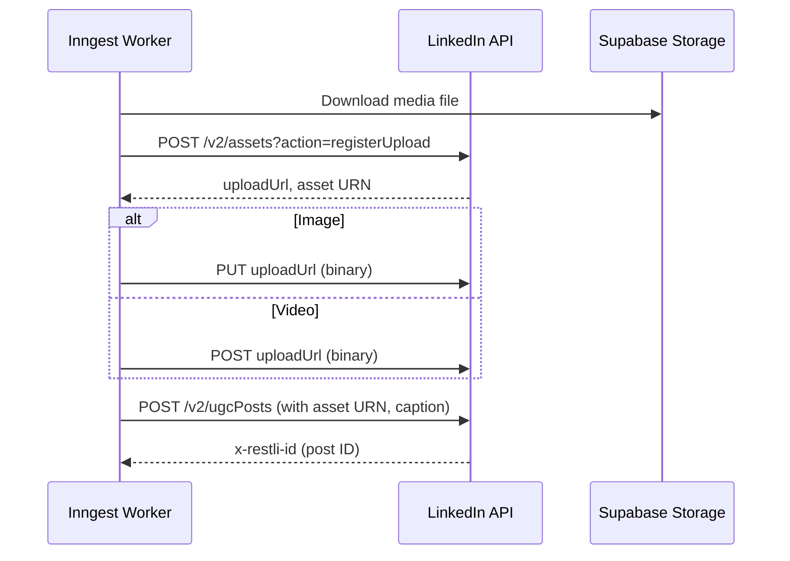
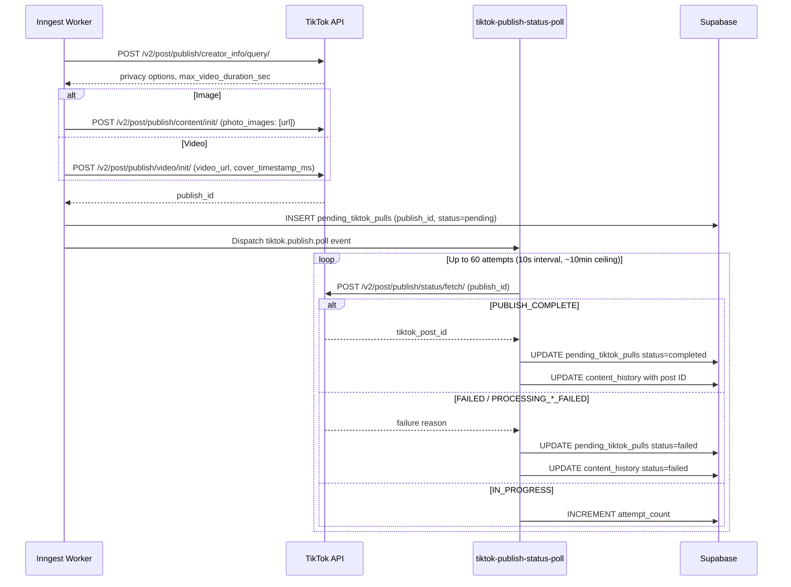
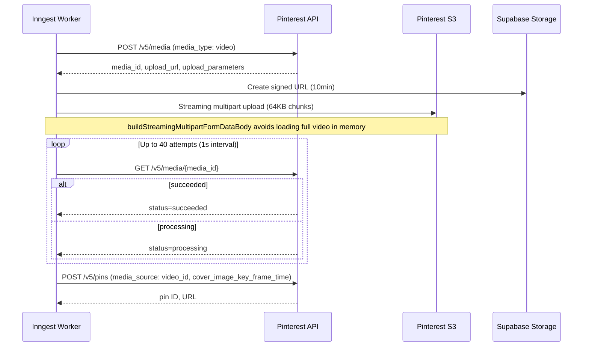
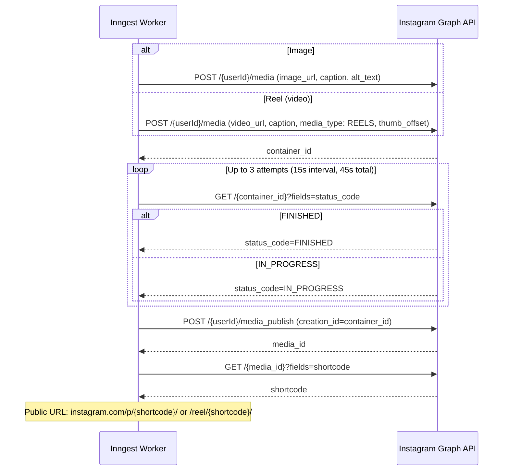

# Platforms

Integration details for each supported social media platform. All 4 platforms share the same OAuth flow structure (initiate with state cookie, exchange code, upsert social_accounts) but differ in token behavior, media upload, and posting model.

[Back to README](../README.md)

## LinkedIn

**API version:** v2 (UGC Posts API)
**OAuth scopes:** `openid`, `profile`, `email`, `w_member_social`
**Token refresh:** Yes, via refresh_token grant. Tokens expire in ~60 minutes.
**Media types:** text, image, video, article (link)

### Posting flow



Text-only posts skip the media registration and go directly to the ugcPosts call.

**Member URN format:** `urn:li:person:{account_identifier}`

**Rate limiting:** 25 posts/minute per account (enforced in application code).

**Token refresh location:** `src/lib/api/linkedin/data/refreshLinkedinToken.ts`

---

## TikTok

**API version:** v2
**OAuth scopes:** `user.info.basic`, `user.info.profile`, `video.publish`, `video.upload`, `user.info.stats`
**Token refresh:** Yes, via refresh_token grant
**Media types:** image, video (no text-only posts)
**Dev/prod credentials:** Separate `TIKTOK_CLIENT_KEY_DEV`/`TIKTOK_CLIENT_SECRET_DEV` for development

### Posting flow (async pull model)

TikTok does not accept direct file uploads. Instead, the server provides a public URL and TikTok pulls the media asynchronously. This means posting is a multi-step process with polling.



### Key quirks

- **Cover timestamp:** Video posts require `video_cover_timestamp_ms` (milliseconds, minimum 1000). Values below 1000 are clamped.
- **Default privacy:** `SELF_ONLY` (private). Users must explicitly select a public privacy level in the create form.
- **Scope validation:** Profile fetch checks for `scope_not_authorized` errors and falls back to a minimal profile if advanced scopes are missing.
- **Consecutive error threshold:** The poll loop fails after 5 consecutive token or polling errors.
- **Media URL:** Uses either HMAC-signed proxy URLs or direct Supabase URLs depending on `TIKTOK_MEDIA_SOURCE` env var (`proxy` or `supabase_direct`).

---

## Pinterest

**API version:** v5
**OAuth scopes:** `boards:read`, `boards:write`, `pins:read`, `pins:write`, `user_accounts:read`, `catalogs:read`, `catalogs:write`
**Token refresh:** Yes, via refresh_token grant. Tokens last ~30 days.
**Token exchange auth:** Basic Auth header with base64(client_id:client_secret)
**Media types:** image, video (no text-only posts)

### Image posting

Simple: provide the image URL directly to Pinterest. No file download needed.

```
POST /v5/pins
  board_id, title, description, media_source: { source_type: "image_url", url }
```

### Video posting (streaming multipart S3 upload)



**Cover timestamp:** Pinterest uses `cover_image_key_frame_time` in seconds (not milliseconds). The code converts from ms to seconds.

**Board listing:** `GET /v5/boards`, rate limited at 15 requests/60 seconds.

**MCP board discovery:** The `list_pinterest_boards` tool lets agents discover board IDs. Parameters: `social_account_id`, `page_size` (1-100), `bookmark` (pagination cursor).

---

## Instagram

**API version:** Graph API v23.0
**OAuth scopes:** `instagram_business_basic`, `instagram_business_content_publish` (new scopes as of Jan 27, 2025)
**Token refresh:** No refresh tokens. Short-lived tokens are upgraded to 60-day long-lived tokens during OAuth exchange. Re-authorization required when the token expires.
**Media types:** image, reel (video), carousel (multi-image, up to 10 items)

### Posting flow (container model)



### Key quirks

- **Long-lived token upgrade:** During OAuth exchange, the short-lived token (1 hour) is automatically upgraded to a 60-day long-lived token via `GET /access_token?grant_type=ig_exchange_token`. If the upgrade fails, the short-lived token is stored as fallback.
- **No refresh tokens.** When the 60-day token expires, the user must re-authorize through the web UI.
- **Alt text:** Supported for images. Derived from the description (first 1000 chars).
- **Video mapped to Reel:** `post_type: "video"` is published as a Reel (media_type: REELS).
- **Media must be publicly accessible.** Instagram fetches media from the provided URL. Supabase signed URLs work for this.
- **Connect button:** Currently commented out in the connections page UI, but the backend OAuth and posting routes are functional.

---

## Future platforms

These platforms appear in type definitions (`social_accounts.platform` enum) but have no backend integration code:

- **Threads** - in type definitions, not implemented
- **YouTube** - in type definitions, not implemented
- **X (Twitter)** - in type definitions, not implemented
- **Facebook** - in type definitions, not implemented

No OAuth flows, posting helpers, or schedule functions exist for any of these. Bluesky is not in the database type definitions.

---

**See also:** [docs/SCHEDULING.md](./SCHEDULING.md) (post lifecycle, retry strategy), [docs/INNGEST.md](./INNGEST.md) (worker details, TikTok poll), [docs/STORAGE.md](./STORAGE.md) (TikTok media delivery modes)

[Back to README](../README.md)
