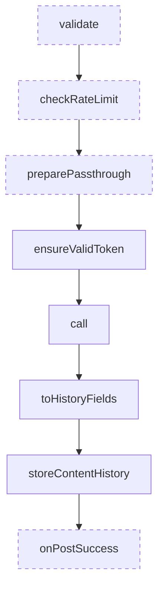
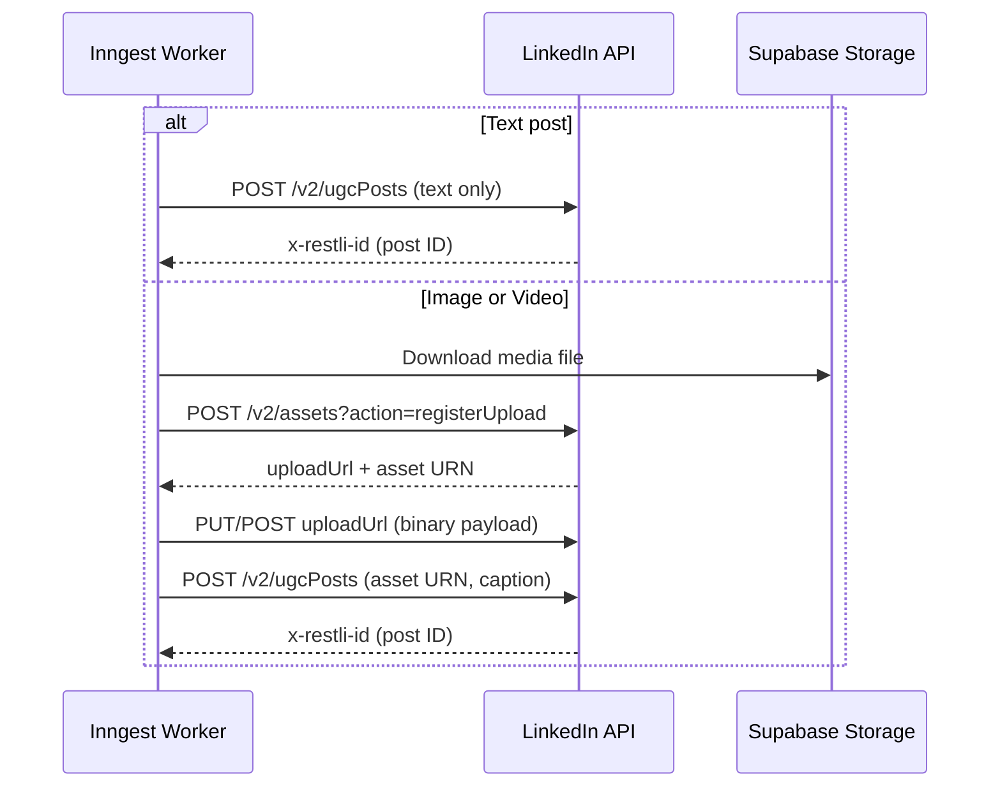
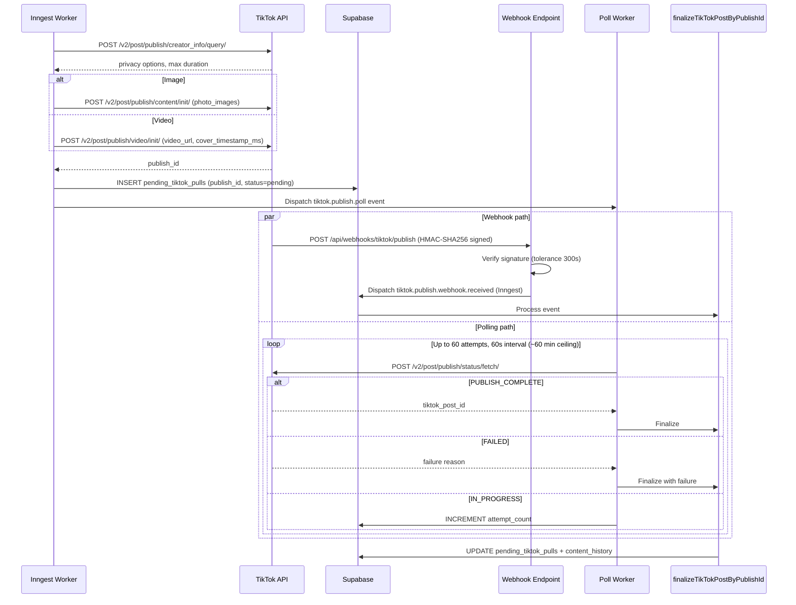
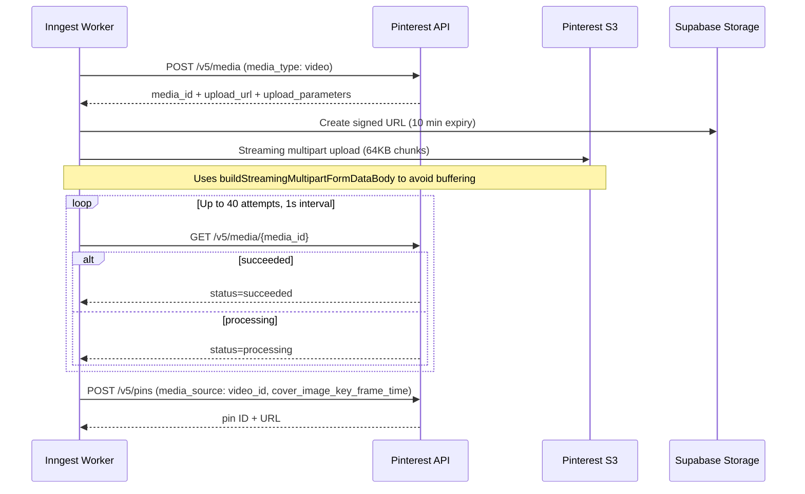
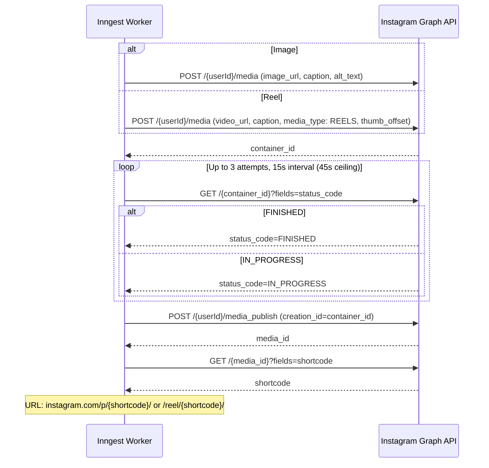

# Platforms

How Sharetopus posts content to LinkedIn, TikTok, Pinterest, and Instagram. All four platforms share a generic adapter pattern but differ in token behavior, media upload mechanics, and post lifecycle.

[Back to README](../README.md)

## Table of Contents

- [Generic Adapter Pattern](#generic-adapter-pattern)
- [Platform Support Matrix](#platform-support-matrix)
- [LinkedIn](#linkedin)
- [TikTok](#tiktok)
- [Pinterest](#pinterest)
- [Instagram](#instagram)
- [Future Platforms](#future-platforms)
- [Adding a New Platform](#adding-a-new-platform)
- [Source Files Referenced](#source-files-referenced)

---

## Generic Adapter Pattern

Every platform implements a thin adapter over `directPostForAccountsGeneric` (268 lines). The generic function handles token validation, history storage, and error handling. Each platform only supplies the platform-specific logic via hooks.

### DirectPostPlatformAdapter Type

```typescript
DirectPostPlatformAdapter<TPassthrough, TPostResult>
```

**Hooks:**

| Hook | Required | Purpose |
|------|----------|---------|
| `validate` | No | Pre-flight checks (e.g., media type support) |
| `checkRateLimit` | No | Platform rate limit enforcement |
| `preparePassthrough` | No | Transform or enrich passthrough data before posting |
| `call` | Yes | Execute the actual API call to the platform |
| `toHistoryFields` | Yes | Map post result to content_history record fields |
| `onPostSuccess` | No | Side effects after successful post (e.g., dispatch poll job) |

### Execution Flow



Dashed boxes are optional hooks. If any step returns a failure, the flow short-circuits and returns the error result.

Also in `_shared/`: `buildStreamingMultipartFormDataBody.ts`, which streams 64KB chunks for Pinterest video upload without buffering the full file in memory.

---

## Platform Support Matrix

| Platform | Text | Image | Video | Scheduled | Direct | OAuth Flow |
|----------|------|-------|-------|-----------|--------|------------|
| LinkedIn | yes | yes | yes | yes | yes | Standard |
| TikTok | no | yes | yes | yes | yes | Standard + dev/prod credential split |
| Pinterest | no | yes | yes | yes | yes | Basic Auth token exchange |
| Instagram | no | yes | reel | yes | yes | Long-lived token upgrade |

---

## LinkedIn

**API:** v2 (UGC Posts API)
**Scopes:** `openid`, `profile`, `email`, `w_member_social`
**Token refresh:** Yes, via refresh_token grant
**Member URN:** `urn:li:person:{account_identifier}`

### Posting Flow



Text-only posts skip media registration entirely and call the ugcPosts endpoint directly.

### Key Details

- Rate limiting: 25 posts/minute per account, enforced in application code.
- Token refresh handled by `refreshLinkedinToken.ts`.
- 5 source files total in the linkedin directory.

---

## TikTok

**API:** v2
**Scopes:** `user.info.basic`, `user.info.profile`, `video.publish`, `video.upload`, `user.info.stats`
**Token refresh:** Yes, via refresh_token grant
**Dev/prod credentials:** Separate `TIKTOK_CLIENT_KEY_DEV` / `TIKTOK_CLIENT_SECRET_DEV` for development environments
**Media types:** Image, Video (no text-only posts)

TikTok is the most complex integration. It uses an async pull model (TikTok fetches media from a URL you provide) and has a dual completion path combining webhooks and polling.

### Posting and Completion Flow



Both paths converge on `finalizeTikTokPostByPublishId` (241 lines), which is idempotent. The poll worker checks if the webhook already finalized the record (status != "pending") before acting. The webhook can also backfill a missing `post_id`.

### Webhook Verification

The webhook endpoint at `/api/webhooks/tiktok/publish` validates incoming requests with HMAC-SHA256:

- Signature input: `${timestamp}.${rawBody}`
- Tolerance: 300 seconds
- Events handled: `post.publish.complete`, `post.publish.publicly_available`, `post.publish.failed`

### Media URL Delivery

TikTok pulls media from a URL. Two modes are supported:

1. **Proxy mode** (default): HMAC-signed `/api/media` URLs with 30-minute expiry. Signature computed as SHA-256 over `${principalId}:${mediaPath}:${expiresAt}`.
2. **supabase_direct mode**: Supabase signed URLs passed directly to TikTok.

Controlled by the `TIKTOK_MEDIA_SOURCE` environment variable.

### Deep Links

Post URLs follow this pattern: `https://www.tiktok.com/@{creator_username}/{segment}/{tiktok_post_id}`

The segment is determined from the publish_id prefix:
- `p_pub_` = `photo`
- `v_pub_` = `video`

### Key Details

- Cover timestamp: `video_cover_timestamp_ms` in milliseconds. Minimum 1000ms; values below are clamped.
- Default privacy: `SELF_ONLY` (private). Users must select a public privacy level explicitly.
- The poll worker runs 60 attempts at 60-second intervals, giving roughly a 60-minute ceiling for TikTok to pull and process media.
- 13 source files total in the tiktok directory (plus 1 shared finalize function).

---

## Pinterest

**API:** v5
**Scopes:** `boards:read`, `boards:write`, `pins:read`, `pins:write`, `user_accounts:read`, `catalogs:read`, `catalogs:write`
**Token refresh:** Yes, ~30 day tokens
**Token exchange:** Basic Auth header with `base64(client_id:client_secret)`
**Media types:** Image, Video (no text-only posts)

### Image Posting

Images are straightforward. Pinterest accepts a URL directly:

```
POST /v5/pins
  board_id, title, description, media_source: { source_type: "image_url", url }
```

No file download or upload needed.

### Video Posting (Streaming Multipart S3 Upload)



### Key Details

- Cover timestamp: Pinterest uses `cover_image_key_frame_time` in **seconds** (not milliseconds). The code converts from ms to seconds.
- Board listing: `GET /v5/boards`, rate limited at 15 requests per 60 seconds.
- Board discovery is exposed via the MCP `list_pinterest_boards` tool (accepts `social_account_id`, `page_size`, `bookmark`).
- 9 source files total in the pinterest directory.

---

## Instagram

**API:** Graph API v23.0
**Scopes:** `instagram_business_basic`, `instagram_business_content_publish`
**Token:** No refresh tokens. Short-lived (1 hour) upgraded to 60-day long-lived via `ig_exchange_token` endpoint. Re-auth required when the long-lived token expires.
**Media types:** Image, Reel (video maps to Reel)

### Posting Flow (Container Model)



### Key Details

- Long-lived token upgrade happens automatically during OAuth exchange. If the upgrade fails, the short-lived token is stored as a fallback.
- No refresh tokens exist. When the 60-day token expires, the user must re-authorize through the web UI.
- Alt text is supported for images. Derived from the description (first 1000 characters).
- `post_type: "video"` is always published as a Reel (`media_type: REELS`).
- Media must be publicly accessible (Instagram fetches from the URL). Supabase signed URLs satisfy this requirement.
- Connect button is currently commented out in the connections page UI, but the backend OAuth and posting routes are functional.
- 4 source files total in the instagram directory.

---

## Future Platforms

These platforms exist in the `social_accounts.platform` enum in database type definitions but have no backend integration code:

- **Threads**
- **YouTube**
- **X (Twitter)**
- **Facebook**

No OAuth flows, posting helpers, or schedule functions exist for any of these. Bluesky is not in the database type definitions.

---

## Adding a New Platform

Checklist for implementing a new platform integration:

1. Add the platform to the `social_accounts.platform` enum in database types.
2. Create `src/lib/api/{platform}/` with subdirectories:
   - `data/`: `exchangeCode.ts`, `getProfile.ts`, `refreshToken.ts`
   - `post/`: `postTo{Platform}.ts`, `directPostFor{Platform}Accounts.ts`
3. Implement a `DirectPostPlatformAdapter` (supply `call` and `toHistoryFields` at minimum).
4. Add OAuth routes:
   - `/api/social/{platform}/initiate`
   - `/api/social/{platform}/connect`
5. Add post routes:
   - `/api/social/{platform}/post`
   - `/api/social/{platform}/process`
6. Add UI:
   - Connect button in the connections page
   - Platform icon and color in shared components

---

## Source Files Referenced

**Shared:**
- `src/lib/api/_shared/directPostForAccountsGeneric.ts` (268 lines, generic adapter)
- `src/lib/api/_shared/buildStreamingMultipartFormDataBody.ts` (streaming multipart for Pinterest video)

**LinkedIn** (`src/lib/api/linkedin/`):
- `post/postToLinkedIn.ts`
- `post/directPostForLinkedInAccounts.ts`
- `data/exchangeLinkedInCode.ts`
- `data/getLinkedInProfile.ts`
- `data/refreshLinkedinToken.ts`

**TikTok** (`src/lib/api/tiktok/`):
- `post/postToTikTok.ts`
- `post/postImage.ts`
- `post/postVideo.ts`
- `post/directPostForTikTokAccounts.ts`
- `data/exchangeTikTokCode.ts`
- `data/getTikTokProfile.ts`
- `data/getTikTokCreatorInfo.ts`
- `data/getTikTokCreatorInfoForAccount.ts`
- `data/refreshTikTokToken.ts`
- `getTikTokPublishStatus.ts`
- `buildProxiedTikTokMediaUrl.ts`
- `buildTikTokMediaUrl.ts`
- `buildSupabaseDirectTikTokMediaUrl.ts`

**Pinterest** (`src/lib/api/pinterest/`):
- `post/postToPinterest.ts`
- `post/postImage.ts`
- `post/createVideoPin.ts`
- `post/directPostForPinterestAccounts.ts`
- `data/exchangePinterestCode.ts`
- `data/getPinterestProfile.ts`
- `data/getPinterestBoards.ts`
- `data/createPinterestBoard.ts`
- `data/refreshPinterestToken.ts`

**Instagram** (`src/lib/api/instagram/`):
- `post/postToInstagram.ts`
- `post/directPostForInstagramAccounts.ts`
- `data/exchangeInstagramCode.ts`
- `data/getInstagramProfile.ts`

---

[Back to README](../README.md)
