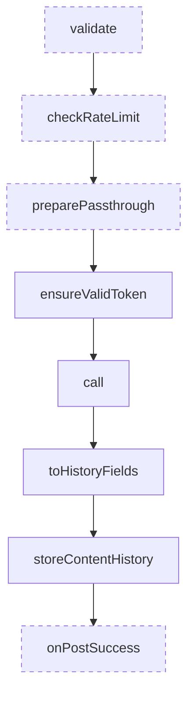
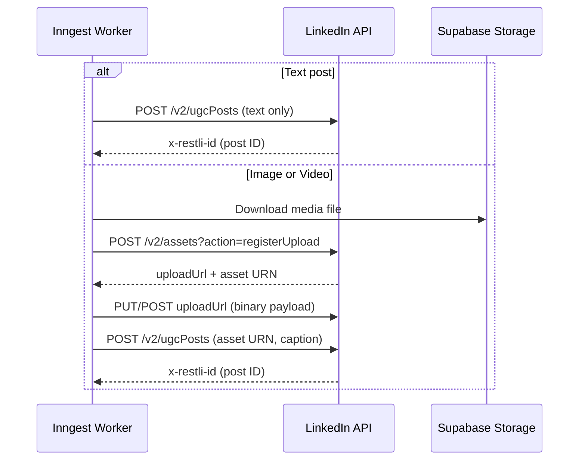
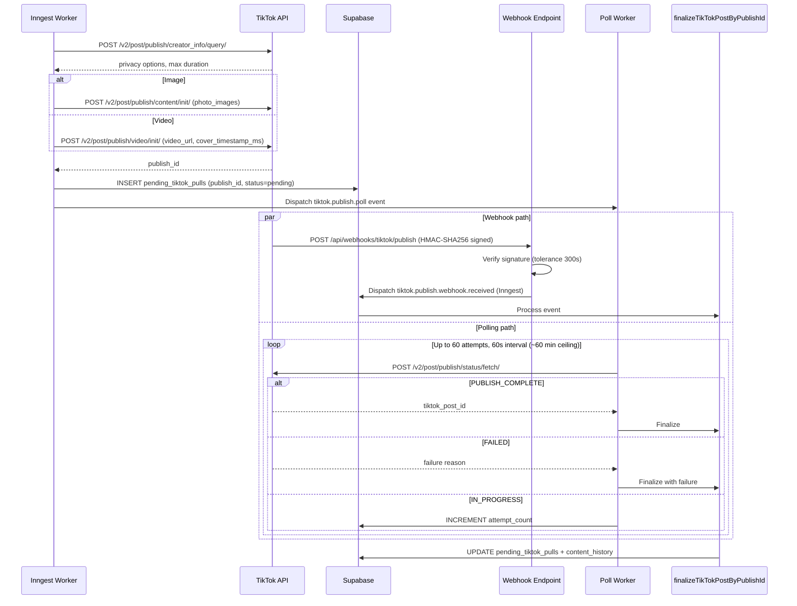
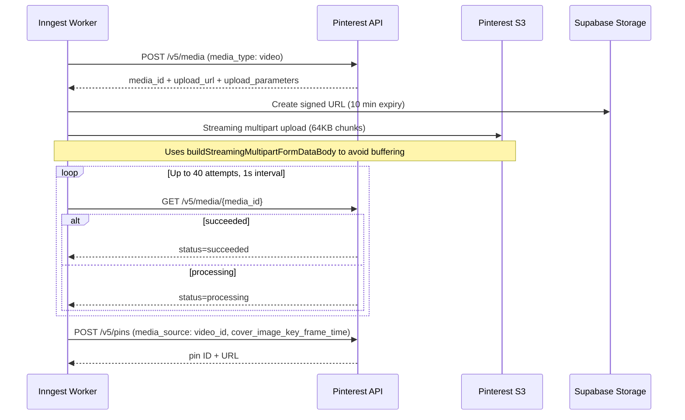
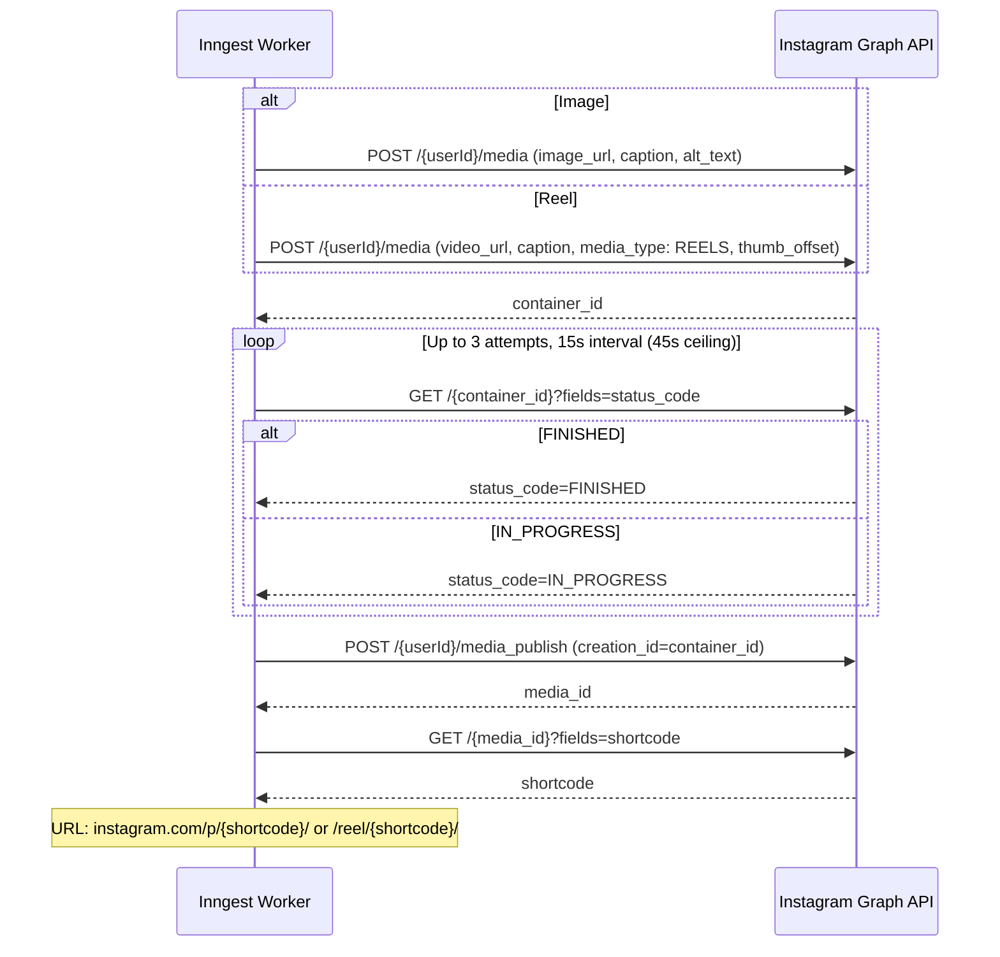

# Platforms

How Sharetopus posts content to LinkedIn, TikTok, Pinterest, Instagram, YouTube, X (Twitter), and Facebook. All platforms share a generic adapter pattern but differ in token behavior, media upload mechanics, and post lifecycle.

The platform capability registry (which platform accepts which media type) lives in `src/lib/platforms/capabilities.ts` and feeds the create form, the account selector, the REST/MCP/x402 schemas, and the Inngest compatibility check.

[Back to README](../README.md)

## Table of Contents

- [Generic Adapter Pattern](#generic-adapter-pattern)
- [Platform Support Matrix](#platform-support-matrix)
- [LinkedIn](#linkedin)
- [TikTok](#tiktok)
- [Pinterest](#pinterest)
- [Instagram](#instagram)
- [YouTube](#youtube)
- [X (Twitter)](#x-twitter)
- [Facebook](#facebook)
- [Future Platforms](#future-platforms)
- [Adding a New Platform](#adding-a-new-platform)
- [Source Files Referenced](#source-files-referenced)

---

## Generic Adapter Pattern

Every platform implements a thin adapter over `directPostForAccountsGeneric` (268 lines). The generic function handles token validation, history storage, and error handling. Each platform only supplies the platform-specific logic via hooks.

### DirectPostPlatformAdapter Type

```typescript
DirectPostPlatformAdapter<TPassthrough, TPostResult>
```

**Hooks:**

| Hook | Required | Purpose |
|------|----------|---------|
| `validate` | No | Pre-flight checks (e.g., media type support) |
| `checkRateLimit` | No | Platform rate limit enforcement |
| `preparePassthrough` | No | Transform or enrich passthrough data before posting |
| `call` | Yes | Execute the actual API call to the platform |
| `toHistoryFields` | Yes | Map post result to content_history record fields |
| `onPostSuccess` | No | Side effects after successful post (e.g., dispatch poll job) |

### Execution Flow



Dashed boxes are optional hooks. If any step returns a failure, the flow short-circuits and returns the error result.

Also in `_shared/`: `buildStreamingMultipartFormDataBody.ts`, which streams 64KB chunks for Pinterest video upload without buffering the full file in memory.

---

## Platform Support Matrix

| Platform | Text | Image | Video | Scheduled | Direct | OAuth Flow |
|----------|------|-------|-------|-----------|--------|------------|
| LinkedIn | yes | yes | yes | yes | yes | Standard |
| TikTok | no | yes | yes | yes | yes | Standard + dev/prod credential split |
| Pinterest | no | yes | yes | yes | yes | Basic Auth token exchange |
| Instagram | no | yes | reel | yes | yes | Long-lived token upgrade |
| YouTube | no | no | yes | yes | yes | Google OAuth, offline access for refresh tokens |
| X (Twitter) | yes | yes | yes | yes | yes | OAuth 2.0 with mandatory PKCE, rotating refresh tokens |
| Facebook | yes | yes | yes | yes | yes | Long-lived user token, then non-expiring Page tokens |

---

## LinkedIn

**API:** v2 (UGC Posts API)
**Scopes:** `openid`, `profile`, `email`, `w_member_social`
**Token refresh:** Yes, via refresh_token grant
**Member URN:** `urn:li:person:{account_identifier}`

### Posting Flow



Text-only posts skip media registration entirely and call the ugcPosts endpoint directly.

### Key Details

- Rate limiting: 25 posts/minute per account, enforced in application code.
- Token refresh handled by `refreshLinkedinToken.ts`.
- 5 source files total in the linkedin directory.

---

## TikTok

**API:** v2
**Scopes:** `user.info.basic`, `user.info.profile`, `video.publish`, `video.upload`, `user.info.stats`
**Token refresh:** Yes, via refresh_token grant
**Dev/prod credentials:** Separate `TIKTOK_CLIENT_KEY_DEV` / `TIKTOK_CLIENT_SECRET_DEV` for development environments
**Media types:** Image, Video (no text-only posts)

TikTok is the most complex integration. It uses an async pull model (TikTok fetches media from a URL you provide) and has a dual completion path combining webhooks and polling.

### Posting and Completion Flow



Both paths converge on `finalizeTikTokPostByPublishId` (241 lines), which is idempotent. The poll worker checks if the webhook already finalized the record (status != "pending") before acting. The webhook can also backfill a missing `post_id`.

### Webhook Verification

The webhook endpoint at `/api/webhooks/tiktok/publish` validates incoming requests with HMAC-SHA256:

- Signature input: `${timestamp}.${rawBody}`
- Tolerance: 300 seconds
- Events handled: `post.publish.complete`, `post.publish.publicly_available`, `post.publish.failed`

### Media URL Delivery

TikTok pulls media from a URL. Two modes are supported:

1. **Proxy mode** (default): HMAC-signed `/api/media` URLs with 30-minute expiry. Signature computed as SHA-256 over `${principalId}:${mediaPath}:${expiresAt}`.
2. **supabase_direct mode**: Supabase signed URLs passed directly to TikTok.

Controlled by the `TIKTOK_MEDIA_SOURCE` environment variable.

### Deep Links

Post URLs follow this pattern: `https://www.tiktok.com/@{creator_username}/{segment}/{tiktok_post_id}`

The segment is determined from the publish_id prefix:
- `p_pub_` = `photo`
- `v_pub_` = `video`

### Key Details

- Cover timestamp: `video_cover_timestamp_ms` in milliseconds. Minimum 1000ms; values below are clamped.
- Default privacy: `SELF_ONLY` (private). Users must select a public privacy level explicitly.
- The poll worker runs 60 attempts at 60-second intervals, giving roughly a 60-minute ceiling for TikTok to pull and process media.
- 13 source files total in the tiktok directory (plus 1 shared finalize function).

---

## Pinterest

**API:** v5
**Scopes:** `boards:read`, `boards:write`, `pins:read`, `pins:write`, `user_accounts:read`, `catalogs:read`, `catalogs:write`
**Token refresh:** Yes, ~30 day tokens
**Token exchange:** Basic Auth header with `base64(client_id:client_secret)`
**Media types:** Image, Video (no text-only posts)

### Image Posting

Images are straightforward. Pinterest accepts a URL directly:

```
POST /v5/pins
  board_id, title, description, media_source: { source_type: "image_url", url }
```

No file download or upload needed.

### Video Posting (Streaming Multipart S3 Upload)



### Key Details

- Cover timestamp: Pinterest uses `cover_image_key_frame_time` in **seconds** (not milliseconds). The code converts from ms to seconds.
- Board listing: `GET /v5/boards`, rate limited at 15 requests per 60 seconds.
- Board discovery is exposed via the MCP `list_pinterest_boards` tool (accepts `social_account_id`, `page_size`, `bookmark`).
- 9 source files total in the pinterest directory.

---

## Instagram

**API:** Graph API v23.0
**Scopes:** `instagram_business_basic`, `instagram_business_content_publish`
**Token:** No refresh tokens. Short-lived (1 hour) upgraded to 60-day long-lived via `ig_exchange_token` endpoint. Re-auth required when the long-lived token expires.
**Media types:** Image, Reel (video maps to Reel)

### Posting Flow (Container Model)



### Key Details

- Long-lived token upgrade happens automatically during OAuth exchange. If the upgrade fails, the short-lived token is stored as a fallback.
- No refresh tokens exist, but the long-lived ACCESS token itself is refreshed before expiry via `/refresh_access_token` (`refreshInstagramToken.ts`, wired into `ensureValidToken`). An already-expired token still requires re-authorization.
- Alt text is supported for images. Derived from the description (first 1000 characters).
- `post_type: "video"` is always published as a Reel (`media_type: REELS`).
- Media must be publicly accessible (Instagram fetches from the URL). Supabase signed URLs satisfy this requirement.
- 5 source files total in the instagram directory.

---

## YouTube

**API:** YouTube Data API v3
**Scopes:** `https://www.googleapis.com/auth/youtube.upload`, `https://www.googleapis.com/auth/youtube.readonly`
**Token refresh:** Yes, Google refresh_token grant (`access_type=offline&prompt=consent` forces a refresh token on every connect)
**Account identifier:** channel id (from `channels.list?mine=true`)
**Media types:** Video only
**Env vars:** `YOUTUBE_CLIENT_ID`, `YOUTUBE_CLIENT_SECRET`, `YOUTUBE_REDIRECT_URL`, `X402_YOUTUBE_REDIRECT_URI`

### Posting Flow

Resumable upload in two steps, streaming the file bytes from Supabase Storage:

1. `POST /upload/youtube/v3/videos?uploadType=resumable&part=snippet,status` with the metadata JSON (title, description, privacyStatus); the session URL returns in the `Location` header.
2. `PUT` the video bytes to the session URL; the response carries the video id. Post URL: `https://www.youtube.com/watch?v={id}`.

### Key Details

- A title is mandatory; the adapter falls back to the first 100 characters of the caption, then "Untitled video".
- `post_options.privacyStatus` (`public` | `unlisted` | `private`, default `public`) maps to `status.privacyStatus`.
- A Google account without a YouTube channel fails the connect flow with a clear message.
- Unverified Google Cloud projects upload as private-locked until the app passes verification; expect that during development.

---

## X (Twitter)

**API:** X API v2
**Scopes:** `tweet.read`, `tweet.write`, `users.read`, `media.write`, `offline.access`
**Token refresh:** Yes, and X ROTATES the refresh token on every refresh; the new value is persisted each time
**PKCE:** Mandatory. The web flow keeps the verifier in an HTTP-only cookie; the x402/REST flow stores it in `social_connections.oauth_code_verifier`
**Account identifier:** numeric user id (from `GET /2/users/me`)
**Media types:** Text, Image, Video
**Env vars:** `X_CLIENT_ID`, `X_CLIENT_SECRET`, `X_REDIRECT_URL`, `X402_X_REDIRECT_URI`

### Posting Flow

- Text: `POST /2/tweets` with `{ text }`.
- Media: v2 chunked upload (the dedicated endpoints that replaced command-style upload in May 2025), then the tweet references the media id:
  1. `POST /2/media/upload/initialize` (JSON: media_type, total_bytes, media_category `tweet_image` or `tweet_video`)
  2. `POST /2/media/upload/{id}/append` (multipart, 4 MB segments)
  3. `POST /2/media/upload/{id}/finalize`
  4. `GET /2/media/upload?command=STATUS` polling while X transcodes video
  5. `POST /2/tweets` with `{ text, media: { media_ids: [id] } }`

### Key Details

- Confidential-client token calls use HTTP Basic auth (`client_id:client_secret`).
- Caption cap is 280 characters (enforced by `CAPTION_LIMITS.x` in the batch cores).
- Media upload endpoints have very low rate limits on the Free API tier (17 initialize/finalize per 24h); plan tier accordingly.

---

## Facebook

**API:** Graph API v23.0 (Pages)
**Scopes:** `pages_show_list`, `pages_manage_posts`, `pages_read_engagement`
**Token:** code -> short-lived user token -> long-lived user token (`fb_exchange_token`) -> PAGE tokens via `GET /me/accounts`. Page tokens minted from a long-lived user token do not expire, so `token_expires_at` is stored null and no refresh path exists.
**Account identifier:** Page id; the stored access token is the PAGE token (the user token is never stored)
**Media types:** Text, Image, Video
**Env vars:** `FACEBOOK_CLIENT_ID`, `FACEBOOK_CLIENT_SECRET`, `FACEBOOK_REDIRECT_URL`, `X402_FACEBOOK_REDIRECT_URI`

### Posting Flow

- Text: `POST /{pageId}/feed` with `{ message }`.
- Image: `POST /{pageId}/photos` with `{ url, caption }` (Facebook pulls the file from the signed URL).
- Video: `POST /{pageId}/videos` with `{ file_url, description }` (Facebook pulls the file).

### Key Details

- The web connect flow stores ONE `social_accounts` row PER managed Page. The x402/REST callback contract is one account per connection, so it stores the FIRST Page and logs how many were skipped; connect the rest through the web flow.
- Post URL: `https://www.facebook.com/{post_id}`.

---

## Future Platforms

These platforms are not yet postable:

- **Threads**: in the `social_accounts.platform` DB union, no integration code.
- **Google Business Profile**: NOT in the DB union yet. Blocked on a schema change only Drew can apply; see below.

Bluesky is not in the database type definitions.

### Enabling Google Business Profile

`src/lib/types/database.types.ts` is hand-maintained and read-only for agents, and the `platform` CHECK constraints in Postgres mirror it. Both must change before any `google_business` code can compile or run. Steps, in order:

1. Run this SQL against Supabase (adjust constraint names if they differ; check with `\d social_accounts`):

```sql
ALTER TABLE social_accounts
  DROP CONSTRAINT social_accounts_platform_check;
ALTER TABLE social_accounts
  ADD CONSTRAINT social_accounts_platform_check CHECK (platform IN (
    'linkedin', 'tiktok', 'pinterest', 'instagram',
    'facebook', 'threads', 'youtube', 'x', 'google_business'
  ));

ALTER TABLE social_connections
  DROP CONSTRAINT social_connections_platform_check;
ALTER TABLE social_connections
  ADD CONSTRAINT social_connections_platform_check CHECK (platform IN (
    'linkedin', 'tiktok', 'pinterest', 'instagram',
    'facebook', 'threads', 'youtube', 'x', 'google_business'
  ));

INSERT INTO platform_quotas (platform, daily_cap, burst_cap_60s, notes)
VALUES ('google_business', 50, 5, 'Google Business Profile localPosts')
ON CONFLICT (platform) DO NOTHING;
```

2. Hand-edit `src/lib/types/database.types.ts`: append `| "google_business"` to the platform union in six places (social_accounts Row/Insert/Update, social_connections Row/Insert/Update) and to the `Platform` alias near line 2258.

3. After both are applied, extend the code exactly like the youtube/x/facebook additions in this change (same checklist below). Google Business specifics: OAuth is standard Google (`https://www.googleapis.com/auth/business.manage` scope, same token endpoint as YouTube), the account identifier is `accounts/{accountId}/locations/{locationId}`, and publishing goes through `POST https://mybusiness.googleapis.com/v4/{parent}/localPosts` with `summary` text and an optional `media` array of publicly reachable URLs.

---

## Adding a New Platform

Checklist for implementing a new platform, matching how youtube/x/facebook were added:

1. Confirm the platform value exists in the DB `platform` CHECK constraints and in `src/lib/types/database.types.ts` (hand-edited by Drew).
2. Register capabilities: add the key to `POSTING_PLATFORMS`, `PLATFORM_LABELS`, and the media-support map in `src/lib/platforms/capabilities.ts`, plus a `CAPTION_LIMITS` entry.
3. Create `src/lib/api/{platform}/`:
   - `data/`: `exchange{Platform}Code.ts`, `get{Platform}Profile.ts`, `refresh{Platform}Token.ts` (when the platform has one)
   - `post/`: `postTo{Platform}.ts`, `directPostFor{Platform}Accounts.ts` (a `DirectPostPlatformAdapter`)
4. Wire the token lifecycle: a case in `refreshTokenForPlatform` inside `src/lib/api/ensureValidToken.ts`.
5. Web OAuth routes via the shared helpers (`initiateWebOAuth`, `completeWebOAuthConnect`):
   - `/api/social/{platform}/initiate`
   - `/api/social/{platform}/connect`
6. x402/REST OAuth:
   - a builder case in `src/lib/x402/connect/buildOAuthUrl.ts`
   - `src/lib/x402/oauth/callback/{platform}TokenExchange.ts` plus a dispatch case in `handleOAuthCallback.ts`
   - a redirect URI case in `getOAuthRedirectUri` (`src/lib/x402/config.ts`) and the `X402_{PLATFORM}_REDIRECT_URI` env var
7. Inngest workers: dispatch cases in `processSinglePostHelpers.callPlatformDirectPost` and `processDirectPostHelpers.callDirectPostFromEvent`.
8. UI: a section in the connections page using `ConnectPlatformButton`, and an icon in `allPlatformsIcons.tsx` / `SocialAvatarWrapper`.
9. Docs: x402 reference strings in `docs/x402/data/endpoints.ts`, this file, and `.env.example`.

The zod platform enums (MCP tools, REST schemas, x402 body schema) derive from `POSTING_PLATFORMS`, so step 2 updates them automatically.

---

## Source Files Referenced

**Shared:**
- `src/lib/api/_shared/directPostForAccountsGeneric.ts` (268 lines, generic adapter)
- `src/lib/api/_shared/buildStreamingMultipartFormDataBody.ts` (streaming multipart for Pinterest video)

**LinkedIn** (`src/lib/api/linkedin/`):
- `post/postToLinkedIn.ts`
- `post/directPostForLinkedInAccounts.ts`
- `data/exchangeLinkedInCode.ts`
- `data/getLinkedInProfile.ts`
- `data/refreshLinkedinToken.ts`

**TikTok** (`src/lib/api/tiktok/`):
- `post/postToTikTok.ts`
- `post/postImage.ts`
- `post/postVideo.ts`
- `post/directPostForTikTokAccounts.ts`
- `data/exchangeTikTokCode.ts`
- `data/getTikTokProfile.ts`
- `data/getTikTokCreatorInfo.ts`
- `data/getTikTokCreatorInfoForAccount.ts`
- `data/refreshTikTokToken.ts`
- `getTikTokPublishStatus.ts`
- `buildProxiedTikTokMediaUrl.ts`
- `buildTikTokMediaUrl.ts`
- `buildSupabaseDirectTikTokMediaUrl.ts`

**Pinterest** (`src/lib/api/pinterest/`):
- `post/postToPinterest.ts`
- `post/postImage.ts`
- `post/createVideoPin.ts`
- `post/directPostForPinterestAccounts.ts`
- `data/exchangePinterestCode.ts`
- `data/getPinterestProfile.ts`
- `data/getPinterestBoards.ts`
- `data/createPinterestBoard.ts`
- `data/refreshPinterestToken.ts`

**Instagram** (`src/lib/api/instagram/`):
- `post/postToInstagram.ts`
- `post/directPostForInstagramAccounts.ts`
- `data/exchangeInstagramCode.ts`
- `data/getInstagramProfile.ts`
- `data/refreshInstagramToken.ts`

**YouTube** (`src/lib/api/youtube/`):
- `post/postToYouTube.ts`
- `post/directPostForYouTubeAccounts.ts`
- `data/exchangeYouTubeCode.ts`
- `data/getYouTubeProfile.ts`
- `data/refreshYouTubeToken.ts`

**X** (`src/lib/api/x/`):
- `post/postToX.ts`
- `post/directPostForXAccounts.ts`
- `data/exchangeXCode.ts`
- `data/getXProfile.ts`
- `data/refreshXToken.ts`

**Facebook** (`src/lib/api/facebook/`):
- `post/postToFacebook.ts`
- `post/directPostForFacebookAccounts.ts`
- `data/exchangeFacebookCode.ts`
- `data/getFacebookPages.ts`

**Shared web OAuth** (`src/lib/api/oauth/web/`):
- `initiateWebOAuth.ts`
- `completeWebOAuthConnect.ts`

**Capability registry:**
- `src/lib/platforms/capabilities.ts`

---

[Back to README](../README.md)
