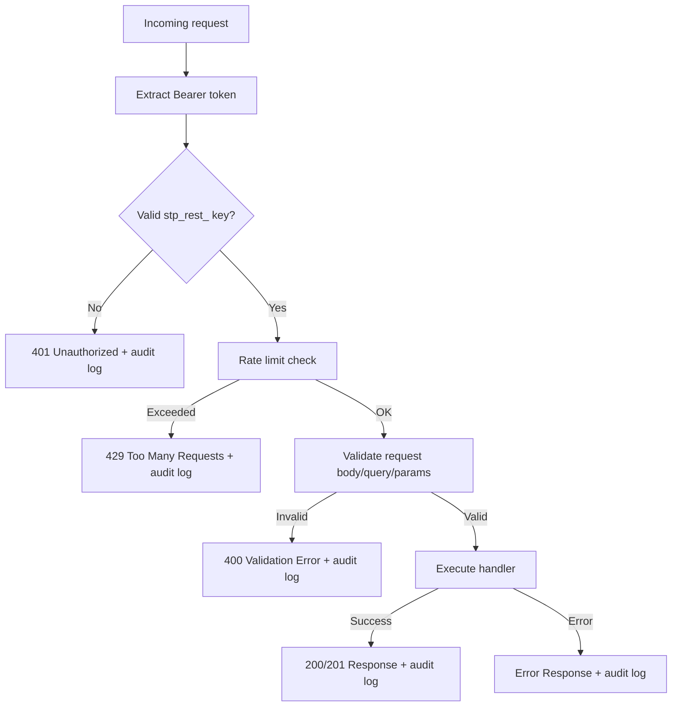

# REST API

28 HTTP endpoint handlers across 21 route files under `/api/v1/`. 27 use Bearer authentication via `withRestEndpoint`. 1 (`GET /api/v1/openapi.json`) is public with no auth. Every request is audited to the append-only `rest_audit_log` table. Rate limiting is per-principal via Upstash Redis.

Built with Zod 4 for request validation and `zod-openapi@5.4.6` for OpenAPI 3.1 spec generation.

[Back to README](../README.md)

## Table of contents

- [Authentication](#authentication)
- [Endpoint inventory](#endpoint-inventory)
- [withRestEndpoint HOF](#withrestendpoint-hof)
- [Error format](#error-format)
- [Rate limiting](#rate-limiting)
- [Validation](#validation)
- [Audit logging](#audit-logging)
- [OpenAPI and docs](#openapi-and-docs)
- [Zod 4 and z.guid()](#zod-4-and-zguid)
- [Tradeoffs and limitations](#tradeoffs-and-limitations)
- [Source files referenced](#source-files-referenced)

---

## Authentication

Every REST API request requires a Bearer token in the `Authorization` header.

```bash
curl https://sharetopus.com/api/v1/posts \
  -H "Authorization: Bearer stp_rest_YOUR_KEY"
```

Token resolution:
1. Extract `Authorization: Bearer <token>` header
2. Verify prefix is `stp_rest_`
3. SHA-256 hash the token
4. Look up `token_hash` in `api_keys` table where `kind = 'rest'`
5. Verify: not revoked (`revoked_at IS NULL`), not expired (`expires_at > now()`)
6. Update `last_used_at` and `last_used_ip`
7. Resolve `principal_id` for downstream queries

Keys are created at [/integrations](https://sharetopus.com/integrations). Key format: `stp_rest_` followed by 64 hex characters. Shown once at creation time. Expiry options: 7, 30, 90, or 365 days.

---

## Endpoint inventory

28 handlers across posts, connections, media, webhooks, analytics, usage, content history, and OpenAPI.

### Posts

| Method | Path | Description |
|--------|------|-------------|
| POST | `/api/v1/posts` | Create/schedule a post |
| GET | `/api/v1/posts` | List posts (filtered by platform, status) |
| GET | `/api/v1/posts/:id` | Get a single post |
| PATCH | `/api/v1/posts/:id` | Update a scheduled post |
| DELETE | `/api/v1/posts/:id` | Delete a post |
| POST | `/api/v1/posts/bulk` | Bulk schedule posts |
| GET | `/api/v1/posts/:id/analytics` | Get analytics for a post |

### Connections

| Method | Path | Description |
|--------|------|-------------|
| GET | `/api/v1/connections` | List connected social accounts |
| GET | `/api/v1/connections/:id` | Get a single connection |
| POST | `/api/v1/connections/initiate` | Initiate OAuth connection flow |
| POST | `/api/v1/connections/:id/reauth` | Get re-auth URL for expired token |
| GET | `/api/v1/connections/:id/boards` | List Pinterest boards for a connection |

### Media

| Method | Path | Description |
|--------|------|-------------|
| POST | `/api/v1/media/upload-url` | Get a signed upload URL |
| POST | `/api/v1/media/attach-from-url` | Download from URL, upload to storage |
| GET | `/api/v1/media/*` | Serve a media file |
| DELETE | `/api/v1/media/*` | Delete a media file |

### Webhooks

| Method | Path | Description |
|--------|------|-------------|
| POST | `/api/v1/webhooks` | Create a webhook subscription |
| GET | `/api/v1/webhooks` | List webhook subscriptions |
| GET | `/api/v1/webhooks/:id` | Get a single subscription |
| PATCH | `/api/v1/webhooks/:id` | Update a subscription (URL, events, active) |
| DELETE | `/api/v1/webhooks/:id` | Delete a subscription |
| POST | `/api/v1/webhooks/:id/test` | Send a test delivery |
| GET | `/api/v1/webhooks/:id/deliveries` | List delivery log |
| POST | `/api/v1/webhooks/:id/deliveries/:delivery_id/replay` | Replay a past delivery |

### Other

| Method | Path | Description |
|--------|------|-------------|
| GET | `/api/v1/analytics` | Get analytics metrics |
| GET | `/api/v1/content-history` | List published content history |
| GET | `/api/v1/usage` | Get quota usage for current period |
| GET | `/api/v1/openapi.json` | Generated OpenAPI 3.1 spec (public, cached) |

---

## withRestEndpoint HOF

Every route handler is wrapped by `withRestEndpoint` in `src/lib/api/rest/middleware/withRestEndpoint.ts`. This higher-order function centralizes:

1. **Authentication:** Bearer token resolution (see above)
2. **Request validation:** Zod schema parsing for body, query, and path params
3. **Rate limiting:** Per-principal Upstash Redis sliding window
4. **Business logic:** Calls the inner handler with validated data and auth context
5. **Audit logging:** Writes to `rest_audit_log` on every request (success or failure)
6. **Error handling:** Catches errors, formats consistent JSON response



The audit log write happens on every path (success or failure). The `request_id` is generated per request and included in all responses for traceability.

---

## Error format

All errors follow a consistent shape:

```json
{
  "error": {
    "code": "validation_error",
    "message": "Description of what went wrong"
  },
  "request_id": "req_abc123"
}
```

Error codes:

| Code | HTTP Status | Description |
|------|------------|-------------|
| `unauthorized` | 401 | Invalid, expired, or revoked API key |
| `forbidden` | 403 | Valid key but insufficient permissions |
| `not_found` | 404 | Resource does not exist or not owned by principal |
| `validation_error` | 400 | Request body or parameters failed Zod validation |
| `rate_limited` | 429 | Per-principal rate limit exceeded |
| `internal_error` | 500 | Unexpected server error |

Rate limit responses include a `retry_after_seconds` field.

---

## Rate limiting

Per-principal rate limits via Upstash Redis sliding window. Limits vary by endpoint. When exceeded, the API returns 429 with `retry_after_seconds`.

Rate limit state is tracked per `principal_id`, not per API key. Multiple keys for the same principal share the same rate limit pool.

---

## Validation

Request validation uses Zod 4 schemas defined in `src/lib/api/rest/validation/`:

| Schema file | Covers |
|-------------|--------|
| `schemas.ts` | Post creation, listing, and update |
| `postPatchSchemas.ts` | Post PATCH operations |
| `connectionSchemas.ts` | Connection initiate and reauth |
| `mediaSchemas.ts` | Media upload URL and attach-from-URL |
| `webhookSchemas.ts` | Webhook subscription create and update |
| `analyticsSchemas.ts` | Analytics query parameters |

Validation errors return 400 with the `validation_error` code and a message describing which fields failed.

---

## Audit logging

Every REST API request is logged to the `rest_audit_log` table (append-only, `Update: never`).

Fields logged:

| Field | Description |
|-------|-------------|
| `principal_id` | Authenticated user |
| `api_key_id` | Which key was used |
| `endpoint` | Route path |
| `http_method` | GET, POST, PATCH, DELETE |
| `request_id` | Per-request correlation ID |
| `ip_hash` | SHA-256 of client IP |
| `user_agent` | Client User-Agent |
| `status_code` | HTTP response status |
| `outcome` | `success`, `validation_error`, `auth_error`, `rate_limited`, `internal_error` |
| `error_code` | Error code string (null on success) |
| `latency_ms` | Request duration |
| `args_redacted` | Request body with sensitive values redacted |
| `response_summary` | Summarized response (not full body) |

The audit log write is via `writeRestAuditLog` in `src/lib/api/rest/audit/writeRestAuditLog.ts`. It runs on every request path (success, validation failure, auth failure, rate limit, error).

---

## OpenAPI and docs

### OpenAPI spec

`GET /api/v1/openapi.json` returns a generated OpenAPI 3.1 document. Built with `zod-openapi@5.4.6` using native Zod 4 `.meta()` API (no `extendZodWithOpenApi` needed).

Generation code lives in `src/lib/api/rest/openapi/`:
- `buildDocument.ts` assembles the OpenAPI document from route definitions
- `paths.ts` maps endpoints to OpenAPI path items
- `responseSchemas.ts` defines shared response schemas

The spec is public (no auth required) and cached.

### Interactive docs

`/docs/api` renders the Scalar interactive API viewer via `@scalar/nextjs-api-reference@0.10.16`. Users can explore endpoints, see schemas, and try requests.

### MDX documentation

Developer-facing docs at:
- `/docs/quickstart` (first API call in 5 minutes)
- `/docs/authentication` (key management, error codes)
- `/docs/webhooks` (event types, signing, retry)

MDX files live in `src/content/docs/`. Rendered via `@next/mdx` with `pageExtensions: ["ts", "tsx", "mdx"]` in `next.config.ts`.

---

## Zod 4 and z.guid()

REST API code uses Zod 4 (`import { z } from "zod"`). UUID fields use `z.guid()` instead of `z.string().uuid()` because Zod 4's `z.string().uuid()` enforces strict RFC 4122 validation, which rejects some Supabase-generated UUIDs.

MCP tool code uses `import { z } from "zod/v3"` and retains `z.string().uuid()`. The two Zod versions coexist via Zod 4's built-in v3 compatibility layer. Do not mix imports.

---

## Tradeoffs and limitations

- **`rest_audit_log` has no cleanup cron.** Unlike `mcp_audit_log` (90-day retention via `cleanup-mcp-audit-log`), REST audit logs grow indefinitely. A retention cron should be added.
- **`typescript.ignoreBuildErrors: true` in next.config.ts.** Type checking runs via `npx tsc --noEmit` in CI/pre-commit, not during Vercel builds (OOM mitigation). Always run tsc locally before pushing.
- **No per-endpoint rate limit documentation in the spec.** Rate limits are enforced but not described in the OpenAPI document.
- **Webhook secret stored raw.** See [docs/WEBHOOKS.md](./WEBHOOKS.md#tradeoffs-and-limitations) for details.

---

## Source files referenced

| File | Description |
|------|-------------|
| `src/lib/api/rest/middleware/withRestEndpoint.ts` | REST API endpoint wrapper HOF |
| `src/lib/api/rest/auth/` | Bearer token resolution |
| `src/lib/api/rest/audit/writeRestAuditLog.ts` | Audit log writer |
| `src/lib/api/rest/errors/` | Error format and codes |
| `src/lib/api/rest/validation/schemas.ts` | Post Zod schemas |
| `src/lib/api/rest/validation/webhookSchemas.ts` | Webhook Zod schemas |
| `src/lib/api/rest/validation/connectionSchemas.ts` | Connection Zod schemas |
| `src/lib/api/rest/validation/mediaSchemas.ts` | Media Zod schemas |
| `src/lib/api/rest/validation/analyticsSchemas.ts` | Analytics Zod schemas |
| `src/lib/api/rest/validation/postPatchSchemas.ts` | Post PATCH Zod schemas |
| `src/lib/api/rest/openapi/buildDocument.ts` | OpenAPI document generation |
| `src/lib/api/rest/openapi/paths.ts` | OpenAPI path definitions |
| `src/lib/api/rest/openapi/responseSchemas.ts` | Shared response schemas |
| `src/lib/api/rest/webhooks/dispatch.ts` | Webhook event dispatcher |
| `src/lib/api/rest/webhooks/signWebhookPayload.ts` | HMAC-SHA256 signing |
| `src/lib/api/rest/dto/` | Data transfer objects |
| `src/lib/api/rest/adapters/` | Service adapters |
| `src/app/api/v1/posts/route.ts` | POST + GET posts |
| `src/app/api/v1/posts/[id]/route.ts` | GET + PATCH + DELETE single post |
| `src/app/api/v1/posts/bulk/route.ts` | POST bulk schedule |
| `src/app/api/v1/webhooks/route.ts` | POST + GET webhooks |
| `src/app/api/v1/openapi.json/route.ts` | GET OpenAPI spec |

---

**See also:** [docs/WEBHOOKS.md](./WEBHOOKS.md) (webhook subsystem), [docs/SECURITY.md](./SECURITY.md) (auth, rate limiting, audit), [docs/AUTH.md](./AUTH.md) (principal model, key lifecycle), [docs/MCP.md](./MCP.md) (MCP tools comparison)

[Back to README](../README.md)
