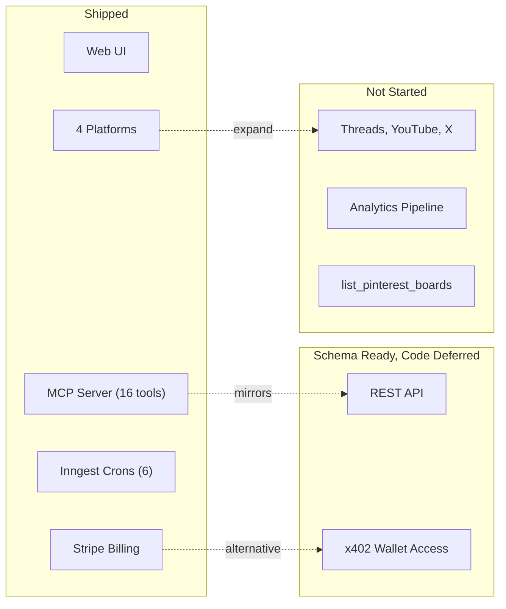

# Roadmap

Features and improvements that are deferred, in-progress, or blocked. This reflects the current state of the codebase, not aspirational goals.

[Back to README](../README.md)

## Implementation status

## Deferred features

### REST API (Phase 2)

A public REST API mirroring the MCP tools (schedule, cancel, list, etc.) with `stp_rest_*` API keys. The `api_keys` table already supports `kind=rest` and the `created_via=api` enum value exists.

**Status:** Deferred. Waiting for MCP traffic signal before investing in a parallel API surface.

### x402 anonymous wallet access (Phase 4)

Wallet-based authentication using SIWE (Sign-In With Ethereum). Users pay per-action with USDC credits instead of a monthly subscription.

Schema tables exist: `wallets`, `wallet_credits`, `wallet_credits_ledger`, `x402_charges`, `x402_refunds`, `x402_access_log`, `pricing_actions`, `siwe_nonces`, `usdc_fmv_daily`, `sanctions_screenings`.

The `principals.kind=wallet` path and `created_via=x402` enum are wired but no code path is built.

**Status:** Deferred. Schema ready, code path not started.

### Platform deduplication refactors (FIXes 22-26)

The 4 platform integrations (LinkedIn, TikTok, Pinterest, Instagram) share similar patterns for OAuth, token refresh, and posting. The code is currently duplicated across platforms. A planned refactor would extract common logic into shared helpers.

**Status:** Open. Low priority, functional as-is.

## Open issues

### list_pinterest_boards MCP tool

Pinterest posting requires a board ID, but there's no MCP tool to list available boards. MCP agents cannot post to Pinterest without knowing the board ID in advance.

The `GET /v5/boards` endpoint is already called from the web UI. Wrapping it as an MCP tool is straightforward.

**Status:** Not implemented. Tracked for next MCP tool batch.

### Analytics metrics population

The `analytics_metrics` table exists and the `get_account_analytics` MCP tool reads from it, but no cron or background job populates it. The tool returns whatever is in the table (currently empty for most users).

A QStash-based refresh job was mentioned in a code comment but the `@upstash/qstash` dependency is not imported anywhere.

**Status:** Table exists, data pipeline not built.

### TikTok unaudited app limitations

TikTok's unaudited developer apps have restrictions that affect posting:
- `picture_size_check_failed` errors for non-square images
- Default privacy `SELF_ONLY` (private posts)
- Limited API rate quotas

These resolve when the TikTok app passes audit review.

**Status:** Known limitation, depends on TikTok developer app approval.

### Instagram connect button

The Instagram OAuth backend (initiate, connect, post, process) is fully functional, but the "Connect Instagram" button is commented out in the connections page UI component.

**Status:** Backend ready, UI button disabled.

### i18n

Internationalization is declared in `i18n-config.ts` (fr, en, es) and dependencies (`i18next`, `react-i18next`, `next-i18next`) are installed. No translation files exist. The UI is English only.

**Status:** Infrastructure in place, no translations.

### Studio/Analytics page

The Studio page at `/studio` shows a "Coming Soon" placeholder. The `analytics_metrics` table exists but has no data pipeline.

**Status:** Placeholder UI only.

## Won't fix (for now)

### Additional platform integrations

Threads, YouTube, X/Twitter, and Facebook appear in type definitions (`social_accounts.platform` enum) but building integrations for these is not planned until the current 4 platforms are stable and the user base warrants it.

### QStash removal

`@upstash/qstash` is listed as a dependency but is not imported in any source file. It was likely used before the migration to Inngest. Removing it is low-risk but low priority.

---

[Back to README](../README.md)
