# Roadmap

Current state of shipped features, deferred work, and known issues. Reflects what the code does today, not aspirational goals.

[Back to README](../README.md)

## Table of Contents

- [Implementation Status](#implementation-status)
- [Shipped](#shipped)
- [Mid-Term (1-3 Months)](#mid-term-1-3-months)
- [Long-Term (3+ Months)](#long-term-3-months)
- [Open Issues](#open-issues)
- [Won't Fix (For Now)](#wont-fix-for-now)
- [Source Files Referenced](#source-files-referenced)

## Implementation Status

```mermaid
graph TD
    subgraph Shipped["Shipped (Production)"]
        RESTAPI["REST API v1 (28 endpoints)"]
        WebhookSub["Webhook Subsystem (HMAC + delivery + replay)"]
        OpenAPIDocs["OpenAPI + Scalar Docs + MDX Pages"]
        Zod4["Zod 4 Upgrade (v3 compat for MCP)"]
        TikTokWH["TikTok Webhook + Inngest Processor"]
        HybridPricing["Hybrid Pricing / MCP Creator+ Gate"]
        WithMcpTool["withMcpTool HOF (auth, audit, entitlement)"]
        APIKeyExpiry["API Key Expiry (7/30/90/365d)"]
        RequestIdTrace["Web requestId Tracing"]
        SharedFinalize["TikTok Shared Finalize (poll+webhook)"]
        GenericAdapter["Generic Adapter Pattern"]
        OAuthTrust["OAuth Client Trust Enforcement"]
        RetentionCrons["Data Retention Crons (3)"]
        SSRFGuard["SSRF Guard (safeUserFetch)"]
        StorageQuota["Storage Quota Enforcement"]
        ToolAnnotations["MCP Tool Annotations (18 tools)"]
        ClientInfo["clientInfo Capture"]
        PinterestBoards["list_pinterest_boards Tool"]
        BulkPostNow["bulk_post_now Tool"]
        IdempotentRetries["Idempotent Retries on Write Tools"]
    end

    subgraph MidTerm["Mid-Term (Schema Exists, Code Deferred)"]
        x402["x402 Wallet Access"]
        NewPlatforms["YouTube, X, Threads, Facebook"]
    end

    subgraph LongTerm["Long-Term (Partial/Planned)"]
        WalletLedger["Wallet Credits Ledger"]
        FederatedAgents["Federated Agent Features"]
        AnalyticsPipeline["Analytics Pipeline"]
    end

    SharedFinalize --> TikTokWH
    GenericAdapter --> NewPlatforms
    HybridPricing --> x402
    RESTAPI --> WebhookSub
    RESTAPI --> OpenAPIDocs
```

## Shipped

All items below are live in production.

### 1. TikTok Webhook Receiver + Inngest Processor

The `/api/webhooks/tiktok/publish` endpoint receives HMAC-SHA256 signed events from TikTok's Content Posting API. The `processTikTokPublishWebhook` Inngest function processes events with 3 retries. Both the webhook path and the existing poll worker converge on `finalizeTikTokPostByPublishId`, making the system dual-path (webhook arrives first in most cases, poll serves as fallback). The `tiktok_webhook_events` table enforces idempotency so concurrent webhook + poll completions are safe.

### 2. Hybrid Pricing / MCP Creator+ Minimum

All 18 MCP tools require Creator tier or above. Starter users have web UI access only, no MCP. Per-tool quotas at Creator tier: 500/mo for most tools, 200/mo for `bulk_schedule`, 100/mo for `generate_post_draft`. Pro tier has unlimited quotas.

### 3. withMcpTool Higher-Order Function

A 240-line wrapper (`withMcpTool`) handles auth, entitlement checks, audit logging, and error handling for every MCP tool. Injects `McpToolContext` containing principal, sessionId, requestId, ipHash, and userAgent. Logs automatically on deny, error, and success paths.

### 4. API Key Expiry

Users select expiry duration when creating API keys: 7, 30, 90, or 365 days (default 90). No "never expires" option. The `ApiKeysCard.tsx` component displays remaining time and expiry date.

### 5. Web requestId Tracing

`generateRequestId()` runs at server action entry points. The ID threads through `schedulePostBatch` and `directPostBatch`, connecting web requests to downstream operations in logs and audit records.

### 6. TikTok Shared Finalize Function

`finalizeTikTokPostByPublishId` handles both poll and webhook outcomes. It is idempotent (first writer wins). Constructs deep links from `creator_username` + `publish_id` prefix.

### 7. Generic Adapter Pattern

`directPostForAccountsGeneric.ts` defines the `DirectPostPlatformAdapter` type. Per-platform adapters (LinkedIn, Pinterest, TikTok, Instagram) are thin wrappers. Token refresh, history storage, and error handling live in the generic layer.

### 8. OAuth Client Trust Enforcement

The `mcp_oauth_clients` table tracks `trust_level` (unverified, verified, blocked). Clients auto-verify on first appearance, demote to unverified on subscription cancel, promote back on resubscribe. The `sweep-stale-oauth-clients` cron runs daily at 04:00 UTC with 90-day retention.

### 9. Data Retention Crons

Three Inngest crons handle cleanup:
- `cleanup-mcp-audit-log`: 90-day retention
- `cleanup-stripe-webhook-events`: 90-day retention
- `cleanup-cancelled-posts-after-grace`: 7-day grace period

### 10. SSRF Guard (safeUserFetch)

Blocks 14 IP ranges (loopback, link-local, RFC 1918, CGNAT, IPv6 ULA, IPv4-mapped IPv6, multicast, reserved). Rejects non-http(s) schemes, blocks redirects, validates content-type, enforces a stream-based byte counter (Content-Length header untrusted). Rate limited at 10 requests per 60 seconds per principal.

### 11. Storage Quota Enforcement (enforceStorageQuota)

Calls the `get_user_storage_bytes` Postgres RPC to read actual bytes from `storage.objects`. Plan-based caps enforced at upload time for both web/MCP upload (`generateServerSignedUploadUrl`) and `attach_media_from_url`.

### 12. MCP Tool Annotations

All 18 tools carry Connectors Directory annotations: `readOnlyHint`, `destructiveHint`, `idempotentHint`, `openWorldHint`.

### 13. clientInfo Capture

The MCP route handler extracts `clientInfo.name` and `clientInfo.version` from the initialize handshake. Stored in `mcp_sessions.client_name` and `mcp_sessions.client_version`.

### 14. list_pinterest_boards MCP Tool

Lets MCP agents discover board IDs for Pinterest posting. Parameters: `social_account_id` (required), `page_size` (1-100, default 25), `bookmark` (pagination cursor). Returns board id, name, description, privacy, pin_count.

### 15. bulk_post_now MCP Tool

Publishes up to 30 posts immediately in one call. Creator+ tier. Same idempotent retry pattern as `bulk_schedule` (batch_id derives per-post idempotency keys).

### 16. Idempotent Retries on MCP Write Tools

`schedule_post`, `post_now`, and `bulk_post_now` accept an optional `idempotency_key` parameter. DB-enforced via UNIQUE constraint on `(principal_id, idempotency_key)`. Safe to retry on network errors without creating duplicates.

### 17. REST API v1

28 HTTP endpoint handlers across 21 route files under `/api/v1/`. Bearer auth via `stp_rest_*` keys. Every request passes through `withRestEndpoint` (auth, validation, audit logging, error handling, rate limiting). Audit trail in `rest_audit_log` (append-only). See [docs/REST.md](./REST.md).

### 18. Webhook Subsystem

User-created webhook subscriptions with HMAC-SHA256 signing. 5 event types: `post.scheduled`, `post.published`, `post.failed`, `connection.connected`, `connection.expired`. Delivery via the `deliver-webhook` Inngest function with 3 retries and auto-disable after 10 consecutive failures. Delivery log, test endpoint, and replay endpoint. See [docs/WEBHOOKS.md](./WEBHOOKS.md).

### 19. OpenAPI + Scalar Docs + MDX Pages

`/api/v1/openapi.json` serves a generated OpenAPI 3.1 document (via `zod-openapi@5.x` using native Zod 4 `.meta()` API). `/docs/api` renders the Scalar interactive viewer. MDX doc pages at `/docs/quickstart`, `/docs/authentication`, `/docs/webhooks` (via `@next/mdx` with `pageExtensions: ["ts", "tsx", "mdx"]`).

### 20. Zod 4 Upgrade

Upgraded from Zod 3 to Zod 4 (`zod@^4.4.3`). REST API and OpenAPI code imports `from "zod"`. MCP code imports `from "zod/v3"` because `mcp-handler@1.1.0` pins `@modelcontextprotocol/sdk@1.26.0` which expects Zod 3 typings. `z.string().uuid()` migrated to `z.guid()` in REST schemas (Zod 4's strict RFC 4122 rejected some UUIDs).

## Mid-Term (1-3 Months)

### x402 Wallet Access (IMPLEMENTED)

Wallet-based pay-per-call access for AI agents via the x402 protocol. Agents pay USDC per action on Base or Solana. No Stripe subscription, no Clerk session, no website account.

**Status:** Fully implemented. 10 paid action routes under `/api/x402/*`, shared middleware (`x402PaidEndpoint` HOF), 1-step charge lifecycle (settled/refunded/failed), sanctions gating, and automatic refund on DB failure.

**Routes:** post-now, schedule, upload-url, reauth, reschedule, cancel, delete, connections, scheduled-posts, history.

**Infrastructure:** `src/lib/x402/middleware/x402PaidEndpoint.ts` (HOF), `src/lib/x402/charges/insertX402Charge.ts`, response builders, wallet storage quota enforcement, 2 cleanup crons (siwe_nonces, x402_access_log).

**Pricing:** Seed SQL at `/x402_pricing_actions_seed.sql`. Ranges from $0.001 (list/cancel/delete) to $1.00 (video post).

### Additional Platforms

YouTube, X/Twitter, Threads, and Facebook appear in the `social_accounts.platform` enum and type definitions. No backend integration code exists for these. The generic adapter pattern (item 7 above) is designed to make adding new platforms straightforward.

## Long-Term (3+ Months)

### Wallet Credits Ledger

The `wallet_credits_ledger` table schema exists as part of the x402 migration. Building the actual credit/debit transaction logic depends on the x402 code path being completed first.

### Federated Agent Features

No schema or code exists. Planned direction for multi-agent collaboration scenarios where external agents interact with Sharetopus on behalf of users.

### Analytics Pipeline

The `analytics_metrics` table exists and `get_account_analytics` reads from it, but no cron or background job populates it. Building the data pipeline requires deciding on data sources (platform APIs, webhook events, or both) and refresh cadence.

## Open Issues

### 1. Analytics Metrics Population

The table exists, the MCP tool reads it, but nothing writes to it. The tool returns whatever is in the table (currently empty for most users). The Studio/Analytics page at `/studio` shows a "Coming Soon" placeholder for the same reason.

### 2. TikTok Unaudited App Limitations

TikTok's unaudited developer apps have restrictions:
- `picture_size_check_failed` errors for non-square images
- Default privacy `SELF_ONLY` (posts are private)
- Limited API rate quotas

These resolve when the TikTok app passes audit review. No code change needed.

### 3. Instagram Connect Button Disabled

The Instagram OAuth backend (initiate, connect, post, process) is fully functional. The "Connect Instagram" button is commented out in the connections page UI component. Backend ready, UI disabled.

### 4. i18n Declared But No Translations

Internationalization is configured in `i18n-config.ts` (fr, en, es) and dependencies (`i18next`, `react-i18next`, `next-i18next`) are installed. No translation files exist. The UI is English only.

### 5. Studio/Analytics Page Placeholder

The `/studio` route renders a "Coming Soon" card. Blocked by issue 1 (no analytics data pipeline).

## Won't Fix (For Now)

---

**See also:** [docs/ARCHITECTURE.md](./ARCHITECTURE.md) (system overview), [docs/MCP.md](./MCP.md) (tool inventory), [docs/SECURITY.md](./SECURITY.md) (security mechanisms)

[Back to README](../README.md)

## Source Files Referenced

| File | Relevance |
|------|-----------|
| `src/app/api/webhooks/tiktok/publish/route.ts` | TikTok webhook endpoint |
| `src/inngest/functions/processTikTokPublishWebhook.ts` | Webhook Inngest processor |
| `src/actions/server/data/finalizeTikTokPostByPublishId.ts` | Shared finalize (poll + webhook) |
| `src/lib/mcp/withMcpTool.ts` | HOF wrapping all 18 tools |
| `src/lib/mcp/auth/resolve.ts` | Auth resolution, REST API phase 2 comment |
| `src/lib/api/_shared/directPostForAccountsGeneric.ts` | Generic adapter pattern |
| `src/lib/mcp/_shared/safeUserFetch.ts` | SSRF guard |
| `src/lib/mcp/_shared/enforceStorageQuota.ts` | Storage quota enforcement |
| `src/app/(protected)/integrations/components/ApiKeysCard.tsx` | API key expiry display |
| `src/inngest/functions/sweepStaleOauthClientsCron.ts` | OAuth trust sweep cron |
| `src/inngest/functions/cleanupMcpAuditLogCron.ts` | Audit log retention cron |
| `src/inngest/functions/cleanupStripeWebhookEvents.ts` | Stripe events retention cron |
| `src/inngest/functions/cleanupCancelledPostsAfterGraceCron.ts` | Cancelled posts cleanup cron |
| `i18n-config.ts` | i18n language configuration |
| `package.json` | Dependency declarations (x402, cdp-sdk) |
| `src/lib/api/rest/middleware/withRestEndpoint.ts` | REST API endpoint wrapper |
| `src/lib/api/rest/webhooks/dispatch.ts` | Webhook dispatch pipeline |
| `src/lib/api/rest/openapi/buildDocument.ts` | OpenAPI document generation |
| `src/content/docs/quickstart.mdx` | MDX quickstart doc page |
