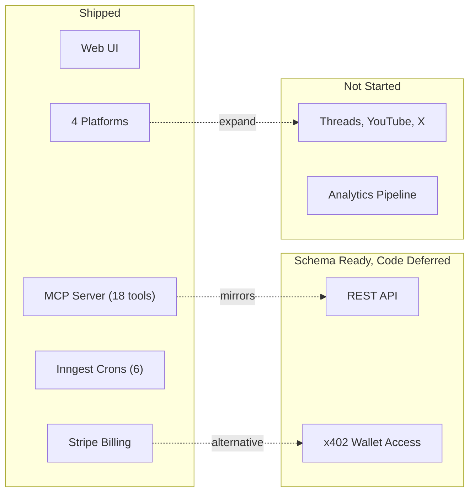

# Roadmap

Features and improvements that are deferred, in-progress, or blocked. This reflects the current state of the codebase, not aspirational goals.

[Back to README](../README.md)

## Implementation status

## Deferred features

### REST API (Phase 2)

A public REST API mirroring the MCP tools (schedule, cancel, list, etc.) with `stp_rest_*` API keys. The `api_keys` table already supports `kind=rest` and the `created_via=api` enum value exists.

**Status:** Deferred. Waiting for MCP traffic signal before investing in a parallel API surface.

### x402 anonymous wallet access (Phase 4)

Wallet-based authentication using SIWE (Sign-In With Ethereum). Users pay per-action with USDC credits instead of a monthly subscription.

Schema tables exist: `wallets`, `wallet_credits`, `wallet_credits_ledger`, `x402_charges`, `x402_refunds`, `x402_access_log`, `pricing_actions`, `siwe_nonces`, `usdc_fmv_daily`, `sanctions_screenings`.

The `principals.kind=wallet` path and `created_via=x402` enum are wired but no code path is built.

**Status:** Deferred. Schema ready, code path not started.

### Platform deduplication refactors

The 4 platform integrations share similar patterns for OAuth, token refresh, and posting. Three generic helpers now handle the common logic (`directPostForAccountsGeneric.ts`, `processAccountsGeneric.ts`, `scheduleForAccountGeneric.ts` in `src/lib/api/_shared/`). The 9 platform-specific wrappers are now thin adapters over these generics.

**Status:** Shipped. Remaining platform-specific duplication is minimal.

## Recently shipped

### list_pinterest_boards MCP tool

The `list_pinterest_boards` tool lets MCP agents discover board IDs for Pinterest posting. Parameters: `social_account_id` (required), `page_size` (1-100, default 25), `bookmark` (pagination cursor). Returns board id, name, description, privacy, pin_count.

### bulk_post_now MCP tool

The `bulk_post_now` tool publishes up to 30 posts immediately in one call. Creator+ tier. Same idempotent retry pattern as `bulk_schedule` (batch_id derives per-post idempotency keys).

### Idempotent retries on MCP write tools

`schedule_post`, `post_now`, and `bulk_post_now` accept an optional `idempotency_key` parameter. DB-enforced via UNIQUE constraint on `(principal_id, idempotency_key)`. Safe to retry on network errors.

### SSRF guard on attach_media_from_url

`safeUserFetch` (`src/lib/mcp/_shared/safeUserFetch.ts`) blocks 14 IP ranges (loopback, link-local, RFC 1918, CGNAT, IPv6 ULA, IPv4-mapped IPv6, multicast, reserved), rejects non-http(s) schemes, blocks redirects, validates content-type, and enforces a stream-based byte counter (Content-Length untrusted). Rate limited at 10/60s per principal.

### Storage quota enforcement parity

`enforceStorageQuota` (`src/lib/mcp/_shared/enforceStorageQuota.ts`) calls the `get_user_storage_bytes` Postgres RPC to read actual bytes from `storage.objects`. Used by both `generateServerSignedUploadUrl` (web/MCP upload) and `attach_media_from_url`.

### MCP tool annotations

All 18 tools carry Connectors Directory annotations: `readOnlyHint`, `destructiveHint`, `idempotentHint`, `openWorldHint`.

### clientInfo capture

The MCP route handler extracts `clientInfo.name` and `clientInfo.version` from the initialize handshake and stores them in `mcp_sessions.client_name` and `mcp_sessions.client_version`.

## Open issues

### Analytics metrics population

The `analytics_metrics` table exists and the `get_account_analytics` MCP tool reads from it, but no cron or background job populates it. The tool returns whatever is in the table (currently empty for most users).

A QStash-based refresh job was mentioned in a code comment but the `@upstash/qstash` dependency is not imported anywhere.

**Status:** Table exists, data pipeline not built.

### TikTok unaudited app limitations

TikTok's unaudited developer apps have restrictions that affect posting:
- `picture_size_check_failed` errors for non-square images
- Default privacy `SELF_ONLY` (private posts)
- Limited API rate quotas

These resolve when the TikTok app passes audit review.

**Status:** Known limitation, depends on TikTok developer app approval.

### Instagram connect button

The Instagram OAuth backend (initiate, connect, post, process) is fully functional, but the "Connect Instagram" button is commented out in the connections page UI component.

**Status:** Backend ready, UI button disabled.

### i18n

Internationalization is declared in `i18n-config.ts` (fr, en, es) and dependencies (`i18next`, `react-i18next`, `next-i18next`) are installed. No translation files exist. The UI is English only.

**Status:** Infrastructure in place, no translations.

### Studio/Analytics page

The Studio page at `/studio` shows a "Coming Soon" placeholder. The `analytics_metrics` table exists but has no data pipeline.

**Status:** Placeholder UI only.

## Won't fix (for now)

### Additional platform integrations

Threads, YouTube, X/Twitter, and Facebook appear in type definitions (`social_accounts.platform` enum) but building integrations for these is not planned until the current 4 platforms are stable and the user base warrants it.

### QStash removal

`@upstash/qstash` is listed as a dependency but is not imported in any source file. It was likely used before the migration to Inngest. Removing it is low-risk but low priority.

---

**See also:** [docs/ARCHITECTURE.md](./ARCHITECTURE.md) (system overview), [docs/MCP.md](./MCP.md) (tool inventory), [docs/SECURITY.md](./SECURITY.md) (security mechanisms)

[Back to README](../README.md)
