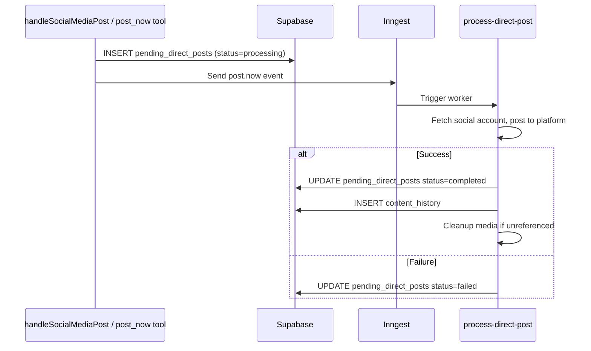

# Scheduling

How posts move from creation to publication. Covers the scheduled post lifecycle, direct posting, lock tables, the `created_via` enum, and retry behavior.

[Back to README](../README.md)

## Lifecycle

```mermaid
stateDiagram-v2
    [*] --> scheduled: User or agent creates post
    scheduled --> queued: scheduled-posts-tick cron (every 5 min, batch <=200)
    scheduled --> cancelled: cancel_scheduled_posts
    cancelled --> scheduled: resume_scheduled_posts (past dates rescheduled +1h)
    queued --> processing: process-single-post claims row (CAS update)
    processing --> posted: Platform publish success
    processing --> failed: Terminal error
    posted --> [*]
    failed --> [*]

    note right of queued: Dedup via event ID = postId:scheduledAt (24h window)
    note right of processing: Retryable errors (auth_expired, rate_limited, transient) throw for Inngest retry
    note left of failed: Failed posts also INSERT into failed_posts table
```

### Status transitions

| From | To | Trigger | Notes |
|------|----|---------|-------|
| (new) | scheduled | schedulePostInternal, bulk_schedule | created_via set at insert time |
| scheduled | queued | scheduled-posts-tick cron | Batch up to 200. Status updated before event dispatch. |
| scheduled | cancelled | cancel_scheduled_posts | Only scheduled status can be cancelled |
| cancelled | scheduled | resume_scheduled_posts | If scheduled_at <= now, bumps to now + 1 hour |
| queued | processing | process-single-post | Compare-and-swap (WHERE status=queued) prevents double-processing |
| processing | posted | Platform publish success | posted_at set to now(). Content history inserted. |
| processing | failed | Terminal platform error | Error recorded in error_message. failed_posts row inserted. |

## created_via

Every post-related table (scheduled_posts, failed_posts, content_history) stores a `created_via` field tracking the origin:

| Value | Meaning |
|-------|---------|
| `web` | Created through the web UI (handleSocialMediaPost) |
| `mcp` | Created through an MCP tool call |
| `x402` | Created through x402 anonymous wallet (deferred, not yet implemented) |
| `api` | Created through REST API (deferred, not yet implemented) |

The value is threaded through `schedulePostInternal`, `storeContentHistory`, and `storeFailedPost`. This was added in commit `FIX SCHEDULE-CREATED-VIA` to enable per-origin analytics.

## Direct posting (post now)

Direct posts bypass the scheduled_posts table entirely. The flow uses `pending_direct_posts` as a lock table to prevent race conditions during media cleanup.



The `pending_direct_posts` row is inserted *before* the Inngest event is sent. This ensures that even if the worker starts immediately, the lock row already exists. The worker's `finalizePendingDirectPost` only updates rows with `status=processing` (idempotent on re-invocation).

## Lock tables

Two tables serve as processing locks to prevent premature media cleanup:

### pending_direct_posts

Tracks direct "post now" operations. One row per platform per dispatch.

| Column | Purpose |
|--------|---------|
| event_id (PK) | Inngest event ID. Duplicate inserts are treated as success. |
| batch_id | Groups multi-platform posts from one user action |
| principal_id | Owner |
| social_account_id | Target account |
| platform | Target platform |
| media_storage_path | File being used (prevents cleanup while in-flight) |
| status | processing, completed, failed |
| failure_reason | Error message on failure |
| finished_at | Timestamp when finalized |

### pending_tiktok_pulls

Tracks TikTok async publish polling. TikTok's pull model means the publish can take minutes.

| Column | Purpose |
|--------|---------|
| publish_id (PK) | TikTok publish ID from content/init response |
| principal_id | Owner |
| social_account_id | TikTok account |
| scheduled_post_id | FK to scheduled_posts (null for direct posts) |
| media_storage_path | File being pulled by TikTok |
| status | pending, completed, failed |
| attempt_count | Number of poll attempts so far |
| last_polled_at | Timestamp of last poll |
| failure_reason | Error on terminal failure |

Both tables are checked by `deleteSupabaseFileActionInternal` and `cleanupMediaIfUnreferenced` before deleting any storage file.

## Retry strategy

Inngest handles retries for `process-single-post`:

- **Max retries:** `RUNTIME.maxRetries` (default 3, capped at 20)
- **Backoff:** Inngest default exponential backoff
- **Throttle:** `RUNTIME.perAccountThrottlePerMinute` (default 5) per social_account_id

Error classification (`src/inngest/functions/platformErrors.ts`):

| Reason | Retryable | Example |
|--------|-----------|---------|
| `auth_expired` | Yes | Token expired, refresh failed |
| `rate_limited` | Yes | Platform 429 response |
| `transient` | Yes | Network timeout, connection reset |
| `policy_rejected` | No | Pinterest domain block, TikTok policy violation |
| `invalid_input` | No | Text post to Pinterest, missing board ID |
| `unknown` | No | Unmapped error |

Terminal failures record the error in `scheduled_posts.error_message` and insert a `failed_posts` row. Retryable failures throw an exception, which Inngest catches for retry.

`process-direct-post` has 0 retries (fire-and-forget from the user's perspective).

## Idempotency

`bulk_schedule` uses `idempotency_key = ${batchId}:${index}` with a unique index on `(principal_id, idempotency_key)`. Retrying a bulk_schedule call with the same batch_id is safe: duplicate rows are detected via `onConflict` and existing IDs are looked up.

The `scheduled-posts-tick` dispatcher uses `eventId = ${postId}:${scheduledAt}` with a 24-hour dedup window in Inngest, preventing duplicate dispatch if the cron fires twice for the same batch.

## Sweep crons

Two crons clean up stuck or orphaned data:

- **sweep-stuck-direct-posts** (every 5 min): Marks `pending_direct_posts` rows stuck in `processing` for over 10 minutes as `failed`. See [docs/INNGEST.md](./INNGEST.md).
- **sweep-orphan-storage-files** (daily 03:00 UTC): Deletes storage files older than 24 hours not referenced by any of the 4 media tables. See [docs/INNGEST.md](./INNGEST.md).

---

[Back to README](../README.md)
