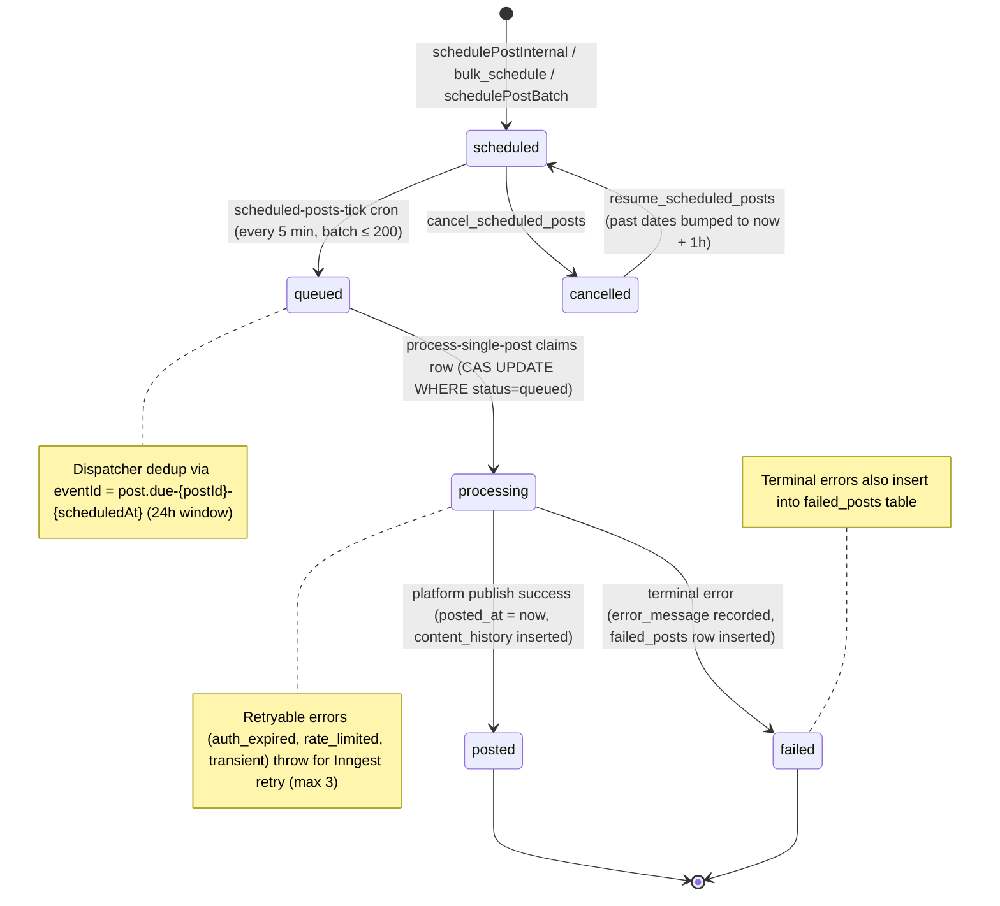
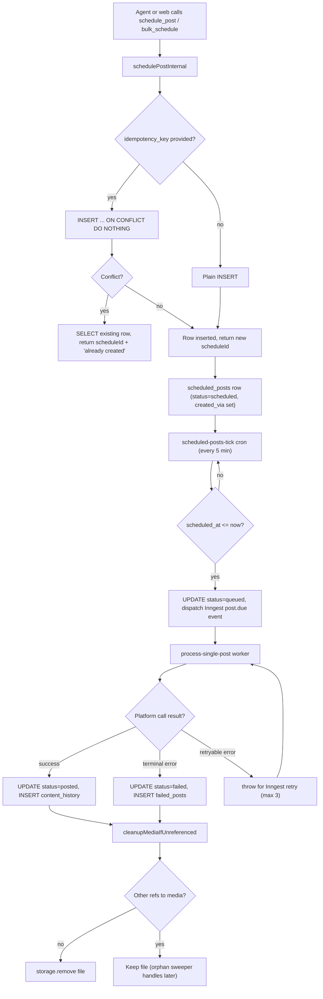
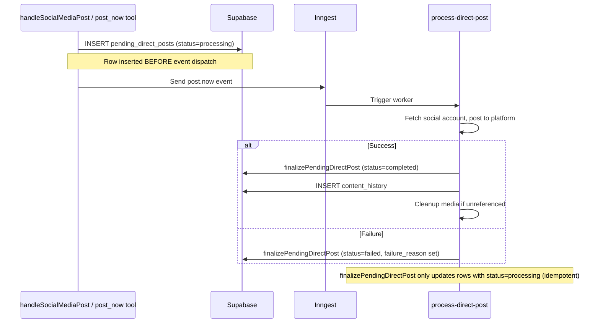
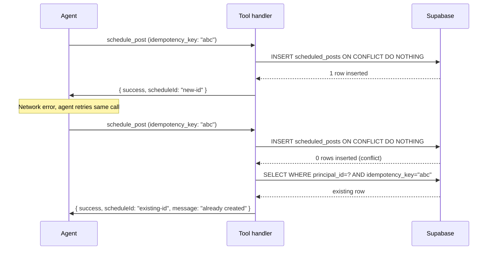

# Scheduling

How posts move from creation to publication. Covers the scheduled post state machine, direct posting, lock tables, fan-out, idempotency, retry behavior, and sweep crons.

[Back to README](../README.md)

## Table of contents

- [State machine](#state-machine)
- [Full lifecycle](#full-lifecycle)
- [Status transitions](#status-transitions)
- [created_via](#created_via)
- [Direct posting (post now)](#direct-posting-post-now)
- [Cross-platform fan-out](#cross-platform-fan-out)
- [Lock tables](#lock-tables)
  - [pending_direct_posts](#pending_direct_posts)
  - [pending_tiktok_pulls](#pending_tiktok_pulls)
- [Idempotency](#idempotency)
- [Retry strategy](#retry-strategy)
- [Cancel, resume, reschedule, delete](#cancel-resume-reschedule-delete)
- [Subscription-triggered cancel](#subscription-triggered-cancel)
- [Sweep crons](#sweep-crons)
- [Source files referenced](#source-files-referenced)

## State machine

The `scheduled_posts.status` column drives all lifecycle transitions. Retryable errors do not produce a status change. The worker throws an exception and Inngest retries the same row.

## Full lifecycle

From creation through publish to media cleanup.

## Status transitions

| From | To | Trigger | Notes |
|------|-----|---------|-------|
| (new) | scheduled | schedulePostInternal, bulk_schedule, schedulePostBatch | `created_via` set at insert time |
| scheduled | queued | scheduled-posts-tick cron | Batch up to 200. Status updated before event dispatch. |
| scheduled | cancelled | cancel_scheduled_posts | Only `scheduled` status can be cancelled |
| cancelled | scheduled | resume_scheduled_posts | Past dates bumped to now + 1 hour via `bumpPastScheduleToFuture` |
| queued | processing | process-single-post | Compare-and-swap (`WHERE status=queued`) prevents double-processing |
| processing | posted | Platform publish success | `posted_at` set to `now()`. Content history inserted. |
| processing | failed | Terminal platform error | Error recorded in `error_message`. `failed_posts` row inserted. |

## created_via

Every post-related table (`scheduled_posts`, `failed_posts`, `content_history`) stores a `created_via` field that tracks origin. The value is threaded through `schedulePostInternal`, `storeContentHistory`, and `storeFailedPost` for per-origin analytics.

| Value | Meaning |
|-------|---------|
| `web` | Created through the web UI (`handleSocialMediaPost`) |
| `mcp` | Created through an MCP tool call |
| `x402` | Created through x402 anonymous wallet |
| `api` | Created through REST API |

## Direct posting (post now)

Direct posts bypass the `scheduled_posts` table entirely. The flow uses `pending_direct_posts` as a lock table so media cleanup cannot race with in-flight publishes.

The lock row is inserted BEFORE the Inngest event is dispatched. This guarantees the row exists when the worker starts, even if Inngest picks up the event immediately.

TikTok is a special case. On successful content/init, media cleanup is deferred to the poll or webhook worker because TikTok pulls the media asynchronously.

## Cross-platform fan-out

A single user action can target multiple platforms. One `batch_id` groups all the resulting posts.

| Path | Max posts per call | Rate limit |
|------|--------------------|------------|
| `directPostBatch` (post now) | 30 | 20 per 60 seconds |
| `schedulePostBatch` (schedule) | 50 | 10 per 60 seconds |

A daily cap of 50 posts per platform is enforced using a 24-hour lookback window.

## Lock tables

Two tables prevent premature media cleanup while posts are in flight. Both are checked by `deleteSupabaseFile` and `cleanupMediaIfUnreferenced` before removing any storage file.

### pending_direct_posts

One row per platform per dispatch. Tracks direct "post now" operations.

| Column | Purpose |
|--------|---------|
| `event_id` (PK) | Inngest event ID. Duplicate inserts treated as success. |
| `batch_id` | Groups multi-platform posts from one user action |
| `principal_id` | Owner |
| `social_account_id` | Target account |
| `platform` | Target platform |
| `media_storage_path` | File being used (prevents cleanup while in-flight) |
| `status` | `processing`, `completed`, `failed` |
| `failure_reason` | Error message on failure |
| `idempotency_key` | For dedup on retry |
| `finished_at` | Timestamp when finalized |

### pending_tiktok_pulls

Tracks TikTok async publish operations. TikTok's pull model means the publish can take minutes after the initial content/init call. This table keeps media alive until TikTok finishes pulling it.

| Column | Purpose |
|--------|---------|
| `publish_id` (PK) | TikTok publish ID from content/init response |
| `principal_id` | Owner |
| `social_account_id` | TikTok account |
| `scheduled_post_id` | FK to `scheduled_posts` (null for direct posts) |
| `content_history_id` | FK to `content_history` |
| `media_storage_path` | File being pulled by TikTok |
| `status` | `pending`, `completed`, `failed` |
| `attempt_count` | Number of poll attempts so far |
| `last_polled_at` | Timestamp of last poll |
| `finalized_at` | Timestamp when resolved |
| `failure_reason` | Error on terminal failure |
| `tiktok_post_id` | TikTok's post ID on success |
| `creator_username` | TikTok creator username for URL construction |

## Idempotency

Four tools support idempotent retries. This protects against duplicate posts when an agent retries after a network error or timeout.

All four use `INSERT ... ON CONFLICT DO NOTHING`. On conflict, the handler fetches the existing row and returns its ID with an "already created" or "already dispatched" message. The key is optional. Omitting it means no dedup (every call creates a new row).

| Tool | Key source | Target table | Constraint |
|------|-----------|--------------|------------|
| `schedule_post` | `idempotency_key` param (optional, 1-200 chars) | `scheduled_posts` | UNIQUE on `(principal_id, idempotency_key)` |
| `post_now` | `idempotency_key` param (optional, 1-200 chars) | `pending_direct_posts` | UNIQUE on `(principal_id, idempotency_key)` |
| `bulk_schedule` | Derived: `${batchId}:${index}` | `scheduled_posts` | Same |
| `bulk_post_now` | Derived: `${batch_id}:${index}` | `pending_direct_posts` | Same |

The `scheduled-posts-tick` dispatcher also deduplicates at the Inngest layer. It sets `eventId = post.due-${postId}-${scheduledAt}` with a 24-hour dedup window, preventing duplicate dispatch if the cron fires twice for the same batch.

## Retry strategy

`process-single-post` retries on transient failures. `process-direct-post` does not retry (0 retries, fire-and-forget from the user's perspective).

**Scheduled post retries:**

- Max retries: `RUNTIME.maxRetries` (default 3, capped at 20)
- Backoff: Inngest default exponential backoff
- Throttle: 5 per minute per `social_account_id`

**Error classification:**

| Reason | Retryable | Example |
|--------|-----------|---------|
| `auth_expired` | Yes | Token expired, refresh failed |
| `rate_limited` | Yes | Platform 429 response |
| `transient` | Yes | Network timeout, connection reset |
| `policy_rejected` | No | Pinterest domain block, TikTok policy violation |
| `invalid_input` | No | Text post to Pinterest, missing board ID |
| `unknown` | No | Unmapped error |

Terminal failures: `error_message` is recorded on the `scheduled_posts` row and a `failed_posts` row is inserted.

Retryable failures: the worker throws an exception, Inngest catches it and retries with backoff.

## Cancel, resume, reschedule, delete

| Operation | Behavior |
|-----------|----------|
| **Cancel** | Only posts with `status=scheduled` can be cancelled. Sets `status=cancelled`. |
| **Resume** | Moves `cancelled` posts back to `scheduled`. Past dates are bumped to now + 1 hour via `bumpPastScheduleToFuture`. |
| **Reschedule** | Changes `scheduled_at` for 1 to 50 posts. Automatically resumes cancelled posts (no separate resume call needed). |
| **Delete** | Permanent removal. Orphan media is cleaned up. |

## Subscription-triggered cancel

When a user cancels their subscription, the system automatically cancels their future scheduled posts and provides a grace period before cleanup.

1. `cancelFutureScheduledPostsOnSubCancel` sets `status=cancelled` and `cancelled_by_sub_at=now()` for all future scheduled posts belonging to that user.
2. The `cleanup-cancelled-posts-after-grace` cron runs after a 7-day grace period to permanently remove system-cancelled posts.
3. If the user resubscribes within the grace period, `resumeCancelledPostsOnResubscribe` resumes all system-cancelled posts. Past dates are bumped forward.

## Sweep crons

Two crons clean up stuck or orphaned data.

| Cron | Schedule | Behavior |
|------|----------|----------|
| `sweep-stuck-direct-posts` | Every 5 minutes | Marks `pending_direct_posts` rows stuck in `processing` for over 10 minutes as `failed` |
| `sweep-orphan-storage-files` | Daily at 03:00 UTC | Deletes storage files older than 24 hours that are not referenced by any of the 4 media tables |

## Post options

Platform-specific options are stored in the `post_options` JSONB column on `scheduled_posts`.

| Platform | Fields |
|----------|--------|
| Pinterest | `pinterest_board_id`, `pinterest_board_name`, `pinterest_link` |
| TikTok | `privacy_level`, `cover_image_timestamp` |

## Source files referenced

| File | What it does |
|------|-------------|
| `src/inngest/functions/scheduledPostsTick.ts` | Cron that moves `scheduled` to `queued` (batch up to 200) |
| `src/inngest/functions/processSinglePost.ts` | Worker that claims and publishes a queued post |
| `src/inngest/functions/processDirectPost.ts` | Worker for direct "post now" operations (0 retries) |
| `src/inngest/functions/platformErrors.ts` | Error classification (retryable vs terminal) |
| `src/inngest/functions/sweepStuckDirectPosts.ts` | Sweep for stuck `pending_direct_posts` rows |
| `src/inngest/functions/sweepOrphanStorageFiles.ts` | Daily cleanup of unreferenced storage files |
| `src/inngest/functions/cleanupCancelledPostsAfterGraceCron.ts` | 7-day grace period cleanup after subscription cancel |
| `src/actions/server/scheduleActions/schedule/schedulePostBatch.ts` | Core scheduling logic, fan-out for scheduled posts (max 50, rate limited) |
| `src/actions/server/directPostActions/directPostBatch.ts` | Fan-out for direct posts (max 30, rate limited) |
| `src/actions/server/data/pendingDirectPosts.ts` | Idempotent finalization of direct post lock rows |
| `src/actions/server/scheduleActions/cancel/cancelScheduledPostBatch.ts` | Cancel scheduled posts |
| `src/actions/server/scheduleActions/resume/resumeScheduledPostBatch.ts` | Resume cancelled posts |
| `src/actions/server/scheduleActions/reschedule/updateScheduledTimeBatch.ts` | Reschedule posts |
| `src/actions/server/scheduleActions/delete/deleteScheduledPostBatch.ts` | Delete scheduled posts |
| `src/actions/server/data/cancelFutureScheduledPostsOnSubCancel.ts` | Subscription-triggered cancel |
| `src/actions/server/data/resumeCancelledPostsOnResubscribe.ts` | Resume posts on resubscribe |
| `src/actions/server/data/storageFiles/deleteSupabaseFile.ts` | Checks both lock tables before deleting media |
| `src/inngest/functions/processSinglePostHelpers.ts` | Cross-table reference check before media removal |

---

**See also:** [docs/SECURITY.md](./SECURITY.md) (idempotency deep dive), [docs/INNGEST.md](./INNGEST.md) (worker details, retry config), [docs/MCP.md](./MCP.md) (schedule_post and post_now tool params)

[Back to README](../README.md)
