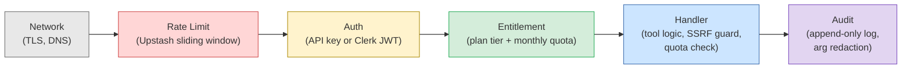
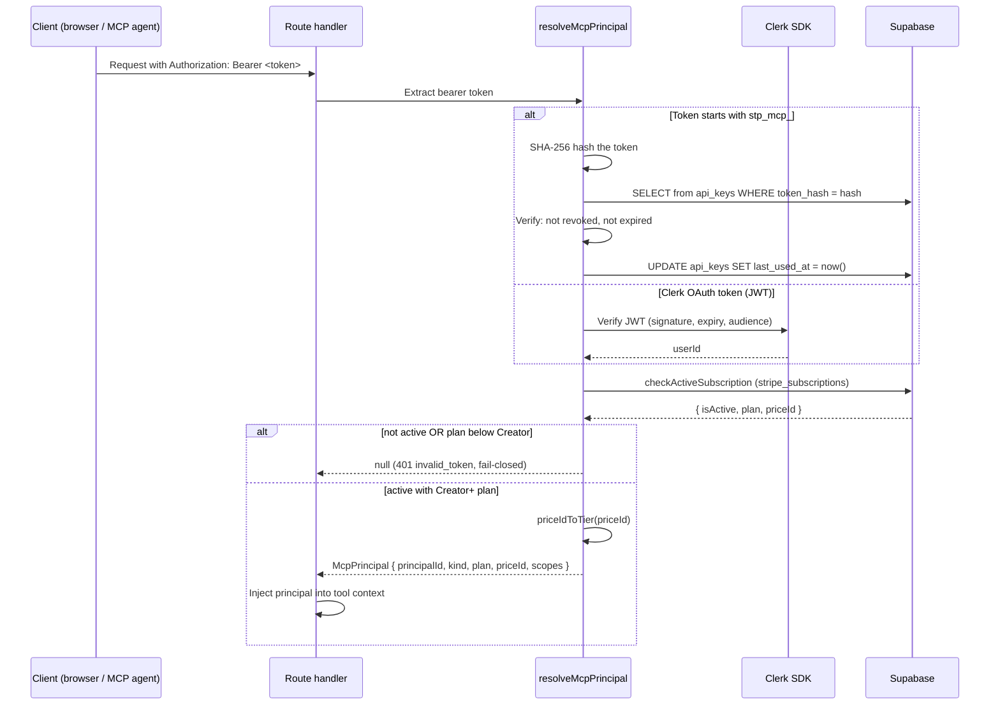
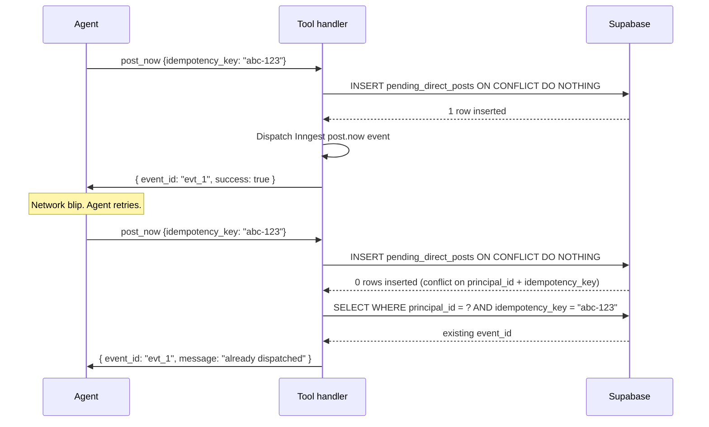
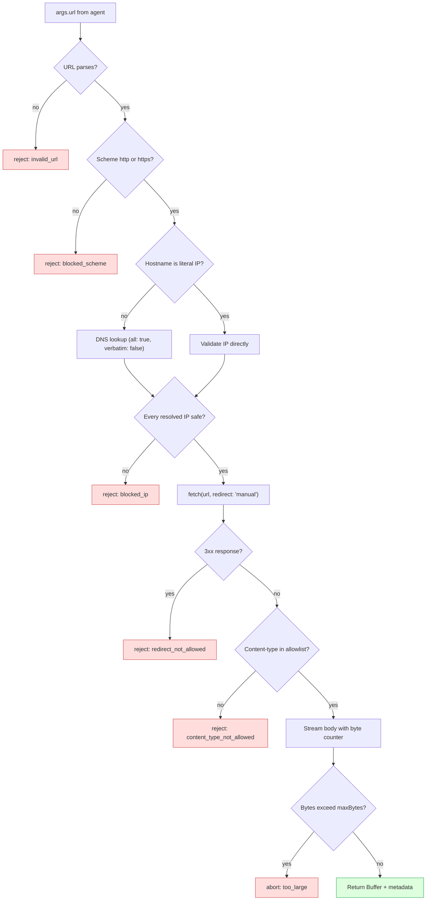
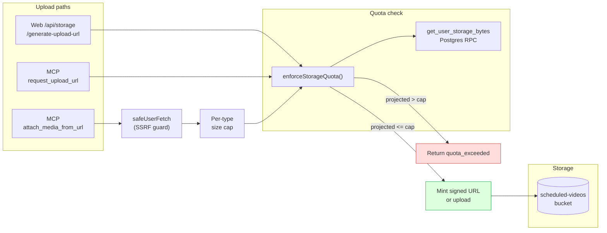
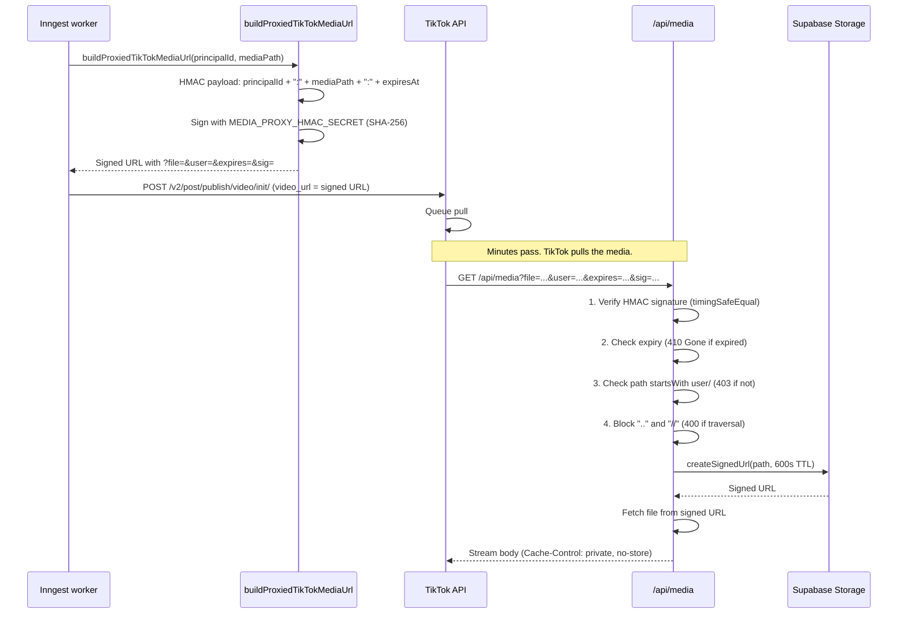

# Security Architecture

Every security mechanism in Sharetopus, organized by the attack it stops, the code that implements the defense, and the known gaps.

[Back to README](../README.md)

## Table of Contents

- [Defense Layers](#defense-layers)
- [Threat Model](#threat-model)
- [Identity Flow](#identity-flow)
- [Rate Limiting](#rate-limiting)
- [Idempotency](#idempotency)
- [SSRF Guard](#ssrf-guard)
- [Storage Quota Enforcement](#storage-quota-enforcement)
- [TikTok HMAC Media Proxy](#tiktok-hmac-media-proxy)
- [Webhook Verification](#webhook-verification)
- [Append-Only Audit](#append-only-audit)
- [Data Protection](#data-protection)
- [XSS Prevention](#xss-prevention)
- [Known Gaps](#known-gaps)
- [Compliance Posture](#compliance-posture)
- [Source Files Referenced](#source-files-referenced)

## Defense Layers

Every inbound request passes through these layers in order. A failure at any layer rejects the request immediately.

MCP route-level rate limiting (100/60s per IP) runs before auth. All other rate limits run after auth, scoped to the authenticated principal.

## Threat Model

| # | Attack | Defense | Implementation |
|---|--------|---------|----------------|
| 1 | Duplicate posts from MCP retry | `idempotency_key` + DB UNIQUE constraint | `schedulePost.ts`, `postNow.ts`, `bulkPostNow.ts`, `bulkSchedule.ts` |
| 2 | SSRF via `attach_media_from_url` (e.g. cloud metadata at 169.254.169.254) | `safeUserFetch` with 14 IP ranges blocked | `safeUserFetch.ts` |
| 3 | Oversized file with fake Content-Length | Stream-based byte counter (Content-Length never trusted) | `safeUserFetch.ts` |
| 4 | Storage quota bypass | `enforceStorageQuota` via `get_user_storage_bytes` RPC | `enforceStorageQuota.ts` |
| 5 | `attach_media_from_url` flood | 10/60s rate limit + monthly cap per tier | `attachMediaFromUrl.ts` |
| 6 | Cross-user storage access | Path `startsWith(principalId/)` check | `/api/storage/generate-view-url`, `/api/media` |
| 7 | TikTok media URL forgery | HMAC-SHA256 + 30-min expiry | `buildProxiedTikTokMediaUrl.ts` |
| 8 | Media proxy path traversal | Block `..`, `//`, leading `/` | `/api/media/route.ts` |
| 9 | Audit log tampering | Append-only table (Update: never, DB trigger) | `mcp_audit_log` table |
| 10 | Concurrent quota race condition | `atomic_increment_quota` Postgres function | `entitlement.ts` |
| 11 | Monthly cap exhaustion | Per-tier quotas enforced atomically | `entitlement.ts` |
| 12 | IP tracking privacy leak | SHA-256 hash with configurable salt | `ipHash.ts` |
| 13 | Sensitive args in audit log | Regex redaction of 12 key patterns + JWT detection | `audit.ts` |
| 14 | Unauthorized MCP access flood | Route-level rate limit: 100/60s per IP (before auth) | MCP route handler |
| 15 | XSS via MCP `clientInfo` | `sanitizeClientField` strips control chars + HTML injection chars | MCP server init |
| 16 | Stripe webhook replay | Signature verification + `stripe_webhook_events` idempotency table | Stripe webhook handler |
| 17 | TikTok webhook replay | HMAC-SHA256 + 300s tolerance + `tiktok_webhook_events` idempotency table | TikTok webhook handler |

## Identity Flow

Two auth paths converge on a single `McpPrincipal` with a cached subscription tier. Free and Starter tiers are blocked at the subscription gate (Creator+ required for MCP).

**Fail-closed behavior.** If `checkActiveSubscription` returns `isActive: false`, errors, or the plan is below Creator, the request is blocked. No principal is returned.

**McpPrincipal type** (discriminated union):
- `kind: "apikey"` carries `apiKeyId`, `scopes`
- `kind: "oauth"` carries `oauthClientId`, `scopes`
- Both carry `principalId`, `plan` (PlanTier), `priceId`

The plan tier is resolved once during auth and cached on the principal. Tools and entitlement checks read `principal.plan` without querying `stripe_subscriptions` again.

## Rate Limiting

### Per-request limits

All per-request rate limits use Upstash Redis sliding window (`@upstash/ratelimit`).

| Path | Scope | Limit | Window | Storage |
|------|-------|-------|--------|---------|
| MCP route (pre-auth) | per IP | 100 | 60s | Upstash |
| `attach_media_from_url` | per principal | 10 | 60s | Upstash |
| `request_upload_url` | per principal | 20 | 60s | Upstash |
| `handleSocialMediaPost` | per user | 30 | 60s | Upstash |
| `checkOutSession` | per user | 15 | 60s | Upstash |
| `createCustomerPortal` | per user | 20 | 60s | Upstash |
| `directPostBatch` | per source | 20 | 60s | Upstash |
| `schedulePostBatch` | per source | 10 | 60s | Upstash |
| DCR registration | per IP | 1/min, 10/day | | Supabase `rate_limit_events` |
| Pinterest board listing | per account | 15 | 60s | Upstash |

### Monthly caps (per-tier, atomic)

Enforced by `entitlementFor` in `src/lib/mcp/entitlement.ts` via `atomic_increment_quota` Postgres RPC. The increment is atomic at the database level, preventing race conditions between concurrent requests.

| Action | Creator | Pro |
|--------|---------|-----|
| `schedule_post` | 500 | unlimited |
| `post_now` | 500 | unlimited |
| `request_upload_url` | 500 | unlimited |
| `attach_media_from_url` | 500 | unlimited |
| `bulk_schedule` | 200 | unlimited |
| `bulk_post_now` | 500 | unlimited |
| `generate_post_draft` | 100 | unlimited |

Starter tier: 0 for all actions (completely blocked from MCP at the auth gate).

Period key format: `YYYY-MM-01` (first of month, UTC), generated by `currentQuotaPeriod()`.

## Idempotency

MCP write tools that create posts support Stripe-style idempotent retries. An agent that retries after a network error with the same `idempotency_key` gets back the original result instead of creating a duplicate.

### Supported tools

| Tool | Key source | Target table |
|------|-----------|-------------|
| `schedule_post` | `idempotency_key` param (optional, 1-200 chars) | `scheduled_posts` |
| `post_now` | `idempotency_key` param (optional, 1-200 chars) | `pending_direct_posts` |
| `bulk_schedule` | Derived: `${batchId}:${index}` from `batch_id` param | `scheduled_posts` |
| `bulk_post_now` | Derived: `${batch_id}:${index}` from `batch_id` param | `pending_direct_posts` |

DB enforcement: partial unique index on `(principal_id, idempotency_key)` on both tables. All four tools use `INSERT ... ON CONFLICT DO NOTHING`.

The key is optional. Omitting it means no deduplication (every call creates a new row). Agents should always supply one when retries are possible.

### Dispatcher-level dedup

The `scheduled-posts-tick` cron uses `eventId = ${postId}:${scheduledAt}` with a 24-hour dedup window in Inngest, preventing duplicate dispatch if the cron fires twice for the same batch.

## SSRF Guard

`safeUserFetch` protects `attach_media_from_url` from Server-Side Request Forgery. An agent could submit a URL pointing at internal infrastructure (cloud metadata endpoints, private services). The guard blocks this at multiple layers.

### Blocked IP ranges

14 ranges covering IPv4 and IPv6. Unrecognized IP formats fail closed (treated as blocked).

**IPv4:**

| CIDR | Description |
|------|-------------|
| `0.0.0.0/8` | Unspecified |
| `10.0.0.0/8` | Private (RFC 1918) |
| `100.64.0.0/10` | CGNAT (RFC 6598) |
| `127.0.0.0/8` | Loopback |
| `169.254.0.0/16` | Link-local |
| `172.16.0.0/12` | Private (RFC 1918) |
| `192.168.0.0/16` | Private (RFC 1918) |
| `224.0.0.0/4` | Multicast |
| `240.0.0.0/4` | Reserved + broadcast |

**IPv6:**

| CIDR | Description |
|------|-------------|
| `::1/128` | Loopback |
| `::/128` | Unspecified |
| `fe80::/10` | Link-local |
| `fc00::/7` | Unique Local Address (ULA) |
| `::ffff:0:0/96` | IPv4-mapped (embedded IPv4 re-checked against IPv4 ranges) |

### Additional guards

- **Scheme validation.** Only `http:` and `https:` are allowed. `file:`, `ftp:`, `data:`, `gopher:` are rejected.
- **Redirect blocking.** `fetch` is called with `redirect: "manual"`. Any 3xx response is rejected. This prevents TOCTOU attacks where DNS resolves to a safe IP but the redirect target is internal.
- **Content-type validation.** Response content-type is checked against an allowlist (prefix match + exact match). Strips parameters before comparison.
- **Stream-based byte counter.** Body is read chunk-by-chunk via `response.body.getReader()`. A running `byteCount` is compared against `maxBytes` on each chunk. If exceeded, the fetch is aborted. The Content-Length header is never trusted.
- **Timeouts.** Connect timeout (5s) and total timeout (30s) via AbortController.
- **User-Agent.** Requests identify as `Sharetopus-MCP/1.0`.

## Storage Quota Enforcement

Three upload paths all converge on a single enforcement function.

`enforceStorageQuota` is the single enforcement point for all three upload paths:

1. Calls `get_user_storage_bytes` Postgres RPC with `_bucket = "scheduled-videos"` and `_prefix = "{principalId}/"`.
2. The RPC reads `storage.objects` directly (no pagination, no estimation).
3. Computes `projected = currentBytes + additionalBytes`.
4. Compares against `STORAGE_LIMITS[priceId]` (falls back to 5 GB default).
5. Returns allow or deny with current/cap in the error message.

| Plan | Storage cap |
|------|-------------|
| Starter | 5 GB |
| Creator | 15 GB |
| Pro | 45 GB |
| Default (unknown priceId) | 5 GB |

Per-file size caps (all plans): image 8 MB, video 250 MB.

## TikTok HMAC Media Proxy

TikTok's pull model requires a publicly accessible URL for media. Sharetopus uses an HMAC-signed proxy (`/api/media`) to serve files without exposing storage credentials.

**HMAC details:**
- Algorithm: SHA-256
- Secret: `MEDIA_PROXY_HMAC_SECRET` env var (64 hex chars)
- Payload: `${principalId}:${mediaPath}:${expiresAt}` (colon-separated)
- Expiry window: 30 minutes from URL creation
- Signature comparison: `crypto.timingSafeEqual` (constant-time, prevents timing attacks)
- Response: proxy streams the file body directly (no redirect). `Cache-Control: private, no-store`.

## Webhook Verification

### Stripe

Stripe webhooks are verified using the Stripe SDK's built-in signature check against `STRIPE_WEBHOOK_SECRET`. Processed events are recorded in the `stripe_webhook_events` table (append-only) for idempotency. If an event ID already exists, the handler returns early without reprocessing.

### TikTok

TikTok webhooks are verified with HMAC-SHA256. The signed payload is `${timestamp}.${rawBody}`, where the timestamp comes from the request header. Verification enforces a 300-second tolerance window to reject stale or replayed requests. Processed events are recorded in the `tiktok_webhook_events` table (append-only) for idempotency.

### Clerk

Clerk webhooks are verified using the Svix library's signature verification. This validates the webhook signature, timestamp, and payload integrity.

## Append-Only Audit

Eight tables are append-only (`Update: never` in database types, enforced at the DB layer):

| Table | Purpose | Retention |
|-------|---------|-----------|
| `mcp_audit_log` | Every MCP tool call with redacted args, result status, latency | 90 days (cleanup cron) |
| `stripe_invoices` | Payment records | Indefinite |
| `stripe_webhook_events` | Stripe webhook idempotency | 90 days (cleanup cron) |
| `tiktok_webhook_events` | TikTok webhook idempotency | Indefinite |
| `wallet_credits_ledger` | Credit transaction history (x402, deferred) | Indefinite |
| `x402_access_log` | Access audit trail (x402, deferred) | Indefinite |
| `x402_refunds` | Refund records (x402, deferred) | Indefinite |
| `sanctions_screenings` | Wallet sanctions check results (x402, deferred) | Indefinite |

### Argument redaction

The `mcp_audit_log` insert happens in `logToolCall`, which runs fire-and-forget after every tool call. Arguments are redacted before insert:

- **12 key patterns** replaced with `[REDACTED]`: token, password, secret, authorization, bearer, api_key, apikey, access_token, refresh_token, credential, private_key, jwt.
- **JWT detector** replaces strings matching the three-segment base64url pattern (`xxx.yyy.zzz`) with `[REDACTED_JWT]`.
- **Truncation** to 4096 chars after redaction.

## Data Protection

### IP hashing

Raw client IPs are never stored. All IP addresses are hashed before persistence.

- Algorithm: SHA-256
- Input: `ip + ":" + salt`
- Output: truncated to 32 hex chars
- Salt: `MCP_IP_HASH_SALT` env var, required in production (server throws if missing)
- Development: fallback salt with a warning log

### PII in audit logs

Token, password, secret, and JWT patterns are redacted before insert (see [Argument redaction](#argument-redaction) above).

### Data retention

| Data | Retention |
|------|-----------|
| `mcp_audit_log` | 90 days (via `cleanup-mcp-audit-log` cron) |
| `stripe_webhook_events` | 90 days (via `cleanup-stripe-webhook-events` cron) |
| Cancelled scheduled posts | 7-day grace period |
| `stripe_invoices` | Grows indefinitely (no cleanup) |
| `content_history` | Grows indefinitely (no cleanup) |

## XSS Prevention

### clientInfo sanitization

MCP clients send a `clientInfo` object containing `clientName` and `clientVersion` during session initialization. These values are stored and rendered in the admin dashboard.

`sanitizeClientField` strips:
- ASCII control characters (0x00-0x1f)
- HTML injection characters: `<`, `>`, `'`, `"`, `&`

This prevents stored-XSS when rendering client names in the dashboard. Field length limits: `clientName` max 200 chars, `clientVersion` max 50 chars.

## Known Gaps

These are acknowledged design decisions or low-severity issues, not bugs.

| # | Gap | Severity | Notes |
|---|-----|----------|-------|
| 1 | Cancelled `scheduled_posts` hold storage indefinitely | Design decision | Orphan sweep only catches unreferenced files. Cancelled posts still reference their media. |
| 2 | `expiresIn` on `/api/storage/generate-view-url` not capped server-side | Low | Own files only. Client could request a long-lived signed URL. |
| 3 | No alerting on orphan sweep counts | Low | Sweep logs stats to Inngest but no external notification hook. |
| 4 | No rate limit on view URL and media proxy endpoints | Low | Both require authentication (Clerk or HMAC). Abuse would require valid credentials. |
| 5 | No aggregate daily cap on `attach_media_from_url` | Low | Per-minute (10/60s) and per-month caps exist. A sustained 10/min attack over 24h would hit the monthly cap within a day for Creator users. |

## Compliance Posture

### Active

- **PII redaction in audit logs.** Token, password, secret, JWT patterns are redacted before insert.
- **IP hashing.** Raw client IPs are never stored. SHA-256 hashed with configurable salt.
- **Append-only financial tables.** `stripe_invoices` cannot be updated or deleted at the DB layer.
- **90-day audit retention.** `mcp_audit_log` and `stripe_webhook_events` are cleaned up by scheduled crons.

### Deferred (until x402 ships)

- **OFAC / FINTRAC / MiCA screening.** The `sanctions_screenings` table exists but no screening service is integrated.
- **Wallet KYC.** No identity verification for wallet-based access.
- **USDC fair market value tracking.** The `usdc_fmv_daily` table exists but is not populated.

## Source Files Referenced

| File | Role |
|------|------|
| `src/lib/mcp/tools/schedulePost.ts` | Schedule post with idempotency |
| `src/lib/mcp/tools/postNow.ts` | Immediate post with idempotency |
| `src/lib/mcp/tools/bulkPostNow.ts` | Bulk immediate post with derived idempotency keys |
| `src/lib/mcp/tools/bulkSchedule.ts` | Bulk schedule with derived idempotency keys |
| `src/lib/mcp/tools/attachMediaFromUrl.ts` | URL-based media attach (rate limited, SSRF guarded) |
| `src/lib/mcp/tools/requestUploadUrl.ts` | Signed upload URL generation (rate limited) |
| `src/lib/mcp/tools/generatePostDraft.ts` | AI draft generation (monthly capped) |
| `src/lib/mcp/_shared/safeUserFetch.ts` | SSRF guard (IP blocklist, scheme, redirect, byte counter) |
| `src/lib/mcp/_shared/enforceStorageQuota.ts` | Storage quota enforcement for all upload paths |
| `src/lib/mcp/_shared/currentQuotaPeriod.ts` | Monthly quota period key generation |
| `src/lib/mcp/entitlement.ts` | Plan tier checks, monthly cap enforcement via `atomic_increment_quota` |
| `src/lib/mcp/audit.ts` | Audit logging with arg redaction and JWT detection |
| `src/lib/mcp/ipHash.ts` | IP hashing (SHA-256 with salt) |
| `src/lib/api/tiktok/buildProxiedTikTokMediaUrl.ts` | HMAC-signed TikTok media URL builder |
| `src/app/api/media/route.ts` | Media proxy (HMAC verification, path traversal guard) |
| `src/app/api/storage/generate-view-url/route.ts` | Web view URL generation (Clerk auth, path ownership) |
| `src/app/api/storage/generate-upload-url/route.ts` | Web upload URL generation (storage quota check) |

---

**See also:** [docs/AUTH.md](./AUTH.md) (principal model, auth paths), [docs/MCP.md](./MCP.md) (tool inventory, annotations, idempotency), [docs/STORAGE.md](./STORAGE.md) (upload paths, orphan sweep)

[Back to README](../README.md)
