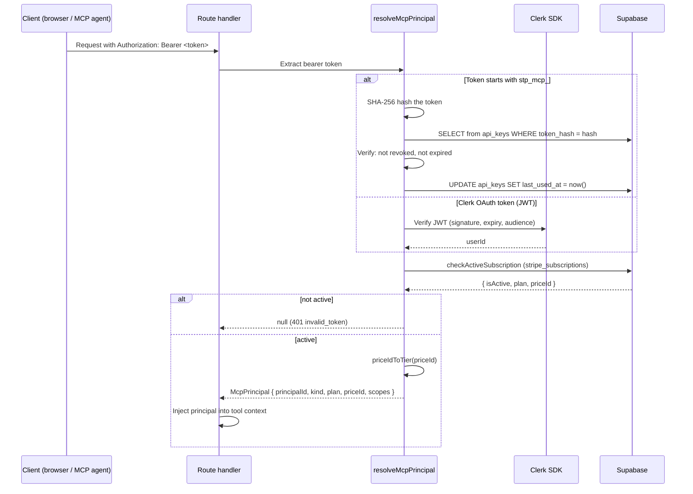
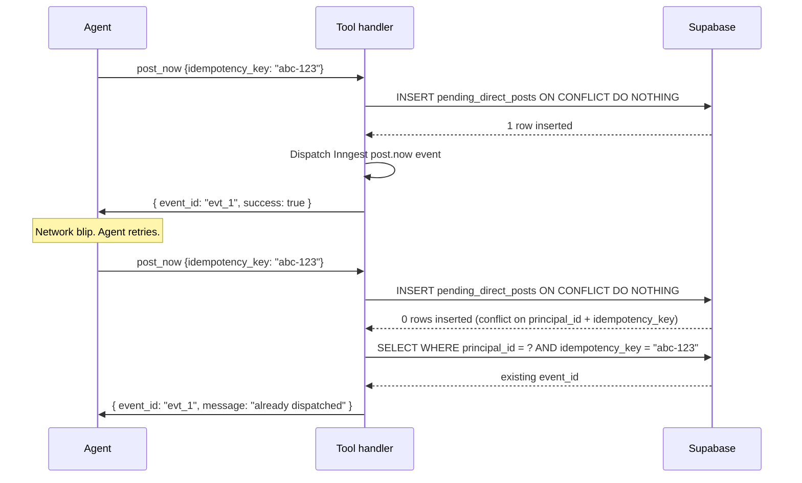
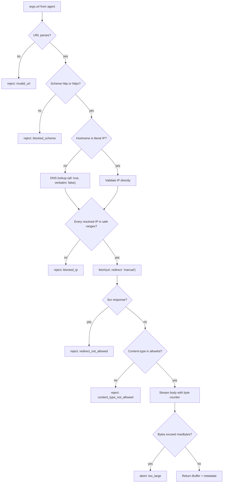
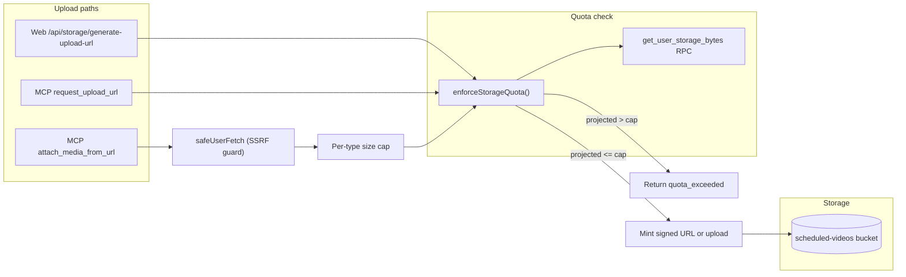
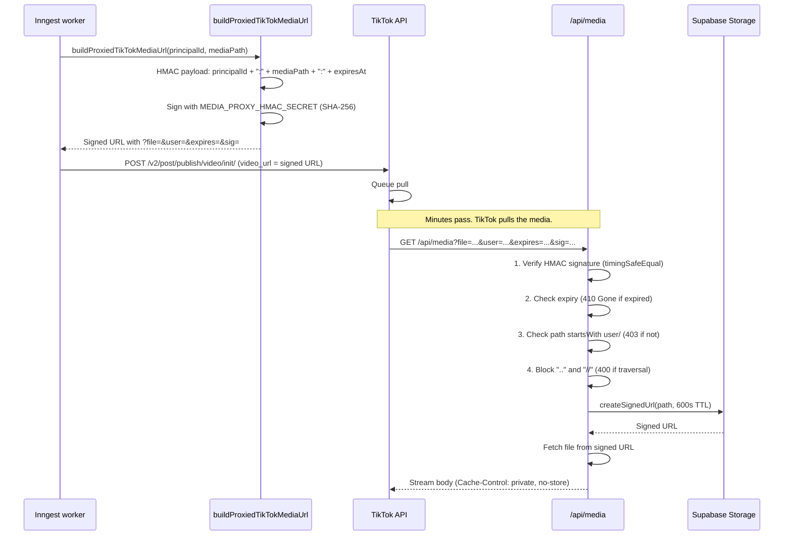

# Security Architecture

Consolidated view of every security mechanism in Sharetopus. Each section names the attack it prevents, the code that implements the defense, and the known gaps.

[Back to README](../README.md)

## Threat model

| Attack | Mechanism | Code |
|--------|-----------|------|
| MCP agent retries on network blip, duplicates a post | Idempotency keys + DB UNIQUE constraint | `src/lib/mcp/tools/schedulePost.ts`, `postNow.ts`, `bulkPostNow.ts`, `bulkSchedule.ts` |
| Agent submits URL pointing at cloud metadata (169.254.169.254) | safeUserFetch DNS + IP blocklist | `src/lib/mcp/_shared/safeUserFetch.ts` |
| Agent submits oversized file claiming small Content-Length | Stream-based byte counter (Content-Length untrusted) | `src/lib/mcp/_shared/safeUserFetch.ts` |
| Agent uploads 25 GB on Starter plan | enforceStorageQuota checks actual bytes via RPC | `src/lib/mcp/_shared/enforceStorageQuota.ts` |
| Agent floods attach_media_from_url | Rate limit 10/60s + monthly cap 100/500/unlimited | `src/lib/mcp/tools/attachMediaFromUrl.ts` |
| Cross-user storage path access | Path `startsWith(principalId/)` check | `/api/storage/generate-view-url`, `/api/media` |
| TikTok pull URL forged | HMAC-SHA256 + 30-min expiry | `src/lib/api/tiktok/buildProxiedTikTokMediaUrl.ts` |
| Media proxy path traversal | Block `..`, `//`, leading `/` | `src/app/api/media/route.ts` |
| MCP audit log tampering | Append-only table (Update: never, DB constraint) | `mcp_audit_log` table, `src/lib/mcp/audit.ts` |
| Concurrent quota race condition | atomic_increment_quota Postgres function | `usage_quotas` table, `src/lib/mcp/entitlement.ts` |
| Agent exhausts monthly action cap | Per-tier monthly quotas enforced atomically | `src/lib/mcp/entitlement.ts` |
| MCP IP tracking leaks real IPs | SHA-256 hash with configurable salt, raw IP never stored | `src/lib/mcp/ipHash.ts` |
| Sensitive args in audit log | Regex redaction of 13 key patterns + JWT detection | `src/lib/mcp/audit.ts` |

## Identity flow

Two auth paths converge on a single principal with a cached subscription tier. Free tier is blocked at the subscription gate.

The subscription gate runs after auth succeeds but before returning the principal. If `checkActiveSubscription` returns `isActive: false` or errors, the request is blocked (fail-closed).

**McpPrincipal type** (discriminated union):
- `kind: "apikey"` carries `apiKeyId`, `scopes`
- `kind: "oauth"` carries `oauthClientId`, `scopes`
- Both carry `principalId`, `plan` (PlanTier), `priceId`

The plan tier is resolved once during auth and cached on the principal. Tools and entitlement checks read `principal.plan` without querying `stripe_subscriptions` again.

See [docs/AUTH.md](./AUTH.md) for the full principal model, API key format, and OAuth discovery.

## Idempotency

MCP write tools that create posts support Stripe-style idempotent retries. An agent that retries after a network error with the same `idempotency_key` gets back the original result instead of creating a duplicate.

### How it works

### Supported tools

| Tool | Key source | Target table |
|------|-----------|-------------|
| `schedule_post` | `idempotency_key` param (optional, 1-200 chars) | `scheduled_posts` |
| `post_now` | `idempotency_key` param (optional, 1-200 chars) | `pending_direct_posts` |
| `bulk_schedule` | Derived: `${batchId}:${index}` from `batch_id` param | `scheduled_posts` |
| `bulk_post_now` | Derived: `${batch_id}:${index}` from `batch_id` param | `pending_direct_posts` |

DB enforcement: partial unique index on `(principal_id, idempotency_key)` on both tables. All four tools use `INSERT ... ON CONFLICT DO NOTHING`.

The key is optional. Omitting it means no deduplication (every call creates a new row). Agents should always supply one when retries are possible.

### Dispatcher-level dedup

The `scheduled-posts-tick` cron uses `eventId = ${postId}:${scheduledAt}` with a 24-hour dedup window in Inngest, preventing duplicate dispatch if the cron fires twice for the same batch.

## SSRF guard

`safeUserFetch` (`src/lib/mcp/_shared/safeUserFetch.ts`) protects `attach_media_from_url` from Server-Side Request Forgery. An agent could submit a URL pointing at internal infrastructure (cloud metadata endpoints, private services). The guard blocks this at multiple layers.

### Flow

### Blocked IP ranges

14 ranges, covering IPv4 and IPv6. Unrecognized IP formats fail closed (treated as blocked).

**IPv4:**

| CIDR | Description |
|------|-------------|
| `0.0.0.0/8` | Unspecified |
| `10.0.0.0/8` | Private (RFC 1918) |
| `100.64.0.0/10` | CGNAT (RFC 6598) |
| `127.0.0.0/8` | Loopback |
| `169.254.0.0/16` | Link-local |
| `172.16.0.0/12` | Private (RFC 1918) |
| `192.168.0.0/16` | Private (RFC 1918) |
| `224.0.0.0/4` | Multicast |
| `240.0.0.0/4` | Reserved + broadcast |

**IPv6:**

| CIDR | Description |
|------|-------------|
| `::1/128` | Loopback |
| `::/128` | Unspecified |
| `fe80::/10` | Link-local |
| `fc00::/7` | Unique Local Address (ULA) |
| `::ffff:0:0/96` | IPv4-mapped (embedded IPv4 re-checked against IPv4 ranges) |

### Additional guards

- **Scheme validation:** Only `http:` and `https:` are allowed. `file:`, `ftp:`, `data:`, `gopher:` are rejected.
- **Redirect blocking:** `fetch` is called with `redirect: "manual"`. Any 3xx response is rejected. This prevents TOCTOU attacks where DNS resolves to a safe IP but the redirect target is internal.
- **Content-type validation:** Response content-type is checked against an allowlist (prefix match + exact match). Strips parameters before comparison.
- **Stream-based byte counter:** Body is read chunk-by-chunk via `response.body.getReader()`. A running `byteCount` is compared against `maxBytes` on each chunk. If exceeded, the fetch is aborted. The Content-Length header is never trusted.
- **Timeouts:** Connect timeout (5s) and total timeout (30s) via AbortController.
- **User-Agent:** Requests identify as `Sharetopus-MCP/1.0`.

## Storage quota enforcement

`enforceStorageQuota` (`src/lib/mcp/_shared/enforceStorageQuota.ts`) is the single enforcement point for all three upload paths.

1. Calls `get_user_storage_bytes` Postgres RPC with `_bucket = "scheduled-videos"` and `_prefix = "{principalId}/"`.
2. The RPC reads `storage.objects` directly (no pagination, no estimation).
3. Computes `projected = currentBytes + additionalBytes`.
4. Compares against `STORAGE_LIMITS[priceId]` (falls back to 5 GB default).
5. Returns allow or deny with current/cap in the error message.

| Plan | Storage cap |
|------|-----------|
| Starter | 5 GB |
| Creator | 15 GB |
| Pro | 45 GB |
| Default (unknown priceId) | 5 GB |

Per-file size caps (all plans): image 8 MB, video 250 MB.

## Web media security

### TikTok HMAC-signed media proxy

TikTok's pull model requires a publicly accessible URL for media. Sharetopus uses an HMAC-signed proxy (`/api/media`) to serve files without exposing storage credentials.

**HMAC details:**
- Algorithm: SHA-256
- Secret: `MEDIA_PROXY_HMAC_SECRET` env var (64 hex chars)
- Payload: `${principalId}:${mediaPath}:${expiresAt}` (colon-separated)
- Expiry window: 30 minutes from URL creation
- Signature comparison: `crypto.timingSafeEqual` (constant-time, prevents timing attacks)

### Web view URLs

`/api/storage/generate-view-url` creates signed view URLs for the web UI.

- Clerk auth required
- Path ownership check: `path.startsWith(userId/)`
- Default TTL: 300 seconds (5 minutes)
- The `expiresIn` parameter is not capped server-side (low severity; users can only access their own files)

## Append-only audit

Six tables are append-only (`Update: never` in database types, enforced at the DB layer):

| Table | Purpose |
|-------|---------|
| `mcp_audit_log` | Every MCP tool call with redacted args, result status, latency |
| `stripe_invoices` | Payment records |
| `wallet_credits_ledger` | Credit transaction history (x402, deferred) |
| `x402_access_log` | Access audit trail (x402, deferred) |
| `x402_refunds` | Refund records (x402, deferred) |
| `sanctions_screenings` | Wallet sanctions check results (x402, deferred) |

The `mcp_audit_log` insert happens in `logToolCall` (`src/lib/mcp/audit.ts`), which runs fire-and-forget after every tool call. Arguments are redacted before insert: 13 key patterns (token, password, secret, authorization, bearer, api_key, apikey, access_token, refresh_token, credential, private_key, jwt) are replaced with `[REDACTED]`. Strings matching the JWT three-segment pattern (`xxx.yyy.zzz` in base64url) are replaced with `[REDACTED_JWT]`. Args are truncated to 4096 chars.

## Rate limiting

### Where it's enforced

| Path | Scope key | Limit | Enforced by |
|------|----------|-------|-------------|
| MCP `attach_media_from_url` | `mcp_attach_media_from_url` | 10/60s | Tool handler |
| MCP `request_upload_url` | `mcp_request_upload_url` | 20/60s | Tool handler |
| Web `handleSocialMediaPost` | per user | 30/60s | Server action |
| Web `checkOutSession` | per user | 15/60s | Server action |
| Web `createCustomerPortal` | per user | 20/60s | Server action |

All rate limits use Upstash Redis sliding window (`@upstash/ratelimit`).

### Monthly caps (per-tier, atomic)

Enforced by `entitlementFor` in `src/lib/mcp/entitlement.ts` via `atomic_increment_quota` Postgres RPC.

| Action | Starter | Creator | Pro |
|--------|---------|---------|-----|
| schedule_post | 100 | 500 | unlimited |
| post_now | 100 | 500 | unlimited |
| request_upload_url | 100 | 500 | unlimited |
| attach_media_from_url | 100 | 500 | unlimited |
| bulk_schedule | blocked | 200 | unlimited |
| bulk_post_now | blocked | 500 | unlimited |
| generate_post_draft | blocked | blocked | 100 |

Period key format: `YYYY-MM-01` (first of month, UTC), generated by `currentQuotaPeriod()` (`src/lib/mcp/_shared/currentQuotaPeriod.ts`). All readers and writers must use this helper to avoid silent zero-result queries.

### Gaps

- No rate limit on `/api/storage/generate-view-url` (Clerk-authed, own files only)
- No rate limit on `/api/media` proxy (HMAC-signed, 30-min expiry)
- No aggregate per-day cap on `attach_media_from_url` (has per-minute and per-month caps)

## Known gaps

These are acknowledged design decisions or low-severity issues, not bugs.

| Gap | Severity | Notes |
|-----|----------|-------|
| Cancelled `scheduled_posts` hold storage indefinitely | Design decision | Orphan sweep only catches unreferenced files. Cancelled posts still reference media. A future FIX could free storage on cancel. |
| `expiresIn` on `/api/storage/generate-view-url` not capped server-side | Low | Own files only. Client could request a very long-lived signed URL. |
| No alerting on orphan sweep counts | Low | Sweep logs stats to Inngest but no Slack/email/PagerDuty hook. |
| No rate limit on view URL and media proxy endpoints | Low | Both require authentication (Clerk or HMAC). Abuse would require valid credentials. |
| `attach_media_from_url` has no aggregate daily cap | Low | Per-minute (10/60s) and per-month caps exist. A sustained 10/min attack over 24h would hit the monthly cap within a day for Starter users. |

## Compliance posture

What Sharetopus does today:

- **PII redaction in audit logs:** Token, password, secret, JWT patterns are redacted before insert. Raw client IPs are never stored (SHA-256 hashed with configurable salt).
- **Data retention:** No automated purge. `mcp_audit_log`, `stripe_invoices`, and `content_history` grow indefinitely.
- **Append-only financial tables:** `stripe_invoices` cannot be updated or deleted at the DB layer.

Deferred until x402 ships:

- **OFAC / FINTRAC / MiCA screening:** The `sanctions_screenings` table exists but no screening service is integrated.
- **Wallet KYC:** No identity verification for wallet-based access.
- **USDC fair market value tracking:** The `usdc_fmv_daily` table exists but is not populated.

---

**See also:** [docs/AUTH.md](./AUTH.md) (principal model, auth paths), [docs/MCP.md](./MCP.md) (tool inventory, annotations, idempotency), [docs/STORAGE.md](./STORAGE.md) (upload paths, orphan sweep)

[Back to README](../README.md)
