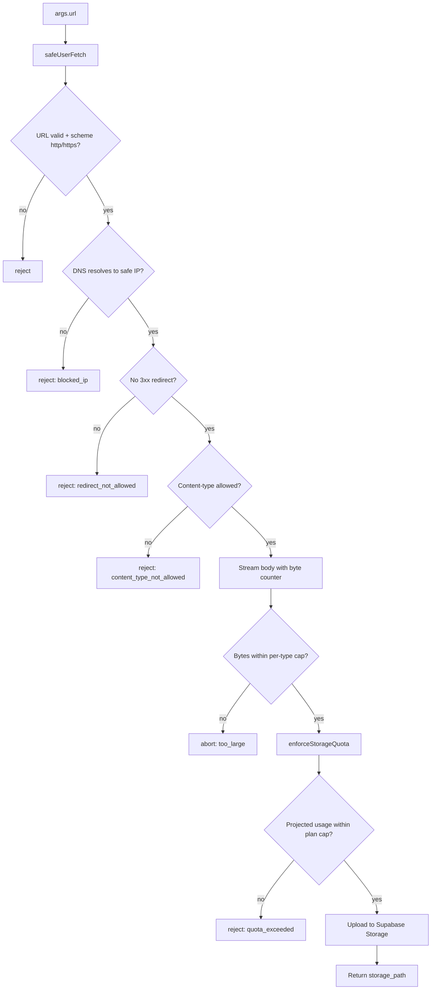
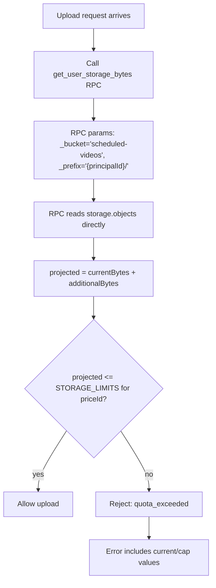
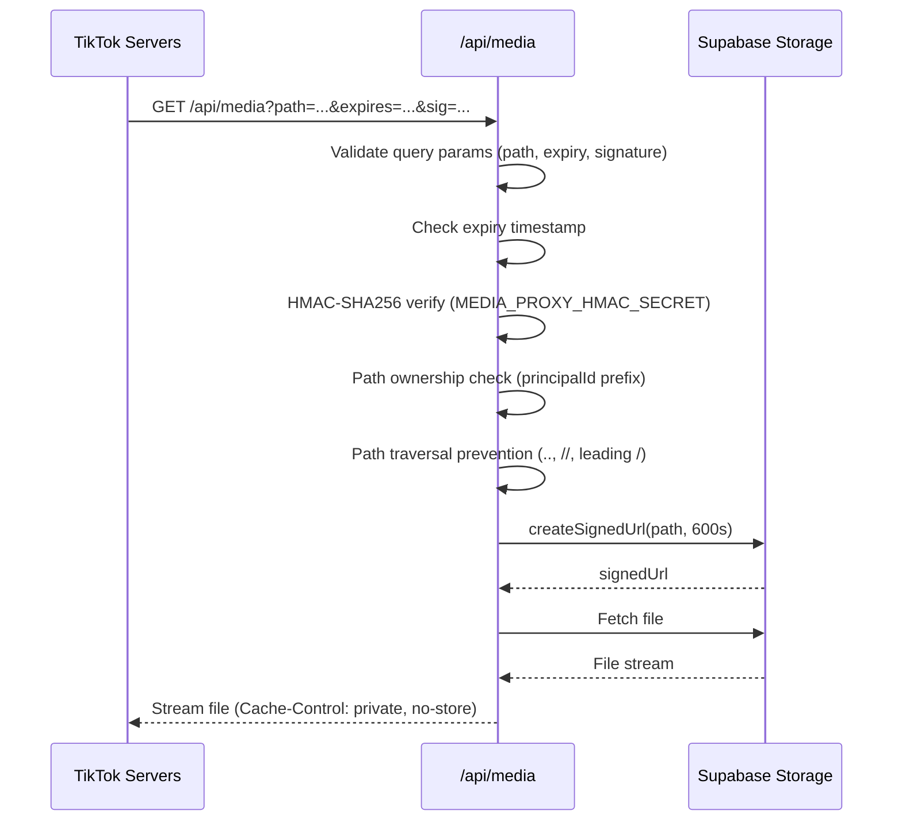
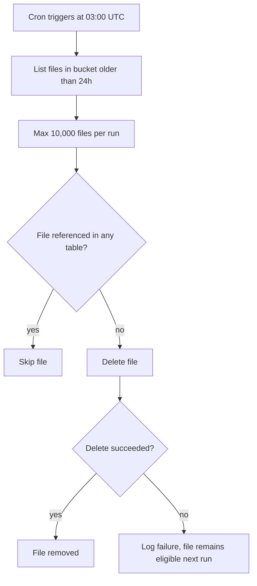

# Storage

Media files (images and videos) are stored in Supabase Storage. Three upload paths exist: web UI, MCP `request_upload_url`, and MCP `attach_media_from_url`. An Inngest cron sweeps orphaned files daily.

[Back to README](../README.md)

## Table of contents

- [Bucket and path convention](#bucket-and-path-convention)
- [Upload paths](#upload-paths)
  - [Web UI upload](#web-ui-upload)
  - [MCP request_upload_url](#mcp-request_upload_url)
  - [MCP attach_media_from_url](#mcp-attach_media_from_url)
- [Storage quota enforcement](#storage-quota-enforcement)
- [View URLs](#view-urls)
- [Media proxy](#media-proxy)
- [TikTok media delivery modes](#tiktok-media-delivery-modes)
- [Size and type limits](#size-and-type-limits)
  - [Allowed content types](#allowed-content-types)
  - [Per-file size limits](#per-file-size-limits)
  - [Storage quotas by plan](#storage-quotas-by-plan)
- [Orphan sweep](#orphan-sweep)
- [Reference-aware cleanup](#reference-aware-cleanup)
- [Cover image timestamps](#cover-image-timestamps)
- [Security considerations](#security-considerations)
- [Source files referenced](#source-files-referenced)

## Bucket and path convention

**Bucket name:** `scheduled-videos` (configurable via `SUPABASE_BUCKET_NAME` env var)

**Storage path format:** Two patterns are used:

- `generateServerSignedUploadUrl` and `request_upload_url`: `{principalId}/{randomUUID()}.{ext}`
- `attach_media_from_url`: `{principalId}/{timestamp}_{filename}`

The `principalId` is the Clerk user ID (e.g., `user_2abc123def456`). Example paths:

- `user_2abc123def456/a1b2c3d4-e5f6-7890-abcd-ef1234567890.mp4`
- `user_2abc123def456/1715400000000_photo.jpg`

Every file operation validates that the path starts with the authenticated user's principal ID. This prevents cross-user access at the application layer.

## Upload paths

### Web UI upload

**Endpoint:** `POST /api/storage/generate-upload-url`

Client-side upload uses `signedUrlUpload.ts` with XMLHttpRequest for progress events.

### MCP request_upload_url

Same validation pipeline as the web UI, authenticated via MCP Bearer token (Creator+ plan required).

- **Rate limit:** 20 requests per 60 seconds
- **Monthly quota:** creator 500/mo, pro unlimited
- **Returns:** `{ upload_url, storage_path, token, expires_in_seconds: 7200 }`

### MCP attach_media_from_url

Server-side download and upload. The MCP server fetches the file from a public URL and uploads it to Supabase Storage on behalf of the user. The download is SSRF-guarded and quota-enforced.

- **Size limits:** 8 MB (image), 250 MB (video). Enforced by stream-based byte counter. Content-Length header is NOT trusted.
- **Rate limit:** 10 requests per 60 seconds per principal.
- **Monthly quota:** creator 500/mo, pro unlimited.
- **Allowed MIME types:** image/jpeg, image/png, image/gif, image/webp, video/mp4, video/quicktime, video/webm.
- **SSRF guard:** `safeUserFetch` blocks private/reserved IP ranges, rejects non-http(s) schemes, blocks 3xx redirects, and validates content-type. See [docs/SECURITY.md](./SECURITY.md#ssrf-guard) for the full list.

## Storage quota enforcement

A single enforcement point (`enforceStorageQuota`) is used by all three upload paths.

The `get_user_storage_bytes` Postgres RPC reads `storage.objects` directly (no pagination, no estimation). The plan cap is looked up from `STORAGE_LIMITS` keyed by Stripe price ID. Unknown price IDs fall back to 5 GB.

| Plan    | Storage Cap |
| ------- | ----------- |
| Starter | 5 GB        |
| Creator | 15 GB       |
| Pro     | 45 GB       |

## View URLs

**Web UI:** `GET /api/storage/generate-view-url` creates signed view URLs. Validates Clerk auth and path ownership (`{userId}/` prefix check). Default TTL: 5 minutes (300 seconds).

**Server-side:** `getServerSignedViewUrl(path, expiresInSeconds)` for internal use by server actions and background jobs.

## Media proxy

`src/app/api/media/route.ts` provides HMAC-signed media URLs for TikTok's pull model. TikTok requires a publicly accessible URL to fetch media from. The proxy provides one without exposing storage credentials or redirecting to Supabase.

Security checks in order:

1. Query parameter validation (path, expiry, signature must all be present)
2. Expiry timestamp check (reject expired URLs)
3. HMAC-SHA256 signature verification using `MEDIA_PROXY_HMAC_SECRET`
4. Path ownership check (principal ID prefix)
5. Path traversal prevention (rejects `..`, `//`, leading `/`)

The proxy streams the file from Supabase (no redirect). Sets `Cache-Control: private, no-store`. Upstream signed URL TTL: 600 seconds (10 minutes).

## TikTok media delivery modes

TikTok uses a pull model where TikTok's servers fetch media from a URL provided by Sharetopus. Two modes are supported via `TIKTOK_MEDIA_SOURCE` env var:

| Mode            | Env Value         | Description                                                                                |
| --------------- | ----------------- | ------------------------------------------------------------------------------------------ |
| Proxy (default) | `proxy`           | Media served through `/api/media` with HMAC signature. Requires `MEDIA_PROXY_HMAC_SECRET`. |
| Direct Supabase | `supabase_direct` | Direct Supabase Storage URL with custom domain. Requires `SUPABASE_CUSTOM_STORAGE_DOMAIN`. |

**Proxy mode (default):**

- HMAC payload format: `${principalId}:${mediaPath}:${expiresAt}`
- Algorithm: SHA-256 with `MEDIA_PROXY_HMAC_SECRET` (64 hex chars)
- Signature comparison: `crypto.timingSafeEqual`
- URL expiry: 30 minutes
- Source: `buildProxiedTikTokMediaUrl.ts`

**Direct mode:**

- Requires `SUPABASE_CUSTOM_STORAGE_DOMAIN` env var
- If the domain is not set, falls back to proxy mode with a warning

The proxy mode works without additional infrastructure. The direct mode avoids the proxy hop but requires a custom storage domain configured in Supabase.

## Size and type limits

### Allowed content types

| Category | Web + MCP upload                            | attach_media_from_url additionally |
| -------- | ------------------------------------------- | ---------------------------------- |
| Image    | `image/jpeg`, `image/png`                   | `image/gif`, `image/webp`          |
| Video    | `video/mp4`, `video/mov`, `video/quicktime` | `video/webm`                       |

### Per-file size limits

All plans share the same per-file caps:

| Type  | Max Size |
| ----- | -------- |
| Image | 8 MB     |
| Video | 250 MB   |

### Storage quotas by plan

| Plan    | Storage Limit | Monthly attach_media_from_url |
| ------- | ------------- | ----------------------------- |
| Starter | 5 GB          | (not available)               |
| Creator | 15 GB         | 500/mo                        |
| Pro     | 45 GB         | unlimited                     |

Defined in `src/lib/types/plans.ts` as `STORAGE_LIMITS` keyed by Stripe price ID. Unknown price IDs fall back to 5 GB.

## Orphan sweep

The `sweep-orphan-storage-files` Inngest cron runs daily at 03:00 UTC. It identifies and deletes files older than 24 hours that are not referenced by any of 4 tables.

**Reference tables checked:**

| Table                  | Column               |
| ---------------------- | -------------------- |
| `scheduled_posts`      | `media_storage_path` |
| `failed_posts`         | `media_storage_path` |
| `pending_tiktok_pulls` | `media_storage_path` |
| `pending_direct_posts` | `media_storage_path` |

`content_history.media_url` is excluded because it stores platform-hosted URLs (e.g., LinkedIn CDN), not Supabase storage paths.

**Max files per run:** 10,000 (pagination: 1,000 per folder page).

**Idempotency:** Partial failures are logged. Failed files remain eligible for the next run due to the 24-hour cutoff.

## Reference-aware cleanup

Outside the orphan sweep, files are deleted individually by `deleteSupabaseFile` (called when deleting scheduled posts or disconnecting accounts). Before deleting, it checks all 4 reference tables:

- `scheduled_posts` where status IN (scheduled, processing)
- `failed_posts`
- `pending_tiktok_pulls` where status = pending
- `pending_direct_posts` where status = processing

If any reference exists, the file is preserved. On database error during the check, the file is also preserved (conservative default).

## Cover image timestamps

Platform-specific timestamp formats for video cover images:

| Platform  | Field                          | Unit         | Notes                              |
| --------- | ------------------------------ | ------------ | ---------------------------------- |
| TikTok    | `video_cover_timestamp_ms`     | milliseconds | Minimum value: 1000 (1 second)     |
| Pinterest | `cover_image_key_frame_time`   | seconds      | Code converts from ms to seconds   |

## Security considerations

- **Path isolation:** Every file operation validates `path.startsWith(authenticatedPrincipalId/)`. No path can cross user boundaries.
- **SSRF protection:** `safeUserFetch` blocks private IP ranges, non-http(s) schemes, and 3xx redirects for `attach_media_from_url`.
- **Signed URLs:** All upload and view URLs are time-limited (upload: 2h, view: 5min default, proxy upstream: 10min).
- **HMAC integrity:** Media proxy URLs are signed with SHA-256 HMAC and verified with `crypto.timingSafeEqual` to prevent timing attacks.
- **No Content-Length trust:** Stream-based byte counting prevents oversized uploads even when Content-Length lies.
- **Conservative deletion:** `deleteSupabaseFile` preserves files on any database error during reference checks.
- **No redirect from proxy:** The media proxy streams the file directly. No redirect to Supabase that could leak signed URLs.
- **Cache suppression:** Media proxy sets `Cache-Control: private, no-store` to prevent caching of user media.

## Source files referenced

| File | Purpose |
| ---- | ------- |
| `src/app/api/storage/generate-upload-url/route.ts` | Web UI upload endpoint |
| `src/app/api/storage/generate-view-url/route.ts` | Web UI view URL endpoint |
| `src/app/api/media/route.ts` | HMAC-signed media proxy for TikTok |
| `src/actions/client/signedUrlUpload.ts` | Client-side XHR upload with progress |
| `src/actions/server/data/getServerSignedViewUrl.ts` | Server-side signed view URL helper |
| `src/actions/server/data/generateServerSignedUploadUrl.ts` | Server-side signed upload URL generation |
| `src/actions/server/data/deleteSupabaseFile.ts` | Reference-aware file deletion |
| `src/lib/mcp/_shared/enforceStorageQuota.ts` | Storage quota enforcement (all 3 upload paths) |
| `src/lib/mcp/_shared/safeUserFetch.ts` | SSRF-guarded HTTP fetch |
| `src/lib/mcp/tools/request_upload_url.ts` | MCP upload URL tool |
| `src/lib/mcp/tools/attach_media_from_url.ts` | MCP server-side media attach tool |
| `src/lib/api/tiktok/buildProxiedTikTokMediaUrl.ts` | HMAC-signed proxy URL builder for TikTok |
| `src/lib/types/plans.ts` | STORAGE_LIMITS and plan definitions |
| `src/inngest/functions/sweep-orphan-storage-files.ts` | Daily orphan file cleanup cron |

---

**See also:** [docs/SECURITY.md](./SECURITY.md) (SSRF guard details, HMAC media proxy), [docs/BILLING.md](./BILLING.md) (plan tiers, monthly caps), [docs/MCP.md](./MCP.md) (attach_media_from_url tool params), [docs/INNGEST.md](./INNGEST.md) (cron schedule details)

[Back to README](../README.md)
