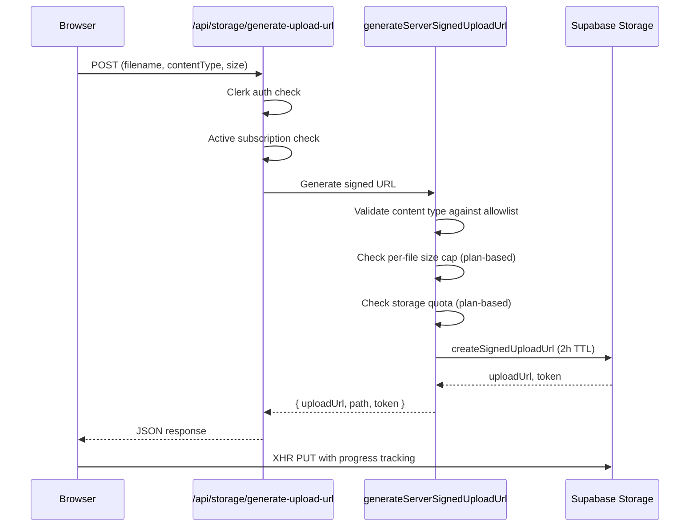
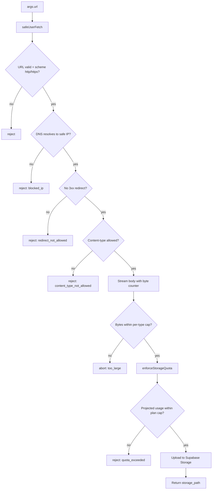

# Storage

Media files (images and videos) are stored in Supabase Storage. Three upload paths exist: web UI, MCP `request_upload_url`, and MCP `attach_media_from_url`. An Inngest cron sweeps orphaned files daily.

[Back to README](../README.md)

## Bucket and path convention

**Bucket name:** `scheduled-videos` (configurable via `SUPABASE_BUCKET_NAME` env var)

**Storage path format:** Two patterns are used:

- `generateServerSignedUploadUrl` and `request_upload_url`: `{principalId}/{randomUUID()}.{ext}`
- `attach_media_from_url`: `{principalId}/{timestamp}_{filename}`

The `principalId` is the Clerk user ID (e.g., `user_2abc123def456`). Example paths:
- `user_2abc123def456/a1b2c3d4-e5f6-7890-abcd-ef1234567890.mp4`
- `user_2abc123def456/1715400000000_photo.jpg`

Every file operation validates that the path starts with the authenticated user's principal ID. This prevents cross-user access at the application layer.

## Upload paths

### Web UI upload

Client-side upload uses `src/actions/client/signedUrlUpload.ts` with XMLHttpRequest for progress events.

### MCP request_upload_url

Same validation pipeline as the web UI, but authenticated via MCP Bearer token instead of Clerk session. Rate limited to 20 requests per 60 seconds. Returns `{ upload_url, storage_path, token, expires_in_seconds: 7200 }`.

### MCP attach_media_from_url

Server-side download and upload. The MCP server fetches the file from the provided public URL and uploads it to Supabase Storage on behalf of the user. The download is SSRF-guarded and quota-enforced.

**Size limits:** 8 MB (image), 250 MB (video). Enforced by stream-based byte counter; Content-Length header is not trusted.
**Rate limit:** 10 requests per 60 seconds per principal.
**Monthly quota:** 100 (starter), 500 (creator), unlimited (pro).
**Allowed MIME types:** image/jpeg, image/png, image/gif, image/webp, video/mp4, video/quicktime, video/webm.
**SSRF guard:** `safeUserFetch` (`src/lib/mcp/_shared/safeUserFetch.ts`) blocks 14 private/reserved IP ranges, rejects non-http(s) schemes, blocks 3xx redirects, and validates content-type. See [docs/SECURITY.md](./SECURITY.md#ssrf-guard) for the full list.

## View URLs

**Web UI:** `GET /api/storage/generate-view-url` creates signed view URLs with a configurable TTL (default 5 minutes / 300 seconds). Validates path ownership (`{userId}/` prefix check).

**Server-side:** `getServerSignedViewUrl(path, expiresInSeconds)` in `src/actions/server/data/getServerSignedViewUrl.ts`.

## Media proxy

`src/app/api/media/route.ts` provides HMAC-signed media URLs for TikTok's pull model. TikTok requires a publicly accessible URL to fetch media from, and the proxy provides one without exposing storage credentials.

Security checks:
1. Query parameter validation (path, expiry, signature)
2. Expiry timestamp check
3. HMAC-SHA256 signature verification using `MEDIA_PROXY_HMAC_SECRET`
4. Path ownership check (principal ID prefix)
5. Path traversal prevention

The proxy streams the file from Supabase (does not redirect) and sets `Cache-Control: private, no-store`. Upstream signed URL TTL: 600 seconds (10 minutes).

## Size and type limits

### Allowed content types

| Category | MIME Types |
|----------|-----------|
| Image | `image/jpeg`, `image/png` |
| Video | `video/mp4`, `video/mov`, `video/quicktime` |

`attach_media_from_url` additionally allows: `image/gif`, `image/webp`, `video/webm`.

### Per-file size limits (all plans)

| Type | Max Size |
|------|----------|
| Image | 8 MB |
| Video | 250 MB |

### Storage quotas by plan

| Plan | Storage Limit |
|------|--------------|
| Starter | 5 GB |
| Creator | 15 GB |
| Pro | 45 GB |

Defined in `src/lib/types/plans.ts` as `STORAGE_LIMITS` keyed by Stripe price ID. Unknown price IDs fall back to 5 GB.

### Quota enforcement

Both the web upload path (`generateServerSignedUploadUrl`) and MCP `attach_media_from_url` call `enforceStorageQuota` (`src/lib/mcp/_shared/enforceStorageQuota.ts`). This helper calls the `get_user_storage_bytes` Postgres RPC to read actual bytes from `storage.objects` (no pagination, no estimation). The projected usage (`current + additionalBytes`) is compared against the plan cap. On deny, returns `quota_exceeded` with current/cap in the error message.

## Orphan sweep

The `sweep-orphan-storage-files` Inngest cron runs daily at 03:00 UTC. It identifies and deletes files older than 24 hours that are not referenced by any of 4 tables:

| Table | Column |
|-------|--------|
| `scheduled_posts` | `media_storage_path` |
| `failed_posts` | `media_storage_path` |
| `pending_tiktok_pulls` | `media_storage_path` |
| `pending_direct_posts` | `media_storage_path` |

`content_history.media_url` is excluded because it stores platform-hosted URLs (e.g., LinkedIn CDN), not Supabase storage paths.

**Max files per run:** 10,000 (pagination: 1,000 per folder page).

**Idempotency:** Partial failures are logged and the files remain eligible for the next run due to the 24-hour cutoff.

See [docs/INNGEST.md](./INNGEST.md) for full details.

## Reference-aware cleanup

Outside the orphan sweep, files are deleted individually by `deleteSupabaseFileActionInternal` (called when deleting scheduled posts or disconnecting accounts). Before deleting, it checks all 4 reference tables:

- `scheduled_posts` where status in (scheduled, processing)
- `failed_posts`
- `pending_tiktok_pulls` where status = pending
- `pending_direct_posts` where status = processing

If any reference exists, the file is preserved. On database error during the check, the file is also preserved (conservative default).

## TikTok media delivery

TikTok uses a pull model where TikTok's servers fetch media from a URL provided by Sharetopus. Two modes are supported via `TIKTOK_MEDIA_SOURCE` env var:

| Mode | Env Value | How It Works |
|------|-----------|-------------|
| Proxy (default) | `proxy` | Media served through `/api/media` with HMAC signature. Requires `MEDIA_PROXY_HMAC_SECRET`. |
| Direct Supabase | `supabase_direct` | Direct Supabase Storage URL with custom domain. Requires `SUPABASE_CUSTOM_STORAGE_DOMAIN`. |

The proxy mode is the default and works without additional infrastructure. The direct mode avoids the proxy hop but requires a custom storage domain configured in Supabase.

If `TIKTOK_MEDIA_SOURCE=supabase_direct` but `SUPABASE_CUSTOM_STORAGE_DOMAIN` is not set, the system falls back to proxy mode with a warning.

---

**See also:** [docs/SECURITY.md](./SECURITY.md) (SSRF guard details, storage quota enforcement, HMAC media proxy), [docs/BILLING.md](./BILLING.md) (plan tiers, monthly caps), [docs/MCP.md](./MCP.md) (attach_media_from_url tool params)

[Back to README](../README.md)
