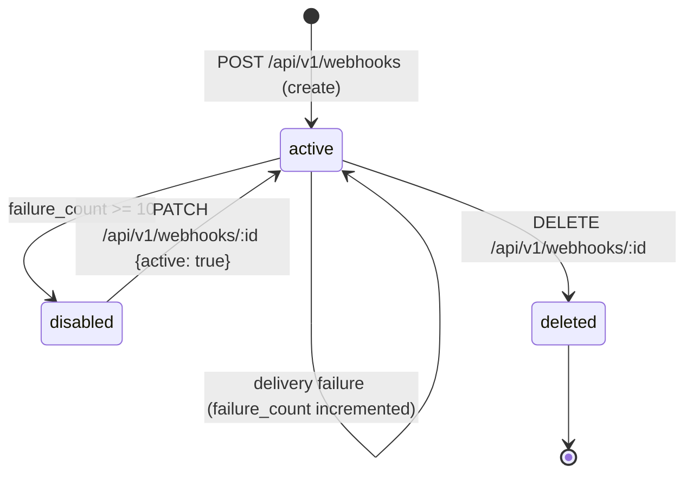
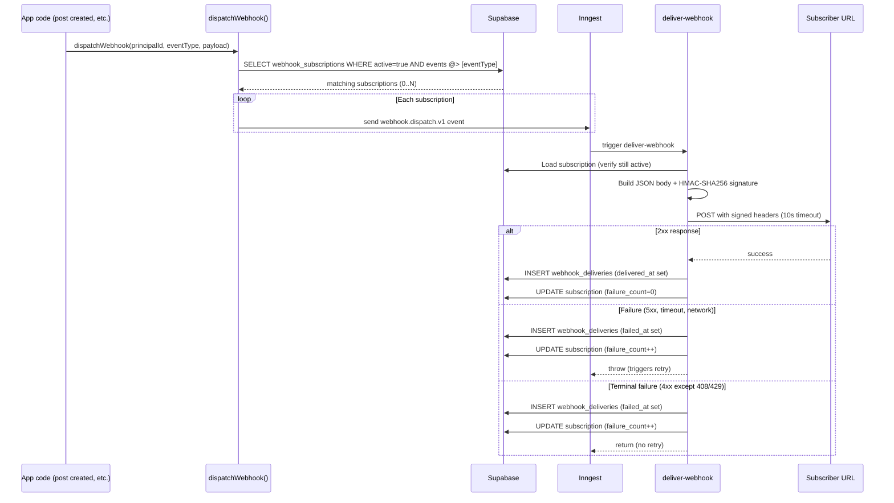

# Webhooks

Outbound webhook subsystem for notifying external services when events occur in a Sharetopus account. Subscriptions are created via the REST API or the Settings UI. Each delivery is HMAC-SHA256 signed so recipients can verify authenticity.

[Back to README](../README.md)

## Table of contents

- [Event types](#event-types)
- [Subscription lifecycle](#subscription-lifecycle)
- [Delivery pipeline](#delivery-pipeline)
- [Signing and verification](#signing-and-verification)
- [Retry behavior](#retry-behavior)
- [Auto-disable](#auto-disable)
- [Replay](#replay)
- [Testing](#testing)
- [Database tables](#database-tables)
- [Dispatch integration points](#dispatch-integration-points)
- [Tradeoffs and limitations](#tradeoffs-and-limitations)
- [Source files referenced](#source-files-referenced)

---

## Event types

5 event types, defined in `src/lib/api/rest/webhooks/eventTypes.ts`:

| Event | Trigger |
|-------|---------|
| `post.scheduled` | A post was scheduled (via web, MCP, or REST API) |
| `post.published` | A post was published successfully |
| `post.failed` | A post failed to publish (terminal) |
| `connection.connected` | A social account was connected |
| `connection.expired` | A social account token expired |

Subscribers select which events they want when creating a subscription. Only matching events are dispatched.

---

## Subscription lifecycle



On creation, the API generates a `whsec_` prefixed secret (32 bytes hex, 64 chars) via `generateWebhookSecret()` in `src/lib/api/rest/webhooks/secretGenerator.ts`. The secret is shown once in the response and stored in the DB as-is (not hashed, because the delivery worker needs the raw secret to sign outbound payloads).

---

## Delivery pipeline



`dispatchWebhook()` in `src/lib/api/rest/webhooks/dispatch.ts` is fire-and-forget. It never throws. If no subscriptions match, it returns silently. Each matching subscription gets its own Inngest event so retries and failures are per-subscription.

---

## Signing and verification

Every delivery includes these headers:

| Header | Value |
|--------|-------|
| `X-Sharetopus-Signature` | `sha256=<hex digest>` |
| `X-Sharetopus-Event` | Event type (e.g. `post.published`) |
| `X-Sharetopus-Delivery` | Delivery UUID |
| `User-Agent` | `Sharetopus-Webhook/1.0` |
| `Content-Type` | `application/json` |

**Signing algorithm:** `HMAC-SHA256(rawBodyString, subscription_secret)` via `signWebhookPayload()` in `src/lib/api/rest/webhooks/signWebhookPayload.ts`.

**Verification (recipient side):**

```javascript
const crypto = require("crypto");

function verify(rawBody, secret, signatureHeader) {
  const expected = crypto
    .createHmac("sha256", secret)
    .update(rawBody)
    .digest("hex");
  const received = signatureHeader.replace("sha256=", "");
  return crypto.timingSafeEqual(
    Buffer.from(expected, "hex"),
    Buffer.from(received, "hex")
  );
}
```

Use the raw request body as a string (before JSON parsing). Use constant-time comparison to prevent timing attacks.

---

## Retry behavior

Delivery retries are handled by Inngest, not inline in the HTTP request.

- **Max retries:** 3 (configured on the `deliver-webhook` Inngest function)
- **Backoff:** Inngest default exponential backoff
- **Throttle:** 100 deliveries per 60 seconds (global, across all subscriptions)
- **Timeout:** 10 seconds per delivery attempt (`DELIVERY_TIMEOUT_MS` in `deliverWebhook.ts`)

**Retryable failures** (trigger Inngest retry):
- Status codes: 408, 429, 500, 502, 503, 504
- Network errors (timeout, connection refused, DNS failure)

**Terminal failures** (no retry):
- All other 4xx status codes (400, 401, 403, 404, etc.)
- Recorded in `webhook_deliveries` but do not trigger Inngest retry

---

## Auto-disable

Subscriptions are automatically disabled after 10 consecutive delivery failures (`AUTO_DISABLE_THRESHOLD` in `deliverWebhook.ts`).

When disabled:
- `active` is set to `false`
- `last_disabled_at` is set to the current timestamp
- No further deliveries are attempted

To re-enable:

```bash
curl -X PATCH https://sharetopus.com/api/v1/webhooks/SUB_ID \
  -H "Authorization: Bearer stp_rest_YOUR_KEY" \
  -H "Content-Type: application/json" \
  -d '{"active": true}'
```

Re-enabling resets `failure_count` to 0 so the auto-disable counter starts fresh.

---

## Replay

Re-send a past delivery:

```bash
curl -X POST https://sharetopus.com/api/v1/webhooks/SUB_ID/deliveries/DELIVERY_ID/replay \
  -H "Authorization: Bearer stp_rest_YOUR_KEY"
```

The replay endpoint dispatches a new `webhook.dispatch.v1` Inngest event using the original delivery's payload. The new delivery gets its own delivery ID, signature, and delivery record.

---

## Testing

Send a test event to verify your endpoint:

```bash
curl -X POST https://sharetopus.com/api/v1/webhooks/SUB_ID/test \
  -H "Authorization: Bearer stp_rest_YOUR_KEY"
```

This creates a synthetic delivery with a test payload and dispatches it through the normal delivery pipeline.

---

## Database tables

Two tables in Supabase:

**`webhook_subscriptions`:** User-created webhook endpoint registrations.

| Column | Type | Notes |
|--------|------|-------|
| id | UUID | PK |
| principal_id | UUID | FK to principals |
| url | text | HTTPS endpoint URL |
| events | text[] | Array of subscribed event types |
| secret | text | `whsec_` prefixed HMAC secret (stored raw) |
| active | boolean | Default true, set false on auto-disable |
| failure_count | integer | Consecutive failures, reset on success |
| last_delivery_at | timestamptz | Last successful delivery |
| last_disabled_at | timestamptz | Last time auto-disabled |
| created_at | timestamptz | |
| updated_at | timestamptz | |

**`webhook_deliveries`:** Record of each delivery attempt.

| Column | Type | Notes |
|--------|------|-------|
| id | UUID | PK (the delivery_id) |
| subscription_id | UUID | FK to webhook_subscriptions |
| event_type | text | e.g. `post.published` |
| event_id | UUID | Groups deliveries of the same event |
| payload | jsonb | Full event payload |
| status_code | integer | HTTP response status (null on network error) |
| response_body | text | First 4096 chars of response |
| attempt | integer | Attempt number |
| latency_ms | integer | Time from request to response |
| delivered_at | timestamptz | Set on 2xx |
| failed_at | timestamptz | Set on non-2xx or network error |
| error_message | text | Network error message if applicable |
| created_at | timestamptz | |

---

## Dispatch integration points

`dispatchWebhook()` is called from these locations:

| Location | Event dispatched |
|----------|-----------------|
| `src/inngest/functions/processSinglePostHelpers.ts` | `post.published`, `post.failed` (after scheduled post processing) |
| `src/actions/server/scheduleActions/schedule/schedulePostBatch.ts` | `post.scheduled` (after scheduling) |
| `src/lib/x402/oauth/callback/handleOAuthCallback.ts` | `connection.connected` (after OAuth callback) |

Connection expiry events (`connection.expired`) are dispatched when token refresh fails during post processing.

---

## Tradeoffs and limitations

- **Secret not hashed in DB.** The subscription secret is stored raw because the delivery worker needs it to compute the HMAC signature. If the DB is compromised, secrets are exposed. Mitigation: secrets are per-subscription and can be rotated by deleting and recreating the subscription.
- **No per-subscription rate limiting.** The 100/60s throttle is global across all subscriptions. A single subscription with a slow endpoint could delay deliveries to other subscriptions.
- **No cleanup cron for `webhook_deliveries`.** The delivery log grows indefinitely. A retention cron (similar to `cleanup-mcp-audit-log`) would be a future addition.
- **Delivery timeout is fixed at 10 seconds.** Not configurable per subscription.
- **`rest_audit_log` has no cleanup cron yet.** Unlike `mcp_audit_log` (90-day retention), REST audit logs grow indefinitely.

---

## Source files referenced

| File | Description |
|------|-------------|
| `src/lib/api/rest/webhooks/dispatch.ts` | `dispatchWebhook()` fire-and-forget dispatcher |
| `src/lib/api/rest/webhooks/eventTypes.ts` | `WEBHOOK_EVENT_TYPES` array (5 events) |
| `src/lib/api/rest/webhooks/signWebhookPayload.ts` | HMAC-SHA256 signing function |
| `src/lib/api/rest/webhooks/secretGenerator.ts` | `generateWebhookSecret()` (`whsec_` prefix + 32 bytes hex) |
| `src/lib/api/rest/webhooks/verifyWebhookConfig.ts` | Subscription URL validation |
| `src/inngest/functions/deliverWebhook.ts` | Inngest function: deliver one webhook event |
| `src/app/api/v1/webhooks/route.ts` | POST (create) + GET (list) subscription endpoints |
| `src/app/api/v1/webhooks/[id]/route.ts` | GET + PATCH + DELETE subscription endpoints |
| `src/app/api/v1/webhooks/[id]/test/route.ts` | POST test delivery endpoint |
| `src/app/api/v1/webhooks/[id]/deliveries/route.ts` | GET delivery log endpoint |
| `src/app/api/v1/webhooks/[id]/deliveries/[delivery_id]/replay/route.ts` | POST replay endpoint |
| `src/lib/api/rest/validation/webhookSchemas.ts` | Zod validation schemas for webhook endpoints |

---

**See also:** [docs/REST.md](./REST.md) (REST API endpoints), [docs/SECURITY.md](./SECURITY.md) (webhook signing, threat model), [docs/INNGEST.md](./INNGEST.md) (deliver-webhook function)

[Back to README](../README.md)
