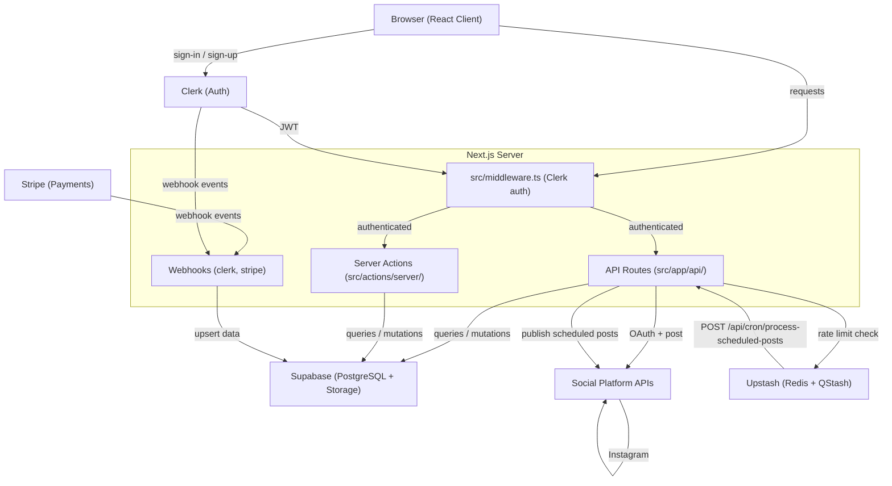

# Architecture Overview

Sharetopus is a single Next.js 16 application (App Router, not a monorepo) that lets users connect social media accounts, compose posts, and publish or schedule them across LinkedIn, TikTok, Pinterest, and Instagram. The codebase contains 268 source files (.ts/.tsx) with roughly 350 export lines. Authentication is handled by Clerk, persistent state lives in Supabase (PostgreSQL + Storage), payments go through Stripe, and scheduled post delivery is driven by Upstash QStash cron triggers.

## System Architecture

## Architecture Files

| File | Contents |
|------|----------|
| [components.md](./components.md) | Directory-by-directory breakdown of the codebase |
| [data-flow.md](./data-flow.md) | Sequence diagrams for OAuth, posting, scheduling, and payments |
| [state-management.md](./state-management.md) | Where state lives: database, storage, Redis, React |
| [lifecycles.md](./lifecycles.md) | Startup, request processing, and cron job lifecycles |
| [design-decisions.md](./design-decisions.md) | Why things are built the way they are, known tradeoffs |

---

[Documentation index](../README.md) | [Project root](../../README.md)
