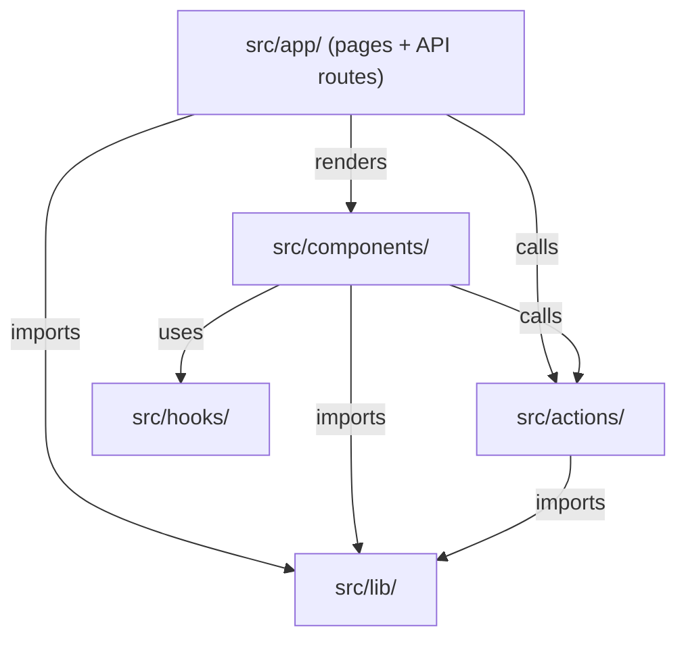

# Components and Directory Structure

This document walks through each major directory in the `src/` tree, explains what lives there and why, and lists key files.

## Directory Overview

```
src/
  app/            # Next.js App Router pages and API routes
  actions/        # Server actions, API clients, UI utilities
  lib/            # Platform API integrations, MCP server, types
  components/     # React components (core features, UI primitives, layout)
  hooks/          # Custom React hooks
  middleware.ts   # Clerk auth middleware
```

## Dependency Flow



Pages and API routes in `src/app/` sit at the top. They render components, call server actions, and import library code. Components also call actions and use hooks directly. The `src/lib/` directory is a leaf dependency that nothing outside it depends on in reverse.

---

## src/app/

The App Router root. Uses route groups to separate public and protected areas.

**Route groups:**

- `(marketing)/` - Public pages: landing page, privacy policy, terms of service.
- `(protected)/` - Auth-required pages: connections, create (text/image/video), integrations, payment/success, posted, scheduled, studio, userProfile.

**API routes (`api/`):**

- `api/social/{platform}/{action}/route.ts` - Four platforms (linkedin, tiktok, pinterest, instagram), each with four actions (initiate, connect, post, process).
- `api/cron/process-scheduled-posts/route.ts` - QStash-triggered cron endpoint for publishing scheduled posts.
- `api/webhooks/clerk/route.ts` - Clerk webhook handler.
- `api/webhooks/stripe/route.ts` - Stripe webhook handler.
- `api/mcp/[transport]/route.ts` - MCP server endpoint.
- `api/media/route.ts` - Media upload endpoint.
- `api/storage/generate-upload-url/` and `api/storage/generate-view-url/` - Supabase Storage signed URL generation.

**Key files:**

| File | Purpose |
|------|---------|
| `layout.tsx` | Root layout with Clerk provider |
| `not-found.tsx` | Custom 404 page |
| `globals.css` | Global styles |
| `robots.ts` | SEO robots config |

---

## src/actions/

Server actions and API client wrappers. Organized by scope.

**Subdirectories:**

- `api/` - Service client constructors: `supabase.ts` (user-scoped with Clerk JWT), `adminSupabase.ts` (service role, bypasses RLS), `qstash.ts`, `upstash.ts`.
- `client/` - Client-side actions: `getSignedViewUrl.ts`, `signedUrlUpload.ts`.
- `server/` - Server actions grouped by domain:
  - `accounts/` - Disconnect social accounts.
  - `connections/` - Check account limits against plan.
  - `contentHistoryActions/` - Store and retrieve post history.
  - `data/` - Fetch social accounts, delete files, get video files, media URLs.
  - `mcp/` - API key management (create, list, revoke).
  - `rateLimit/` - Rate limit checks via Upstash Redis.
  - `scheduleActions/` - Schedule, cancel, resume, delete, update scheduled posts.
  - `stripe/` - Checkout session, subscription check, customer portal.
  - `_internal/` - MCP-only actions that skip Clerk auth. Mirror some of the above but use adminSupabase instead.
- `ui/` - Theme provider component.

**Key files:**

| File | Purpose |
|------|---------|
| `server/authCheck.ts` | Verify Clerk user session for server actions |
| `server/authCheckCronJob.ts` | Verify Bearer token for cron requests |
| `server/ensureUserExists.ts` | Upsert user record in Supabase on first visit |
| `checkActiveSubscription.ts` | Quick subscription status check |

---

## src/lib/

Platform API integrations, the MCP server, type definitions, and shared utilities.

**Subdirectories:**

- `api/` - Per-platform integration code. Each platform (linkedin, tiktok, pinterest, instagram) has:
  - `data/` - Token exchange, profile fetch, token refresh.
  - `post/` - Direct posting logic.
  - `processAccounts/` - Orchestrator that loops through selected accounts.
  - `schedule/` - Scheduling helper functions.
  - Also: `ensureValidToken.ts` (shared token refresh logic), `facebook/facebook.ts` (used by Instagram integration).
- `mcp/` - MCP server implementation:
  - `auth.ts`, `entitlement.ts`, `audit.ts`, `tokens.ts` - Auth and access control.
  - `tools/` - 14 MCP tools (schedule, cancel, list, analytics, billing, etc.).
  - `resources/` - 3 resources (connections, contentHistory, scheduledPosts).
  - `prompts/` - 3 prompts (auditCalendar, planWeekForPlatform, repurposePost).
- `types/` - TypeScript type definitions:
  - `database.types.ts` - Full Supabase schema types (auto-generated).
  - `dbTypes.ts` - App-level database type aliases.
  - `plans.ts` - Subscription plan definitions.
  - `SchedulePostData.ts`, `LinkedinProfile.ts`, `TikTokProfile.ts`, `PinterestProfile .ts` - Domain types.

**Key files:**

| File | Purpose |
|------|---------|
| `stripe.ts` | Stripe client initialization (API version "2025-08-27.basil") |
| `utils.ts` | Shared utility functions |
| `api/ensureValidToken.ts` | Check token expiry and refresh before API calls |

---

## src/components/

All React components. Split between feature-specific and generic.

**Subdirectories:**

- `core/` - Feature components, one subdirectory per page area:
  - `accounts/` - Connect buttons (ConnectLinkedInButton, ConnectTikTokButton, ConnectPinterestButton, ConnectInstagramButton), ConnectionLimitModal, account badges.
  - `create/` - SocialPostForm (the most stateful component), handleSocialMediaPost action, media upload utilities, content validation, upload limits constants.
  - `posted/` - Content history display.
  - `scheduled/` - Scheduled posts management.
- `marketing-page/` - Landing page sections: hero, pricing, testimonials, partners, footer, nav-bar, alternatives comparison.
- `sidebar/` - App shell navigation: app-sidebar, ModeToggle, nav sections (accounts, create, post, user), Site-Header.
- `suspense/` - Suspense boundary wrappers for account, create, posted, and scheduled pages.
- `ui/` - 30+ shadcn/ui primitives (button, card, dialog, table, tabs, etc.).
- `icons/` - Icon components.

**Key files:**

| File | Purpose |
|------|---------|
| `core/create/SocialPostForm.tsx` | Main post creation form, heaviest client state |
| `core/create/action/handleSocialMediaPost/handleSocialMediaPost.ts` | Orchestrates posting across selected platforms |
| `core/accounts/connectAccountsButton/ConnectLinkedInButton.tsx` | OAuth popup connect flow |
| `SubscriptionPrompt.tsx` | Upgrade prompt for free-tier users |
| `RateLimitError.tsx` | Rate limit feedback display |

---

## src/hooks/

Custom React hooks. Currently minimal.

| File | Purpose |
|------|---------|
| `use-mobile.ts` | Responsive breakpoint detection |

---

## src/middleware.ts

The single middleware file. Uses Clerk's `clerkMiddleware` and `createRouteMatcher` to enforce authentication. Protected route patterns include `/connections`, `/create`, `/scheduled`, `/posted`, `/studio`, `/userProfile`, `/integrations`, and others. MCP routes (`/api/mcp/*`) and OAuth discovery routes (`/.well-known/*`) are explicitly marked public so they can handle their own auth.

---

[Back to Architecture](./README.md) | [Documentation index](../README.md) | [Project root](../../README.md)
