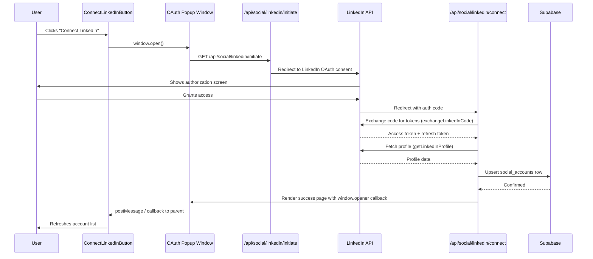
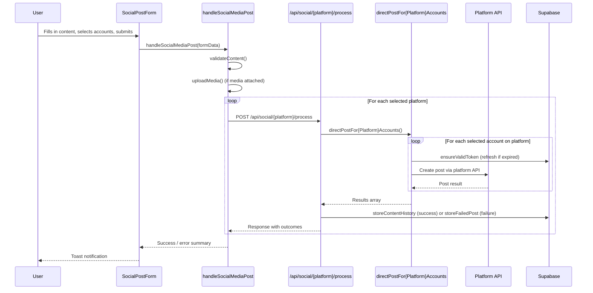
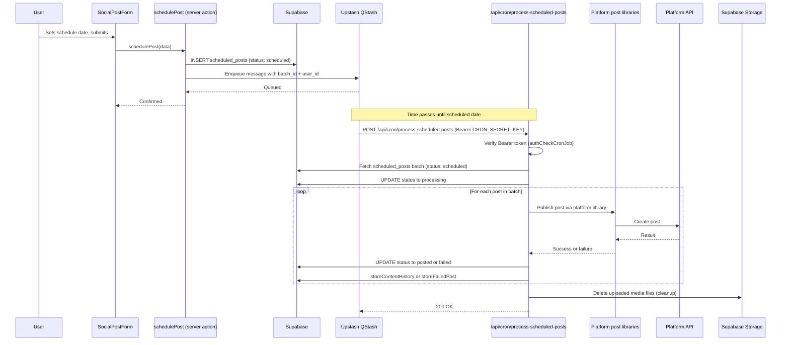
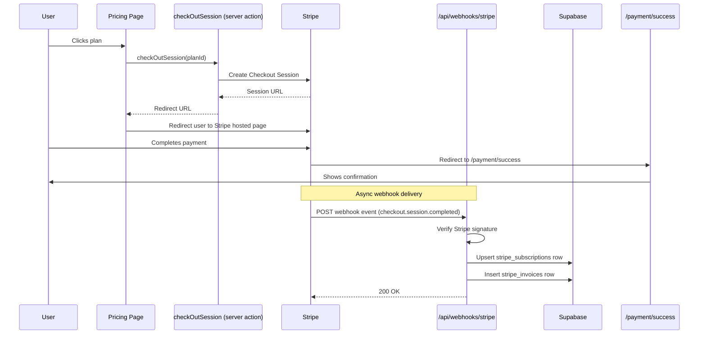

# Data Flow

This document contains sequence diagrams for the four main data flows in Sharetopus: OAuth account connection, direct posting, scheduled posting, and Stripe checkout.

## 1. OAuth Connect Flow

When a user clicks a "Connect" button (for example, ConnectLinkedInButton), the app opens a popup window that initiates the OAuth flow with the platform. After the user authorizes, the platform redirects back to the connect route, which exchanges the code for tokens, fetches the profile, upserts the account in Supabase, and signals the opener window to refresh.

## 2. Direct Post Flow

When a user fills out the SocialPostForm and submits, the client-side handleSocialMediaPost function is called. It validates content, uploads media if needed, then calls the process route for each selected platform. The process route orchestrates posting to each selected account on that platform, stores the result in content_history (or failed_posts on error), and returns the outcome.

## 3. Scheduled Post Flow

When a user schedules a post, the form inserts a row into the scheduled_posts table with status "scheduled" and enqueues a QStash message timed for the target publish date. When the scheduled time arrives, QStash fires an HTTP POST to the cron endpoint. The cron handler authenticates with a Bearer token (CRON_SECRET_KEY), fetches the batch, publishes each post, updates statuses, and cleans up stored media.

## 4. Stripe Checkout Flow

When a user clicks a plan on the pricing page, the app creates a Stripe Checkout Session and redirects the user to Stripe's hosted payment page. After payment completes, Stripe redirects the user back to the success page. Separately, Stripe sends a webhook event that the server uses to upsert the subscription record in Supabase.

---

[Back to Architecture](./README.md) | [Documentation index](../README.md) | [Project root](../../README.md)
