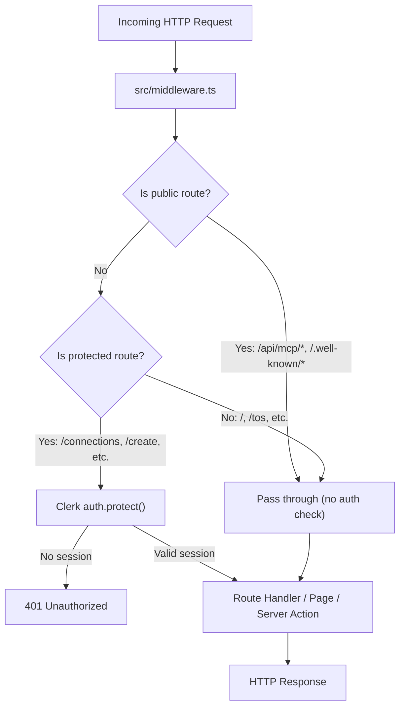
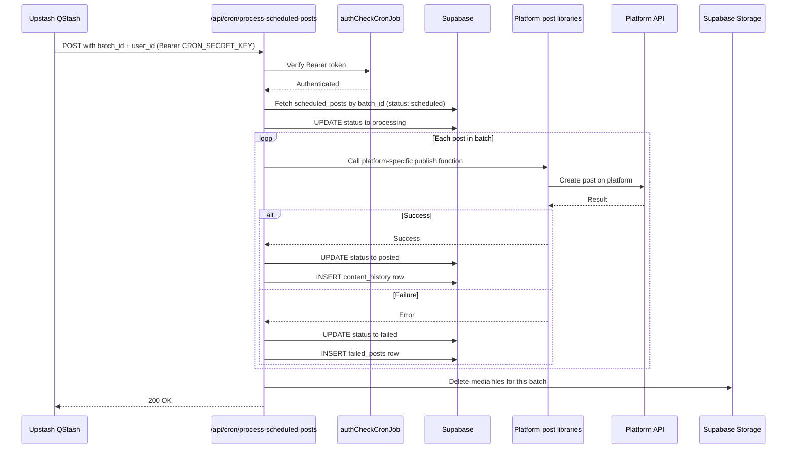

# Lifecycles

This document covers the three main lifecycles in Sharetopus: server startup, HTTP request processing, and cron job execution.

## Startup

Sharetopus starts with `bun dev`, which launches Next.js with Turbopack for development. There is no explicit startup sequence beyond what Next.js provides by default.

1. `bun dev` starts the Next.js dev server with Turbopack.
2. Turbopack compiles TypeScript and resolves modules on demand.
3. `src/middleware.ts` is registered as the global middleware (Clerk auth).
4. API route handlers, server actions, and page components are compiled on first request.

There are no initialization scripts, database migrations on boot, or warm-up routines. Service clients (Supabase, Stripe, Upstash, QStash) are initialized lazily when their modules are first imported.

In production, Vercel handles the build and deployment. The `vercel.json` config sets `maxDuration: 60` seconds for `/api/direct/**` routes.

## Request Lifecycle

Every HTTP request flows through the Clerk middleware before reaching its handler.

**Details of middleware behavior:**

- Public routes (`/api/mcp/*`, `/.well-known/oauth-*`) skip Clerk entirely. The MCP handler does its own Bearer token auth.
- Protected routes (`/connections`, `/create`, `/scheduled`, `/posted`, `/studio`, `/userProfile`, `/integrations`, and others) require a valid Clerk session. Unauthenticated requests get a 401.
- All other routes (marketing pages, static assets) pass through without an auth check.

Once past middleware, the request reaches its handler:

- **Page routes** render React Server Components, which may call server actions to fetch data from Supabase.
- **API routes** (`src/app/api/`) handle REST requests. Social platform routes validate input, call platform API libraries in `src/lib/api/`, and return JSON.
- **Server actions** (`src/actions/server/`) are called from both pages and API routes. They run server-side, authenticate via `authCheck.ts`, and query Supabase.

## Cron Lifecycle

Scheduled post processing is triggered by Upstash QStash. QStash sends an HTTP POST to the cron endpoint at the scheduled time.

**Key points about cron processing:**

- Authentication uses a Bearer token (`CRON_SECRET_KEY`), not Clerk. The cron endpoint is not behind Clerk middleware.
- The cron handler uses `adminSupabase` (service role) because there is no user session in a cron context.
- QStash messages include `batch_id` and `user_id` so the handler knows which posts to process.
- Media cleanup happens after all posts in the batch are processed, removing files from the `scheduled-videos` bucket.

## Shutdown

There are no shutdown hooks. The Next.js server is stateless, so a shutdown (or new deployment on Vercel) does not lose any in-flight work beyond the currently executing request. Scheduled posts that have not yet been triggered remain queued in QStash and will fire against the new deployment.

---

[Back to Architecture](./README.md) | [Documentation index](../README.md) | [Project root](../../README.md)
