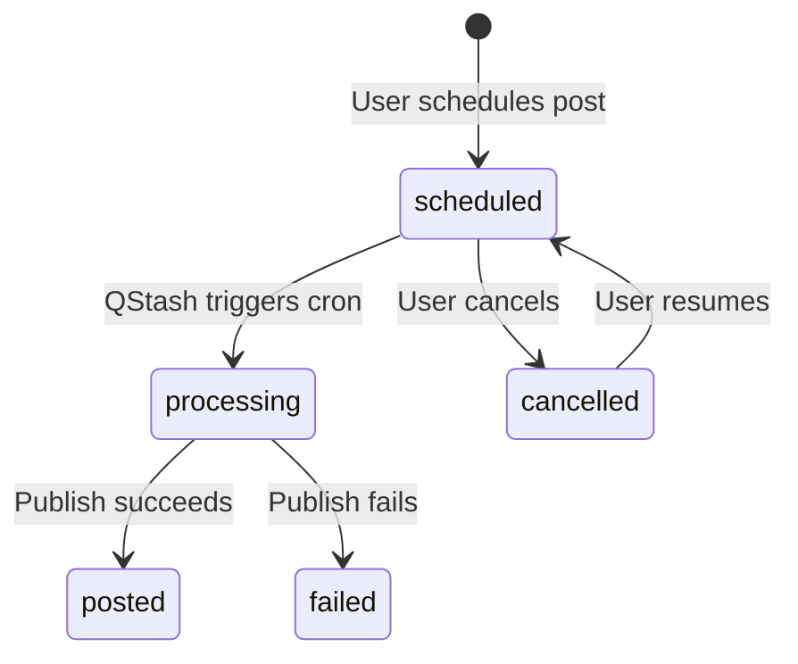

# State Management

Sharetopus does not use a global state management library (no Redux, Zustand, Jotai, or similar). All persistent state lives in external services. Client-side state is limited to React `useState` and `useEffect` within individual components.

## Where State Lives

### 1. PostgreSQL via Supabase (all persistent application state)

The Supabase PostgreSQL database is the single source of truth. The 7 core tables used by the app:

| Table | What it stores |
|-------|---------------|
| `users` | User records synced from Clerk |
| `social_accounts` | Connected platform accounts with OAuth tokens |
| `scheduled_posts` | Posts queued for future publishing |
| `content_history` | Successfully published posts |
| `failed_posts` | Posts that failed to publish |
| `stripe_subscriptions` | Active subscription records |
| `stripe_invoices` | Payment history |

Additional tables support the MCP server: `api_keys`, `principals`, `mcp_audit_log`, `mcp_sessions`, `usage_quotas`, `platform_quotas`.

Two Supabase clients provide access:

- `supabase.ts` - User-scoped client that uses the Clerk JWT. Respects Row Level Security (RLS) policies so users can only see their own data.
- `adminSupabase.ts` - Service role client that bypasses RLS. Used by cron jobs, webhooks, and MCP _internal actions where there is no user session.

### 2. Supabase Storage (media files)

Uploaded media (images, videos) are stored in the `scheduled-videos` Supabase Storage bucket. Files are stored at the path `{userId}/{uuid}.{ext}` and accessed via signed URLs. After a scheduled post is published, the cron job deletes the stored media as part of cleanup.

### 3. Upstash Redis (rate limit counters)

Upstash Redis stores ephemeral rate limit counters. These are checked by `src/actions/server/rateLimit/checkRateLimit.ts` before processing API requests. The counters have TTLs and are not critical state. If Redis is unavailable, the rate limit check would fail open or closed depending on error handling, but no business data is lost.

### 4. React useState in Client Components (form state)

Client-side state management uses React's built-in `useState` and `useEffect` hooks. There is no shared client-side store. The most stateful component is `SocialPostForm` (`src/components/core/create/SocialPostForm.tsx`), which manages:

- Post text content
- Selected social accounts
- Uploaded media files and previews
- Schedule date/time (when scheduling)
- Form validation state
- Submission loading state

Each page component manages its own local state independently. There is no cross-page state sharing on the client.

## Scheduled Post Lifecycle

A scheduled post moves through these statuses:

The six possible statuses are: `scheduled`, `processing`, `posted`, `failed`, `cancelled`, and `idle`.

## What Happens on Restart

Nothing is lost. All state is stored in external services (Supabase, Stripe, Upstash). The Next.js server is stateless. No in-memory caches, no in-process timers, no local file state. A server restart (or a new Vercel deployment) picks up exactly where the previous instance left off because:

- Pending scheduled posts are tracked in the database and triggered by QStash (an external service).
- OAuth tokens are stored in Supabase, not in server memory.
- Rate limit counters are in Upstash Redis, not in-process.
- User sessions are managed by Clerk, not by the server.

---

[Back to Architecture](./README.md) | [Documentation index](../README.md) | [Project root](../../README.md)
