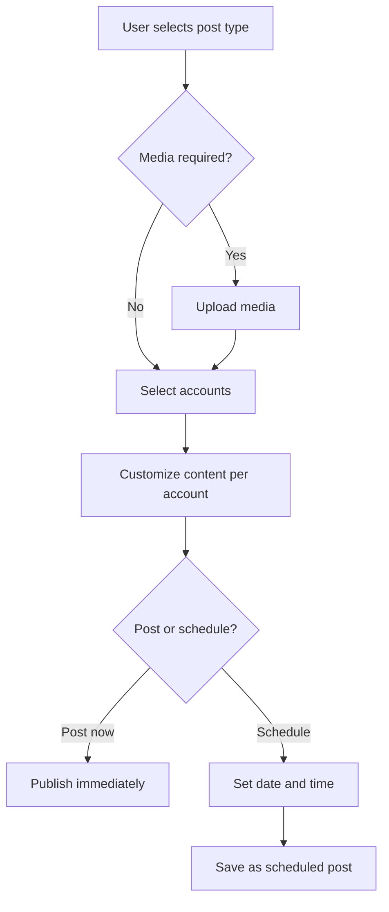

# Content Creation

Sharetopus supports three post types: text, image, and video. Each type has different platform support and constraints.

## Platform support

| Post type | LinkedIn | Pinterest | TikTok | Instagram |
|-----------|----------|-----------|--------|-----------|
| Text      | Yes      | No        | No     | No        |
| Image     | Yes      | Yes       | Yes    | Yes       |
| Video     | Yes      | Yes       | Yes    | Yes       |

## Character limits

| Platform  | Limit |
|-----------|-------|
| LinkedIn  | 3000  |
| Pinterest | 500   |
| TikTok    | 2200  |
| Instagram | 2200  |

## Post types

### Text posts

Text-only posts are supported on LinkedIn only. The `SocialPostForm` component renders in text mode when `postType="text"`. Maximum length is 3000 characters.

### Image posts

Supported on LinkedIn, Pinterest, TikTok, and Instagram. Accepted formats are JPEG and PNG, with an 8 MB maximum file size. PNG files are automatically converted to JPEG when posting to Instagram.

### Video posts

Supported on LinkedIn, Pinterest, TikTok, and Instagram. Accepted formats are MP4 and MOV, with a 250 MB maximum file size. A cover thumbnail can be selected using the timestamp selector in the form.

## Multi-account posting

Users can select multiple connected accounts and post to all of them at once. A per-account customization toggle lets you tailor the caption or media for each account before submitting.

## Platform-specific options

- **TikTok**: Privacy defaults to `SELF_ONLY`. Options to disable comments, duets, and stitches.
- **Pinterest**: A board is required. Users can create a new board inline. An optional link URL can be attached.
- **LinkedIn**: Visibility defaults to `PUBLIC`.
- **Instagram**: Alt text field (1000 character limit). Option to share to feed.

## SocialPostForm flow

The main component lives at `src/components/core/create/SocialPostForm.tsx`.

## Upload flow

1. User drops or selects a file via `react-dropzone`.
2. Client validates file format and size.
3. Client sends `POST /api/storage/generate-upload-url` to get a signed URL.
4. Client uploads the file with `PUT` directly to Supabase storage.
5. Upload progress is tracked and shown in the UI.

Files are stored in the `scheduled-videos` bucket with the path format `{userId}/{uuid}.{ext}`.

## Validation rules

The form enforces the following before submission:

- User must be authenticated.
- At least one account must be selected.
- Image and video post types require media to be uploaded.
- Media must match the accepted format and size limits.
- If scheduling, the selected date must be in the future.
- Pinterest posts require a board selection.

---

[Back to features](./README.md) | [Back to docs](../README.md) | [Back to project root](../../README.md)
