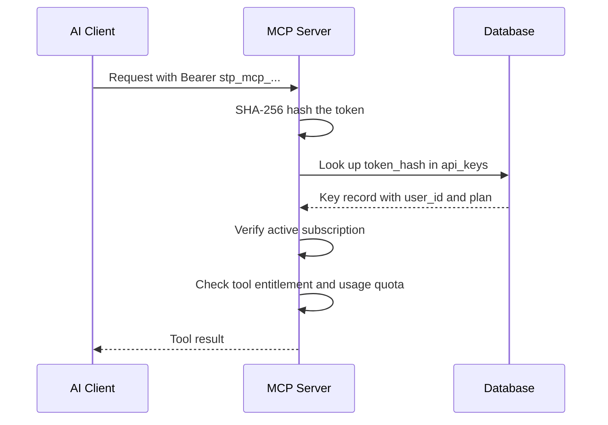

# MCP Server

Sharetopus exposes a [Model Context Protocol](https://modelcontextprotocol.io/) server at `/api/mcp/[transport]`. It provides 14 tools, 3 resources, and 3 prompts that let AI clients (Claude Desktop, Cursor, ChatGPT, etc.) manage social media posts on behalf of authenticated subscribers.

An active subscription is required for MCP access. This is enforced at three levels: authentication, API key creation, and the integrations page itself.

## Authentication

Two auth paths are supported. Both resolve to an `McpPrincipal` passed to every tool handler.

### API key auth

API keys use the `stp_mcp_` prefix. They are SHA-256 hashed before storage and matched against the `api_keys.token_hash` column. Keys are managed on the `/integrations` page.

### Clerk OAuth 2.1

Clients discover the auth server via `/.well-known/oauth-protected-resource` (RFC 9728). The client goes through Clerk's OAuth 2.1 flow with Dynamic Client Registration, then sends the access token on every request. The token is verified by `@clerk/mcp-tools`.

## Entitlement model

Every tool call checks the user's Stripe subscription plan and monthly usage quotas before executing. The plan gate determines which tools are available at each tier.

## Tools

| Tool | Plan gate | Description |
|------|-----------|-------------|
| `list_connections` | Free | List connected social accounts. |
| `list_scheduled_posts` | Free | List all scheduled posts. |
| `list_content_history` | Free | List published content history. |
| `list_billing_summary` | Free | Show current subscription and usage. |
| `schedule_post` | Starter | Schedule a post for future publishing. |
| `cancel_scheduled_post` | Starter | Cancel a scheduled post. |
| `resume_scheduled_post` | Starter | Resume a cancelled scheduled post. |
| `reschedule_scheduled_post` | Starter | Change the scheduled time of a post. |
| `delete_scheduled_post` | Starter | Permanently delete a scheduled post. |
| `attach_media_from_url` | Starter | Attach media to a post from a URL. |
| `request_account_reauth_link` | Starter | Get a re-authentication link for an expired account. |
| `bulk_schedule` | Creator | Schedule multiple posts in one call. |
| `get_account_analytics` | Creator | Retrieve analytics for a connected account. |
| `generate_post_draft` | Pro | Generate a draft post using AI. |

## Resources

| URI | Description |
|-----|-------------|
| `mcp://sharetopus/scheduled-posts` | Current scheduled posts. |
| `mcp://sharetopus/connections` | Connected social accounts. |
| `mcp://sharetopus/content-history` | Published content history. |

## Prompts

| Prompt | Description |
|--------|-------------|
| `plan_week_for_platform` | Plan a week of content for a specific platform. |
| `repurpose_post` | Adapt an existing post for a different platform. |
| `audit_calendar` | Review the scheduled content calendar for gaps or issues. |

## Audit logging

All MCP tool calls are logged to the `mcp_audit_log` table. Secrets are redacted before storage.

## Usage quotas

Monthly usage is tracked in the `usage_quotas` table, keyed by a `YYYY-MM` period string.

## Implementation details

See [src/lib/mcp/README.md](../../src/lib/mcp/README.md) for the file layout, auth internals, and instructions for adding new tools.

---

[Back to features](./README.md) | [Back to docs](../README.md) | [Back to project root](../../README.md)
