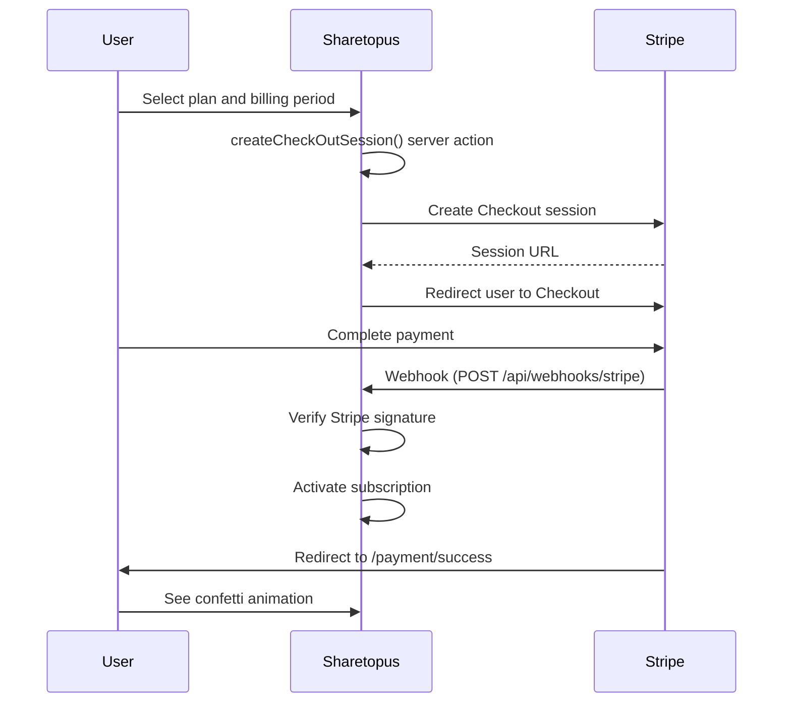

# Payments

Sharetopus uses Stripe for subscription billing. A subscription is required to create posts or connect social accounts. Users without an active subscription see a `SubscriptionPrompt` instead of the relevant UI.

## Subscription tiers

| | Starter | Creator | Pro |
|---|---------|---------|-----|
| Monthly price | $9/mo | $18/mo | $27/mo |
| Yearly price | $64/yr | $129/yr | $194/yr |
| Yearly savings | ~40% | ~40% | ~40% |
| Account limit | 5 | 15 | 999 (unlimited) |
| Storage limit | 5 GB | 15 GB | 45 GB |
| Image upload limit | 8 MB | 8 MB | 8 MB |
| Video upload limit | 250 MB | 250 MB | 250 MB |

## Checkout flow

The `createCheckOutSession()` server action is rate limited to 15 requests per minute.

## Customer portal

Users access the Stripe customer portal from the sidebar: user dropdown, then "Billing". This opens the Stripe-hosted portal where they can update payment methods, change plans, or cancel. The portal redirects back to `/create` when done.

The portal session creation endpoint is rate limited to 20 requests per minute.

## Subscription verification

The `checkActiveSubscription()` function verifies that the user's subscription status is one of: `active`, `trialing`, or `past_due`. Any other status (or no subscription) is treated as inactive.

## Feature gating

Without an active subscription:

- Users cannot create or schedule posts.
- Users cannot connect social accounts.
- The `SubscriptionPrompt` component is shown in place of gated features.

## Webhook handling

Stripe sends events to `POST /api/webhooks/stripe`. The handler verifies the request using the Stripe signature before processing any event.

---

[Back to features](./README.md) | [Back to docs](../README.md) | [Back to project root](../../README.md)
