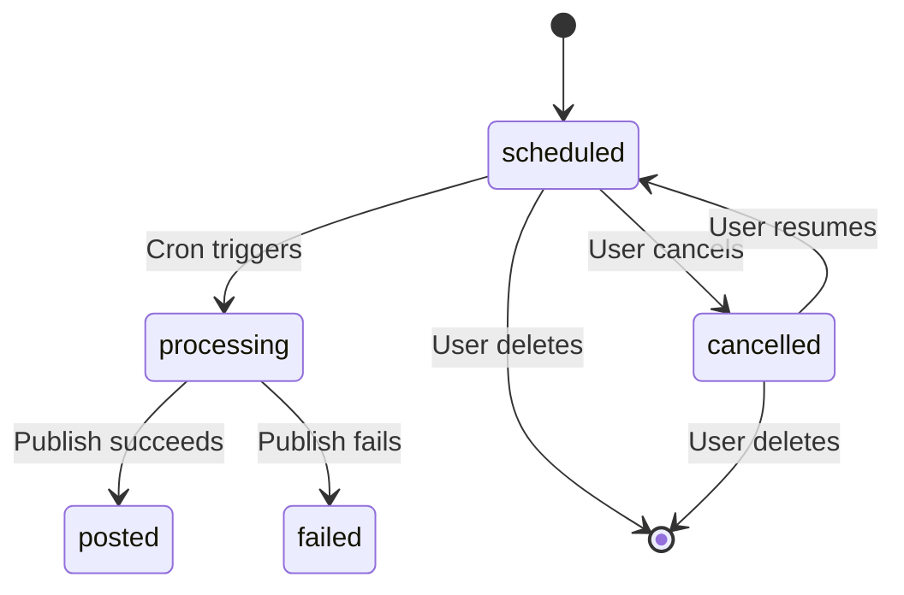
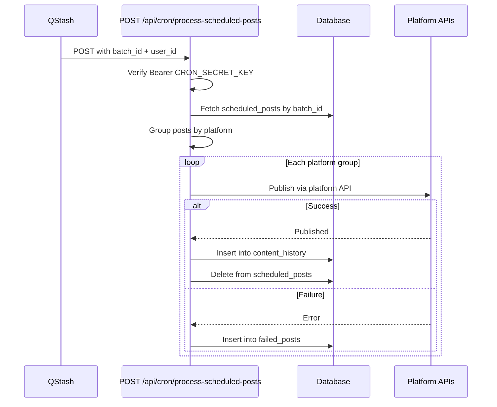

# Scheduling

Posts can be scheduled for future publishing. Toggle "Schedule" in the create form, pick a date (minimum: tomorrow) and time (HH:MM format), then submit. The post is saved to the `scheduled_posts` table with a `batch_id` generated by `nanoid`.

## Post status lifecycle

### Status definitions

| Status | Meaning |
|--------|---------|
| `scheduled` | Waiting for the scheduled time. |
| `processing` | Cron job picked it up, publishing in progress. |
| `posted` | Successfully published to the platform. |
| `failed` | Publishing failed. Record stored in `failed_posts` table. |
| `cancelled` | User cancelled the post. Can be resumed. |

## Cron processing flow

QStash triggers the cron endpoint at the scheduled time. The cron route authenticates using a Bearer token (`CRON_SECRET_KEY`).

## Scheduled posts page

The `/scheduled` page shows all scheduled batches. Each batch displays the scheduled date, current status, media type, and platform avatars for the targeted accounts.

## User actions

| Action | Effect |
|--------|--------|
| **Reschedule** | Opens the batch dialog with inline date/time picker. Updates the scheduled time. |
| **Cancel** | Sets the batch status to `cancelled`. The post will not be processed. |
| **Resume** | Returns a cancelled batch to `scheduled` status. |
| **Delete** | Permanently removes the batch. A confirmation dialog is shown before deletion. |

---

[Back to features](./README.md) | [Back to docs](../README.md) | [Back to project root](../../README.md)
