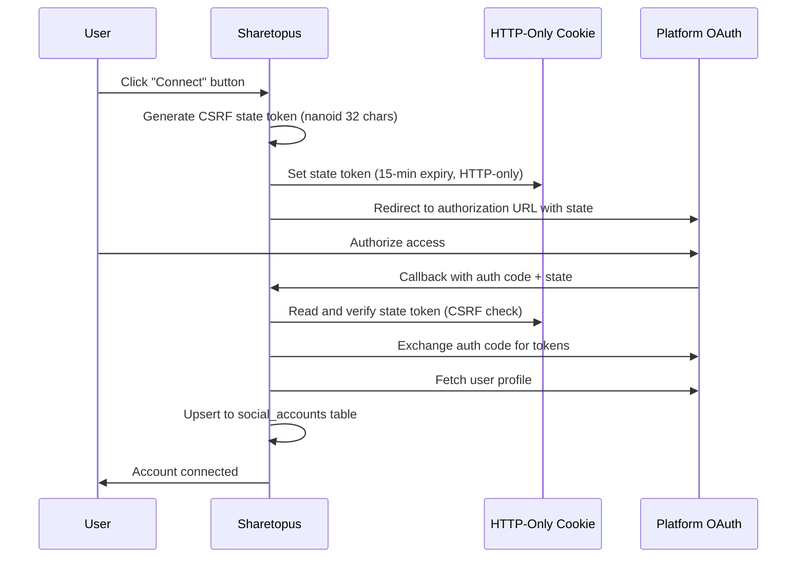

# Social Accounts

Social accounts are connected via OAuth on the `/connections` page. Each platform has a connect button. Currently connectable platforms are TikTok, Pinterest, and LinkedIn. The Instagram connect button is present in the codebase but commented out in the UI.

## OAuth connection flow

## CSRF protection

A `nanoid(32)` state token is generated at the start of each OAuth flow. It is stored in an HTTP-only cookie with a 15-minute expiry. When the platform redirects back, the callback handler compares the returned state parameter against the cookie value. If they do not match, the request is rejected.

## Token refresh

The `ensureValidToken()` function checks whether a token is about to expire using a 5-minute buffer. If the token is within that window, it calls the platform-specific refresh function before making any API request.

### Instagram limitation

Instagram tokens do not include a `refresh_token`. They have a fixed 60-day TTL. When an Instagram token expires, the user must reconnect the account manually.

## Account limits by plan

| Plan | Account limit |
|------|---------------|
| No subscription | 0 (cannot connect any accounts) |
| Starter | 5 |
| Creator | 15 |
| Pro | 999 (effectively unlimited) |

When a user reaches their plan's account limit, a `ConnectionLimitModal` is displayed instead of starting the OAuth flow.

---

[Back to features](./README.md) | [Back to docs](../README.md) | [Back to project root](../../README.md)
