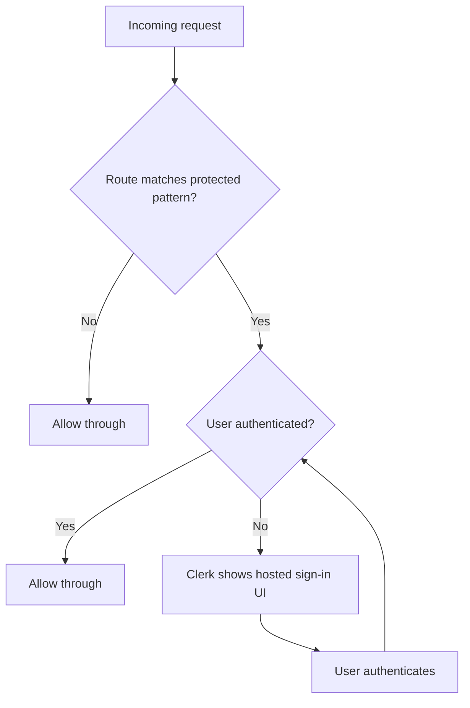

# Clerk Integration

Sharetopus uses Clerk (`@clerk/nextjs ^7.3.2`) for authentication. There are no dedicated sign-in or sign-up routes. Clerk middleware intercepts protected routes and shows hosted UI.

## Architecture

| Component | Location | Purpose |
|-----------|----------|---------|
| Root provider | `src/app/layout.tsx` | `ClerkProvider` wraps the entire app |
| Middleware | `src/middleware.ts` | `clerkMiddleware()` with `createRouteMatcher()` |
| Server-side auth | Any server component or route handler | `auth()` and `currentUser()` from `@clerk/nextjs/server` |
| Client-side auth | Any client component | `useAuth()`, `useUser()`, `useClerk()` hooks |
| Webhook endpoint | `POST /api/webhooks/clerk` | Receives user lifecycle events from Clerk |

## Auth Middleware Flow

The middleware uses `clerkMiddleware()` and `createRouteMatcher()` to decide which routes require authentication. Protected routes redirect unauthenticated users to the Clerk-hosted sign-in flow.

## User Sync

Every protected page calls `ensureUserExists()`, which:

1. Checks if the Clerk user already exists in Supabase.
2. If not, creates a Stripe customer, a Supabase user record, and a principal record.
3. Syncs profile data from Clerk to Supabase.

This ensures the local database always has a matching record for the authenticated Clerk user.

## Webhooks

The webhook endpoint at `POST /api/webhooks/clerk` verifies payloads using Svix. Three headers are required for verification:

- `svix-id`
- `svix-timestamp`
- `svix-signature`

### Webhook Events

| Event | Action |
|-------|--------|
| `user.created` | Create Stripe customer, Supabase user record, and principal |
| `user.updated` | Sync profile data to Supabase |
| `user.deleted` | Delete user record, Stripe customer, and associated storage |

### Webhook Secrets

The app uses separate webhook secrets per environment:

- **Production:** `CLERK_WEBHOOK_SECRET`
- **Development:** `CLERK_WEBHOOK_SECRET_DEV`

## Environment Variables

| Variable | Description |
|----------|-------------|
| `NEXT_PUBLIC_CLERK_PUBLISHABLE_KEY` | Clerk publishable key (client-side) |
| `CLERK_SECRET_KEY` | Clerk secret key (server-side) |
| `CLERK_WEBHOOK_SECRET` | Webhook signing secret (production) |
| `CLERK_WEBHOOK_SECRET_DEV` | Webhook signing secret (development) |

---

[Back to Integrations](./README.md) | [Back to docs](../README.md) | [Back to project root](../../README.md)
