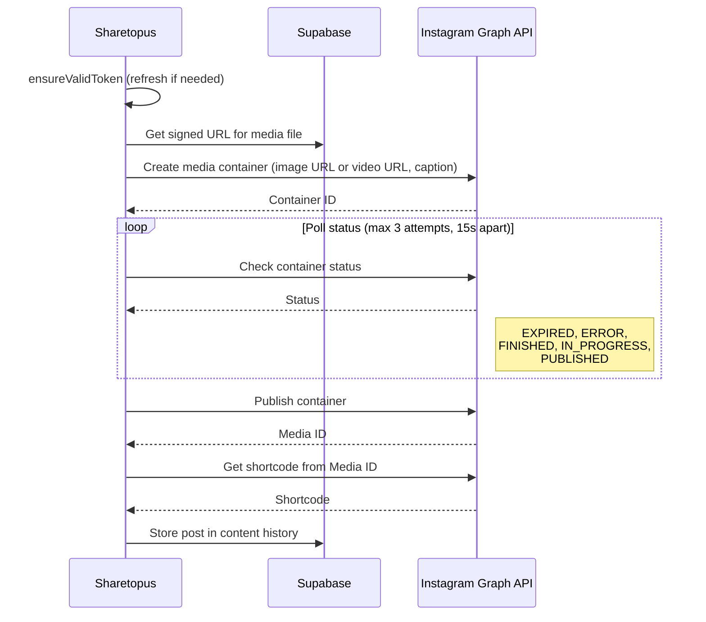

# Instagram Integration

Sharetopus connects to Instagram using the Instagram Graph API v23.0 to publish feed images and Reels.

## API Details

| Field | Value |
|-------|-------|
| API version | Instagram Graph API v23.0 |
| OAuth scopes | `instagram_business_basic`, `instagram_business_content_publish` |
| Token refresh | Long-lived token refresh (60-day TTL, no `refresh_token` grant) |
| Caption limit | 2200 characters |
| Content types | Image (feed post), Video (Reel) |
| Media source | Public HTTPS URL (Instagram fetches from the URL) |
| Account type | Requires Business or Creator Instagram account |

## Token Refresh

Instagram does not use a `refresh_token` grant. Instead, the long-lived access token is refreshed directly. The token has a 60-day TTL and must be refreshed before it expires. If the token expires without being refreshed, the user must re-authenticate.

## Container-Based Publishing

Instagram publishing uses a three-step process: create a media container, wait for processing, then publish.

### Container Statuses

| Status | Meaning |
|--------|---------|
| `IN_PROGRESS` | Still processing, keep polling |
| `FINISHED` | Ready to publish |
| `EXPIRED` | Container timed out before publishing |
| `ERROR` | Processing failed |
| `PUBLISHED` | Already published |

## Known Limitations

- **No text-only posts.** Instagram requires media for every post.
- **PNG auto-conversion.** PNG images are automatically converted to JPEG by the platform.
- **UI connect button disabled.** The Instagram connect button is disabled in the UI, but the backend OAuth and posting flows are functional.

## Reel Options

- **`share_to_feed`** - controls whether Reels also appear in the user's feed
- **Alt text** - optional, up to 1000 characters

## OAuth

Token exchange, profile fetching, and refresh are in `src/lib/api/instagram/data/`:

- `exchangeInstagramCode` - exchanges the OAuth authorization code for tokens
- `getInstagramProfile` - fetches the authenticated user's Instagram profile
- `refreshInstagramToken` - refreshes the long-lived access token (no refresh_token, refreshes the token itself)

## Source Files

| Path | Contents |
|------|----------|
| `src/lib/api/instagram/data/` | `exchangeInstagramCode`, `getInstagramProfile`, `refreshInstagramToken` |
| `src/lib/api/instagram/post/` | `postToInstagram`, `directPostForInstagramAccounts` |
| `src/lib/api/instagram/processAccounts/` | Scheduled post account processing |
| `src/lib/api/instagram/schedule/` | Scheduled post handling |

## Environment Variables

| Variable | Description |
|----------|-------------|
| `INSTAGRAM_CLIENT_ID` | Instagram/Meta developer app client ID |
| `INSTAGRAM_CLIENT_SECRET` | Instagram/Meta developer app client secret |
| `INSTAGRAM_REDIRECT_URL` | OAuth redirect URL registered with Instagram/Meta |

---

[Back to Integrations](./README.md) | [Back to docs](../README.md) | [Back to project root](../../README.md)
