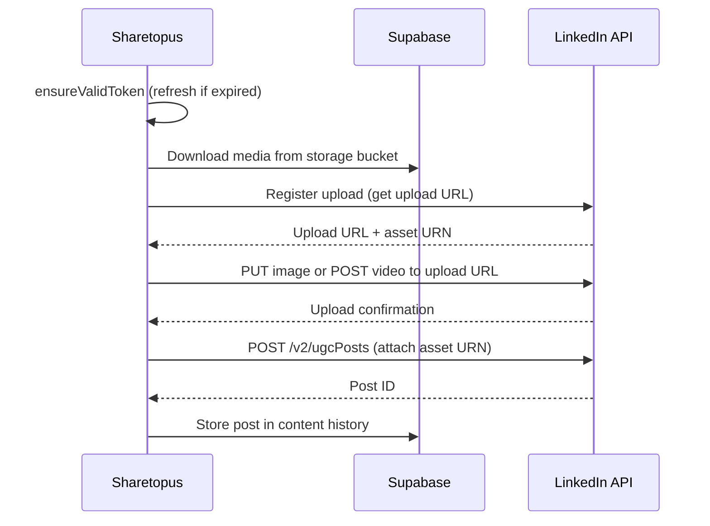

# LinkedIn Integration

Sharetopus connects to LinkedIn using the LinkedIn v2 API (Rest.li 2.0.0) to publish text, image, and video posts on behalf of users.

## API Details

| Field | Value |
|-------|-------|
| API version | LinkedIn v2 (Rest.li 2.0.0) |
| Post endpoint | `POST /v2/ugcPosts` (via `postToLinkedIn`) |
| OAuth scopes | `openid`, `profile`, `email`, `w_member_social` |
| Token refresh | Yes (`refresh_token` grant) |
| Caption limit | 3000 characters |
| Visibility | `PUBLIC` (default) |
| Account identifier | Member URN (`urn:li:person:{id}`) |
| Content types | Text, Image, Video |
| Media source | Buffer (downloaded from Supabase, uploaded directly to LinkedIn) |

## OAuth

Token exchange, profile fetching, and refresh are in `src/lib/api/linkedin/data/`:

- `exchangeLinkedInCode` - exchanges the OAuth authorization code for tokens
- `getLinkedInProfile` - fetches the authenticated user's LinkedIn profile
- `refreshLinkedinToken` - refreshes an expired access token using the refresh token

## Direct Post Flow

## Media Upload

LinkedIn uses a two-step media upload:

1. **Register upload** - call LinkedIn's upload registration endpoint to get an upload URL and an asset URN.
2. **Upload media** - PUT the image bytes or POST the video bytes to the upload URL. Media is downloaded from Supabase as a Buffer and sent directly.
3. **Attach to post** - include the asset URN in the `ugcPosts` payload.

## Source Files

| Path | Contents |
|------|----------|
| `src/lib/api/linkedin/data/` | `exchangeLinkedInCode`, `getLinkedInProfile`, `refreshLinkedinToken` |
| `src/lib/api/linkedin/post/` | `postToLinkedIn`, `directPostForLinkedInAccounts` |
| `src/lib/api/linkedin/processAccounts/` | `processLinkedinAccounts` |
| `src/lib/api/linkedin/schedule/` | `scheduledForLinkedinAccounts` |

## Environment Variables

| Variable | Description |
|----------|-------------|
| `LINKEDIN_CLIENT_ID` | LinkedIn developer app client ID |
| `LINKEDIN_CLIENT_SECRET` | LinkedIn developer app client secret |
| `LINKEDIN_REDIRECT_URL` | OAuth redirect URL registered with LinkedIn |

---

[Back to Integrations](./README.md) | [Back to docs](../README.md) | [Back to project root](../../README.md)
