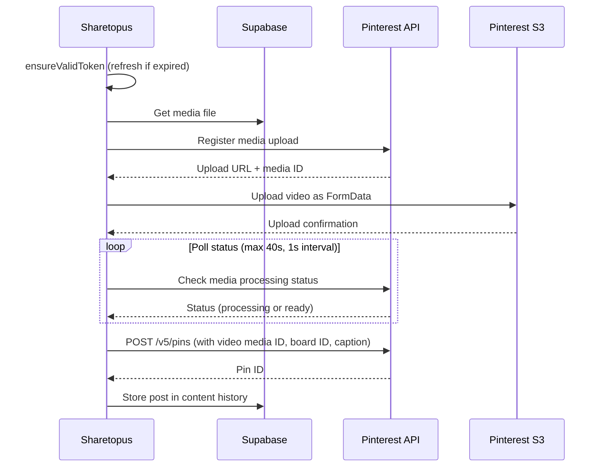

# Pinterest Integration

Sharetopus connects to Pinterest using the Pinterest v5 API to create image pins and video pins.

## API Details

| Field | Value |
|-------|-------|
| API version | Pinterest v5 |
| Pin creation endpoint | `POST /v5/pins` |
| OAuth scopes | `boards:read`, `boards:write`, `pins:read`, `pins:write`, `user_accounts:read`, `catalogs:read`, `catalogs:write` |
| Token refresh | Yes (30-day default) |
| Caption limit | 500 characters |
| Content types | Image pin, Video pin |
| Auth method (token exchange) | Basic Auth (base64-encoded `client_id:client_secret`) |

## Board Requirement

Every pin must be attached to a board. The integration supports:

- Fetching the user's existing boards (`getPinterestBoards`)
- Creating new boards (`createPinterestBoard`)

Board selection is required before publishing.

## Image Upload

Image pins use a direct URL reference. The image source type is `image_url`, pointing to the media file's URL. No separate upload step is needed.

## Video Pin Flow

Video pins require a multi-step process: register the media, upload to S3, poll until processing completes, then create the pin.

## Pin Options

- **Board selection** (required)
- **Link URL** - optional URL attached to the pin
- **Cover image key frame time** - timestamp for the video cover frame

## OAuth

Token exchange uses Basic Auth: the `client_id` and `client_secret` are base64-encoded and sent in the `Authorization` header. Profile fetching and token refresh are in `src/lib/api/pinterest/data/`:

- `exchangePinterestCode` - exchanges the OAuth authorization code for tokens
- `getPinterestProfile` - fetches the authenticated user's Pinterest profile
- `refreshPinterestToken` - refreshes an expired access token
- `getPinterestBoards` - fetches the user's boards
- `createPinterestBoard` - creates a new board

## Source Files

| Path | Contents |
|------|----------|
| `src/lib/api/pinterest/data/` | `exchangePinterestCode`, `getPinterestProfile`, `refreshPinterestToken`, `getPinterestBoards`, `createPinterestBoard` |
| `src/lib/api/pinterest/post/` | `postToPinterest`, `postImage`, `createVideoPin`, `directPostForPinterestAccounts` |
| `src/lib/api/pinterest/processAccounts/` | Scheduled post account processing |
| `src/lib/api/pinterest/schedule/` | Scheduled post handling |

## Environment Variables

| Variable | Description |
|----------|-------------|
| `PINTEREST_CLIENT_ID` | Pinterest developer app client ID |
| `PINTEREST_CLIENT_SECRET` | Pinterest developer app client secret |
| `PINTEREST_REDIRECT_URL` | OAuth redirect URL registered with Pinterest |

---

[Back to Integrations](./README.md) | [Back to docs](../README.md) | [Back to project root](../../README.md)
