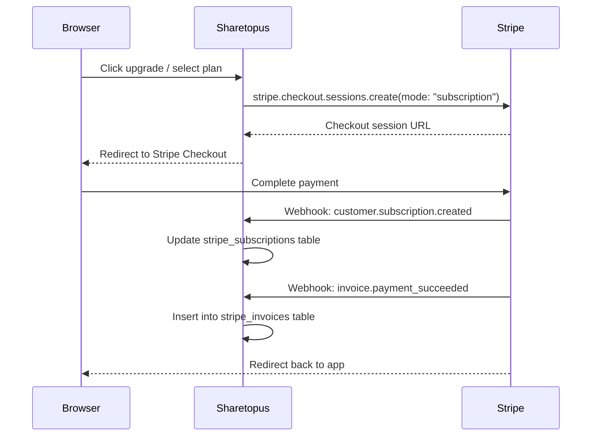

# Stripe Integration

Sharetopus uses Stripe (`stripe ^18.5.0`) for subscription billing, checkout, and the customer portal.

## API Details

| Field | Value |
|-------|-------|
| Package | `stripe ^18.5.0` |
| API version | `2025-08-27.basil` (set in `src/lib/stripe.ts`) |
| Checkout mode | `subscription` |
| Tables | `stripe_subscriptions`, `stripe_invoices` |
| Plan mapping | Price ID to plan name in `src/lib/types/plans.ts` |

## Checkout Flow

## Customer Portal

Users can manage their subscription (cancel, update payment method) through the Stripe customer portal:

1. App calls `stripe.billingPortal.sessions.create()`.
2. User is redirected to the Stripe-hosted portal.
3. Subscription changes trigger webhooks back to the app.

## Plan Mapping

Plans are mapped from Stripe price IDs to plan names in `src/lib/types/plans.ts`. The three plan tiers are:

- `starter`
- `creator`
- `pro`

## Webhook Events

The webhook endpoint at `POST /api/webhooks/stripe` verifies payloads using `stripe.webhooks.constructEventAsync()`.

| Event | Action |
|-------|--------|
| `customer.subscription.created` | Insert or update subscription record in `stripe_subscriptions` |
| `customer.subscription.updated` | Update subscription record in `stripe_subscriptions` |
| `customer.subscription.deleted` | Update subscription record (mark as canceled) |
| `invoice.payment_succeeded` | Insert invoice record into `stripe_invoices` |
| `invoice.payment_failed` | Insert invoice record with failed status |

### Webhook Secrets

Separate secrets per environment:

- **Production:** `STRIPE_WEBHOOK_SECRET`
- **Development:** `STRIPE_WEBHOOK_SECRET_DEV` (from `stripe listen` CLI output)

## Environment Variables

| Variable | Description |
|----------|-------------|
| `STRIPE_SECRET_KEY` | Stripe secret API key (server-side) |
| `STRIPE_PUBLISHABLE_KEY` | Stripe publishable API key (client-side) |
| `STRIPE_WEBHOOK_SECRET` | Webhook signing secret (production) |
| `STRIPE_WEBHOOK_SECRET_DEV` | Webhook signing secret (development) |

---

[Back to Integrations](./README.md) | [Back to docs](../README.md) | [Back to project root](../../README.md)
