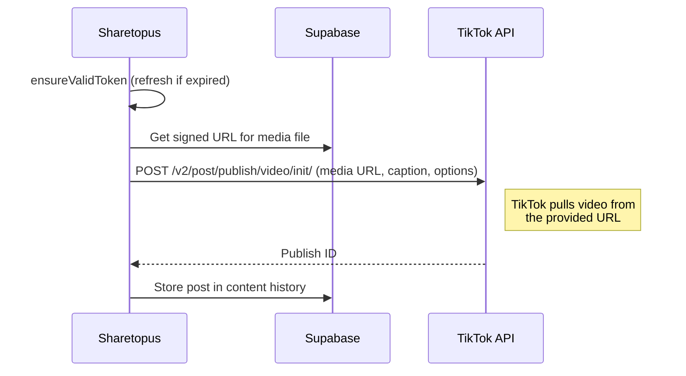

# TikTok Integration

Sharetopus connects to TikTok using the TikTok v2 API to publish image posts and videos.

## API Details

| Field | Value |
|-------|-------|
| API version | TikTok v2 |
| Image endpoint | `POST /v2/post/publish/content/init/` |
| Video endpoint | `POST /v2/post/publish/video/init/` |
| OAuth scopes | `user.info.basic`, `user.info.profile`, `video.publish`, `video.upload`, `user.info.stats` |
| Token refresh | Yes |
| Caption limit | 2200 characters |
| Privacy default | `SELF_ONLY` (configurable) |
| Content types | Image (photo post), Video |
| Media source | `PULL_FROM_URL` (TikTok fetches from provided URL) |

## Dev/Prod Key Split

TikTok uses separate client keys for development and production environments:

- **Production:** `TIKTOK_CLIENT_KEY` / `TIKTOK_CLIENT_SECRET`
- **Development:** `TIKTOK_CLIENT_KEY_DEV` / `TIKTOK_CLIENT_SECRET_DEV`

The app selects the correct pair based on the environment.

## Privacy Default

Posts default to `SELF_ONLY` visibility. This means newly published content is only visible to the posting account until the user changes the privacy setting on TikTok. The privacy level is configurable.

## Post Options

- Disable comments
- Disable duets
- Disable stitches
- Video cover timestamp
- `auto_add_music`

## OAuth

Token exchange, profile fetching, and refresh are in `src/lib/api/tiktok/data/`:

- `exchangeTikTokCode` - exchanges the OAuth authorization code for tokens
- `getTikTokProfile` - fetches the authenticated user's TikTok profile
- `refreshTikTokToken` - refreshes an expired access token

## Video Post Flow

TikTok uses a pull model: instead of uploading bytes, Sharetopus provides a publicly accessible URL and TikTok downloads the file from it.

## Source Files

| Path | Contents |
|------|----------|
| `src/lib/api/tiktok/data/` | `exchangeTikTokCode`, `getTikTokProfile`, `refreshTikTokToken` |
| `src/lib/api/tiktok/post/` | `postToTikTok`, `postImage`, `postVideo`, `directPostForTikTokAccounts` |
| `src/lib/api/tiktok/processAccounts/` | Scheduled post account processing |
| `src/lib/api/tiktok/schedule/` | Scheduled post handling |

## Environment Variables

| Variable | Description |
|----------|-------------|
| `TIKTOK_CLIENT_KEY` | TikTok developer app client key (production) |
| `TIKTOK_CLIENT_SECRET` | TikTok developer app client secret (production) |
| `TIKTOK_CLIENT_KEY_DEV` | TikTok developer app client key (development/sandbox) |
| `TIKTOK_CLIENT_SECRET_DEV` | TikTok developer app client secret (development/sandbox) |
| `TIKTOK_REDIRECT_URL` | OAuth redirect URL registered with TikTok |

---

[Back to Integrations](./README.md) | [Back to docs](../README.md) | [Back to project root](../../README.md)
