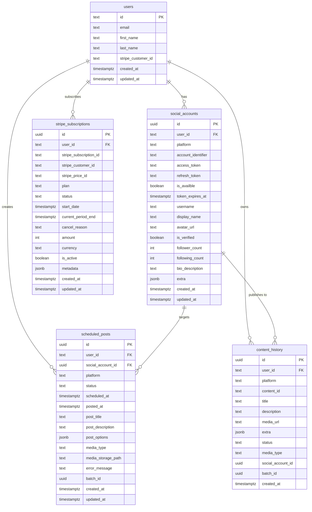

# Database Schema

All 27 tables defined in `supabase/migrations/20260506000001_initial_schema.sql`. Tables are split into three groups: core application tables, MCP tables, and tables that exist in the schema but are not actively used by the application code.

## Entity Relationships (Core Tables)

## Core Tables

These tables are actively used by the application.

### users

Primary key is the Clerk user ID (text, not UUID).

| Column | Type | Notes |
|--------|------|-------|
| id | text | PK, Clerk user ID |
| email | text | |
| first_name | text | |
| last_name | text | |
| stripe_customer_id | text | |
| created_at | timestamptz | |
| updated_at | timestamptz | |

### social_accounts

Connected social platform accounts. The `is_availble` column name contains a typo that exists in the codebase.

Unique constraint on `(user_id, platform, account_identifier)`.

| Column | Type | Notes |
|--------|------|-------|
| id | uuid | PK |
| user_id | text | FK to users |
| platform | text | linkedin, tiktok, pinterest, instagram |
| account_identifier | text | Platform-specific user/account ID |
| access_token | text | |
| refresh_token | text | |
| is_availble | boolean | Note: typo in schema |
| token_expires_at | timestamptz | |
| username | text | |
| display_name | text | |
| avatar_url | text | |
| is_verified | boolean | |
| follower_count | int | |
| following_count | int | |
| bio_description | text | |
| extra | jsonb | |
| created_at | timestamptz | |
| updated_at | timestamptz | |

### scheduled_posts

Posts queued for future publishing.

| Column | Type | Notes |
|--------|------|-------|
| id | uuid | PK |
| user_id | text | FK to users |
| social_account_id | uuid | FK to social_accounts |
| platform | text | |
| status | text | scheduled, processing, posted, failed, cancelled, idle |
| scheduled_at | timestamptz | When the post should be published |
| posted_at | timestamptz | When the post was actually published |
| post_title | text | |
| post_description | text | |
| post_options | jsonb | Platform-specific options |
| media_type | text | text, image, video |
| media_storage_path | text | Path in Supabase storage |
| error_message | text | Populated on failure |
| batch_id | uuid | Groups posts published together |
| created_at | timestamptz | |
| updated_at | timestamptz | |

### content_history

Record of published content.

| Column | Type | Notes |
|--------|------|-------|
| id | uuid | PK |
| user_id | text | FK to users |
| platform | text | |
| content_id | text | Platform-assigned post ID |
| title | text | |
| description | text | |
| media_url | text | |
| extra | jsonb | |
| status | text | |
| media_type | text | |
| social_account_id | uuid | |
| batch_id | uuid | |
| created_at | timestamptz | |

### failed_posts

Records of posts that failed to publish.

| Column | Type | Notes |
|--------|------|-------|
| id | uuid | PK |
| user_id | text | |
| social_account_id | uuid | |
| platform | text | |
| post_title | text | |
| post_description | text | |
| media_type | text | |
| media_storage_path | text | |
| error_message | text | |
| extra_data | jsonb | |
| batch_id | uuid | |
| created_at | timestamptz | |

### stripe_subscriptions

Subscription state synced from Stripe webhooks.

| Column | Type | Notes |
|--------|------|-------|
| id | uuid | PK |
| user_id | text | FK to users |
| stripe_subscription_id | text | |
| stripe_customer_id | text | |
| stripe_price_id | text | |
| plan | text | starter, creator, pro |
| status | text | active, canceled, past_due, trialing, incomplete |
| start_date | timestamptz | |
| current_period_end | timestamptz | |
| cancel_reason | text | |
| amount | int | In cents |
| currency | text | |
| is_active | boolean | |
| metadata | jsonb | |
| created_at | timestamptz | |
| updated_at | timestamptz | |

### stripe_invoices

Invoice records synced from Stripe.

| Column | Type | Notes |
|--------|------|-------|
| id | uuid | PK |
| user_id | text | |
| stripe_invoice_id | text | |
| amount_paid | int | In cents |
| currency | text | |
| status | text | paid, failed |
| created_at | timestamptz | |

### analytics_metrics

Per-content analytics data.

| Column | Type | Notes |
|--------|------|-------|
| id | uuid | PK |
| user_id | text | FK to users |
| platform | text | |
| content_id | text | |
| views | bigint | |
| comments | bigint | |
| subscribers | bigint | |
| extra | jsonb | |
| created_at | timestamptz | |
| updated_at | timestamptz | |

## MCP Tables

Tables used by the MCP server for authentication, audit logging, sessions, and quotas.

### principals

| Column | Type | Notes |
|--------|------|-------|
| id | uuid | PK |
| kind | text | clerk, wallet |
| external_id | text | |
| created_at | timestamptz | |

### api_keys

| Column | Type | Notes |
|--------|------|-------|
| id | uuid | PK |
| principal_id | uuid | FK to principals |
| kind | text | mcp |
| name | text | |
| token_hash | text | |
| prefix | text | |
| scopes | jsonb | |
| revoked_at | timestamptz | |
| last_used_at | timestamptz | |
| expires_at | timestamptz | |
| created_at | timestamptz | |

### mcp_audit_log

| Column | Type | Notes |
|--------|------|-------|
| id | uuid | PK |
| principal_id | uuid | |
| api_key_id | uuid | |
| tool_name | text | |
| arguments | jsonb | |
| result_summary | text | |
| latency_ms | int | |
| created_at | timestamptz | |

### mcp_sessions

| Column | Type | Notes |
|--------|------|-------|
| id | uuid | PK |
| principal_id | uuid | FK to principals |
| transport | text | |
| created_at | timestamptz | |
| last_seen_at | timestamptz | |

### usage_quotas

| Column | Type | Notes |
|--------|------|-------|
| id | uuid | PK |
| principal_id | uuid | FK to principals |
| action | text | |
| period | text | Format: YYYY-MM |
| used | int | |
| cap | int | |
| created_at | timestamptz | |
| updated_at | timestamptz | |

### platform_quotas

| Column | Type | Notes |
|--------|------|-------|
| id | uuid | PK |
| platform | text | |
| daily_cap | int | |
| created_at | timestamptz | |

## Schema-Only Tables

The following tables exist in the migration file but are not actively referenced by the application code:

- `wallets`
- `wallet_credits`
- `wallet_credits_ledger`
- `x402_charges`
- `x402_refunds`
- `x402_access_log`
- `pricing_actions`
- `usdc_fmv_daily`
- `sanctions_screenings`
- `siwe_nonces`
- `social_connections`
- `rate_limit_events`
- `mcp_oauth_clients`

---

[Back to Reference](./README.md) | [Back to docs](../README.md) | [Back to project root](../../README.md)
