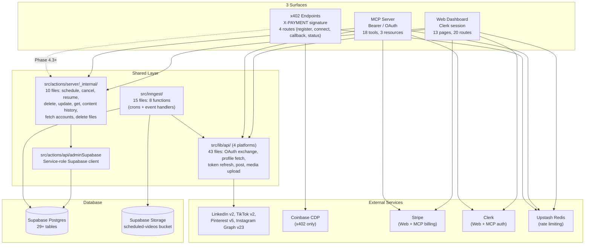

# Overview: 3 Surfaces + Shared Layer

All files in the mandatory pre-read list were read before writing this document.

## Section 1: The 3 surfaces

**Web (Clerk dashboard).** Used by human subscribers who log in at sharetopus.com via Clerk authentication. They create, schedule, and manage social media posts across LinkedIn, TikTok, Pinterest, and Instagram from a React 19 SPA. Code lives in `src/app/(protected)/` (13 page components), `src/app/api/social/` (16 route handlers), `src/app/api/storage/` (2 route handlers), and `src/app/api/webhooks/` (2 route handlers). Auth is a Clerk session cookie checked by `src/middleware.ts:1` and server-side `auth()` calls from `@clerk/nextjs/server`.

**MCP (AI agents with subscription).** Used by AI agents (Claude Desktop, Cursor, ChatGPT) on behalf of subscribers with active Stripe plans. The MCP server at `src/app/api/mcp/[transport]/route.ts:1` exposes 18 tools, 3 resources, and 3 prompts via Streamable HTTP and SSE transports (mcp-handler 1.1.0, stateless). Auth is Bearer token (either `stp_mcp_*` API key hashed and looked up in `api_keys` table, or Clerk OAuth JWT). Code lives in `src/lib/mcp/` (43 files) including `tools/` (18 tool files), `auth/` (key + OAuth resolvers), `audit.ts`, `entitlement.ts`, `context.ts`, and `_shared/` (safeUserFetch, enforceStorageQuota, currentQuotaPeriod).

**x402 (AI agents with crypto payment per call).** Used by AI agents that pay per action with USDC instead of holding a monthly subscription. Phase 4.1 (register) and Phase 4.2 (connect + Solana) are shipped as of HEAD `2f2794e`. Phase 4.3 (post endpoints) is planned but not built. Auth is SIWE (Sign-In With Ethereum) signature verified via `viem/siwe`, with payment authorization via EIP-3009 `transferWithAuthorization`. Code lives in `src/app/api/x402/` (4 route handlers) and `src/lib/x402/` (33 files) including `register/`, `connect/`, `oauth/`, `auth/`, `siwe/`, `sanctions/`, `responses/`, `audit/`, `facilitator.ts`, and `networks.ts`.

## Section 2: Top-level architecture



## Section 3: File count by surface

Counts from actual file system enumeration:

```
find src/app/api/social src/app/api/posts src/app/api/storage src/app/api/webhooks -name "*.ts" | wc -l   => 21
find src/lib/mcp -name "*.ts" | wc -l                                                                      => 43
find src/app/api/x402 -name "*.ts" | wc -l                                                                 => 4
find src/lib/x402 -name "*.ts" | wc -l                                                                     => 33
find src/actions/server/_internal -name "*.ts" | wc -l                                                      => 10
find src/lib/api -name "*.ts" | wc -l                                                                       => 43
find src/inngest -name "*.ts" | wc -l                                                                       => 15
```

| Surface | Route handlers | Lib files | Custom DB writes | Notes |
|---|---|---|---|---|
| Web | 20 (4 per platform x 4 + storage x 2 + webhooks x 2) | 0 (uses shared libs) | social_accounts, scheduled_posts, content_history, stripe_subscriptions, stripe_invoices, users, principals | Clerk auth, dashboard UI |
| MCP | 1 (`src/app/api/mcp/[transport]/route.ts`) | 43 (`src/lib/mcp/`) | scheduled_posts, content_history, pending_direct_posts, mcp_audit_log, mcp_sessions, usage_quotas, api_keys | Tool registry + subscription gates |
| x402 | 4 (`register`, `connect`, `oauth/callback/[platform]`, `oauth/status`) | 33 (`src/lib/x402/`) | principals, wallets, siwe_nonces, x402_charges, x402_access_log, sanctions_screenings, wallet_credits, social_connections, social_accounts | Per-call crypto payment |
| Shared (_internal) | n/a | 10 | scheduled_posts, content_history, failed_posts | Surface-agnostic business logic |
| Shared (platform libs) | n/a | 43 (`src/lib/api/`) | social_accounts (via OAuth callbacks) | Per-platform API integrations |
| Shared (Inngest) | 1 (`src/app/api/inngest/route.ts`) | 15 | scheduled_posts, content_history, failed_posts, pending_direct_posts, pending_tiktok_pulls | Background job workers |

## Section 4: What each surface ships TODAY

### Web dashboard (shipped)

- User authentication via Clerk (sign up, sign in, profile management)
- Connect social accounts: LinkedIn, TikTok, Pinterest (Instagram backend ready, button commented out)
- Create posts: text, image, video with per-platform customization
- Schedule posts for future dates (status: scheduled, queued, processing, posted, failed, cancelled)
- Post immediately ("post now") with async processing via Inngest
- View scheduled posts with cancel/resume/reschedule/delete operations
- View content history (posted items)
- Media upload to Supabase Storage with signed URLs (image 8 MB, video 250 MB)
- Stripe checkout for 3 subscription tiers (Starter $9/mo, Creator $18/mo, Pro $27/mo)
- Customer portal for subscription management
- MCP API key management (create, list, revoke; max 10 per user)
- Direct post status polling via DB (replaced Inngest polling in commit `6281f6b`)
- Studio/Analytics page: placeholder "Coming Soon"

### MCP server (shipped)

- 18 tools across 4 tiers (Free: 6 read tools, Starter+: 8 write tools, Creator+: 3 bulk/analytics tools, Pro: 1 draft tool)
- 3 resources (scheduled-posts, connections, content-history)
- 3 prompts (plan_week_for_platform, repurpose_post, audit_calendar)
- Two transports: Streamable HTTP + SSE (both stateless, mcp-handler 1.1.0)
- Auth: `stp_mcp_*` API key (SHA-256 hash lookup) or Clerk OAuth JWT
- Subscription gate: free tier blocked for all tools
- Per-tier monthly quotas: atomic enforcement via `atomic_increment_quota` Postgres RPC
- Rate limiting: 10/60s on attach_media_from_url, 20/60s on request_upload_url
- SSRF guard on attach_media_from_url (14 blocked IP ranges, no redirects, stream-based size enforcement)
- Storage quota enforcement: actual bytes checked via `get_user_storage_bytes` RPC
- Idempotent retries: `idempotency_key` on schedule_post, post_now, bulk_schedule, bulk_post_now
- Append-only audit log: every tool call logged with redacted args, latency, IP hash
- Session tracking: clientInfo (name, version) captured on initialize
- OAuth client trust enforcement: auto-verify on first sight, block/revoke via DB

### x402 surface (partially shipped)

- **Phase 4.1 (shipped):** `POST /api/x402/register` with SIWE + EIP-3009 payment
  - 402 challenge with bundled SIWE nonce
  - Verify SIWE signature via `viem/siwe`
  - Verify + settle payment via Coinbase CDP facilitator
  - Atomic DB insert: principals, wallets, sanctions_screenings, x402_charges, wallet_credits
  - Refund on DB failure (EVM only; Solana refund returns stub)
  - IP-based rate limiting (10/60s challenge, 5/60s verify)
  - Audit logging to `x402_access_log`
  - Network support: Base mainnet, Base Sepolia, Solana mainnet, Solana devnet (Solana register route exists but dispatches to `handleRegisterSolanaVerify`)
- **Phase 4.2 (shipped):** `POST /api/x402/connect` + OAuth callback + status poll
  - Connect social accounts for wallet principals
  - OAuth flow with DB-backed state (social_connections table)
  - Per-platform token exchange (4 platforms)
  - Status polling at `GET /api/x402/oauth/status`
  - Charge $0.50 USDC per new connection
- **Phase 4.3 (not built):** Post endpoints for wallet principals
- **Phase 4.4 (not built):** Refund cron for abandoned connections
- **Phase 4.5 (not built):** CDP webhook handler

[Back to Index](./00_INDEX.md) | [Next: Web Post Schedule Flow](./02_WEB_POST_SCHEDULE_FLOW.md)
